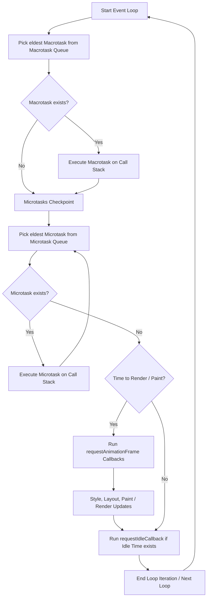

## 1. 💡 Sodda Tushuntirish va Analogiya

### Asinxronlik va Task Scheduling nima?
JavaScript **bitta oqimli (single-threaded)** til bo'lib, u bir vaqtning o'zida faqat bitta kod bo'lagini bajara oladi. Bu bitta oqim (Main Thread) nafaqat JavaScript-ni bajaradi, balki sahifani chizish (rendering) va foydalanuvchi hodisalarini (click, type) qayta ishlash bilan ham shug'ullanadi. 

Agarda biz oqimni juda og'ir matematik hisob-kitob bilan band qilib qo'ysak, sahifa muzlab (freeze) qoladi. Shuning uchun, vazifalarni to'g'ri rejalashtirish (Task Scheduling) va kerak bo'lganda asosiy oqimni bo'shatib berish (Yielding) juda muhimdir.

### Real hayotiy analogiya
Tasavvur qiling, siz **kasalxona tez yordam bo'limining bosh shifokorisiz (Event Loop)**:
* **Microtask-lar (Shoshilinch tibbiy yordam):** Bu og'ir ahvoldagi bemorlar. Agar bir shoshilinch bemorni ko'rib bo'lsangiz-u, eshik tagida yana bir shoshilinch bemor paydo bo'lsa, siz navbatdagi oddiy bemorga o'tmasdan, darhol uni davolashga kirishasiz. Microtask navbati to'liq bo'shamaguncha boshqa ishlarga o'ta olmaysiz.
* **Macrotask-lar (Navbat bilan kelgan bemorlar):** Bular oldindan yozilib kelgan oddiy ko'rikdagi bemorlar (`setTimeout`). Siz har safar bitta oddiy bemorni ko'rib bo'lgach, shoshilinch navbatda (Microtask) kimdir bormi-yo'qligini tekshirasiz.
* **Animation Frame (Ekranni yangilash):** Bu shifoxonadagi bemorlar holati ko'rsatiladigan monitorlarni yangilash. U shoshilinch bemorlar ketganidan keyin va oddiy bemorlar ko'rilayotgan vaqt oralig'ida ma'lum bir reja asosida (ekran kadriga mos ravishda) yangilanadi.
* **Yielding (Tanaffus berish):** Agar siz 5 soatlik murakkab operatsiyani uzluksiz bajarsangiz, boshqa barcha bemorlar o'lib ketishi mumkin (sahifa qotib qoladi). Shuning uchun operatsiyani 30 daqiqalik bo'laklarga bo'lasiz va har bir bo'lakdan keyin 1 daqiqaga tashqariga chiqib shoshilinch bemorlarni tekshirasiz.

---

## 2. 💻 Real Kod Misollari

### 1. Navbatlar tartibini tekshirish (Micro vs Macro vs rAF)
Quyidagi misolda har xil turdagi vazifalar Event Loop-da qanday ketma-ketlikda bajarilishini ko'rishimiz mumkin:

```javascript
console.log("1. Sinxron Kod");

setTimeout(() => {
  console.log("6. Macrotask (setTimeout)");
}, 0);

Promise.resolve().then(() => {
  console.log("3. Microtask (Promise)");
});

queueMicrotask(() => {
  console.log("4. Microtask (queueMicrotask)");
});

requestAnimationFrame(() => {
  console.log("5. Animation Frame Callback");
});

console.log("2. Sinxron Kod Oxiri");

// Konsoldagi natija:
// 1. Sinxron Kod
// 2. Sinxron Kod Oxiri
// 3. Microtask (Promise)
// 4. Microtask (queueMicrotask)
// 5. Animation Frame Callback
// 6. Macrotask (setTimeout)
```

### 2. Prioritized Task Scheduling (`scheduler.postTask`)
Zamonaviy brauzerlarda vazifalarni prioriteti bo'yicha rejalashtirish uchun yangi `Scheduler API` taqdim etilgan:

```javascript
// Agarda brauzer qo'llab-quvvatlasa
if (window.scheduler) {
  // 1. Eng past ustuvorlikdagi vazifa (background)
  scheduler.postTask(() => console.log("Background Task"), { priority: 'background' });

  // 2. Foydalanuvchiga ko'rinadigan standart vazifa (user-visible)
  scheduler.postTask(() => console.log("User Visible Task"), { priority: 'user-visible' });

  // 3. Foydalanuvchi interaktivligi uchun muhim vazifa (user-blocking)
  scheduler.postTask(() => console.log("User Blocking Task"), { priority: 'user-blocking' });
}

// Bajarilish tartibi:
// 1. User Blocking Task
// 2. User Visible Task
// 3. Background Task
```

### 3. Og'ir sikllarda Main Thread bloklanishini oldini olish (Yielding)
Bloklovchi sinxron kod vs Yielding (bo'laklab asinxron bajarish):

```javascript
// YOMON USUL: Asosiy oqimni 3 soniyaga bloklaydi, sahifa qotadi
function heavyComputationSync() {
  let result = 0;
  for (let i = 0; i < 1e9; i++) {
    result += Math.sqrt(i);
  }
  console.log("Tugadi:", result);
}

// YAXSHI USUL: Kodni bo'laklarga ajratib, Event Loop-ga yo'l berish (Yielding)
async function heavyComputationYielding() {
  let result = 0;
  const totalIterations = 1e9;
  const chunkSize = 1e7; // Har 10 million amaldan keyin bo'shatamiz

  for (let i = 0; i < totalIterations; i++) {
    result += Math.sqrt(i);
    
    if (i % chunkSize === 0) {
      // Main Thread-ga nafas olish va render qilish uchun yo'l beramiz
      await yieldToMain();
    }
  }
  console.log("Tugadi:", result);
}

function yieldToMain() {
  if (window.scheduler) {
    return scheduler.postTask(() => {}, { priority: 'user-visible' });
  }
  return new Promise(resolve => setTimeout(resolve, 0));
}
```

---

## 3. ⚙️ Qanday Ishlaydi (Under the Hood)

### JavaScript Event Loop arxitekturasi
JavaScript Event Loop dvigatel (V8) va brauzer muhiti (Web APIs) o'rtasidagi bog'lovchi hisoblanadi. Bir iteratsiya (aylanish) davomida u quyidagi navbatlarni ma'lum tartibda boshqaradi:



### Navbatlar turlari:
1. **Macrotask Queue (Task Queue):**
   * Bu yerda asinxron API-lar (`setTimeout`, `setInterval`, `MessageChannel`, I/O va tarmoq hodisalari) callbacks saqlanadi.
   * Har bir Event Loop aylanishida faqatgina **bitta** macrotask olinadi va Call Stack-da bajariladi.
2. **Microtask Queue:**
   * Bu yerda `Promise` callbacks (`.then/catch/finally`), `queueMicrotask` va `MutationObserver` saqlanadi.
   * Event Loop har bir macrotask tugaganidan keyin **Microtasks Checkpoint**-ni amalga oshiradi. Bu jarayonda Microtask Queue to'liq bo'shaguncha barcha microtask-lar ketma-ket bajariladi. Agar microtask bajarilayotganda yana yangi microtask navbatga qo'shilsa, u ham shu iteratsiyada bajariladi.
3. **Animation Frame Callbacks:**
   * Ekranning yangilanish tezligiga (odatda 60Hz yoki 120Hz) mos ravishda, brauzer render qilishdan avval `requestAnimationFrame` ichidagi vazifalarni bajaradi.
   * Bu sinxronizatsiya render kadrlarini silliq va ortiqcha hisob-kitoblarsiz bo'lishini ta'minlaydi.

---

## 4. 🧪 Bosqichma-bosqich Amaliy Mashq

Keling, katta hajmdagi ma'lumotlarni massivda qayta ishlovchi va foydalanuvchi interfeysini qotirib qo'ymaydigan **Non-blocking Data Processor** yaratamiz.

### Kod yozish:
```javascript
// 1. Asosiy yield helper funksiyasini yozamiz
function yieldControl() {
  if (typeof scheduler !== 'undefined' && scheduler.postTask) {
    return scheduler.postTask(() => {}, { priority: 'user-visible' });
  }
  // Eski brauzerlar uchun fallback
  return new Promise(resolve => setTimeout(resolve, 0));
}

// 2. Asosiy ma'lumotlarni asinxron bo'laklab ishlovchi funksiya
async function processLargeArray(data, processor, onProgress) {
  const total = data.length;
  const startTime = performance.now();
  
  for (let i = 0; i < total; i++) {
    // Har bir elementni qayta ishlaymiz
    processor(data[i]);
    
    // Har 5ms ishlagandan keyin asosiy oqimga yo'l beramiz
    if (performance.now() - startTime > 5) {
      const progress = Math.round(((i + 1) / total) * 100);
      onProgress(progress);
      
      // Yo'l berish va taymerni qayta tiklash
      await yieldControl();
    }
  }
  
  onProgress(100);
  console.log("Qayta ishlash yakunlandi.");
}

// 3. Ishlatib ko'rish
const hugeData = Array.from({ length: 500000 }, (_, i) => i);
processLargeArray(
  hugeData, 
  (num) => Math.sqrt(num) * Math.sin(num), // Og'ir hisob
  (percent) => console.log(`Jarayon: ${percent}%`)
);
```

---

## 5. ⚠️ Ko'p Uchraydigan Xatolar (Junior Mistakes)

### 1. Microtask-lar yordamida cheksiz sikl yaratib qo'yish
Microtask navbati tugamaguncha brauzer ekranni chiza olmaydi. Agar microtask ichida recursive ravishda yana microtask chaqirilsa, sahifa abadiy muzlab qoladi.
* **Noto'g'ri (Sahifa butunlay qotib qoladi):**
  ```javascript
  function runInfiniteMicrotask() {
    queueMicrotask(() => {
      runInfiniteMicrotask(); // Cheksiz microtask checkpoint loop
    });
  }
  runInfiniteMicrotask();
  ```
* **To'g'ri (Macrotask orqali yo'l berish):**
  ```javascript
  function runSafeLoop() {
    setTimeout(() => {
      runSafeLoop(); // Macrotask bo'lgani uchun brauzer oraliqda chiza oladi
    }, 0);
  }
  runSafeLoop();
  ```

### 2. requestAnimationFrame-ni microtask deb o'ylash
Ba'zilar `rAF` microtask kabi tez ishlaydi deb o'ylashadi, lekin u faqat brauzer yangi kadr render qilmoqchi bo'lgandagina chaqiriladi. Agar sahifa orqa fondagi tabda turgan bo'lsa, `rAF` butunlay to'xtab qolishi mumkin.

---

## 6. 📝 Qisqacha Xulosa (Cheat Sheet)

| Navbat turi | Qo'shish API-lari | Ishga tushish vaqti | Thread Blocking xavfi |
| :--- | :--- | :--- | :--- |
| **Sinxron Kod** | Global kod, funksiyalar | Darhol (Call Stack-da) | Yuqori |
| **Microtask** | `Promise.then`, `queueMicrotask` | Har bir Macrotask-dan keyin | Juda Yuqori (sikl bloklaydi) |
| **Animation Frame** | `requestAnimationFrame` | Render qilishdan oldin | O'rtacha |
| **Macrotask (Task)** | `setTimeout`, `MessageChannel` | Navbat bo'yicha (1 ta aylanishda 1 ta) | Past (orqaga qaytadi) |
| **Idle Task** | `requestIdleCallback` | Brauzer mutlaqo bo'sh bo'lganda | Yo'q |

---

## 7. ❓ Savollar va Javoblar

### 1. Nima uchun `setTimeout(fn, 0)` darhol 0ms-da ishlamaydi?
HTML standarti bo'yicha, ketma-ket joylashtirilgan asinxron taymerlar 4 yoki undan ko'p marta chuqurlashganda minimun 4ms kechikish majburiy hisoblanadi. Undan tashqari, agar Event Loop Call Stack band bo'lsa, vazifa navbatda kutib qoladi.

### 2. Scheduler API bilan setTimeout o'rtasidagi eng katta farq nima?
Scheduler API vazifalarni ustuvorligiga ko'ra dinamik boshqaradi va `AbortController` integratsiyasiga ega. Bu esa keraksiz yoki kechikkan vazifalarni bekor qilishni juda osonlashtiradi.

---

## 8. 🧠 O'z-o'zini Tekshirish

1. Qanday holatlarda `queueMicrotask` ishlatish xavfli hisoblanadi?
2. Sahifani silliq 60 kadr/soniya (60fps) tezlikda saqlab turish uchun har bir render sikli necha millisekunddan oshmasligi kerak? (Javob: ~16.7ms).
3. Nima uchun `requestIdleCallback` tezkor animatsiyalarni yaratish uchun mutlaqo yaroqsiz?

---

## 9. 🚀 Amaliy Topsiriq

Quyida keltirilgan 10 ta amaliy vazifalar orqali Event Loop boshqaruvi va vazifalarni rejalashtirish bo'yicha ko'nikmalaringizni charxlang. Har bir topshiriq real loyihalardagi murakkab arxitektura muammolarining simulyatsiyasidir.
