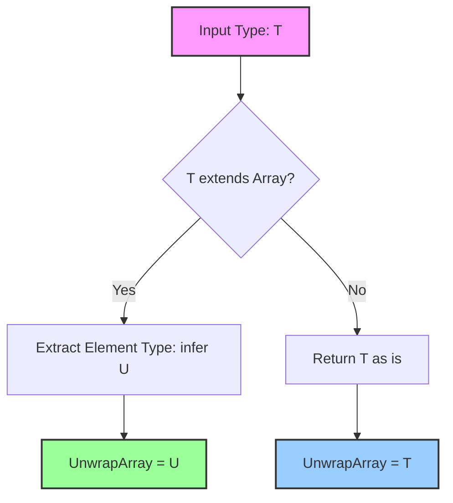
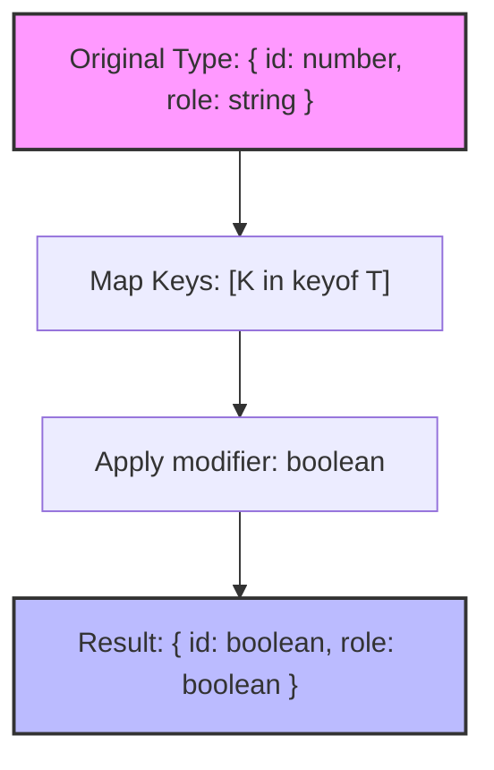

## 1. 💡 Sodda Tushuntirish va Analogiya

### Advanced & Utility Types nima?
TypeScript-da **Utility Types** (Yordamchi tiplar) va **Advanced Types** (Kengaytirilgan tiplar) — bu tayyor tiplarni o'zgartirish, ulardan nusxa olish yoki ularni tahrirlash orqali yangi tiplar hosil qilish usulidir. Ular kod takrorlanishini (DRY qoidasini) kamaytiradi va tiplash jarayonini osonlashtiradi.

### Real hayotiy analogiya
Buni rasm tahrirlovchi **foto-filtrlarga (photo filters)** o'xshatish mumkin:
* **Original Type:** Bu sizning asl rasmingiz (barcha maydonlari bo'lgan obyekt).
* **Partial filter:** Rasmning ba'zi qismlarini xiralashtiradi yoki yashiradi. Asl rasmdagi barcha elementlar endi ixtiyoriy (optional) bo'ladi.
* **Readonly filter:** Rasmni shisha ramkaga soladi. Uni faqat tomosha qilishingiz mumkin, lekin ustiga chizib bo'lmaydi.
* **Pick filter:** Rasmdan faqat sizga kerakli qismini (masalan, faqat yuzingizni) qirqib (crop) oladi.
* **Omit filter:** Rasm fonidagi keraksiz detalni o'chirib tashlaydi va qolgan hamma narsani saqlaydi.

---

## 2. 💻 Real Kod Misollari

### 1. Basic Example (Partial va Readonly yordamida obyektlar bilan ishlash)
```typescript
interface User {
  id: number;
  name: string;
  email: string;
}

// Barcha maydonlar ixtiyoriy: { id?, name?, email? }
type UpdateUser = Partial<User>;

// Barcha maydonlar faqat o'qish uchun: o'zgartirib bo'lmaydi
type ReadonlyUser = Readonly<User>;

const user: ReadonlyUser = {
  id: 1,
  name: "Farhod",
  email: "farhod@example.com"
};

// user.name = "Ali"; // Xatolik! Readonly maydonni o'zgartirib bo'lmaydi.
```

### 2. Intermediate Example (Record, Pick va Omit orqali ma'lumotlarni filtrlash)
```typescript
interface Product {
  id: number;
  name: string;
  price: number;
  description: string;
}

// Faqat nom va narx kerak bo'lgan holat
type ProductCardInfo = Pick<Product, "name" | "price">;

// Tavsif (description) va ID dan tashqari hamma narsani olish
type InsertProduct = Omit<Product, "id" | "description">;

// Mahsulotlar lug'atini yaratish (Kalit - string, qiymat - Product)
type ProductCatalog = Record<string, Product>;

const catalog: ProductCatalog = {
  "laptop-01": { id: 101, name: "Noutbuk", price: 1200, description: "Zo'r noutbuk" }
};
```

### 3. Advanced Example (Conditional Types va `infer` yordamida funksiya qaytarish tipini aniqlash)
```typescript
// Agarda T funksiya bo'lsa, uning qaytarish tipini (R) ajratib oladi, aks holda never qaytaradi
type MyReturnType<T> = T extends (...args: any[]) => infer R ? R : never;

const getUserRole = () => "admin" as const;

type UserRole = MyReturnType<typeof getUserRole>; // "admin"
```

---

## 3. ⚠️ Muammo va Nima uchun Muhimligi

### Qaysi muammoni hal qiladi?
Katta loyihalarda bitta tipning har xil ko'rinishlari talab etiladi. Masalan, ma'lumotlar bazasidagi `User` modeli barcha maydonlarga ega, lekin API orqali uni tahrirlashda (`PATCH` so'rovida) faqat bitta-ikkita maydon yuborilishi mumkin. Agarda yordamchi tiplar bo'lmaganida, dasturchi har bir holat uchun alohida `UserUpdate`, `UserCard`, `UserReadOnly` kabi o'nlab o'xshash interfeyslarni qo'lda yozishi kerak bo'lardi. Bu esa kod takrorlanishiga va keyinchalik bitta maydon o'zgarganda barcha tiplarni yangilab chiqish qiyinchiligiga (maintenance do'zaxiga) sabab bo'lardi.

---

## 4. ❌ Ko'p Uchraydigan Xatolar (Junior Mistakes)

### 1. Mapped yoki Omit tiplarida mavjud bo'lmagan kalitlarni ishlatish
#### Xato:
```typescript
interface User {
  id: number;
  name: string;
}
// Loyihada xato ko'rsatmasligi mumkin, lekin mantiqan noto'g'ri
type InvalidOmit = Omit<User, "password">; 
```

### 2. `typeof` va `keyof` operatorlarini chalkashtirish
`typeof` qiymatning tipini oladi, `keyof` esa obyekt tipining barcha kalitlarini union (birlashma) sifatida qaytaradi.
#### Xato:
```typescript
const config = { theme: "dark" };
type ConfigKeys = keyof config; // Xatolik! Obyekt o'zgaruvchisiga to'g'ridan-to'g'ri keyof berib bo'lmaydi.
```
#### Tuzatish:
```typescript
const config = { theme: "dark" };
type ConfigKeys = keyof typeof config; // "theme"
```

### 3. Partial qiymat maydonlarini tekshirmasdan ishlatish
`Partial<T>` qilinganda barcha maydonlar `undefined` bo'lishi mumkinligini inobatga olmaslik.

---

## 5. 💬 12 ta Intervyu Savollari

### Junior (1–4)
1. **Savol:** `Partial<T>` va `Required<T>` farqi nimada?
   * **Javob:** `Partial<T>` barcha xossalarni ixtiyoriy (`?`) qiladi, `Required<T>` esa aksincha barcha ixtiyoriy xossalarni majburiy qiladi.
2. **Savol:** Obyekt maydonlarini faqat o'qiladigan qilish uchun qaysi utility tip ishlatiladi?
   * **Javob:** `Readonly<T>`.
3. **Savol:** `Pick<T, K>` qanday ishlaydi?
   * **Javob:** Berilgan `T` tipidan faqat `K` kalitlari orqali ko'rsatilgan xossalarni tanlab olib, yangi tip yaratadi.
4. **Savol:** `Record<K, T>` nima uchun ishlatiladi?
   * **Javob:** Obyekt lug'atlari (dictionary) yoki xaritalar (map) uchun kalit va qiymat tiplarini belgilab berishda qo'llaniladi.

### Middle (5–8)
5. **Savol:** `Omit<T, K>` va `Exclude<T, U>` farqi nimada?
   * **Javob:** `Omit` obyekt tipidan ma'lum kalitlarni olib tashlaydi, `Exclude` esa union (birlashma) tiplardan ma'lum tiplarni chiqarib yuboradi.
6. **Savol:** Mapped Types (Xaritalangan tiplar) nima?
   * **Javob:** Mavjud tip kalitlari ro'yxatini aylanib chiqib (sikl kabi), xususiyatlarini va qiymat tiplarini o'zgartirib yangi tip yaratish texnikasi.
7. **Savol:** `NonNullable<T>` qanday qiymatlarni filtrlaydi?
   * **Javob:** Berilgan tip tarkibidan `null` va `undefined` tiplarini butunlay olib tashlaydi.
8. **Savol:** TypeScript-da `typeof` operatori nima vazifani bajaradi?
   * **Javob:** JavaScript o'zgaruvchisi yoki obyektining strukturasini TypeScript tipi darajasida aniqlab beradi.

### Senior (9–12)
9. **Savol:** Conditional Types (Shartli tiplar) qanday yoziladi?
   * **Javob:** Ternary operator yordamida: `T extends U ? X : Y` ko'rinishida yoziladi.
10. **Savol:** Conditional tiplardagi `infer` kalit so'zining vazifasi nima?
    * **Javob:** Shart tekshiruvi jarayonida aniqlanmagan yoki yashirin bo'lgan tipni ajratib olish va unga o'zgaruvchi nomi berish uchun ishlatiladi.
11. **Savol:** Mapped Types-da `+` va `-` modifierlari nima qiladi?
    * **Javob:** `readonly` yoki `?` (optional) xususiyatlarni qo'shish (`+`) yoki olib tashlash (`-`) uchun qo'llaniladi. Masalan, `-readonly` maydonni o'zgaruvchan qiladi.
12. **Savol:** Utility tiplari JavaScript dasturi ishlash (runtime) tezligiga ta'sir qiladimi?
    * **Javob:** Yo'q. TypeScript-dagi barcha tiplar va utility vositalari transpayl paytida o'chiriladi va JS kodga hech qanday ta'sir o'tkazmaydi.

---

## 6. 🛠️ Amaliy Topshiriqlar

Quyida Mapped va Conditional tiplarni yechish va qayta ishlash jarayonini aks ettiruvchi sxema ko'rsatilgan:





---

## 7. 📝 12 ta Mini Test

Dars yakunidagi testlar orqali mavzuni qanchalik yaxshi o'zlashtirganingizni sinab ko'ring.

---

## 8. 🎯 Real Project Case Study

### API Response Mapper va Permission Checker
Katta loyihalarda API orqali keladigan ma'lumotlarni foydalanuvchi huquqlariga qarab cheklash talab etiladi. Mapped va Conditional tiplar yordamida ma'lumotlarni faqat ruxsat berilgan qismini ko'rish uchun dinamik tiplash mumkin:

```typescript
type Permissions = {
  canReadEmail: boolean;
  canReadSalary: boolean;
};

type EmployeeData = {
  email: string;
  salary: number;
  fullName: string;
};

// Shartli ravishda huquqlarga qarab Employee data qiymatlarini tiplaymiz
type RestrictData<Data, Perms extends Permissions> = {
  [K in keyof Data]: K extends "email" 
    ? (Perms["canReadEmail"] extends true ? string : null)
    : K extends "salary"
    ? (Perms["canReadSalary"] extends true ? number : null)
    : Data[K];
};

type GuestPermissions = { canReadEmail: false; canReadSalary: false };
type GuestData = RestrictData<EmployeeData, GuestPermissions>;
// GuestData = { email: null; salary: null; fullName: string; }
```

---

## 9. 🚀 Performance va Optimization

* **TypeScript kompilyator tezligi:** Murakkab shartli yoki rekurziv tiplar (`extends` zanjirlari juda chuqur bo'lsa) VS Code va IDE-larda tip tekshiruvini sekinlashtirishi mumkin.
* **Transpilation:** Utility va Advanced tiplar faqat loyiha ishlab chiqilayotgan paytda xavfsizlik uchun xizmat qiladi. JavaScript-ga o'girilganda barcha tiplar butunlay olib tashlanishi sababli runtime performance-ga 0% ta'sir qiladi.

---

## 10. 📌 Cheat Sheet

| Yordamchi Tip | Sintaksis | Vazifasi |
| :--- | :--- | :--- |
| `Partial<T>` | `Partial<User>` | Barcha maydonlarni ixtiyoriy (`?`) qiladi |
| `Required<T>` | `Required<User>` | Barcha ixtiyoriy maydonlarni majburiy qiladi |
| `Readonly<T>` | `Readonly<User>` | Barcha maydonlarni o'zgartirib bo'lmaydigan (`readonly`) qiladi |
| `Record<K, T>` | `Record<string, number>` | Dinamik kalit-qiymat obyektlari tipini yaratadi |
| `Pick<T, K>` | `Pick<User, "name">` | Faqat tanlangan maydonlardan iborat yangi tip yaratadi |
| `Omit<T, K>` | `Omit<User, "id">` | Tanlangan maydonlarni olib tashlab, qolganlaridan tip yaratadi |
| `NonNullable<T>` | `NonNullable<string \| null>` | `null` va `undefined` qiymatlarini olib tashlaydi |
