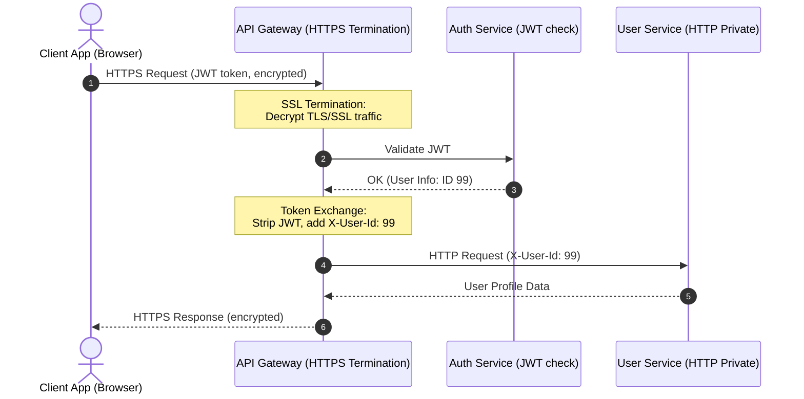

## 1. 💡 Sodda Tushuntirish va Analogiya

Tizim dizaynida (System Design) **API Gateway** butun tizimning "darvozaboni" yoki "kirish eshigi" hisoblanadi. Mikroxizmatlar (microservices) dunyosida har bir xizmat (masalan, foydalanuvchilar xizmati, to'lovlar xizmati) o'z domeniga va portiga ega. Agar API Gateway bo'lmasa, mijoz (klient) dasturi har bir servisning manzilini bilishi va ularga to'g'ridan-to'g'ri ulanishi kerak bo'ladi. Bu esa xavfsizlik va boshqaruv jihatidan juda katta muammolarni keltirib chiqaradi.

### Real hayotiy analogiya:
Tasavvur qiling, siz **yirik aeroportga** keldingiz:
* **API Gateway bo'lmaganda (Monolit yoki To'g'ridan-to'g'ri ulanish):** Siz samolyotga chiqish uchun pasport nazoratidan alohida eshikda, yuk topshirish uchun boshqa ko'chadagi binoda va xavfsizlik tekshiruvidan butunlay boshqa binoda o'tishingiz kerak bo'lardi. Har bir joyda pasportingizni qayta-qayta tekshirishardi.
* **API Gateway bo'lganda:** Aeroportda bitta **katta markaziy terminal (Gateway)** bor. Siz terminal eshigidan kirasiz. Xavfsizlik va hujjat tekshiruvi (SSL Termination va JWT Validation) shu yerda bir marta amalga oshiriladi. Shundan so'ng terminal ichidagi yo'laklar orqali tegishli samolyotga (Routing) yo'naltirilasiz.

---

## 2. 💻 Real Kod Misollari

Node.js va Express yordamida sodda API Gateway routing va SSL Termination simulyatsiyasi:

```javascript
const express = require('express');
const app = express();

// 1. CORS Dynamic Policy
const ALLOWED_ORIGINS = ['https://my-app.com', 'https://admin.my-app.com'];
app.use((req, res, next) => {
  const origin = req.headers.origin;
  if (ALLOWED_ORIGINS.includes(origin)) {
    res.setHeader('Access-Control-Allow-Origin', origin);
  }
  res.setHeader('Access-Control-Allow-Methods', 'GET,POST,PUT,DELETE,OPTIONS');
  res.setHeader('Access-Control-Allow-Headers', 'Content-Type, Authorization');
  if (req.method === 'OPTIONS') return res.sendStatus(200);
  next();
});

// 2. Correlation ID & Tracing Middleware
app.use((req, res, next) => {
  const correlationId = req.headers['x-correlation-id'] || `corr-${Math.random().toString(36).substr(2, 9)}`;
  req.correlationId = correlationId;
  res.setHeader('X-Correlation-ID', correlationId);
  console.log(`[LOG] [${correlationId}] Incoming: ${req.method} ${req.url}`);
  next();
});

// 3. Simple JWT Validation & Token Exchange (Edge Security)
const mockValidateJWTAndExchange = (req, res, next) => {
  const authHeader = req.headers.authorization;
  if (!authHeader || !authHeader.startsWith('Bearer ')) {
    return res.status(401).json({ error: 'Avtorizatsiyadan o\'tilmagan' });
  }
  
  const token = authHeader.split(' ')[1];
  if (token === 'valid-user-token') {
    // Token Exchange: Tashqi JWT tokenni ichki mikroxizmatlar uchun xavfsiz headerga o'tkazish
    req.headers['x-user-id'] = 'user-123';
    req.headers['x-user-role'] = 'customer';
    delete req.headers.authorization; // Tashqi tokenni o'chirib tashlaymiz
    return next();
  }
  return res.status(403).json({ error: 'Yaroqsiz token' });
};

// 4. Path-based Routing
const UPSTREAM_SERVICES = {
  users: 'http://internal-user-service:3001',
  orders: 'http://internal-order-service:3002'
};

app.use('/api/v1/users', mockValidateJWTAndExchange, (req, res) => {
  console.log(`[LOG] [${req.correlationId}] Routing to Users Upstream: ${UPSTREAM_SERVICES.users}${req.url}`);
  res.json({ message: 'User Service-dan javob', user: req.headers['x-user-id'] });
});

app.listen(8080, () => {
  console.log('API Gateway 8080 portida ishga tushdi');
});
```

---

## 3. ⚙️ Qanday Ishlaydi (Under the Hood)

### API Gateway mas'uliyatlari:
1. **SSL Termination (SSL shifrlashni tugatish):** Mijoz va API Gateway o'rtasidagi trafik shifrlangan (HTTPS/TLS) bo'ladi. API Gateway bu shifrlangan ulanishni yechadi (tugatadi) va ichki tarmoqdagi mikroxizmatlarga shifrlanmagan (HTTP) oddiy va tezkor so'rov yuboradi. Bu backend serverlardagi protsessor (CPU) yuklamasini kamaytiradi.
2. **CORS Policies:** Brauzerlar xavfsizligi uchun CORS (Cross-Origin Resource Sharing) sarlavhalari Gateway darajasida boshqariladi. Har bir mikroxizmat alohida CORS sozlashiga hojat qolmaydi.
3. **Logging & Tracing:** Gateway har bir so'rovga noyob **Correlation ID** (so'rov identifikatori) yopashtiradi. Ushbu ID so'rov barcha backend mikroxizmatlar bo'ylab yurganda loglarda birga uzatiladi, bu esa xatolarni kuzatishni osonlashtiradi.
4. **Edge Security:** Tashqi foydalanuvchining JWT tokeni kirishda tekshiriladi va xavfsiz ichki token yoki headerga almashtiriladi (**Token Exchange**). Ichki mikroxizmatlar og'ir kriptografik tekshiruvlarni bajarmaydi.

### Marshrutlash strategiyalari (Routing Strategies):
* **Path-based (Yo'lga asoslangan):** So'rov yo'li (URL path) bo'yicha yo'naltirish. Masalan, `/api/users` -> `User Service`, `/api/orders` -> `Order Service`.
* **Host-based (Xostga asoslangan):** So'rov kelgan domen (Host header) bo'yicha yo'naltirish. Masalan, `api.dastur.uz` -> `Main API Service`, `admin.dastur.uz` -> `Admin Console Service`.
* **Header-based (Sarlavhaga asoslangan):** Maxsus HTTP sarlavhalari (masalan, `X-Version: v2` yoki `X-User-Group: canary`) bo'yicha yo'naltirish. Canary/AB testlar uchun keng qo'llaniladi.

---

## 4. ❌ Ko'p Uchraydigan Xatolar (Junior Mistakes)

1. **Gateway-da Biznes Mantiq yozish:** Eng keng tarqalgan xato. API Gateway ichida ma'lumotlar bazasiga ulanish yoki murakkab hisob-kitoblar (biznes mantiq) yozilmasligi kerak. Gateway faqat tranzit va marshrutlovchi komponent bo'lib qolishi shart.
2. **Correlation ID ni uzatishni unutish:** Mikroxizmatlarda xato yuz berganda qaysi so'rov sabab bo'lganini bilish qiyin bo'ladi. Har doim ichki so'rovlarga `X-Correlation-ID` sarlavhasini qo'shib yuborish lozim.
3. **CORS qoidalarini * (hamma uchun) qilib qo'yish:** Ishlab chiqish (Development) vaqtida oson bo'lishi uchun `Access-Control-Allow-Origin: *` qo'yiladi. Production muhitida bu juda katta xavfsizlik xatosi hisoblanadi.

---

## 5. 💬 12 ta Intervyu Savollari

1. **SSL Termination nima va u qanday foyda keltiradi?**
   HTTPS ulanishini API Gateway-da tugatib, ichki tarmoqda HTTP-dan foydalanish. Bu ichki serverlar CPU resursini tejaydi va sertifikatlar boshqaruvini osonlashtiradi.

2. **Canary Deployment-da API Gateway qanday rol o'ynaydi?**
   Gateway foydalanuvchilarning ma'lum foizini (masalan, 5%) `X-User-Group` sarlavhasi yoki cookie asosida yangi versiyaga yo'naltiradi.

3. **Token Exchange patterni nima?**
   Tashqi shifrlangan JWT tokenni API Gateway-da tekshirib, ichki mikroxizmatlar tushunadigan soddaroq (va xavfsiz ichki tarmoqdagi) ma'lumotlar formatiga (masalan, `X-User-Id` headeri) aylantirish.

4. **Edge Security deganda nima tushuniladi?**
   Xavfsizlik choralarini (DDoS himoya, IP qora ro'yxat, Auth, Rate limit) ichki tarmoqqa kirmasdan, eng chekka nuqtada (Gateway-da) hal qilish.

5. **Path-based va Host-based routing farqi nimada?**
   Path-based yo'lga ko'ra (`/users`), Host-based esa domenga ko'ra (`users.api.com`) yo'naltiradi.

6. **Correlation ID loglarni tahlil qilishda nega kerak?**
   Tizim tarqoq bo'lgani sababli, bitta foydalanuvchi so'rovi 5 ta servisga borishi mumkin. Correlation ID yordamida barcha 5 ta servis loglarini bitta zanjirga birlashtirish mumkin.

7. **API Gateway va Reverse Proxy (masalan, Nginx) farqi nimada?**
   Nginx ko'proq L4/L7 routing va keshlash uchun ishlatiladi. API Gateway esa ko'proq dasturiy mantiq (Auth, Token Exchange, Custom Plugins) bilan integratsiya qilinadi.

8. **CORS nima va nega uni Gateway-da sozlash qulay?**
   Brauzerdan boshqa domendagi resurslarni so'rashni cheklovchi xavfsizlik qoidasi. Gateway-da bir marta sozlash orqali barcha backend xizmatlarini CORS muammolaridan qutqarish mumkin.

9. **API Gateway-da qanday qilib Single Point of Failure (SPOF) ning oldi olinadi?**
   Gateway serverlarini bir nechta nusxada (Active-Active) ishlatish va ularning oldiga tarmoq yuk taqsimlovchisini (Load Balancer) qo'yish orqali.

10. **Tashqi va Ichki API Gateway farqi nimada?**
    Tashqi Gateway internetdan keladigan trafigi qabul qiladi. Ichki Gateway (yoki Service Mesh) mikroxizmatlar orasidagi ichki aloqalarni tartibga soladi.

11. **API Gateway-da retry policies (qayta urinishlar) qanday xavf tug'dirishi mumkin?**
    Agar upstream xizmat haddan tashqari yuklangan bo'lsa va Gateway har bir muvaffaqiyatsiz so'rovni 3 martadan qayta urinsa, bu "DDoS" effektini keltirib chiqarib, tizimni butunlay qulatishi mumkin.

12. **Ingress Controller nima?**
    Kubernetes muhitida tashqi trafigi klaster ichidagi xizmatlarga yo'naltiruvchi maxsus API Gateway turi.

---

## 6. 🛠️ Amaliy Topshiriqlar

Ushbu mashqlarda siz quyidagi real API Gateway vazifalarini yaratasiz:
1. HTTPS/SSL so'rovini yechuvchi va shifrsiz so'rov formatiga o'tkazuvchi simulyator.
2. Kelgan URL yo'liga qarab upstream servis manzilini aniqlovchi marshrutizator.
3. CORS sarlavhalarini dinamik ravishda to'g'ri shakllantiruvchi tizim.

---

## 7. 📝 12 ta Mini Test

Bilimingizni tekshirish uchun testlarni yeching.

---

## 8. 🎯 Real Project Case Study

### Netflix API Gateway (Zuul / Spring Cloud Gateway)
Netflix-ga soniyasiga millionlab so'rovlar kelib tushadi. Ularning arxitekturasida API Gateway markaziy rol o'ynaydi. Tizim foydalanuvchi qurilmasiga qarab (Smart TV, Telefon, Brauzer) so'rovlarni optimallashtiradi. Agar foydalanuvchi mobil ilovadan kirsa, Gateway dynamic payload compression va image resizing-ni amalga oshirishi yoki so'rovlarni bitta paketga yig'ishi (Request Aggregation) mumkin. Bu esa mobil tarmoqdagi kechikishlarni kamaytiradi.

---

## 9. 🧠 Vizual ko'rinish (Architecture Diagram)



---

## 10. 📌 Cheat Sheet

| Vazifa | Nima qiladi? | Nega muhim? |
| :--- | :--- | :--- |
| **SSL Termination** | HTTPS ni yechadi, ichkariga HTTP yuboradi | Backend CPU yuklamasini kamaytiradi |
| **Correlation ID** | Har bir so'rovga noyob ID beradi | Loglarni bir-biriga bog'lab kuzatish (Tracing) |
| **Token Exchange** | JWT -> X-User-Id va X-Role | Ichki servislar xavfsiz va sodda ishlaydi |
| **Canary Routing** | Maxsus header orqali 5% foydalanuvchini v2 ga yo'naltiradi | Xavfsiz yangi versiyani sinab ko'rish |
