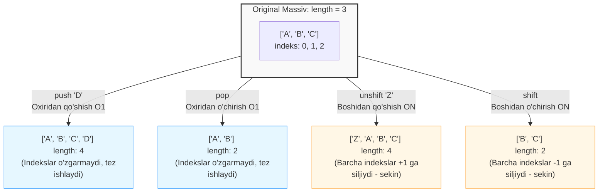

## 1. 💡 Sodda Tushuntirish va Analogiya

### Massiv (Array) nima?
**Massiv (Array)** — bu bir nechta qiymatlarni (elementlarni) ma'lum bir tartibda o'zida saqlaydigan maxsus ma'lumotlar strukturasidir. Oddiy o'zgaruvchi faqat bitta qiymatni saqlay olsa, massiv bitta nom ostida yuzlab yoki minglab qiymatlarni tartiblangan ro'yxat ko'rinishida saqlashi mumkin. Massivdagi har bir element o'zining joylashuv tartibiga ega bo'lib, u **indeks (index)** deb ataladi. Dasturlashda indekslash har doim **0 dan boshlanadi**.

### Real hayotiy analogiya
Tasavvur qiling, siz **poyezd bekatidasiz**:
* **O'zgaruvchi** — bu faqat bitta odam sig'adigan kichkina taksi.
* **Massiv (Array)** — bu ketma-ket ulangan ko'plab vagonlardan iborat yuk poyezdi.
  * Har bir vagonning o'z tartib raqami (indeksi) bor: birinchi vagon 0-indeks, ikkinchisi 1-indeks va hokazo.
  * Har bir vagon ichida har xil yuklar (ma'lumotlar: sonlar, matnlar yoki obyektlar) saqlanishi mumkin.
  * Agar siz poyezd oxiriga yangi vagon qo'shmoqchi bo'lsangiz (`push`) yoki boshidagi vagonni uzib tashlamoqchi bo'lsangiz (`shift`), bu butun poyezdning umumiy uzunligiga va vagonlar indekslariga ta'sir qiladi.

---

## 2. 💻 Real Kod Misollari

### 1. Basic Example (Massiv yaratish va elementlarga murojaat)
Massiv literalidan foydalanib oddiy massiv yaratish va uning elementlarini olish/o'zgartirish:
```javascript
// Massiv yaratish
const colors = ['red', 'green', 'blue'];

// Elementlarga indeks orqali murojaat qilish
console.log(colors[0]); // "red"
console.log(colors[2]); // "blue"
console.log(colors[3]); // undefined (bunday indeks mavjud emas)

// Element qiymatini o'zgartirish
colors[1] = 'yellow';
console.log(colors); // ['red', 'yellow', 'blue']

// Massiv uzunligi
console.log(colors.length); // 3
```

### 2. Intermediate Example (Massiv oxiridan va boshidan element qo'shish/o'chirish)
Massiv uzunligini dynamic o'zgartiruvchi asosiy mutator metodlar (`push`, `pop`, `shift`, `unshift`):
```javascript
const todoList = ['Dars qilish', 'Kitob o\'qish'];

// 1. push() - massiv oxiriga element qo'shadi
todoList.push('Yugurish'); 
console.log(todoList); // ['Dars qilish', 'Kitob o\'qish', 'Yugurish']

// 2. pop() - massiv oxiridan elementni o'chiradi va o'chirilgan qiymatni qaytaradi
const lastTodo = todoList.pop();
console.log(lastTodo);  // "Yugurish"
console.log(todoList); // ['Dars qilish', 'Kitob o\'qish']

// 3. unshift() - massiv boshiga element qo'shadi
todoList.unshift('Choy ichish');
console.log(todoList); // ['Choy ichish', 'Dars qilish', 'Kitob o\'qish']

// 4. shift() - massiv boshidan elementni o'chiradi va o'chirilgan qiymatni qaytaradi
const firstTodo = todoList.shift();
console.log(firstTodo); // "Choy ichish"
console.log(todoList);  // ['Dars qilish', 'Kitob o\'qish']
```

### 3. Advanced Example (Splice, Slice va Qidiruv metodlari)
Massiv elementlarini qirqib olish, almashtirish va massiv ichidan elementlarni qidirish:
```javascript
const members = ['Ali', 'Vali', 'Sardor', 'Olim', 'Rustam'];

// 1. slice() - massivning ma'lum qismidan nusxa oladi (asl massiv o'zgarmaydi)
const team = members.slice(1, 4); 
console.log(team);    // ['Vali', 'Sardor', 'Olim'] (1-indeksdan 4-indeksgacha, 4 kirmaydi)
console.log(members); // original o'zgarmadi

// 2. splice() - massiv tarkibini o'zgartiradi (elementlarni o'chiradi, qo'shadi yoki almashtiradi)
// 2-indeksdan boshlab 2 ta elementni o'chirish va o'rniga 'Eldor'ni qo'shish:
const deleted = members.splice(2, 2, 'Eldor');
console.log(deleted); // ['Sardor', 'Olim'] (o'chirilgan elementlar)
console.log(members); // ['Ali', 'Vali', 'Eldor', 'Rustam'] (original o'zgardi!)

// 3. indexOf() va includes() - qidiruv metodlari
console.log(members.indexOf('Vali'));    // 1 (indeksini qaytaradi)
console.log(members.indexOf('Anvar'));   // -1 (topilmasa -1)
console.log(members.includes('Eldor'));  // true (bor bo'lsa true, yo'q bo'lsa false)
```

---

## 3. ⚙️ Qanday Ishlaydi (Under the Hood)

### JavaScript-da massivlarning haqiqiy tabiati
C, C++ yoki Java kabi statik dasturlash tillarida massivlar xotiraning ketma-ket kelgan yagona blokida (contiguous block of memory) saqlanadi va ularning hajmi e'lon qilinganda qat'iy belgilab qo'yiladi.
JavaScript-da esa vaziyat butunlay boshqacha:
1. **Massivlar aslida Obyektlardir:** JavaScript-da massivlar o'ziga xos tarzda ishlovchi obyektlardir. Ularning indekslari (`0`, `1`, `2`...) aslida obyektning kalitlari (string properties) hisoblanadi. Ya'ni `arr[0]` yozuvi xotira darajasida `arr['0']` ko'rinishida ishlaydi.
2. **Dynamic va Heterogen:** Massiv o'lchami oldindan belgilanmaydi va u dynamic tarzda o'sishi mumkin. Massiv ichida bir vaqtning o'zida har xil ma'lumot turlarini (`number`, `string`, `object`, `function`) saqlash mumkin.
3. **`length` xususiyatining ishlashi:** Massivning `length` xossasi faqatgina elementlar sonini hisoblamaydi, u har doim **massivdagi eng katta indeks + 1** ga teng bo'ladi. Agar siz `length`ni qo'lda kichraytirsangiz, massiv oxiridagi elementlar o'chib ketadi.

### V8 Dvigatelining Optimizatsiyasi (Fast vs Dictionary Elements)
JavaScript massivlari oddiy obyekt bo'lsa, ulardan element o'qish juda sekin bo'lishi kerak edi. Shuning uchun JavaScript dvigatellari (masalan, Chrome-dagi V8) massivlarni optimallashtiradi:
* **Fast Elements (Zich massivlar):** Agar massiv elementlari bir xil turdagi ma'lumotlardan tashkil topsa va indekslari ketma-ket kelgan bo'lsa (masalan: `[1, 2, 3, 4]`), dvigatel ularni xuddi C tilidagi kabi xotiraning ketma-ket blokida saqlaydi. Bu elementlarga juda tez kirish imkonini beradi.
* **Dictionary Elements / Sparse Arrays (Siyrak massivlar):** Agar massivda indekslar oralig'ida bo'shliqlar bo'lsa (masalan: `arr[0] = 1; arr[1000] = 2;`), dvigatel uni zich saqlay olmaydi. U massivni oddiy **Hash Map (kalit-qiymat lug'ati)** ko'rinishiga o'tkazadi. Bu xotirani tejaydi, lekin ishlash tezligini pasaytiradi.

---

## 4. ❌ Ko'p Uchraydigan Xatolar (Junior Mistakes)

### 1. Massiv elementini o'chirishda `delete` operatoridan foydalanish
* **Noto'g'ri (Siyrak massiv hosil qiladi):**
  ```javascript
  const arr = [10, 20, 30];
  delete arr[1]; // 20 o'chiriladi, lekin...
  console.log(arr); // [10, <1 empty item>, 30]
  console.log(arr.length); // 3 (uzunlik o'zgarmadi!)
  console.log(arr[1]); // undefined (lekin xotirada joy turibdi)
  ```
* **To'g'ri (Splice yoki Filter ishlatish):**
  ```javascript
  const arr = [10, 20, 30];
  arr.splice(1, 1); // 1-indeksdagi 1 ta elementni butunlay o'chirish
  console.log(arr); // [10, 30]
  console.log(arr.length); // 2
  ```

### 2. Massivlarni `===` yordamida qiymat bo'yicha solishtirish
* **Noto'g'ri:**
  ```javascript
  const a = [1, 2];
  const b = [1, 2];
  console.log(a === b); // false (chunki xotiradagi manzillar boshqa)
  ```
* **To'g'ri:**
  ```javascript
  const a = [1, 2];
  const b = [1, 2];
  // Qiymatlarni va uzunlikni solishtirish:
  const areEqual = a.length === b.length && a.every((val, index) => val === b[index]);
  console.log(areEqual); // true
  ```

### 3. Mavjud bo'lmagan indeks xossasiga murojaat qilish (TypeError)
* **Noto'g'ri (Dasturni to'xtatib qo'yadigan xato):**
  ```javascript
  const users = [{ name: 'Ali' }];
  // users[1] - undefined qaytaradi, uning ichidan name ni o'qish esa error beradi
  console.log(users[1].name); // TypeError: Cannot read properties of undefined
  ```
* **To'g'ri (Optional Chaining yoki shartli tekshirish):**
  ```javascript
  const users = [{ name: 'Ali' }];
  console.log(users[1]?.name); // undefined qaytaradi (xato bermaydi)
  ```

---

## 5. 💬 12 ta Intervyu Savollari

### Junior Darajasi (1–4)
1. **Savol:** Massiv (Array) nima va u oddiy obyektlardan qanday farq qiladi?
   * **Javob:** Massiv ham obyekt turi hisoblanadi. U tartiblangan ma'lumotlarni kalit sifatida 0 dan boshlanadigan butun sonlar (indekslar) yordamida saqlaydi va dynamic ravishda o'zgarib boruvchi maxsus `length` xususiyatiga ega.
2. **Savol:** Massiv oxiriga element qo'shish/o'chirish va boshiga qo'shish/o'chirish metodlarini sanab bering.
   * **Javob:** Oxiriga qo'shish: `push()`, oxiridan o'chirish: `pop()`. Boshiga qo'shish: `unshift()`, boshidan o'chirish: `shift()`.
3. **Savol:** `arr.length = 0` amali bajarilganda nima sodir bo'ladi?
   * **Javob:** Massiv to'liq tozalanadi (bo'shab qoladi), undagi barcha elementlar o'chib ketadi.
4. **Savol:** E'lon qilingan `const arr = [1, 2]` massiviga yangi element qo'shsa bo'ladimi? `const` xatolik bermaydimi?
   * **Javob:** Ha, yangi element qo'shish mumkin. Chunki `const` faqat massivning xotiradagi manziliga (reference) boshqa yangi massiv yoki qiymat biriktirishni taqiqlaydi, massiv ichidagi elementlarni o'zgartirishni emas.

### Middle Darajasi (5–8)
5. **Savol:** `slice()` va `splice()` metodlarining asosiy farqi nimada?
   * **Javob:** `slice()` massivning belgilangan qismidan nusxa oladi va yangi massiv qaytaradi, asl massivni o'zgartirmaydi (pure function). `splice()` esa elementlarni o'chirish, qo'shish yoki almashtirish orqali asl massiv tarkibini bevosita o'zgartiradi (mutates array).
6. **Savol:** Massivni qanday usullar bilan to'liq yoki qisman nusxalash (shallow copy) mumkin?
   * **Javob:** Spread operator yordamida `[...arr]`, argumentsiz `arr.slice()` metodi yordamida yoki `Array.from(arr)` yordamida.
7. **Savol:** Massivda ma'lum bir element mavjudligini tekshirish uchun qaysi metodlardan foydalanish afzal?
   * **Javob:** Agar faqat bor/yo'qligini tekshirish kerak bo'lsa, `.includes()` (true/false). Agar element indeksini bilish kerak bo'lsa, `.indexOf()` (indeks yoki -1) ishlatiladi.
8. **Savol:** "Sparse Array" (siyrak massiv) nima va u qanday hosil bo'ladi?
   * **Javob:** Bu elementlari orasida bo'shliqlar (empty slots) bo'lgan massivdir. Masalan, massiv yaratib to'g'ridan-to'g'ri katta indeksga qiymat berilsa (`arr[10] = 'test'`), yoki o'chirishda `delete arr[2]` ishlatilsa hosil bo'ladi.

### Senior Darajasi (9–12)
9. **Savol:** Nima uchun `push()`/`pop()` amallari `shift()`/`unshift()` amallariga qaraganda tezroq ishlaydi?
   * **Javob:** `push()` va `pop()` faqat massiv oxiri bilan ishlaydi va mavjud elementlarning xotiradagi o'rnini o'zgartirmaydi ($O(1)$). `shift()` va `unshift()` esa boshiga ta'sir qilgani uchun barcha qolgan elementlarni xotirada bitta indeks oldinga yoki orqaga surishga majbur qiladi ($O(N)$).
10. **Savol:** V8 dvigateli kontekstida "Fast Elements" va "Dictionary Elements" (yoki Hash Map representation) farqini tushuntiring.
    * **Javob:** Zich va homogeneous (bir xil tipli) massivlar V8 tomonidan xotirada ketma-ketlikda ("Fast Elements") saqlanadi va juda tez ishlaydi. Siyrak (sparse) va heterogenous massivlar esa sekinroq ishlovchi obyekt lug'atlari ("Dictionary Elements") shakliga o'tkaziladi.
11. **Savol:** Massivlarni chuqur nusxalash (Deep Copy) va yuzaki nusxalash (Shallow Copy) farqi nimada va ularni massivlar uchun qanday bajaramiz?
    * **Javob:** Shallow copy (`[...]`) faqat massivning birinchi darajali elementlarini nusxalaydi, agar uning ichida boshqa ichki obyekt yoki massiv bo'lsa, ularning havolasi (reference) nusxalanadi va ular o'zaro bog'liq qoladi. Deep copy esa ichki obyektlar bilan birga to'liq yangi nusxa yaratadi. Buni zamonaviy JSda `structuredClone(arr)` yordamida amalga oshirish mumkin.
12. **Savol:** Massiv elementlari bo'sh (`empty`) ekanligini va `undefined` qiymatga ega ekanligini qanday farqlash mumkin?
    * **Javob:** `empty` (hole) elementlar massiv kaliti sifatida umuman mavjud bo'lmaydi. Uni `index in arr` (masalan, `2 in arr`) yoki `arr.hasOwnProperty(index)` yordamida tekshirish mumkin. Agar element rostdan mavjud bo'lsa-yu, qiymati `undefined` bo'lsa, `in` operatori `true` qaytaradi, bo'sh (empty slot) bo'lsa `false` qaytaradi.

---

## 6. 🛠️ Amaliy Topshiriqlar

Quyidagi Mermaid diagrammasi massiv mutatsiyalarining massiv uzunligiga (`length`) va elementlarning indekslariga ko'rsatadigan ta'sirini grafik shaklda tasvirlaydi. Boshdan bajariladigan amallar nima uchun sekinroq ($O(N)$) ekanligini indekslarning siljishi orqali tushunishingiz mumkin:



* **Push/Pop:** Massiv oxiridagi o'zgarishlar faqat oxirgi elementga ta'sir qiladi. Boshqa elementlar o'z o'rnida qoladi.
* **Shift/Unshift:** Massiv boshiga ta'sir etuvchi amallar har bir elementning indeksini o'zgartirishni talab qiladi. Dvigatel orqa fonda barcha elementlarni xotirada surib chiqadi, bu esa massiv kattalashgan sari sekinlashadi.

---

## 7. 📝 12 ta Mini Test

Darsimizning quizzes bo'limida massiv metodlari, xususiyatlari, xotira xulq-atvori va amaliy vaziyatlar bo'yicha tayyorlangan 12 ta test savolini yechib, bilimingizni sinab ko'ring. Har bir savolda to'g'ri javob bilan birga batafsil tushuntirish berilgan.

---

## 8. 🎯 Real Project Case Study

### Tizim jurnali (Buffer Log) va "Undo" harakatlari tarixi
Real loyihalarda massivlar yordamida foydalanuvchining oxirgi bajargan harakatlari ro'yxatini (History/Undo Stack) yoki tizim loglarini saqlash mumkin. Bu yerda xotirani cheklash muhim. Biz faqat oxirgi 5 ta harakatni saqlab qoladigan dynamic log tizimi misolini ko'ramiz:

```javascript
class ActionHistory {
  constructor(maxSize = 5) {
    this.history = [];
    this.maxSize = maxSize;
  }

  // Yangi harakat qo'shish
  add(action) {
    this.history.push(action); // Harakatni oxiriga qo'shadi
    console.log(`Qo'shildi: ${action}`);

    // Agar limitdan oshib ketsa, eng eskisini boshidan o'chirib yuboradi
    if (this.history.length > this.maxSize) {
      const removed = this.history.shift(); // 0-indeksdagi element o'chiriladi
      console.log(`Limit oshdi! Eng eski harakat o'chirildi: ${removed}`);
    }
  }

  // Tarixni ko'rish
  getHistory() {
    return [...this.history]; // Massiv havolasini himoya qilish uchun nusxa qaytaramiz
  }
}

// Foydalanish:
const userHistory = new ActionHistory(3); // Maksimim 3 ta harakat saqlaymiz

userHistory.add("Sahifaga kirdi");
userHistory.add("Profilni tahrirladi");
userHistory.add("Rasmni yukladi");
console.log("Hozirgi tarix:", userHistory.getHistory()); 
// ['Sahifaga kirdi', 'Profilni tahrirladi', 'Rasmni yukladi']

userHistory.add("Parolni o'zgartirdi"); // Limit oshadi! "Sahifaga kirdi" o'chiriladi.
console.log("Yangi tarix:", userHistory.getHistory()); 
// ['Profilni tahrirladi', 'Rasmni yukladi', 'Parolni o'zgartirdi']
```

---

## 9. 🚀 Performance va Optimization

Massiv bilan ishlashda uning metodlari vaqt murakkabligini (Time Complexity) bilish kod samaradorligini oshiradi:

1. **Indeks orqali element o'qish/yozish ($O(1)$):** Massivdagi istalgan elementni indeksi bo'yicha olish (masalan `arr[500]`) xotira manzilini darhol hisoblagani sababli doimiy vaqt oladi.
2. **Push/Pop ($O(1)$ amortizatsiyalangan):** Massiv oxiridan element qo'shish yoki olish eng tezkor operatsiyalardir. V8 massiv uchun xotirada biroz qo'shimcha joy ajratib qo'ygani uchun ko'pincha bu amal zudlik bilan bajariladi.
3. **Shift/Unshift ($O(N)$):** Har safar massiv boshiga element qo'shilganda yoki olib tashlanganda, barcha $N$ ta element indekslari qayta yozilishi kerak. Bu massiv hajmi kattalashgan sari samarasiz bo'ladi.
4. **Splice ($O(N)$):** Element o'chirilgan yoki qo'shilgan joydan boshlab undan keyingi barcha elementlar siljitilishi kerak bo'ladi.
5. **Includes/IndexOf ($O(N)$):** Elementni topish uchun massiv boshidan oxirigacha qidirib chiqiladi (Chiziqli qidiruv - Linear Search), shuning uchun eng yomon holatda butun massiv aylanib chiqiladi.

> [!TIP]
> Agar dasturda tez-tez massiv boshidan ma'lumot qo'shish va o'chirish kerak bo'lsa, massiv o'rniga **Double-ended Queue (Deq)** yoki **Linked List (Bog'langan ro'yxat)** ma'lumotlar strukturasidan foydalanish tavsiya etiladi.

---

## 10. 📌 Cheat Sheet

| Metod | Nima qiladi? | Asl massivni o'zgartiradimi? (Mutation) | Qaytargan qiymati | Vaqt murakkabligi (Big O) |
| :--- | :--- | :--- | :--- | :--- |
| **`push(el)`** | Oxiriga element qo'shadi | **Ha** | Yangi massiv uzunligi (`length`) | $O(1)$ |
| **`pop()`** | Oxiridan elementni o'chiradi | **Ha** | O'chirilgan element qiymati | $O(1)$ |
| **`unshift(el)`** | Boshiga element qo'shadi | **Ha** | Yangi massiv uzunligi (`length`) | $O(N)$ |
| **`shift()`** | Boshidan elementni o'chiradi | **Ha** | O'chirilgan element qiymati | $O(N)$ |
| **`slice(start, end)`**| Massiv qismidan nusxa oladi | Yo'q | Yangi massiv nusxasi | $O(N)$ |
| **`splice(start, count, ...items)`** | Elementlarni o'chiradi/qo'shadi | **Ha** | O'chirilgan elementlar massivi | $O(N)$ |
| **`indexOf(el)`** | Element indeksini qidiradi | Yo'q | Element indeksi yoki `-1` | $O(N)$ |
| **`includes(el)`** | Element borligini tekshiradi | Yo'q | Mantiqiy qiymat (`true`/`false`) | $O(N)$ |
| **`concat(arr2)`** | Massivlarni birlashtiradi | Yo'q | Yangi birlashgan massiv | $O(N + M)$ |
| **`join(separator)`** | Massivni satrga (string) o'tkazadi | Yo'q | Yig'ilgan satr (string) | $O(N)$ |
