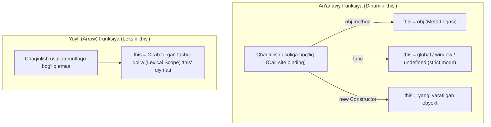

## 1. 💡 Sodda Tushuntirish va Analogiya

### Arrow Functions nima?
**Arrow Functions (Yoyli yoki ko'rsatkichli funksiyalar)** — bu ES6 (2015-yil) standartida JavaScript dasturlash tiliga kiritilgan, funksiyalarni yozishning yanada qisqa, tushunarli va zamonaviy sintaksisidir. U an'anaviy `function` kalit so'zi o'rniga `=>` (strelka / ko'rsatkich) belgisidan foydalanadi.

### Real hayotiy analogiya
Tasavvur qiling, siz do'stingizga xat yozayapsiz:
* **Eski usul (Rasmiy xat):** "Hurmatli do'stim, sizga shuni ma'lum qilamanki, ertaga uchrashamiz. Hurmat bilan, Ali." (Barcha kalit so'zlar va rasmiyatchiliklar joyida).
* **Arrow funksiya (SMS tili):** "Ertaga ko'rishamiz. Ali." (Ortiqcha so'zlarsiz, maqsad qisqa, tezkor va sodda ifodalangan).

---

## 2. 💻 Real Kod Misollari

### 1. Basic Example (Sintaksis Qisqartirilishi)
```javascript
// An'anaviy funksiya ifodasi (Function Expression)
const doubleOld = function(x) {
  return x * 2;
};

// Arrow funksiya (Implicit Return bilan)
const doubleNew = x => x * 2;

console.log(doubleNew(5)); // 10
```

### 2. Intermediate Example (Massiv Metodlari bilan ishlash)
Arrow funksiyalar massiv metodlariga callback yuborishda juda qulay:
```javascript
const numbers = [1, 2, 3, 4, 5];

// Massivdagi juft sonlarni filtrlash
const evens = numbers.filter(num => num % 2 === 0);
console.log(evens); // [2, 4]
```

### 3. Advanced Example (Lexical `this` va asinxron chaqiriq)
Arrow funksiyalar o'zining shaxsiy `this` kontekstiga ega emas, ular `this`ni tashqi doiradan (scope) meros oladi:
```javascript
const counter = {
  count: 0,
  start() {
    // Arrow funksiya ishlatilgani uchun 'this' counter obyektiga ishora qiladi
    setInterval(() => {
      this.count++;
      console.log(`Hozirgi hisob: ${this.count}`);
    }, 1000);
  }
};

// counter.start();
```

---

## 3. ⚙️ Qanday Ishlaydi (Under the Hood)

### Leksik `this` Bog'lanishi (Lexical `this` Binding)
An'anaviy funksiyalar chaqirilish usuliga qarab o'zlarining `this` qiymatini dinamik ravishda belgilaydi. Arrow funksiyalar esa `this`ni lexical doiradan oladi. Ya'ni funksiya qayerda yozilgan bo'lsa, o'sha joydagi `this` bog'lanib qoladi va hech qachon o'zgarmaydi.

### Ichki tuzilishi va farqlari:
1. **`[[Construct]]` yo'qligi:** Arrow funksiyalarda ichki `[[Construct]]` metodi mavjud emas. Shu sababli ularni `new` kalit so'zi yordamida konstruktor funksiya kabi chaqirib bo'lmaydi.
2. **`prototype` xususiyati yo'qligi:** Arrow funksiyaning `prototype` xususiyati yo'q (`undefined` bo'ladi).
3. **`arguments` yo'qligi:** Arrow funksiyalar o'zining lokal `arguments` obyektiga ega emas. Agar kiruvchi parametrlarni massiv qilib olish kerak bo'lsa, rest parametridan (`...args`) foydalaniladi.

> [!IMPORTANT]
> Arrow funksiyalarga `call()`, `apply()` yoki `bind()` metodlari orqali boshqa `this` kontekstini majburlavchi qiymat bog'lab bo'lmaydi. Bu metodlarning birinchi parametri shunchaki inobatga olinmaydi.

---

## 4. ❌ Ko'p Uchraydigan Xatolar (Junior Mistakes)

### 1. Obyekt metodlarida Arrow funksiya ishlatish
Arrow funksiya obyekt kontekstini bilmaydi, u tashqi scope (odatda global/window) `this`ini oladi.
* **Xato:**
  ```javascript
  const person = {
    name: "Farhod",
    sayName: () => {
      console.log(this.name); // 'this' global window yoki undefined bo'ladi
    }
  };
  person.sayName(); // undefined (yoki xato)
  ```
* **Tuzatish:**
  ```javascript
  const person = {
    name: "Farhod",
    sayName() {
      console.log(this.name); // 'this' person obyektiga to'g'ri bog'lanadi
    }
  };
  person.sayName(); // "Farhod"
  ```

### 2. Implicit return da jingalak qavslarni noto'g'ri ishlatish
Agar jingalak qavs ochilsa, JavaScript uni funksiya bloki deb o'ylaydi va `return` yozmasangiz, `undefined` qaytaradi.
* **Xato:**
  ```javascript
  const multiply = (a, b) => { a * b };
  console.log(multiply(2, 3)); // undefined
  ```
* **Tuzatish:**
  ```javascript
  const multiply = (a, b) => a * b; // implicit return (jingalak qavslarsiz)
  // yoki
  const multiply = (a, b) => { return a * b; };
  ```

### 3. Obyekt qaytarishda qavslarni unutish
Jingalak qavsli obyekt literalini qaytarishda qavs bilan o'rash shart:
* **Xato:**
  ```javascript
  const getUser = name => { username: name }; // undefined qaytadi
  ```
* **Tuzatish:**
  ```javascript
  const getUser = name => ({ username: name }); // to'g'ri qaytaradi
  ```

---

## 5. 💬 12 ta Intervyu Savollari

### Junior Savollar
1. **Savol:** Arrow funksiyaning an'anaviy funksiyadan farqi nimada?
   * **Javob:** Arrow funksiyada `function` so'zi ishlatilmaydi, o'zining `this` va `arguments` obyekti yo'q, va ularni `new` bilan konstruktor sifatida ishlatib bo'lmaydi.
2. **Savol:** Arrow funksiyada implicit return (avtomatik qaytarish) nima?
   * **Javob:** Agar funksiya tanasi bir qatordan iborat bo'lsa va jingalak qavs ishlatilmasa, u holda `return` kalit so'zisiz ham o'sha qatordagi qiymat avtomatik qaytariladi.
3. **Savol:** Arrow funksiyada qachon parametr atrofidagi qavslarni tashlab ketish mumkin?
   * **Javob:** Funksiya atigi bitta parametr qabul qilganda qavslarni yozmaslik mumkin. Masalan: `x => x * 2`. Parametrlar soni 0 ta yoki 2 va undan ko'p bo'lsa, qavslar majburiy.
4. **Savol:** Arrow funksiya ichida `arguments` obyektini chaqirsa nima bo'ladi?
   * **Javob:** ReferenceError xatosi yuz beradi yoki agar tashqi (o'rab turgan) an'anaviy funksiya mavjud bo'lsa, o'sha tashqi funksiyaning `arguments` obyektini olib beradi.

### Middle Savollar
5. **Savol:** Leksik `this` (lexical this) nima degani?
   * **Javob:** Bu `this` qiymati funksiya chaqirilayotgan paytda emas, balki funksiya kodda yozilgan joyidagi tashqi kontekstdan aniqlanishini anglatadi.
6. **Savol:** Nima uchun arrow funksiyani `new` yordamida konstruktor qilib chaqirib bo'lmaydi?
   * **Javob:** Chunki ularda `prototype` obyekti va ichki `[[Construct]]` metodi mavjud emas.
7. **Savol:** Arrow funksiyaga `bind()`, `call()` yoki `apply()` orqali boshqa `this`ni bog'lash mumkinmi?
   * **Javob:** Yo'q, arrow funksiya `this`ni o'zgartirishga yo'l qo'ymaydi, bu metodlarga berilgan birinchi parametr shunchaki rad etiladi.
8. **Savol:** Arrow funksiyalar hoisted (yuqoriga ko'tariladigan) bo'ladimi?
   * **Javob:** Yo'q, arrow funksiyalar funksiya ifodalari (Function Expression) kabi ishlaydi. Ular odatda `const` yoki `let` bilan e'lon qilingani uchun hoisted bo'lmaydi va TDZ (Temporal Dead Zone) qoidalariga bo'ysunadi.

### Senior Savollar
9. **Savol:** Arrow funksiyalardan Generator funksiya (`function*`) yasash mumkinmi?
   * **Javob:** Yo'q, arrow funksiyalar generator bo'la olmaydi. Ular ichida `yield` kalit so'zini ishlatish sintaktik jihatdan taqiqlangan.
10. **Savol:** DOM event listenerlarida arrow funksiya ishlatishning qanday kamchiligi bor?
    * **Javob:** Agar hodisa yuz berganda chertilgan elementni olish uchun `this` ishlatilsa, arrow funksiyada `this` global oynaga ishora qiladi. Shuning uchun event listenerlarda elementga kirish uchun arrow funksiya ichida `event.currentTarget` dan foydalanish kerak bo'ladi.
11. **Savol:** OOP sinflarida (Classes) metodlarni arrow funksiya shaklida yozishning afzalligi va kamchiligi nimada?
    * **Javob:** Afzalligi — metod callback sifatida boshqa joyga uzatilganda ham (masalan, `setTimeout` yoki React componentlarida) `this` konteksti yo'qolmaydi. Kamchiligi — bu metod prototype-da emas, balki har bir obyekt nusxasida (instance) qaytadan yaratiladi, bu esa xotira sarfini oshiradi.
12. **Savol:** Arrow funksiyaning xotira va ishlash tezligi (performance) nuqtai nazaridan an'anaviy funksiyadan farqi bormi?
    * **Javob:** Oddiy holatlarda farqi deyarli sezilarsiz. Biroq arrow funksiyalar prototype-ga ega bo'lmagani uchun xotiradan biroz kamroq joy olishi mumkin, lekin class ichida metod sifatida ishlatilganda har bir nusxada qayta yaratilishi tufayli xotira sarfini ko'paytiradi.

---

## 6. 🛠️ Amaliy Topshiriqlar

Ushbu bo'limda siz yoyli funksiyalarning (arrow functions) eng muhim xususiyati — `this` kalit so'zining leksik (lexical) bog'lanishini chizma orqali tushunib olasiz va uni an'anaviy funksiyalarning dinamik bog'lanishi bilan solishtirasiz.

### Leksik `this` va Dinamik `this` farqi (Chizma)

Quyidagi Mermaid chizmasida an'anaviy funksiya va yoyli (arrow) funksiya uchun `this` qiymati qayerdan olinishi ko'rsatilgan:



Bu chizmadan ko'rinib turibdiki, yoyli funksiyada `this` dinamik ravishda o'zgarmaydi, balki funksiya yozilgan joydagi (kod yozilayotgan paytdagi) tashqi muhitdan meros olinadi.

---

## 7. 📝 12 ta Mini Test

Bilimingizni sinash uchun `arrowFunctions_quizzes.json` faylidagi 12 ta test savollarini javoblang. U yerda `this` konteksti, implicit return, arguments obyekti va konstruktor cheklovlari bo'yicha muhim savollar joy olgan.

---

## 8. 🎯 Real Project Case Study

### Asinxron Loger va API Tracker simulyatsiyasi
Haqiqiy loyihalarda asinxron operatsiyalar bajarilayotganda obyekt holatini (state) yo'qotmaslik juda muhim. Quyidagi misolda HTTP so'rovlarni kuzatuvchi va yuklanish vaqtini hisoblovchi loger classi tasvirlangan. Undagi `setTimeout` ichidagi callback arrow funksiya yordamida yozilgani sababli `this` konteksti yo'qolmaydi:

```javascript
class APILogger {
  constructor(endpoint) {
    this.endpoint = endpoint;
    this.logs = [];
  }

  // API dan ma'lumot olishni simulyatsiya qiluvchi metod
  fetchData(payload) {
    console.log(`[START] ${this.endpoint} manziliga so'rov yuborilmoqda...`);
    
    // setTimeout ichida arrow funksiya ishlatilgan
    // Agar oddiy funksiya ishlatilsa, 'this' global obyekt bo'lib qolardi va xato berardi
    setTimeout(() => {
      const timestamp = new Date().toLocaleTimeString();
      const status = "SUCCESS";
      
      // 'this' APILogger obyektiga to'g'ri ishora qiladi
      this.logs.push({ timestamp, status, payload });
      
      console.log(`[DONE] ${this.endpoint} natijasi logga yozildi. Jami loglar: ${this.logs.length}`);
    }, 1500);
  }
}

const userTracker = new APILogger("/api/users");
userTracker.fetchData({ userId: 42 });
```

---

## 9. 🚀 Performance va Optimization

* **Massiv metodlari ichida ortiqcha funksiya yaratmaslik:** Agar siz massivni tez-tez aylanib chiqadigan operatsiyalarda (masalan, animatsiya renderida) arrow funksiyalardan foydalansangiz, har bir renderda yangi funksiya obyekti yaratiladi. Katta yuklamali joylarda funksiyani bir marta tashqarida e'lon qilib, keyin ishlatish afzalroq.
* **Klasslarda xotira optimallash:** Sinflarda arrow funksiyali metodlarni yozish `this`ni kafolatlasa-da, bu metodlar klass prototipiga (prototype) emas, balki obyekt nusxasining o'ziga biriktiriladi. Agar ushbu sinfdan minglab nusxalar olinsa, har bitta nusxa uchun alohida funksiya xotirada joy egallaydi.
* **Implicit return samaradorligi:** Sintaktik jihatdan arrow funksiyalar kod hajmini sezilarli darajada kamaytiradi. Bu esa o'z navbatida minifikatsiya qilingan (compressed) JS fayllar hajmini kichikroq bo'lishiga yordam beradi.

---

## 10. 📌 Cheat Sheet

| Xususiyat | An'anaviy funksiya (`function`) | Yoyli funksiya (`=>`) |
| :--- | :--- | :--- |
| **Yozilish shakli** | `function name(x) { return x; }` | `const name = x => x;` |
| **`this` bog'lanishi** | Dinamik (chaqirilgan kontekstga qarab) | Leksik (yozilgan joyidagi tashqi scope-dan) |
| **Konstruktor (`new`)** | Ha (yangi obyekt yarata oladi) | Yo'q (TypeError xatoligi beradi) |
| **`arguments` obyekti** | Ha (ballar to'plami bor) | Yo'q (o'rniga `...args` ishlatiladi) |
| **`prototype` property** | Ha (mavjud) | Yo'q (`undefined`) |
| **Hoisting** | Ha (faqat Function Declaration bo'lsa) | Yo'q (TDZ qoidalariga amal qiladi) |
