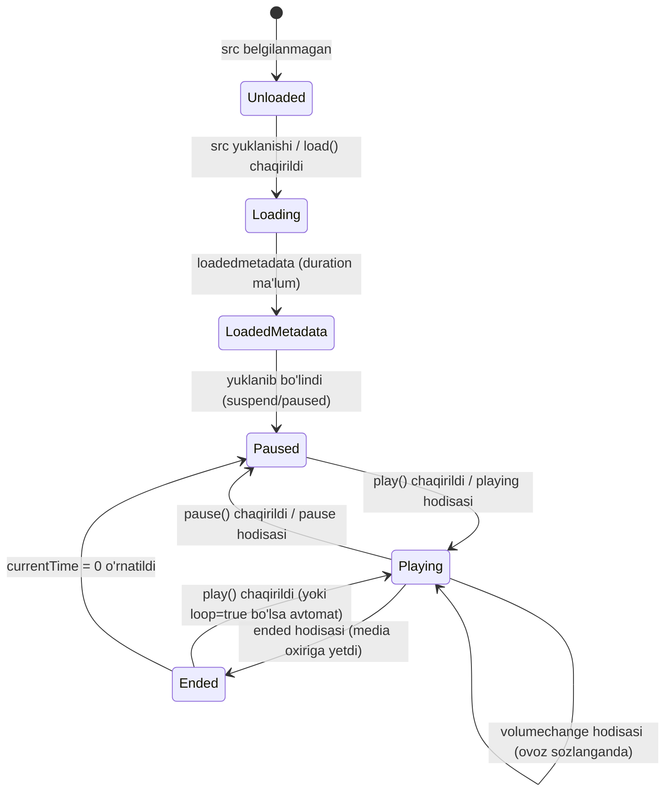

## 1. 💡 Sodda Tushuntirish va Analogiya

### Audio va Video API (HTMLMediaElement) nima?
**Audio va Video API** — bu brauzerga o'rnatilgan audio (`<audio>`) va video (`<video>`) fayllarni JavaScript yordamida dasturiy boshqarish (o'ynatish, to'xtatish, ovozni sozlash, tezlikni o'zgartirish) imkonini beruvchi interfeysdir. HTML-dagi pleyer faqat visual element bo'lsa, JavaScript bizga uning orqasidagi "miya" vazifasini bajarib beradi.

### Real hayotiy analogiya
Tasavvur qiling, sizda **avtomobil magnitolasi** va uning **masofaviy pulti (remote control)** bor:
* **Magnitola (HTML media elementi):** Qo'shiqlarni ijro qiluvchi va ovoz chiqaruvchi asosiy qurilma.
* **Pult (JavaScript Media API):** Magnitolani uzoqdan boshqaruvchi tugmalar to'plami:
  * `play()` tugmasi — gazni bosib harakatni (ijroni) boshlash.
  * `pause()` tugmasi — tormozni bosib vaqtincha to'xtash.
  * `currentTime` — kassetani qo'lda aylantirib, qo'shiqning ma'lum soniyasiga (masalan, 2-daqiqasiga) o'tkazish.
  * `volume` — ovozni baland yoki past qiluvchi burama murvat.
  * `muted` — ovozni bir zumda o'chirib qo'yuvchi Mute (tovushsiz) tugmasi (lekin original ovoz darajasini o'zgartirmaydi).
  * `timeupdate` (hodisa) — magnitola ekranida har soniyada o'zgarib turadigan elektron soniyalar hisoblagichi.

---

## 2. 💻 Real Kod Misollari

### 1. Basic Example (Play va Pause)
Videoni dasturiy boshqarish va brauzerning avtomatik o'ynatish (autoplay block) cheklovini to'g'ri hal qilish:
```javascript
const video = document.getElementById("my-video");

// play() va'da (Promise) qaytargani uchun .catch yordamida autoplay cheklovini tutamiz
function startPlayback() {
  video.play()
    .then(() => {
      console.log("Video muvaffaqiyatli o'ynay boshladi!");
    })
    .catch(error => {
      console.warn("Avtomatik o'ynatish taqiqlandi. Foydalanuvchi klik qilishi kutilmoqda:", error);
    });
}

// 5 soniyadan keyin videoni to'xtatish
setTimeout(() => {
  if (!video.paused) {
    video.pause();
    console.log("Video vaqtincha to'xtatildi.");
  }
}, 5000);
```

### 2. Intermediate Example (Mute va Tezlikni sozlash)
Ovoz rejimini almashtirish va ijro tezligini dinamik sozlash:
```javascript
const audio = document.getElementById("my-audio");

// Ovozni yoqish/o'chirish (Mute Toggle)
function toggleMute() {
  audio.muted = !audio.muted;
  console.log(audio.muted ? "Ovoz o'chirildi" : "Ovoz yoqildi");
}

// Ovoz balandligini 70% ga sozlash (0.0 dan 1.0 gacha)
function setVolumeToSeventy() {
  audio.volume = 0.7;
}

// Ijro tezligini 1.5 barobar oshirish (darslarni tez ko'rish uchun)
function setSpeedOneAndHalf() {
  audio.playbackRate = 1.5;
}
```

### 3. Advanced Example (Custom Progress Bar)
Vaqt yangilanishini kuzatish (`timeupdate`) va foydalanuvchiga progress bar-ni chizish:
```javascript
const video = document.getElementById("video-player");
const progressBar = document.getElementById("progress");

// Video o'ynayotgan vaqtda joriy vaqtni doimiy kuzatib boramiz
video.addEventListener("timeupdate", () => {
  if (video.duration) {
    // Foizni hisoblaymiz: (joriy vaqt / umumiy vaqt) * 100
    const percentage = (video.currentTime / video.duration) * 100;
    progressBar.style.width = `${percentage}%`;
  }
});

// Progress bar ustiga bosilganda videoni o'sha joyga o'tkazish
const progressContainer = document.getElementById("progress-container");
progressContainer.addEventListener("click", (e) => {
  const rect = progressContainer.getBoundingClientRect();
  const clickX = e.clientX - rect.left; // Bosilgan joy koordinatasi
  const width = rect.width;             // Progress bar kengligi
  
  // Bosilgan joy nisbati orqali yangi vaqtni hisoblaymiz
  const clickPercentage = clickX / width;
  video.currentTime = clickPercentage * video.duration;
});
```

---

## 3. ⚙️ Qanday Ishlaydi (Under the Hood)

### HTMLMediaElement Interfeysi va Merosxo'rlik
Brauzerda `<audio>` va `<video>` teglari JavaScript-da turli xil elementlar kabi ko'rinsa-da, aslida ularning ikkalasi ham bitta umumiy **`HTMLMediaElement`** prototipidan meros oladi. Shuning uchun ular bir xil metodlar (`play()`, `pause()`, `load()`) va xossalarga (`volume`, `currentTime`, `duration`, `paused`).

### Brauzerlarning Autoplay Siyosati (Autoplay Policy)
Zamonaviy brauzerlar foydalanuvchi tajribasini himoya qilish va internet trafigini tejash maqsadida sahifa yuklanganda ovozli media fayllarni avtomatik o'ynatishni taqiqlaydi. 
* **Autoplay ishlashi shartlari:**
  1. Media elementida `muted` xossasi `true` bo'lek bo'lishi kerak.
  2. Yoki foydalanuvchi sahifada kamida bir marta faol harakat qilgan bo'lishi (klik qilishi, tugmani bosishi) kerak.
* Agar ushbu shartlar bajarilmasa, `play()` metodi qaytargan Promise **`NotAllowedError`** bilan rad etiladi.

### Buffering (Buferlash) jarayoni
Media to'liq yuklanmasdan turib ham o'ynay boshlaydi. Buning sababi brauzer faylni bo'laklab yuklaydi (streaming).
* **`buffered`** xossasi `TimeRanges` obyektini qaytaradi. Unda brauzer media faylning aynan qaysi qismlarini yuklab bo'lganligi haqida vaqt segmentlari saqlanadi.

---

## 4. ❌ Ko'p Uchraydigan Xatolar (Junior Mistakes)

### 1. Metama'lumotlar yuklanmasdan oldin `duration`ni o'qish (NaN)
Video yuklanishi bilanoq uning davomiyligini (`duration`) o'qishga harakat qilganda `NaN` qiymati qaytadi, chunki brauzer hali fayl hajmi va uzunligini aniqlashga ulgurmagan bo'ladi.
```javascript
// XATO:
const myVideo = document.createElement("video");
myVideo.src = "movie.mp4";
console.log(myVideo.duration); // NaN

// TO'G'RI:
myVideo.addEventListener("loadedmetadata", () => {
  console.log(myVideo.duration); // Soniyalarda to'g'ri qiymat qaytadi
});
```

### 2. Ovoz darajasini belgilangan diapazondan tashqarida berish
Ovoz balandligi (`volume`) xususiyati faqat `0.0` va `1.0` orasidagi son bo'lishi mumkin.
```javascript
// XATO:
video.volume = 80; // IndexSizeError xatoligi otiladi va kod to'xtaydi!

// TO'G'RI:
video.volume = 0.8; // 80% ovoz balandligi
```

### 3. `play()` metodini xatolikni tutmasdan chaqirish
Brauzer autoplay-ni blocklaganda xatolik yuz beradi. Agar uni `.catch()` bilan tutmasangiz, konsolda qizil xatoliklar paydo bo'ladi.
```javascript
// XATO:
video.play(); // Konsolda: Uncaught (in promise) DOMException: play() failed...

// TO'G'RI:
video.play().catch(error => {
  showPlayButtonOnUI(); // UI-da foydalanuvchiga play tugmasini ko'rsatish
});
```

---

## 5. 💬 12 ta Intervyu Savollari

### Junior Darajasi (1-4)
1. **Savol:** `<audio>` va `<video>` elementlarini boshqaruvchi umumiy JavaScript klassi nima?
   * **Javob:** Har ikkala element ham **`HTMLMediaElement`** klassidan (prototipidan) meros oladi va uning xususiyatlarini ishlatadi.
2. **Savol:** Media pleyerni vaqtincha to'xtatish va to'liq o'chirish o'rtasida qanday farq bor?
   * **Javob:** Media elementlarida `stop()` metodi mavjud emas. To'xtatish uchun `pause()` chaqiriladi. Uni butunlay boshidan boshlash uchun `pause()` qilib, keyin `currentTime = 0` o'rnatiladi.
3. **Savol:** Media fayl butunlay ijro etilib bo'linganligini qaysi event orqali aniqlaymiz?
   * **Javob:** `'ended'` hodisasi (event) orqali aniqlanadi. Masalan, musiqa tugagach keyingisiga o'tishda ishlatiladi.
4. **Savol:** Nima uchun `video.play()` ba'zida konsolda xatolik qaytaradi?
   * **Javob:** Brauzerlarning Autoplay Policy (Avtomatik ijro siyosati) tufayli ovozli videolarni sahifa ochilishi bilan foydalanuvchi aralashuvisiz o'ynatib bo'lmaydi.

### Middle Darajasi (5-8)
5. **Savol:** `muted = true` va `volume = 0` o'rtasida qanday amaliy farq bor?
   * **Javob:** `muted = true` qilinganda ovoz o'chadi, lekin ovoz darajasi (volume) o'zgarmaydi. Mute o'chirilganda avvalgi ovoz balandligi qaytadi. `volume = 0` esa ovoz darajasini nolga tushiradi va avvalgi darajani eslab qolmaydi.
6. **Savol:** `playbackRate` nima va unga manfiy qiymat berish mumkinmi?
   * **Javob:** `playbackRate` ijro etish tezligini boshqaradi (masalan, `0.5` - sekin, `2.0` - tez). HTML5 standartiga ko'ra ba'zi brauzerlar orqaga o'ynatish uchun manfiy qiymatlarni qo'llashi belgilangan bo'lsa-da, amalda ko'pgina zamonaviy brauzerlar buni qo'llab-quvvatlamaydi va manfiy qiymat berilsa ijro to'xtaydi yoki xatolik yuz beradi.
7. **Savol:** Musiqa ijro etilayotganda buferlangan (yuklangan) qismlarni qanday ko'rish mumkin?
   * **Javob:** Elementning `buffered` xossasi orqali. U `TimeRanges` obyektini qaytaradi va undan yuklangan qismlarning boshlanish (`start(i)`) va tugash (`end(i)`) vaqtlarini olish mumkin.
8. **Savol:** `loadedmetadata` va `loadeddata` hodisalari farqi nimada?
   * **Javob:** `loadedmetadata` faqat metama'lumotlar (davomiyligi, o'lchamlari, format) yuklanganda ishlaydi. `loadeddata` esa brauzer birinchi freymni (videoning birinchi tasvirini) yuklab bo'lganda ishga tushadi.

### Senior Darajasi (9-12)
9. **Savol:** `readyState` xususiyati nima va uning qiymatlari nimani bildiradi?
   * **Javob:** `readyState` medianing hozirgi vaqtda ijroga tayyorlik holatini raqamlar orqali ko'rsatadi:
     * `0` (HAVE_NOTHING) — media haqida ma'lumot yo'q.
     * `1` (HAVE_METADATA) — metama'lumotlar bor.
     * `2` (HAVE_CURRENT_DATA) — joriy kadr bor, lekin keyingisi yuklanmagan (ijro davom etolmaydi).
     * `3` (HAVE_FUTURE_DATA) — ijro davom etishi mumkin, lekin keyinroq buferlash kerak bo'lishi mumkin.
     * `4` (HAVE_ENOUGH_DATA) — media to'liq yoki yetarli darajada yuklangan, to'xtovsiz o'ynay oladi.
10. **Savol:** Media Source Extensions (MSE) nima va u qachon kerak bo'ladi?
    * **Javob:** MSE — bu JavaScript-ga video oqimini dinamik ravishda bo'laklab (chunks) media elementiga uzatish imkonini beruvchi API. U HLS (HTTP Live Streaming) yoki DASH kabi moslashuvchan video oqimlarini (adaptive streaming) yaratish va video sifatini internet tezligiga qarab o'zgartirish uchun ishlatiladi.
11. **Savol:** Custom video pleyerda `timeupdate` hodisasidan foydalanish xotira va ishlash unumdorligiga qanday ta'sir qiladi va uni qanday optimallashtirish mumkin?
    * **Javob:** `timeupdate` hodisasi soniyasiga 4 dan 25 martagacha chaqirilishi mumkin. Uning ichida og'ir DOM manipulyatsiyalarini bajarish sahifani qotishiga (jank) olib keladi. Optimallashtirish uchun vaqtni yaxlitlab (soniyalarda), faqat soniya o'zgargandagina UI-ni yangilash kerak yoki `requestAnimationFrame` dan foydalanish lozim.
12. **Savol:** SPA (React/Vue) ilovalarida media elementlaridan foydalanganda xotira sizib chiqishi (memory leak) qanday yuzaga keladi?
    * **Javob:** Agar komponent o'chirilganda (unmount) video pleyer `pause()` qilinmasa va event listener-lar tozalanmasa, audio orqa fonda chalinishda davom etishi va xotira elementlari o'chmasdan qolishi mumkin. Buni oldini olish uchun unmount-da `src` bo'shatilib, `load()` chaqiriladi.

---

## 6. 🛠️ Amaliy Topshiriqlar

Quyidagi Mermaid diagrammasi HTML5 media elementining JavaScript yordamida boshqariladigan holatlar mashinasi (State Machine) va unga bog'liq hodisalarni (events) grafik shaklda tasvirlaydi:



* **Play/Pause:** Media ijrosining asosiy holatlari.
* **Volume Change & Timeupdate:** Ijro jarayonida faol ravishda yuz berib turadigan va UI-ni yangilash uchun xizmat qiladigan hodisalar.
* **Ended:** Ijro tugaganda keyingi treklarni boshqarish nuqtasi.

Amaliy mashqlar `/Users/farhod/Desktop/github/js-uz/scratch/audioVideo_exercises.json` faylida berilgan. Ularni bajarish orqali media boshqaruvini mustahkamlang.

---

## 7. 📝 12 ta Mini Test

Darsimizning quizzes bo'limida siz HTML5 Media API, uning xususiyatlari, brauzer cheklovlari va metodlari bo'yicha tayyorlangan 12 ta test savolini topasiz. Ularni yechib darsni qay darajada o'zlashtirganingizni sinab ko'ring.

Savollar `/Users/farhod/Desktop/github/js-uz/scratch/audioVideo_quizzes.json` faylida joylagan.

---

## 8. 🎯 Real Project Case Study

### Custom Video Pleyer (Custom Video Player)
Ushbu loyihada biz brauzerning standart video boshqaruv tugmalarini o'chirib, o'zimizning shaxsiy Play, Mute, Ovoz sozlagich va progress bar-ga ega bo'lgan boshqaruv panelimizni yaratamiz:

```javascript
// HTML:
// <div id="player-container">
//   <video id="my-video" src="video.mp4" width="600"></video>
//   <div class="controls">
//     <button id="play-btn">▶ Play</button>
//     <button id="mute-btn">🔊 Mute</button>
//     <input type="range" id="volume-slider" min="0" max="1" step="0.1" value="0.8">
//     <div id="progress-container" style="background:#ccc; height:10px; cursor:pointer;">
//       <div id="progress-bar" style="background:red; width:0%; height:100%;"></div>
//     </div>
//     <span id="time-display">00:00 / 00:00</span>
//   </div>
// </div>

const video = document.querySelector("#my-video");
const playBtn = document.querySelector("#play-btn");
const muteBtn = document.querySelector("#mute-btn");
const volumeSlider = document.querySelector("#volume-slider");
const progressBar = document.querySelector("#progress-bar");
const progressContainer = document.querySelector("#progress-container");
const timeDisplay = document.querySelector("#time-display");

// 1. Play/Pause rejimlarini almashtirish
function togglePlay() {
  if (video.paused || video.ended) {
    video.play()
      .then(() => { playBtn.textContent = "⏸ Pause"; })
      .catch(err => console.warn("Autoplay bloklandi:", err));
  } else {
    video.pause();
    playBtn.textContent = "▶ Play";
  }
}

playBtn.addEventListener("click", togglePlay);

// 2. Ovozni butunlay o'chirish / yoqish (Mute Toggle)
function toggleMute() {
  video.muted = !video.muted;
  muteBtn.textContent = video.muted ? "🔇 Unmute" : "🔊 Mute";
}

muteBtn.addEventListener("click", toggleMute);

// 3. Slider orqali ovoz balandligini sozlash
volumeSlider.addEventListener("input", (e) => {
  video.volume = e.target.value;
  video.muted = false; // Slider ishlatilganda ovoz avtomat yonadi
  muteBtn.textContent = video.volume === 0 ? "🔇 Unmute" : "🔊 Mute";
});

// 4. Vaqt ko'rsatkichi va Progress bar-ni yangilash
video.addEventListener("timeupdate", () => {
  const percent = (video.currentTime / video.duration) * 100;
  progressBar.style.width = `${percent}%`;
  
  // Vaqtni formatlash: soniyalarni MM:SS ko'rinishiga o'tkazish
  const format = (seconds) => {
    const min = String(Math.floor(seconds / 60) || 0).padStart(2, "0");
    const sec = String(Math.floor(seconds % 60) || 0).padStart(2, "0");
    return `${min}:${sec}`;
  };
  
  timeDisplay.textContent = `${format(video.currentTime)} / ${format(video.duration)}`;
});

// 5. Progress barga klik qilib videoni kerakli joyga o'tkazish (Seeking)
progressContainer.addEventListener("click", (e) => {
  const rect = progressContainer.getBoundingClientRect();
  const clickX = e.clientX - rect.left;
  const width = rect.width;
  const clickPercent = clickX / width;
  
  video.currentTime = clickPercent * video.duration;
});
```

---

## 9. 🚀 Performance va Optimization

* **`preload` atributidan to'g'ri foydalaning:**
  HTML-da media elementlariga `preload` atributini berish mumkin:
  * `preload="none"`: Foydalanuvchi play tugmasini bosmaguncha hech qanday ma'lumot yuklanmaydi (trafikni tejash uchun eng yaxshi usul).
  * `preload="metadata"`: Faqat video davomiyligi va formati yuklanadi (NaN xatosini oldini oladi va trafikni ko'p sarflamaydi).
  * `preload="auto"`: Sahifa yuklanishi bilan butun video orqa fonda yuklana boshlaydi (autoplay bo'lsa yoki video asosiy kontent bo'lsa qulay).

* **`timeupdate` ichidagi kodni kamaytiring (Throttling):**
  UI-da vaqtni har 250ms dan ortiq yangilash inson ko'zi uchun sezilarsiz bo'ladi. Agar soniyalarni MM:SS ko'rinishida chiqarmoqchi bo'lsangiz, faqat soniyaning butun qismi o'zgargandagina DOM-ni yangilang:
  ```javascript
  let lastSecond = -1;
  video.addEventListener("timeupdate", () => {
    const currentSec = Math.floor(video.currentTime);
    if (currentSec !== lastSecond) { // faqat yangi soniyaga o'tganda ishlaydi
      lastSecond = currentSec;
      updateTimeDisplay(currentSec);
    }
  });
  ```

* **Xotirani ozod qilish (Clean-up):**
  SPA platformalarida (React, Vue, Svelte) komponent unmount bo'lganda media yuklanishini to'liq to'xtatish xotira va tarmoq yuklanishini kamaytiradi:
  ```javascript
  // Komponent yo'qolganda:
  video.pause();
  video.removeAttribute("src"); // manbani o'chirish
  video.load();                 // pleyerni bo'shatish
  ```

---

## 10. 📌 Cheat Sheet

### Asosiy Metodlar
| Metod | Vazifasi | Qaytaradigan qiymati |
| :--- | :--- | :--- |
| `play()` | Medianing ijrosini boshlaydi | `Promise<void>` |
| `pause()` | Ijroni vaqtincha to'xtatadi | `void` |
| `load()` | Yangi o'rnatilgan manbani (`src`) qaytadan yuklaydi | `void` |
| `canPlayType(mimeType)` | Brauzer ushbu formatni o'ynata olishini tekshiradi | `'probably'`, `'maybe'` yoki `''` |

### Asosiy Xossalar (Properties)
| Xossa | Vazifasi | Turi / Diapazoni | O'qish/Yozish |
| :--- | :--- | :--- | :--- |
| `currentTime` | Joriy ijro vaqti (soniyalarda) | `Number` | O'qish va Yozish |
| `duration` | Medianing umumiy vaqti (soniyalarda) | `Number` | Faqat o'qish |
| `volume` | Ovoz balandligi | `0.0` dan `1.0` gacha | O'qish va Yozish |
| `muted` | Ovoz o'chirilganligi | `Boolean` | O'qish va Yozish |
| `paused` | Media to'xtab turganligi | `Boolean` | Faqat o'qish |
| `ended` | Ijro oxiriga yetganligi | `Boolean` | Faqat o'qish |
| `playbackRate` | Ijro tezligi (1.0 = normal) | `Number` | O'qish va Yozish |
| `readyState` | Medianing yuklanish darajasi | `Number` (0 dan 4 gacha) | Faqat o'qish |

### Eng ko'p ishlatiladigan Hodisalar (Events)
| Hodisa | Ishga tushish vaqti |
| :--- | :--- |
| `'play'` | `play()` chaqirilganda yoki autoplay boshlanganda |
| `'pause'` | `pause()` chaqirilganda |
| `'playing'` | Media buferlashdan chiqib, rostdan o'ynay boshlaganda |
| `'timeupdate'` | Ijro vaqti (`currentTime`) o'zgarganda (tez-tez chaqiriladi) |
| `'volumechange'` | Ovoz darajasi yoki `muted` holati o'zgarganda |
| `'ended'` | Ijro oxiriga yetganda |
| `'loadedmetadata'` | Fayl uzunligi va o'lchamlari aniqlanganda |
| `'waiting'` | Tarmoq sekinligi sababli video to'xtab, buferlash boshlanganda |
