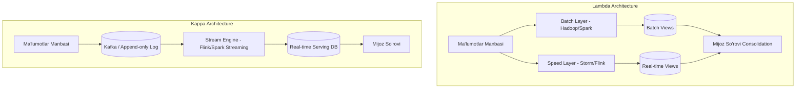

# Batch va Stream Processing (Katta ma'lumotlarni qayta ishlash)

## 1. 💡 Sodda Tushuntirish va Analogiya

Tizimlar juda katta hajmdagi ma'lumotlar bilan ishlaganda (Big Data), ularni qayta ishlashning ikki xil asosiy falsafasi yuzaga keladi: **Batch (Guruhli) Processing** va **Stream (Oqimli) Processing**.

### Real hayotiy analogiya:
*   **Batch Processing (Paqirda suv tashish):** Tasavvur qiling, sizda katta hovuz bor. Uni to'ldirish uchun siz chelakni (paqirni) quduqqa olib borib, suv to'ldirib, hovuzga quyasiz. Suv faqat paqir to'lgandan keyingina yetib keladi. Bu xuddi kunlik tranzaksiyalarni tun yarmida yig'ib hisoblashga o'xshaydi.
*   **Stream Processing (Vodoprovod quvuri):** Bu safar siz quduqdan hovuzgacha to'g'ridan-to'g'ri quvur tortib qo'yasiz. Suv doimiy ravishda oqib turadi. Har bir tomchi suv real vaqtda hovuzga yetib keladi. Bu real vaqtdagi foydalanuvchilar oqimini har soniyada tahlil qilishdir.

---

## 2. 💻 Real Kod Misollari

### 1. Oddiy MapReduce Paradigmasi
MapReduce — bu katta ma'lumotlarni parallel qayta ishlash modeli. Keling, JavaScript-da matndagi so'zlar sonini hisoblash misolida Map, Shuffle va Reduce bosqichlarini simulyatsiya qilamiz:

```javascript
// 1. Map bosqichi: Matnni so'zlarga ajratib, har biri uchun [key, 1] juftligini yaratadi
function mapStep(text) {
  return text.toLowerCase().split(/\s+/).map(word => {
    // Tinish belgilarini tozalash
    const cleanWord = word.replace(/[.,/#!$%\^&\*;:{}=\-_`~()]/g, "");
    return [cleanWord, 1];
  }).filter(pair => pair[0].length > 0);
}

// 2. Shuffle bosqichi: Bir xil kalitli qiymatlarni guruhlaydi
function shuffleStep(mappedPairs) {
  const grouped = {};
  mappedPairs.forEach(([word, count]) => {
    if (!grouped[word]) grouped[word] = [];
    grouped[word].push(count);
  });
  return grouped; // { 'hello': [1, 1], 'world': [1] }
}

// 3. Reduce bosqichi: Guruhlangan qiymatlarni yig'ib natijani chiqaradi
function reduceStep(groupedData) {
  const result = {};
  for (const [word, counts] of Object.entries(groupedData)) {
    result[word] = counts.reduce((acc, curr) => acc + curr, 0);
  }
  return result; // { 'hello': 2, 'world': 1 }
}

// Birlashtirilgan MapReduce zanjiri
const text = "Hello world! Hello node.";
const mapped = mapStep(text);
const shuffled = shuffleStep(mapped);
const reduced = reduceStep(shuffled);

console.log(reduced); // { hello: 2, world: 1, node: 1 }
```

---

## 3. ⚙️ Qanday Ishlaydi (Under the Hood)

### 1. MapReduce Paradigm
*   **Map:** Ma'lumotlarni filtrlash va transformatsiya qilish (parallel bajariladi).
*   **Shuffle (va Sort):** Ma'lumotlarni kaliti bo'yicha tarmoq orqali qayta taqsimlash (Eng qimmat operatsiya, chunki disk I/O va Network I/O talab qiladi).
*   **Reduce:** Guruhlangan ma'lumotlarni agregatsiya qilish (yig'indi, o'rtacha qiymat va hokazo).

### 2. Apache Spark (Micro-batch) vs Apache Flink (Real-time Stream)
*   **Apache Spark Streaming:** Oqimni juda kichik guruhlarga (micro-batches, masalan, har 500ms dagi eventlar) bo'ladi va ularni batch dvigateli yordamida qayta ishlaydi.
*   **Apache Flink:** Har bir event kelishi bilan uni zudlik bilan qayta ishlaydi (Native Streaming). Kechikish muddati (latency) mikrosaniyalarda o'lchanadi.

### 3. Oyna Turlari (Windowing)
Oqimli ma'lumotlar cheksiz bo'lgani uchun, ularni agregatsiya qilishda vaqtinchalik oynalar ishlatiladi:
*   **Tumbling Window (Kesishmaydigan oyna):** Ruxsat etilgan statik vaqt oralig'i (masalan, har 5 daqiqalik oyna: 10:00-10:05, 10:05-10:10).
*   **Sliding Window (Siljuvchi oyna):** Oyna hajmi va siljish qadamiga ega (masalan, oyna hajmi 5 daqiqa, har 1 daqiqada siljiydi). Oynalar ustma-ust tushishi mumkin.
*   **Session Window (Sessiya oynasi):** Foydalanuvchi faolligiga qarab dynamic o'zgaradi. Agar foydalanuvchi ma'lum bir vaqt (inactivity gap) davomida hech narsa qilmasa, oyna yopiladi.

### 4. Event Time vs Processing Time, Watermarks
*   **Event Time (Hodisa vaqti):** Event foydalanuvchi qurilmasida haqiqatda sodir bo'lgan vaqt.
*   **Processing Time (Qayta ishlash vaqti):** Event serverga yetib kelib, dastur tomonidan o'qilgan vaqt.
*   **Late Data & Watermarks:** Tarmoq kechikishi sababli ba'zi eventlar kech yetib keladi. **Watermark** — bu Event Time bo'yicha tizim qanchalik orqada qolayotganini belgilovchi vaqt ko'rsatkichi. Masalan, `Watermark = MaxEventTime - AllowedLateness`. Watermarkdan kichik bo'lgan eventlar "Late Data" (kechikkan) deb hisoblanadi va odatda maxsus qayta ishlanadi.

---

## 4. ❌ Ko'p Uchraydigan Xatolar (Junior Mistakes)

1.  **Shuffle operatsiyalarini haddan tashqari ko'p ishlatish:** Shuffle tarmoq orqali ma'lumotlarni uzatadi va diskka yozadi. Spark/MapReduce dasturlarida keraksiz joyda `groupByKey` ishlatish o'rniga `reduceByKey` kabi lokal agregatsiya qiluvchi metodlardan foydalanish lozim.
2.  **Oqim drayverida state xotirasini cheklamang:** Session window yoki stateful oqimlarda eski holatlarni (state) tozalab turish (TTL o'rnatish) esdan chiqsa, xotira to'lib `OutOfMemory` xatoligi yuzaga keladi.
3.  **Processing Time-ni Event Time o'rniga ishlatish:** Tarmoq uzilishi tufayli foydalanuvchi telefonidagi 5 ta hodisa 1 soatdan keyin serverga birga yetib kelsa va siz Processing Time ishlatsangiz, barcha 5 ta event noto'g'ri tarzda joriy oyna uchun hisoblanadi.

---

## 5. 💬 12 ta Intervyu Savollari

**1. Batch processing nima va u qachon qo'llaniladi?**
Tarixiy, katta hajmdagi ma'lumotlarni bloklarga bo'lib, past kechikish talab etilmaydigan holatlarda (masalan, kunlik hisobotlar, oylik tahlillar) qayta ishlash.

**2. Stream processing nima va uning asosiy qiyinchiligi nimada?**
Cheksiz ma'lumotlar oqimini real vaqtda qayta ishlash. Asosiy qiyinchiligi — ma'lumotlarning tartibsiz kelishi (out-of-order) va tizim holatini (state) xotirada saqlash.

**3. Apache Spark Streaming va Apache Flink o'rtasidagi asosiy farq nima?**
Spark asosan micro-batching modeliga asoslangan, Flink esa har bir elementni individual ravishda qayta ishlovchi continuous event-driven stream processing dvigatelidir.

**4. MapReduce modelidagi Shuffle qadami nima uchun eng og'ir hisoblanadi?**
Chunki u barcha node-lardagi ma'lumotlarni kalitlar bo'yicha guruhlash uchun tarmoq (network) orqali yuboradi va diskka vaqtinchalik yozadi.

**5. Watermark nima va u kechikkan ma'lumotlarni qanday hal qiladi?**
Watermark — oqimli tizimda Event Time vaqtining borishini kuzatuvchi ko'rsatkich. U kechikkan ma'lumotlar (late data) qachongacha qabul qilinishini belgilaydi. Undan keyin kelgan ma'lumotlar rad etiladi yoki DLQ ga o'tkaziladi.

**6. Lambda arxitekturasi nima va uning kamchiligi nimada?**
Lambda arxitekturasi ma'lumotlarni parallel ravishda ham Batch Layer-ga (aniqlik uchun), ham Speed Layer-ga (tezlik uchun) yuboradi. Kamchiligi — bitta biznes mantiqni (business logic) ikki xil texnologiyada (masalan, Spark va Storm/Flink) yozish va saqlash majburiyati.

**7. Kappa arxitekturasi qanday ishlaydi?**
Kappa arxitekturasi batch layerdan butunlay voz kechib, barcha ma'lumotlarni yagona oqimli (stream) dvigatel yordamida qayta ishlaydi. Tarixiy ma'lumotlarni qayta ishlash uchun esa log brokeridan (Kafka) ma'lumotlar boshidan qayta oqiziladi (replay).

**8. At-least-once, At-most-once va Exactly-once delivery semantics farqlari nimada?**
*   **At-most-once:** Xabar 0 yoki 1 marta yetib boradi (yo'qolishi mumkin, dublikat bo'lmaydi).
*   **At-least-once:** Xabar kamida 1 marta yetib boradi (yo'qolmaydi, lekin dublikat bo'lishi mumkin).
*   **Exactly-once:** Xabar aniq 1 marta yetkaziladi va qayta ishlanadi (tranzaksiyalar va idempotentlik yordamida erishiladi).

**9. Stateful vs Stateless stream processing nima?**
Stateless-da har bir event mustaqil qayta ishlanadi. Stateful-da esa tizim o'tgan eventlar tarixini (masalan, oxirgi 1 soatdagi tranzaksiyalar summasini) xotirada saqlab turishi kerak.

**10. Tumbling Window va Sliding Window o'rtasidagi farqni chizib bering.**
Tumbling Window oynalari bir-biri bilan kesishmaydi (10:00-10:05, 10:05-10:10). Sliding Window oynalari esa siljish qadami tufayli ustma-ust tushishi mumkin (10:00-10:05 oyna 1 daqiqadan keyin 10:01-10:06 bo'lib o'zgaradi).

**11. Nega oqimli tizimlarda ma'lumotlar tartibsiz (out-of-order) kelib qoladi?**
Tarmoq uzilishlari, qurilmalarning oflayn rejimda ishlashi va yuklamalar muvozanati tufayli eventlar yaratilgan vaqtidan ancha kech yetib kelishi mumkin.

**12. Backpressure nima va u oqimli ishlov berishda nega zarur?**
Agar ma'lumotlar oqimi tezligi Consumer-ning qayta ishlash tezligidan yuqori bo'lsa, tizim qulamasligi uchun brokerga xabarlar tezligini pasaytirish haqida signal yuboriladi. Bu Backpressure deyiladi.

---

## 6. 🛠️ Amaliy Topshiriqlar

Dars doirasida siz MapReduce simulyatsiyasi, oynali agregatorlar (Tumbling, Sliding, Session), Watermark trekeri va Lambda/Kappa arxitekturasi elementlarini yozasiz. Har bir topshiriq real ma'lumotlar oqimini simulyatsiya qiladi.

---

## 7. 📝 12 ta Mini Test

Bilimingizni tekshirish uchun dars oxiridagi 12 ta mini testni bajaring.

---

## 8. 🎯 Real Project Case Study

### Netflix Real-Time Recommendation System
Netflix foydalanuvchilar qaysi videoni tomosha qilayotganini real vaqtda kuzatish uchun **Apache Flink** va **Apache Kafka** dan foydalanadi.
*   **Muammo:** Foydalanuvchi sahifasini tark etmasdan oldin unga mos tavsiyalarni 1 soniya ichida chiqarish kerak edi. An'anaviy batch processing (Hadoop) buni bajara olmas edi.
*   **Yechim:** Foydalanuvchi bosgan har bir tugma (clickstream) Kafka orqali Flink-ga keladi. Flink dynamic Session Window yordamida foydalanuvchi faolligini kuzatib boradi va uning joriy qiziqishlari asosida tavsiyalarni o'zgartiradi.

---

## 9. 🧠 Vizual ko'rinish (Architecture Diagram)

Quyida Lambda va Kappa arxitekturasining taqqoslanishi hamda oynalash turlari tasvirlangan:



---

## 10. 📌 Cheat Sheet

| Xususiyat | Batch Processing | Stream Processing |
| :--- | :--- | :--- |
| **Ma'lumotlar hajmi** | Cheklangan, statik | Cheksiz, dinamik |
| **Kechikish (Latency)** | Daqiqalar / Soatlar | Millisekund / Soniyalar |
| **Dvigatellar** | Hadoop MapReduce, Spark | Apache Flink, Kafka Streams |
| **Oynalash (Windowing)** | Ishlatilmaydi (yoki statik) | Tumbling, Sliding, Session |
| **Holat (State)** | Saqlanmaydi (tarixiy) | Stateful (xotirada saqlanadi) |
