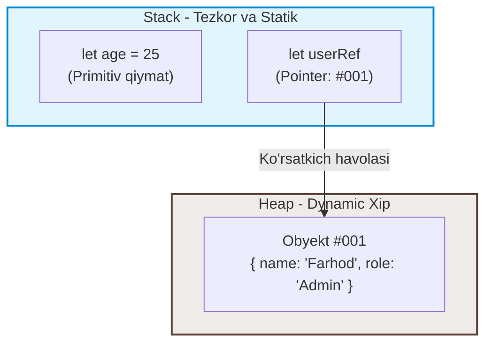
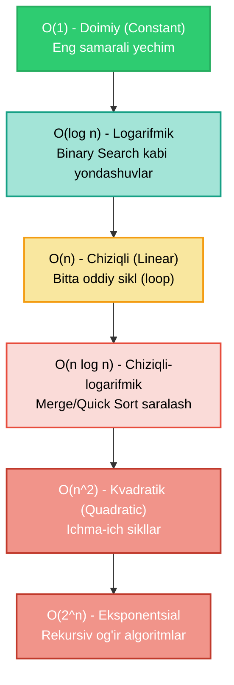

## 1. 💡 Sodda Tushuntirish va Analogiya

### Big O va Algoritmlar Murakkabligi nima?
* **Big O Notatsiyasi:** Bu algoritmning kirish ma'lumotlari hajmi (masalan, massiv uzunligi yoki matn o'lchami) o'sishi bilan uning bajarilish vaqti (Time Complexity) yoki talab etadigan qo'shimcha xotira hajmi (Space Complexity) qanchalik o'sishini ko'rsatadigan matematik o'lchovdir.
* **Maqsad:** Kodimiz millisekundlarda qancha tez ishlashini emas (chunki u kompyuterning protsessoriga bog'liq), balki operatsiyalar soni ma'lumotlar ko'payganda qanday tezlikda o'sib borishini o'rganishdir.

### Real hayotiy analogiya
Tasavvur qiling, siz **do'stingizga katta hajmdagi ma'lumot faylini (masalan, 1 TB video)** yetkazishingiz kerak:
* **1-usul (Internet orqali jo'natish):** Agar siz faylni Telegram yoki bulutli saqlagich orqali jo'natsangiz, uzatish vaqti fayl hajmiga to'g'ri proporsional ravishda oshadi. 1 GB tez uzatiladi, 1 TB esa ancha uzoq kutishni talab qiladi. Bu **O(n)** (Chiziqli murakkablik).
* **2-usul (Samolyot yoki mashinada olib borish):** Siz faylni qattiq diskka (HDD/SSD) yozasiz-da, mashinaga o'tirib o'zingiz yetkazib berasiz. Bu holda fayl o'lchami 1 GB bo'ladimi yoki 10 TB bo'ladimi, borish vaqti bir xil bo'lib qolaveradi. Bu **O(1)** (Doimiy murakkablik).

---

## 2. 💻 Real Kod Misollari

### 1. Constant Time - O(1) (Doimiy vaqt)
Ma'lumot hajmi qancha bo'lishidan qat'i nazar, faqat bitta operatsiya bajariladi:
```javascript
function getElementAtIndex(arr, index) {
  return arr[index]; // O(1) - indeks bo'yicha olish darhol bajariladi
}
```

### 2. Linear Time - O(n) (Chiziqli vaqt)
Operatsiyalar soni kirish ma'lumotlari soni `n` ga to'g'diran-to'g'ri bog'liq:
```javascript
function printAllElements(arr) {
  for (let i = 0; i < arr.length; i++) {
    console.log(arr[i]); // O(n) - massivda n ta element bo'lsa, n marta ishlaydi
  }
}
```

### 3. Quadratic Time - O(n^2) (Kvadratik vaqt)
Ko'pincha ichma-ich joylashgan looplar sababli yuzaga keladi. Elementlar soni ko'paysa, vaqt keskin (kvadrat shaklida) oshadi:
```javascript
function printPairs(arr) {
  for (let i = 0; i < arr.length; i++) {
    for (let j = 0; j < arr.length; j++) {
      console.log(arr[i], arr[j]); // O(n^2) - har bir element boshqa har bir element bilan juftlanadi
    }
  }
}
```

---

## 3. ⚙️ Qanday Ishlaydi (Under the Hood)

### Xotira taqsimoti: Stack vs Heap
Dastur bajarilayotganda JavaScript dvigateli (V8 kabi) xotirani ikki qismga bo'ladi:
1. **Stack (Stek xotira):**
   * Bu qism o'ta tezkor va o'lchami oldindan ma'lum bo'lgan static ma'lumotlarni saqlaydi.
   * Primitiv turlar (Numbers, Strings, Booleans, undefined, null) to'g'ridan-to'g'ri stack xotirasida qiymat sifatida saqlanadi.
   * Funksiya chaqiriqlari va lokal o'zgaruvchilar uchun yaratilgan ramkalar (execution frames) shu yerda joylashadi.

2. **Heap (Xip xotira):**
   * Bu katta va tartibsiz joylashgan dynamic xotira hovuzidir.
   * Obyektlar, massivlar va funksiyalar kabi o'lchami dynamic ravishda o'zgaruvchi referensial ma'lumotlar heap xotirasidan joy oladi.
   * Stack xotirada esa faqatgina ushbu obyektning heapdagi manziliga ishora qiluvchi ko'rsatkich pointer (`reference`) saqlanadi.

```javascript
let age = 25; // Stack xotirada qiymat bilan saqlanadi. Space: O(1)
let user = { name: "Ali", age: 25 }; // Obyekt Heap xotirada, unga havola Stack xotirada saqlanadi.
```

### Big O ni hisoblash qoidalari
Dastur kodining Big O murakkabligini aniqlash uchun quyidagi 3 ta asosiy qoidaga amal qilinadi:

1. **Eng yomon holatga e'tibor qaratish (Worst Case):**
   Agar massivdan element qidirayotgan bo'lsak, u eng birinchi indeksda ham bo'lishi mumkin (Best Case - O(1)) yoki umuman yo'q bo'lishi mumkin (Worst Case - O(n)). Biz doimo eng yomon holatni - O(n) ni hisobga olamiz.
   
2. **O'zgarmaslarni (Constants) olib tashlash:**
   Agar algoritm `2n` ta operatsiya bajarsa, u `O(2n)` deb emas, balki `O(n)` deb yoziladi. Chunki `n` cheksizlikka intilganda `2` koeffitsiyenti ahamiyatini yo'qotadi.
   
3. **Kichik hadlarni olib tashlash (Drop Non-Dominant Terms):**
   Agar algoritm `n^2 + n + 5` ta operatsiya bajarsa, uning murakkabligi `O(n^2)` deb olinadi. Chunki `n` juda katta bo'lganda (masalan, 1,000,000), `n^2` (1 trillion) oldida `n` (1 million) va `5` juda kichik bo'lib qoladi.

---

## 4. ❌ Ko'p Uchraydigan Xatolar (Junior Mistakes)

### 1. Loop ichida og'ir metodlarni ishlatish (yashirin O(n^2))
Sikl ichida `indexOf`, `includes`, `shift` yoki `slice` kabi chiziqli murakkablikdagi metodlarni ishlatish kodni bilmasdan sekinlashtiradi.
* **Xato (O(n^2)):**
  ```javascript
  const arr = [1, 2, 3, 4, 5];
  for (let i = 0; i < arr.length; i++) {
    if (arr.includes(3)) { // includes ham orqa fonda massivni aylanib chiqadi (O(n))
      console.log("Topildi");
    }
  }
  ```
* **Tuzatish (O(n) yoki O(1) lookup):**
  Qidiruv uchun `Set` yoki `Map`dan foydalanish lookup operatsiyasini O(1) ga tushiradi:
  ```javascript
  const mySet = new Set(arr);
  for (let i = 0; i < arr.length; i++) {
    if (mySet.has(3)) { // Set.has() O(1) murakkablikda ishlaydi
      console.log("Topildi");
    }
  }
  ```

---

## 5. 💬 12 ta Intervyu Savollari

### Junior
1. **Big O nima?**
   * *Javob:* Algoritmning kirish o'lchami kattalashganda vaqt va xotira sarfining o'sish sur'atini ko'rsatuvchi matematik notatsiya.
2. **O(1) va O(n) farqi nimada?**
   * *Javob:* O(1) doimiy vaqt oladi, O(n) esa ma'lumotlar soniga mutanosib ravishda o'sib boradi.
3. **Sikl ichidagi boshqa sikl qanday murakkablik yaratadi?**
   * *Javob:* Agar ikkala sikl ham kirish o'lchami `n` ga bog'liq bo'lsa, u O(n^2) kvadratik murakkablikni yaratadi.
4. **JavaScript massivining `.push()` metodi qanday vaqt oladi?**
   * *Javob:* O(1) amortizatsiyalangan vaqt oladi, chunki u massiv oxiriga element qo'shadi.

### Middle
5. **Logarifmik murakkablik (O(log n)) deganda nimani tushunasiz?**
   * *Javob:* Har bir bosqichda kirish ma'lumotlarining hajmi yarmiga qisqarib boradigan algoritmlar (masalan, Binary Search).
6. **Space Complexity (Xotira murakkabligi) nima?**
   * *Javob:* Algoritm o'z ishini bajarishi uchun talab etadigan qo'shimcha xotira miqdori (kirish ma'lumotlaridan tashqari).
7. **Nima uchun Big O da konstantalar (masalan, O(2n)) yozilmaydi?**
   * *Javob:* Chunki Big O ning maqsadi aniq millisekundlarni o'lchash emas, balki `n` cheksiz o'sganda tendensiyani (o'sish tezligini) ifodalashdir.
8. **Massiv boshiga element qo'shish (`.unshift()`) nega O(n) vaqt oladi?**
   * *Javob:* Massivning barcha mavjud elementlarini bitta indeks o'ngga surib chiqish kerak bo'lgani uchun.

### Senior
9. **Amortizatsiyalangan murakkablik (Amortized Time Complexity) nima?**
   * *Javob:* Ko'p marta bajariladigan operatsiyalarning o'rtacha murakkabligi. Masalan, massiv to'lib qolganda xotirani kengaytirish O(n) vaqt olsa-da, oddiy vaqtlarda `.push()` O(1) oladi. O'rtacha hisoblaganda bu O(1) ga teng.
10. **Rekursiv chaqiriqlarning Space Complexity-ga ta'siri qanday?**
    * *Javob:* Har bir rekursiv chaqiriq Call Stack-ga yangi freym qo'shadi. Shuning uchun rekursiya chuqurligi `d` bo'lsa, u O(d) qo'shimcha xotira talab qiladi.
11. **`new Set()` yordamida massivdagi dublikatlarni tozalashning murakkabligi qanday?**
    * *Javob:* Vaqt bo'yicha O(n), chunki har bir element Set-ga qo'shib chiqiladi. Xotira bo'yicha ham O(n), chunki yangi Set yaratiladi.
12. **`O(n log n)` algoritmlar `O(n^2)` dan har doim tezroqmi?**
    * *Javob:* Matematik jihatdan `n` kattalashganda `n log n` doimo `n^2` dan kichik bo'ladi. Lekin `n` juda kichik bo'lganda (masalan, n < 10) konstantalar ta'sirida ba'zan O(n^2) tezroq ishlashi mumkin.

---

## 6. 🎨 Interaktiv Vizual

### Stack vs Heap Xotira Strukturasi
Quyidagi diagrammada primitiv `age` o'zgaruvchisi va heapdagi obyektga ishora qiluvchi `userRef` ko'rsatkichining xotiradagi ko'rinishi keltirilgan:



### Big O Murakkablik Tizimi
Algoritmlar o'sish sur'atlarining o'zaro taqqoslanishi:



---

## 7. 🛠️ Amaliy Topshiriqlar

Bu dars uchun mo'ljallangan amaliy topshiriqlarni `bigO_exercises.json` faylidan topishingiz mumkin. U yerda siz O(1), O(n) va O(log n) murakkablikdagi algoritmlarni amaliy yozasiz.

---

## 8. 📝 12 ta Mini Test

Dars oxirida o'zlashtirgan bilimlaringizni tekshirish uchun 12 ta test savollari tayyorlangan. Savollar va variantlar `bigO_quizzes.json` faylida keltirilgan.

---

## 9. 🚀 Performance va Optimization

* **O(1) va O(log n) sari intiling:** Qidiruv va lookup amallarida massivlardan ko'ra Hash Table (Set/Map) ma'lumotlar tuzilmasini tanlang.
* **Ichma-ich looplardan qoching:** Kodda `for` ichida boshqa `for` ishlatayotganda massiv o'lchamlarini hisobga oling. Agar `n` katta bo'lsa, bu algoritm ishdan chiqishiga olib kelishi mumkin.

---

## 10. 📌 Cheat Sheet

| Murakkablik | Nomi | Izoh / Misol | O'sish tezligi |
| :--- | :--- | :--- | :--- |
| **O(1)** | Constant (Doimiy) | Massiv elementini indeks orqali olish | Juda zo'r |
| **O(log n)** | Logarithmic (Logarifmik) | Binary Search | Juda yaxshi |
| **O(n)** | Linear (Chiziqli) | Oddiy `for` loop, `.find()`, `.indexOf()` | Yaxshi |
| **O(n log n)** | Linearithmic | Merge Sort, Quick Sort | Qoniqarli |
| **O(n^2)** | Quadratic (Kvadratik) | Ichma-ich `for` looplar | Yemon |
| **O(2^n)** | Exponential (Eksponentsial) | Rekursiv Fibonachchi ketma-ketligi | Juda yomon |
