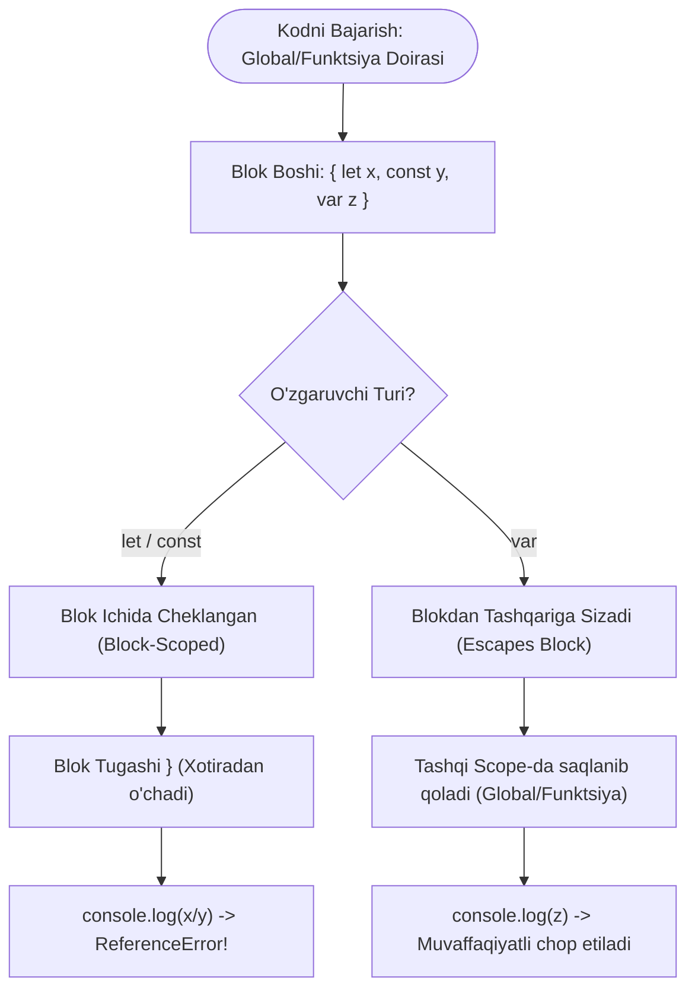

## 1. 💡 Sodda Tushuntirish va Analogiya

### Blok Ko'lami (Block Scope) nima?
Blok ko'lami — bu o'zgaruvchining faqat o'zi e'lon qilingan figurali qavslar `{ ... }` (blok) ichida ko'rinishi va undan tashqarida mavjud bo'lmasligidir. JavaScript-da `let` va `const` yordamida e'lon qilingan o'zgaruvchilar blok ko'lamiga ega. O'z navbatida, `var` kalit so'zi blok ko'lamini mutlaqo hisobga olmaydi.

### Real hayotiy analogiya
Tasavvur qiling, siz ko'p xonali **shaxsiy uyda** yashayapsiz:
* **`let` va `const` (Xonadagi shaxsiy buyumlar):** Siz xonangizning ichiga seyf qo'ydingiz va u yerda shaxsiy kundaligingizni saqlaysiz. Uyning boshqa xonasidagi odamlar u yerga kira olmaydi va u buyumni ko'ra olmaydi. Agar kimdir tashqaridan kundalikni so'rasa, "bunday buyum yo'q" deb javob beriladi (ReferenceError).
* **`var` (Megafonli odam):** Siz xonangiz ichida turib megafonda baqiryapsiz. Garchi siz xona ichida bo'lsangiz ham, ovozingiz butun uyga tarqaladi. Uyning istalgan burchagidagi odam sizni eshitishi mumkin, chunki ovoz xona chegarasidan (blokdan) tashqariga sizib chiqqan.

---

## 2. 💻 Real Kod Misollari

### 1. Basic Example (Bare Blocks va if-else shartlarida doiralar)
Bare block (oddiy figurali qavslar) ichida o'zgaruvchilar e'lon qilish:
```javascript
{
  var globalA = "Men megafonman (var)";
  let localB = "Men shaxsiy xonadaman (let)";
  const localC = "Men ham shaxsiy xonadaman (const)";
}

console.log(globalA); // Natija: "Men megafonman (var)"
// console.log(localB); // Xato beradi: ReferenceError: localB is not defined
// console.log(localC); // Xato beradi: ReferenceError: localC is not defined
```

`if-else` sharti ichida blok ko'lami:
```javascript
const isAuthorized = true;

if (isAuthorized) {
  let secretKey = "12345-SUPER-SECRET";
  var sessionID = "ACTIVE-SESSION-99";
  console.log("Blok ichida secretKey:", secretKey); // Ishlaydi
}

console.log("Blok tashqarisida sessionID:", sessionID); // Natija: ACTIVE-SESSION-99
// console.log("Blok tashqarisida secretKey:", secretKey); // ReferenceError xatosi!
```

### 2. Intermediate Example (for tsikli ichida let va var farqi)
`var` yordamida tsikl sanog'ini yaratganda uning tashqariga sizib chiqishi:
```javascript
for (var i = 0; i < 3; i++) {
  console.log("Tsikl ichi:", i); // 0, 1, 2
}
console.log("Tsikl tashqarisi (var):", i); // Natija: 3 (Sizib chiqdi!)
```

`let` yordamida tsikl yozilganda xavfsiz blok ko'lami:
```javascript
for (let j = 0; j < 3; j++) {
  console.log("Tsikl ichi:", j); // 0, 1, 2
}
// console.log("Tsikl tashqarisi (let):", j); // ReferenceError: j is not defined
```

### 3. Advanced Example (O'zgaruvchini soya qilish - Shadowing va TDZ)
Bir xil nomdagi o'zgaruvchilarni ichma-ich bloklarda e'lon qilish (Variable Shadowing):
```javascript
const username = "Ali"; // Global/Tashqi o'zgaruvchi

{
  // console.log(username); // ReferenceError: Cannot access 'username' before initialization
  // Sababi: TDZ (Temporal Dead Zone) boshlandi. Blok ichidagi username hali yaratilmagan.
  
  let username = "Vali"; // Soya qilish (Shadowing) boshlandi
  console.log("Blok ichida username:", username); // Natija: "Vali"
  
  {
    let username = "Hasan"; // Yana bir qatlam soya qilish
    console.log("Ichki blokda username:", username); // Natija: "Hasan"
  }
  
  console.log("Blok ichida qayta tekshirish:", username); // Natija: "Vali" (Hasan o'chib ketdi)
}

console.log("Blok tashqarisida username:", username); // Natija: "Ali" (Tashqi o'zgaruvchiga ta'sir qilmadi)
```

---

## 3. ⚙️ Qanday Ishlaydi (Under the Hood)

### Leksik Muhit (Lexical Environment) va Bloklar
JavaScript dvigateli (masalan, Chrome brauzeridagi V8) kodni bajarishda **Bajarilish Konteksti (Execution Context)** va **Leksik Muhit (Lexical Environment)** konsepsiyalaridan foydalanadi:

1. **Blokga kirish:** Dvigatel biror blokni `{` boshlaganda, joriy leksik muhitni vaqtincha muzlatib, blok uchun yangi alohida leksik muhit (Lexical Environment) yaratadi.
2. **Environment Record:** Blok uchun ochilgan muhit ikki qismdan iborat bo'ladi:
   * **Declarative Environment Record:** Blok doirasidagi `let`, `const`, `class` e'lonlarini saqlaydi.
   * **Outer reference (Tashqi havola):** Ota (tashqi) blok yoki funktsiyaning leksik muhitiga ishora qiladi (Scope Chain shu orqali ishlaydi).
3. **Hoisting va TDZ:** Blok ichidagi `let` va `const` o'zgaruvchilari ham hoist qilinadi (blok boshiga olib o'tiladi), lekin ularga boshlang'ich qiymat (masalan, `undefined`) yuklanmaydi. Ular **Temporal Dead Zone (TDZ)** ga joylashtiriladi. Dvigatel o'zgaruvchi e'lon qilingan haqiqiy qatorga yetib kelmaguncha u o'zgaruvchiga murojaat qilish mutlaqo taqiqlanadi va `ReferenceError` tashlaydi.
4. **`var` ning chetlab o'tishi:** `var` kalit so'zi blok doirasidagi Leksik Muhitni umuman chetlab o'tadi va eng yaqin o'rab turgan funktsiya yoki global leksik muhitning (Variable Environment) tarkibiga qo'shiladi. Shuning uchun u blokdan tashqarida ham ko'rinadi.
5. **Blokdan chiqish:** Blok tugagach `}`, uning shaxsiy leksik muhiti xotiradan o'chiriladi va dvigatel yana tashqi leksik muhitga qaytadi. Blokdagi `let`/`const` o'zgaruvchilariga havola yo'qolgani uchun ular axlat yig'uvchi (Garbage Collector) tomonidan tezda tozalanadi.

---

## 4. ❌ Ko'p Uchraydigan Xatolar (Junior Mistakes)

### 1. Blok scoped o'zgaruvchini tashqarida ishlatishga urinish
Dasturchilar shart bajarilganda qiymat oladigan o'zgaruvchini blok tashqarisida ishlatib xatoga yo'l qo'yadilar.
* **Xato:**
  ```javascript
  if (true) {
    let result = 10 * 5;
  }
  console.log(result); // ReferenceError: result is not defined
  ```
* **Tuzatish:**
  ```javascript
  let result; // O'zgaruvchini tashqi doirada e'lon qilamiz
  if (true) {
    result = 10 * 5;
  }
  console.log(result); // Natija: 50 (to'g'ri ishlaydi)
  ```

### 2. `var` tufayli yuzaga keladigan asinxron tsikl muammosi
Asinxron callback funksiyalari (masalan, `setTimeout` yoki `addEventListener`) ishga tushganda `var` bilan e'lon qilingan o'zgaruvchining oxirgi qiymatini olishi.
* **Xato:**
  ```javascript
  for (var i = 0; i < 3; i++) {
    setTimeout(function() {
      console.log(i); // Natija ketma-ketligi: 3, 3, 3 (0, 1, 2 emas!)
    }, 100);
  }
  ```
* **Tuzatish:**
  ```javascript
  for (let i = 0; i < 3; i++) { // var o'rniga let ishlatamiz
    setTimeout(function() {
      console.log(i); // Natija ketma-ketligi: 0, 1, 2
    }, 100);
  }
  ```
*Tushuntirish:* `let` ishlatilganda, har bir aylanish (iteratsiya) uchun yangi blok ko'lami ochilib, `i` o'zgaruvchisining alohida nusxasi saqlab qolinadi.

### 3. Temporal Dead Zone (TDZ) ga tushib qolish
O'zgaruvchi e'lon qilinishidan oldin unga murojaat qilish.
* **Xato:**
  ```javascript
  function calculate() {
    console.log(temp); // ReferenceError: Cannot access 'temp' before initialization
    let temp = 36.6;
  }
  calculate();
  ```
* **Tuzatish:**
  ```javascript
  function calculate() {
    let temp = 36.6; // Avval e'lon qilamiz
    console.log(temp); // 36.6
  }
  calculate();
  ```

---

## 5. 💬 12 ta Intervyu Savollari

### Junior Level
1. **Savol:** O'zgaruvchi ko'lami (scope) nima?
   * **Javob:** Scope — o'zgaruvchilar va funksiyalarga dasturning qaysi qismlaridan kirish (access) mumkinligini belgilaydigan qoidalar to'plamidir.
2. **Savol:** Blok ko'lami (block scope) nima va u qanday yaratiladi?
   * **Javob:** Blok doirasi figurali qavslar `{}` yordamida ochilgan har qanday kod blokidir. Blok ichida `let` yoki `const` yordamida e'lon qilingan o'zgaruvchilar faqat shu blok ichida ko'rinadi.
3. **Savol:** `var` kalit so'zi blok ko'lamiga bo'ysunadimi?
   * **Javob:** Yo'q, `var` blok ko'lamini tan olmaydi. U faqat funktsiya ko'lamiga (function scope) yoki global ko'lamga bo'ysunadi.
4. **Savol:** Blok doirasidagi `let` va `const` o'rtasidagi farq nimada?
   * **Javob:** Ikkalasi ham blok ko'lamiga ega. Biroq, `let` o'zgaruvchisini keyinchalik qayta o'zgartirish (re-assignment) mumkin, `const` esa o'zgarmas doimiydir va unga qayta qiymat yuklab bo'lmaydi.

### Middle Level
5. **Savol:** Temporal Dead Zone (TDZ) nima va u qachon sodir bo'ladi?
   * **Javob:** TDZ — bu blok boshlangan joydan to o'zgaruvchi (`let`/`const`) haqiqiy e'lon qilingan satrgacha bo'lgan oraliq. Bu hududda o'zgaruvchiga murojaat qilish `ReferenceError` xatosiga sabab bo'ladi.
6. **Savol:** Variable Shadowing (soya qilish) nima?
   * **Javob:** Variable Shadowing — ichki blok doirasida tashqi doiradagi o'zgaruvchi bilan bir xil nomdagi yangi o'zgaruvchining e'lon qilinishi. Bunda ichki doiradagi o'zgaruvchi tashqarisidagisini yashirib (soya qilib) turadi.
7. **Savol:** Global doirada `var` va `let` o'rtasida window obyekti nuqtai nazaridan qanday farq bor?
   * **Javob:** Global ko'lamda `var` yordamida yaratilgan o'zgaruvchi brauzerda `window` obyektining xususiyatiga aylanadi (masalan, `window.x`). `let` esa global doirada e'lon qilinsa ham `window` obyektiga birikmaydi.
8. **Savol:** Tsikl ichida `var` va `let` o'zgaruvchilarining ishlash mexanizmi qanday farq qiladi?
   * **Javob:** `for` tsiklida `var` faqat bitta umumiy o'zgaruvchini ishlatadi va qiymat tsikl tugaguncha o'zgarib boradi. `let` ishlatilganda esa, har bir iteratsiya uchun yangi o'zgaruvchi (nusxa) va shaxsiy blok muhiti yaratiladi.

### Senior Level
9. **Savol:** JavaScript dvigateli bloklarni bajarishda Lexical Environment-ni qanday manipulyatsiya qiladi?
   * **Javob:** Har safar blok doirasiga kirilganda, dvigatel joriy muhitni o'rab turuvchi tashqi havola (Outer reference) sifatida belgilab, blok uchun yangi alohida Lexical Environment yaratadi. Blokdan chiqilganda esa eski Lexical Environment tiklanadi, blok doirasidagi o'zgaruvchilar Garbage Collector uchun ochiq qoladi.
10. **Savol:** Nima uchun ES6 dan keyin IIFE (Immediately Invoked Function Expressions) dan foydalanish sezilarli darajada kamaydi?
    * **Javob:** IIFE-lar asosan `var` o'zgaruvchilarini ma'lum bir doirada yashirish va global sohaga o'tishining oldini olish (encapsulation) uchun ishlatilgan. ES6 da blok ko'lami (`let`/`const`) va bare block-lar `{}` paydo bo'lishi bilan IIFE funksiyalariga bo'lgan ehtiyoj yo'qoldi.
11. **Savol:** `try-catch` blokidagi `catch(error)` qismining scope xususiyati qanday?
    * **Javob:** `catch(error)` bloki o'zining mustaqil blok ko'lamiga ega. Hatto ES6 gacha ham, `error` o'zgaruvchisi faqat `catch` bloki ichida mavjud bo'lib, unga tashqaridan kirish taqiqlangan. Bu JS-dagi blok doirasiga ega dastlabki elementlardan biri edi.
12. **Savol:** Quyidagi kod bajarilganda qanday xato chiqadi va nima uchun?
    ```javascript
    let x = 10;
    {
      console.log(x);
      let x = 20;
    }
    ```
    * **Javob:** `ReferenceError: Cannot access 'x' before initialization` xatosi chiqadi. Sababi, blok ichida `let x = 20` borligi uchun bu blokda local `x` ustuvor (shadowing). Ammo `console.log(x)` bajarilganda, local `x` hali e'lon qilinmagan (u TDZ da), shuning uchun tashqi `x = 10` qiymatiga murojaat qilinmaydi va xatolik beradi.

---

## 6. 🛠️ Amaliy Topshiriqlar

Blok ko'lami va o'zgaruvchilarning sizib chiqishini vizual diagramma orqali tahlil qilamiz.

### Bajarilish Oqimi Diagrammasi (Control Flow)



### Bosqichma-bosqich ishlash jarayoni:
1. Blok ochilganda (`{` belgisiga duch kelganda), yangi blok leksik muhiti (Scope) yaratiladi.
2. `let` va `const` o'zgaruvchilari shu blok ichidagi Declarative Environment Record ga joylashtiriladi (va TDZ ga tushadi).
3. `var` o'zgaruvchisi esa blokni chetlab o'tib, tashqi funktsional/global muhitga biriktiriladi.
4. Blok yakunlanganda (`}` belgisiga kelganda), blok doirasidagi o'zgaruvchilar o'chiriladi. Tashqaridan ularni chaqirish `ReferenceError` xatoligiga olib keladi.

> [!TIP]
> Doimo dastur yozayotganda standart sifatida `const` dan foydalaning. Agar o'zgaruvchining qiymati o'zgarishi kerak bo'lsa, `let` ishlating. `var` kalit so'zini ishlatishdan butunlay qoching, chunki u kutilmagan xatoliklar va global soha ifloslanishiga (scope pollution) olib keladi.

---

## 7. 📝 12 ta Mini Test

Ushbu mavzu bo'yicha olgan bilimlaringizni sinab ko'rish uchun maxsus testlar to'plami tayyorlangan. Mavzuga oid `quizzes.json` fayli yordamida o'z bilimlaringizni chuqur tekshirib olishingiz mumkin.

---

## 8. 🎯 Real Project Case Study

### Tranzaksiya Ma'lumotlarini Qayta Ishlash Tizimi
Real loyihalarda tsikl yoki shart bloklari ichida oraliq hisob-kitob o'zgaruvchilaridan ko'p foydalaniladi. Agar ushbu o'zgaruvchilar blok ko'lamiga ega bo'lmasa, ular tashqi hisob-kitoblar bilan to'qnashib, ma'lumotlar buzilishiga (data corruption) sabab bo'lishi mumkin.

Quyidagi kodda do'kon savatidagi mahsulotlar chegirmasi hisoblanadi. Unda block scope yordamida oraliq o'zgaruvchilarning xavfsizligi ta'minlangan:

```javascript
const cartItems = [
  { name: "Smartfon", price: 800, discount: 0.1 },  // 10% chegirma
  { name: "G'ilof", price: 20, discount: 0 },       // Chegirma yo'q
  { name: "Quloqchin", price: 150, discount: 0.15 } // 15% chegirma
];

function calculateCartTotal(items) {
  let grandTotal = 0;

  for (let i = 0; i < items.length; i++) {
    const item = items[i]; // Block-scoped: Har bir iteratsiya uchun alohida ob'ekt
    
    // 1. Chegirmali narxni hisoblash
    if (item.discount > 0) {
      // temporary discount variables
      const discountAmount = item.price * item.discount; // Block-scoped
      const discountedPrice = item.price - discountAmount; // Block-scoped
      
      grandTotal += discountedPrice;
      console.log(`Chegirma qo'llanildi: ${item.name} -> Yangi narx: $${discountedPrice}`);
    } else {
      // Chegirmasiz to'liq narx
      const finalPrice = item.price; // Block-scoped
      grandTotal += finalPrice;
      console.log(`Oddiy narx: ${item.name} -> $${finalPrice}`);
    }
    
    // console.log(discountedPrice); // ReferenceError! O'zgaruvchi if-blokidan tashqarida ko'rinmaydi.
  }

  return grandTotal;
}

const totalToPay = calculateCartTotal(cartItems);
console.log(`Jami to'lanadigan summa: $${totalToPay}`); // Natija: $867.5 (720 + 20 + 127.5)
```

*Nega bu uslub muhim?*
Agar biz `const discountAmount` o'rniga `var` ishlatganimizda, bu o'zgaruvchi butun funksiya bo'ylab yoyilib, keyingi iteratsiyalardagi hisob-kitoblarga tasodifan aralashib ketishi mumkin edi. Block scope yordamida esa har bir `if` va `for` bloki o'zining "shaxsiy hududi"da xavfsiz hisob-kitoblarni amalga oshirdi.

---

## 9. 🚀 Performance va Optimization

### 1. Axlat yig'uvchi (Garbage Collector) faoliyati
Blok ko'lamiga ega bo'lgan o'zgaruvchilar dasturning umumiy xotira (RAM) sarfini kamaytirishga xizmat qiladi. Dastur kodi blokdan (`}`) chiqishi bilan, u yerdagi barcha `let` va `const` o'zgaruvchilariga bo'lgan havolalar yo'qoladi. Bu esa JavaScript Garbage Collector-ga ushbu o'zgaruvchilar egallab turgan xotirani darhol tozalash imkonini beradi. `var` ishlatilganda esa, o'zgaruvchi funksiya oxirigacha xotirada saqlanib qoladi.

### 2. V8 Dvigateli tomonidan optimallashtirish (JIT Compilers)
Zamonaviy JS dvigatellari (V8, JavaScriptCore, SpiderMonkey) `let` va `const` o'zgaruvchilari orqali yozilgan kodlarni osonroq tahlil qila oladi. `const` bilan e'lon qilingan o'zgaruvchilarning qayta o'zgarmasligi dvigatelga kodni interpretatsiya qilishda qo'shimcha tezkor optimallashtirishlar qilishga yordam beradi.

### 3. Memory Leak (Xotira sizishi) oldini olish
Global yoki funktsional doirada ortiqcha o'zgaruvchilarning yoyilib ketishi (Scope pollution) xotira sizishiga olib keladi. Qat'iy blok ko'lamidan foydalanish orqali siz keraksiz ma'lumotlarning global `window` yoki uzoq yashovchi funktsiyalar xotirasida saqlanib qolishini oldini olasiz.

---

## 10. 📌 Cheat Sheet

| Xususiyati | `var` | `let` | `const` |
| :--- | :---: | :---: | :---: |
| **Ko'lam (Scope)** | Funktsional yoki Global | Blok ko'lami (`{}`) | Blok ko'lami (`{}`) |
| **Hoisting** | Ha (qiymati `undefined` bo'ladi) | Ha (lekin TDZ da qoladi) | Ha (lekin TDZ da qoladi) |
| **E'londan oldin chaqirish** | Muvaffaqiyatli (`undefined`) | `ReferenceError` xatoligi | `ReferenceError` xatoligi |
| **Qayta e'lon qilish (Re-declaration)**| Muvaffaqiyatli | Sintaktik xato (`SyntaxError`)| Sintaktik xato (`SyntaxError`)|
| **Qayta qiymat o'zlashtirish** | Muvaffaqiyatli | Muvaffaqiyatli | Taqiqlangan (`TypeError`) |
| **Global window obyektiga birikish** | Ha | Yo'q | Yo'q |
