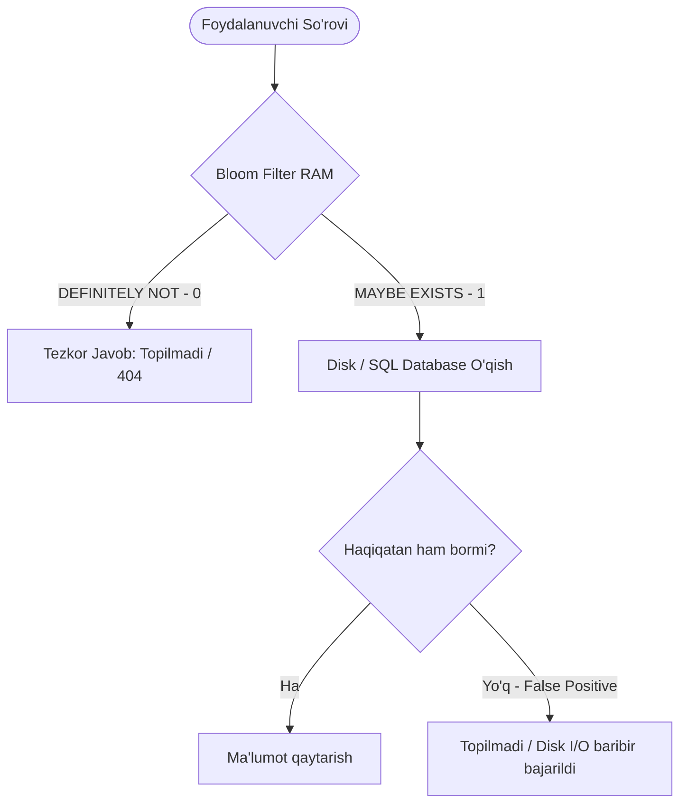

## 1. 💡 Sodda Tushuntirish va Analogiya

Tizimlar o'ta yiriklashib borganda, millionlab yoki milliardlab ma'lumotlar elementining mavjudligini tezkor tekshirish an'anaviy ma'lumotlar tuzilmalari (masalan, Set, Hash Map) uchun juda qimmatga tushadi. Chunki vaqt o'tishi bilan ular har bir elementni xotirada to'liq saqlashni talab qiladi.

**Bloom Filter (Blum Filtri)** — bu elementning to'plamda mavjudligini tekshirish uchun ishlatiladigan, xotirani o'ta tejaydigan ehtimolli ma'lumotlar tuzilmasidir. U elementni o'zini saqlamaydi, balki bitlar massivi (bit array) va hash funksiyalaridan foydalanadi.

### Mehmonlar Ro'yxati Analogiyasi:
Tasavvur qiling, siz juda katta tantanali kecha tashkil qilyapsiz va mehmonlar ro'yxatida 1 million odam bor. Har safar eshik tagiga kelgan odam ro'yxatda bor-yo'qligini qog'ozdan qidirish juda uzoq vaqt oladi.
Buning o'rniga siz devorga 1000 ta chiroqchadan iborat panel o'rnatasiz (barcha chiroqlar dastlab o'chirilgan - 0). Har bir kelishi kutilayotgan mehmonga 3 tadan chiroq raqamini biriktirasiz (hash funksiyalar). Mehmon tasdiqlanganda, uning 3 ta chirog'ini yoqib qo'yasiz (1 ga o'zgartirasiz).
* **Lookup (Tekshirish):** Yangi odam kelganda, uning 3 ta chirog'ini tekshirasiz.
  * Agar chiroqlarning kamida bittasi o'chgan bo'lsa: demak, bu odam ro'yxatda **mutlaqo yo'q** (False Negative bo'lishi mumkin emas, aniq 100% yo'q).
  * Agar barcha 3 ta chiroq yonib turgan bo'lsa: demak, bu odam ro'yxatda **bo'lishi mumkin** (lekin 100% kafolat emas, chunki boshqa mehmonlarning chiroqlari tasodifan aynan shu kombinatsiyani yoqib qo'ygan bo'lishi mumkin - bu **False Positive** deyiladi).

---

## 2. 💻 Real Kod Misollari

JavaScript-da sodda Bloom Filter klassi:

```javascript
class SimpleBloomFilter {
  constructor(size = 1000, hashCount = 3) {
    this.size = size;
    this.hashCount = hashCount;
    this.bitArray = new Array(size).fill(0);
  }

  // MurmurHash yoki FNV-1a o'rniga sodda hashlar generatori
  _hashes(element) {
    const hashes = [];
    let h1 = 0;
    let h2 = 0;
    
    for (let i = 0; i < element.length; i++) {
      h1 = (h1 * 31 + element.charCodeAt(i)) % this.size;
      h2 = (h2 * 37 + element.charCodeAt(i)) % this.size;
    }
    
    // Kirill-Mitzenmacher texnikasi yordamida k ta hash hosil qilish
    for (let i = 0; i < this.hashCount; i++) {
      hashes.push(Math.abs((h1 + i * h2) % this.size));
    }
    return hashes;
  }

  add(element) {
    const indices = this._hashes(element);
    for (const index of indices) {
      this.bitArray[index] = 1;
    }
  }

  maybeContains(element) {
    const indices = this._hashes(element);
    for (const index of indices) {
      if (this.bitArray[index] === 0) {
        return false; // Aniq mavjud emas (False Negative yo'q)
      }
    }
    return true; // Bo'lishi mumkin (False Positive ehtimoli bor)
  }
}

const filter = new SimpleBloomFilter(100, 3);
filter.add("user_123");
console.log(filter.maybeContains("user_123")); // true
console.log(filter.maybeContains("user_456")); // false (yoki kam ehtimol bilan true)
```

---

## 3. ⚙️ Qanday Ishlaydi (Under the Hood)

### 1. Bit Array (Bitlar Massivi):
Bloom Filter faqat 0 va 1 qiymatlardan tashkil topgan bitlar ketma-ketligidir. Dastlab barcha bitlar 0 bo'ladi.

### 2. Hash Funksiyalari (k count):
Har bir elementni bitlar massividagi bir nechta indeksga o'tkazish uchun k ta mustaqil va tekis taqsimlanadigan hash funksiyalari kerak. 
* Agar k juda kichik bo'lsa, kolliziyalar (to'qnashuvlar) ko'payib, False Positive darajasi oshadi.
* Agar k juda katta bo'lsa, bitlar tez to'lib ketadi va tekshirish sekinlashadi.

Optimal formula:
k = (m / n) * ln(2)
Bu yerda m - bitlar soni, n - kiritiladigan elementlar soni.

### 3. False Positive vs False Negative:
* **False Positive (Xato ijobiy javob):** Element ro'yxatda aslida yo'q bo'lsa-da, filter "ha, bor" deb javob berishi. Bu bitlar to'qnashuvi natijasida yuz beradi.
* **False Negative (Xato salbiy javob):** Element ro'yxatda bor bo'lsa-da, filter "yo'q" deb javob berishi. **Bloom Filter-da bu holat mutlaqo sodir bo'lmaydi**, chunki element qo'shilganda uning bitlari albatta 1 qilinadi va hech qachon o'chirilmaydi.

### 4. Elementlarni O'chirish Muammosi (Deleting Elements):
Standart Bloom Filter-dan elementni o'chirib bo'lmaydi. Chunki bitta bit bir nechta har xil elementlar uchun 1 qilingan bo'lishi mumkin. Agar uni 0 qibo'ysangiz, boshqa elementlarning mavjudlik tekshiruvi buziladi.
* **Counting Bloom Filter:** Har bir bit o'rniga sonli hisoblagich (counter) ishlatadi. Element qo'shilganda hisoblagich oshiriladi, o'chirilganda kamaytiriladi. Bu o'chirishni ta'minlaydi, ammo xotirani 3-4 barobar ko'proq yeydi.
* **Cuckoo Filter:** Bloom Filter-ning zamonaviy muqobili. U elementlarning qisqacha barmoq izlarini (fingerprints) saqlash orqali elementlarni o'chirish imkonini beradi va keshni o'ta optimal boshqaradi (Cuckoo hashing yordamida).

### 5. Boshqa Probabilistic Ma'lumotlar Tuzilmalari:
* **HyperLogLog (HLL):** O'ta ulkan oqimlardagi (stream) unikal elementlar sonini (cardinality estimation) hisoblash uchun ishlatiladi. Masalan, 10 million unikal IP-manzillarni atigi 12KB xotirada, log-log darajali hash bitlarini sanash orqali 99% aniqlikda hisoblay oladi.
* **Count-Min Sketch:** Oqimdagi elementlarning takrorlanish chastotasini (frequency estimation) aniqlash uchun chastotalar matritsasini yurituvchi tuzilma.

---

## 4. ❌ Ko'p Uchraydigan Xatolar (Junior Mistakes)

1. **Standart Bloom Filter-dan element o'chirishga urinish:** Junior dasturchilar bitni shunchaki 0 ga almashtirib qo'yishadi. Bu butun filtrni korruptsiya qiladi. O'chirish kerak bo'lsa, **Cuckoo Filter** yoki **Counting Bloom Filter** ishlatish shart.
2. **Kriptografik hash funksiyalarni ishlatish (SHA-256, MD5):** Bu funksiyalar xavfsizlik uchun mo'ljallangan va o'ta sekin ishlaydi. Bloom Filter uchun MurmurHash, FNV-1a yoki xxHash kabi tezkor, kriptografik bo'lmagan hashlar ishlatilishi kerak.
3. **Bitlar soni (m) va elementlar soni (n) formulasini hisobga olmaslik:** Filtr hajmini juda kichik olish tezda bitlar massivining 1 lar bilan to'lishiga va False Positive darajasining 100% ga yaqinlashishiga olib keladi.

---

## 5. 💬 12 ta Intervyu Savollari

**1. Bloom Filter nima?**
Bu ma'lumotlar to'plamida element bor-yo'qligini aniqlash uchun ishlatiladigan, xotirani tejaydigan ehtimolli ma'lumotlar tuzilmasi.

**2. Bloom Filter qanday holatlarda False Negative berishi mumkin?**
Hech qachon. Agar element kiritilgan bo'lsa, unga mos bitlar albatta 1 bo'ladi, shuning uchun filtr hech qachon bor narsani yo'q demaydi.

**3. False Positive qanday yuzaga keladi?**
Turli xil elementlarning hash qiymatlari bir xil bit indekslariga to'g'ri kelib qolganda (kolliziya), filtr element aslida yo'q bo'lsa ham "bor" deb xato hisoblaydi.

**4. Nima uchun standart Bloom Filter-dan elementni o'chirib bo'lmaydi?**
Chunki bitlar bir nechta element o'rtasida umumiy bo'lishi mumkin. Bitni o'chirish boshqa elementlarning borligini inkor etib qo'yadi.

**5. Elementlarni o'chirish zarur bo'lsa, qaysi tuzilmalardan foydalaniladi?**
Counting Bloom Filter yoki Cuckoo Filter.

**6. Counting Bloom Filter-ning kamchiligi nimada?**
Bitlar o'rniga hisoblagichlar (masalan, 4-bitli counter) ishlatilgani sababli xotira hajmi bir necha barobarga ko'payadi.

**7. Cuckoo Filter-ning Bloom Filter-dan afzalligi nimada?**
Elementlarni o'chirishni qo'llab-quvvatlaydi, yuqori yuklamada False Positive ehtimoli pastroq bo'ladi va CPU keshidan samarali foydalanadi.

**8. HyperLogLog algoritmi qachon ishlatiladi?**
Juda yirik ma'lumotlar oqimida (masalan, kunlik tashrif buyuruvchilar soni) unikal elementlar sonini (cardinality) o'ta kichik xotira yordamida hisoblash uchun.

**9. Count-Min Sketch nima uchun kerak?**
Katta ma'lumot oqimlarida har bir element necha marta takrorlanganini (frequency) taxminiy hisoblash uchun.

**10. Bloom Filter uchun qaysi hash algoritmlari tavsiya etiladi?**
MurmurHash3, FNV-1a, xxHash. Ular kriptografik emas va juda tez hisoblanadi.

**11. Redis Bloom moduli nima?**
Redis bazasiga Bloom Filter va Cuckoo Filter buyruqlarini (masalan, `BF.ADD`, `BF.EXISTS`) qo'shadigan rasmiy kengaytma.

**12. Kirill-Mitzenmacher optimizatsiyasi nima?**
Faqatgina 2 ta hash funksiya yordamida k ta hash indeksini hisoblash usuli (g_i(x) = h1(x) + i * h2(x) % m). Bu hashing hisob-kitoblarini keskin tezlashtiradi.

---

## 6. 🛠️ Amaliy Topshiriqlar

Mashqlar bo'limida 10 ta algoritmik topshiriqni muvaffaqiyatli yakunlang.

---

## 7. 📝 12 ta Mini Test

Dars yakunidagi testlar orqali bilimingizni sinab ko'ring.

---

## 8. 🎯 Real Project Case Study

### Cassandra SSTable va PostgreSQL-da Disk Operatsiyalarini Optimallashtirish

Katta hajmdagi ma'lumotlar bazalarida (masalan, Apache Cassandra yoki BigTable) ma'lumotlar diskdagi **SSTable** deb ataluvchi fayllarda saqlanadi. Foydalanuvchi ma'lum bir kalit bo'yicha so'rov yuborganda, agar kalit bazada yo'q bo'lsa, tizim diskdagi barcha SSTable fayllarini qidirib chiqishga majbur bo'ladi (bu o'ta sekin Disk I/O degani).

**Yechim:** Har bir SSTable uchun xotirada (RAM) kichik Bloom Filter saqlanadi.
1. So'rov kelganda, avval RAM-dagi Bloom Filter-dan kalit tekshiriladi.
2. Agar Bloom Filter "yo'q" deb qaytarsa, diskka murojaat qilinmaydi (darhol 404 yoki bo'sh natija qaytadi). Bu disk I/O ni 90%+ ga kamaytiradi.
3. Faqat filtr "bor bo'lishi mumkin" degandagina, diskdagi SSTable fayli o'qiladi.

---

## 9. 🧠 Vizual ko'rinish (Architecture Diagram)

Quyida Bloom Filter orqali ma'lumotlar bazasini aylanib o'tish (bypass) zanjiri ko'rsatilgan:



---

## 10. 📌 Cheat Sheet

| Algoritm / Konsept | Maqsadi | Xotira Sarfi | O'chirishni qo'llaydimi? | Real Tizimlar |
| :--- | :--- | :--- | :--- | :--- |
| **Bloom Filter** | Element bor/yo'qligini tekshirish | Bir necha bit (juda kichik) | Yo'q | Cassandra, Postgres, Redis |
| **Counting Bloom** | Element borligini tekshirish + o'chirish | Bir necha nibble/bayt (o'rta) | Ha | Tarmoq marshrutizatorlari |
| **Cuckoo Filter** | O'chirishni qo'llaydigan zamonaviy filter | Bloom filterdan ham kamroq (yuqori yuklamada) | Ha | Kesh tizimlari |
| **HyperLogLog** | Unikal elementlar sonini sanash (Cardinality) | Ruxsat etilgan 12KB | N/A | Redis HLL, Google BigQuery |
| **Count-Min Sketch** | Element takrorlanish sonini hisoblash | Matritsa o'lchamiga qarab (belgilangan) | Yo'q | Trafik monitoringi, IP limit |
