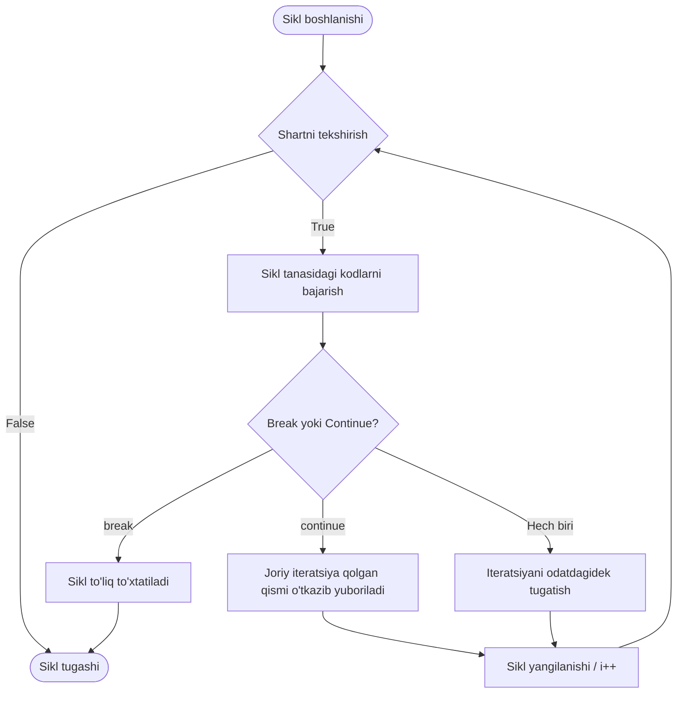

## 1. 💡 Sodda Tushuntirish va Analogiya

### break va continue nima?
* **break:** Siklni (loop) darhol va butunlay to'xtatib, undan chiqib ketish buyrug'i. Siklning qolgan barcha iteratsiyalari bekor qilinadi.
* **continue:** Siklning joriy (hozirgi) iteratsiyasini to'xtatib, qolgan kodlarini bajarmasdan, keyingi iteratsiyaga (siklning navbatdagi aylanishiga) o'tish buyrug'i.

### Real hayotiy analogiya
Tasavvur qiling, siz **zinadan 10-qavatga ko'tarilyapsiz**:
* **break (To'xtash/Chiqish):** 5-qavatga yetganingizda lift ishga tushib qoldi yoki charchadingiz va zinadan yurishni butunlay to'xtatib, zinapoyani tark etdingiz (sikl tugadi).
* **continue (O'tkazib yuborish):** Siz har bir qavatdagi do'stingizning eshigini taqillatib ketyapsiz. Ammo 4-qavatdagi do'stingiz safarga ketganini bilasiz. Shuning uchun 4-qavat eshigi oldiga kelganda uni taqillatib o'tirmay, uni **tashlab o'tib (continue)** to'g'ri 5-qavatga chiqib ketasiz.

---

## 2. 💻 Real Kod Misollari

### 1. Basic Example (Sikllarni to'xtatish va o'tkazib yuborish)
`break` yordamida siklni 5-elementda to'xtatish:
```javascript
for (let i = 1; i <= 10; i++) {
  if (i === 5) {
    break; // i 5 ga teng bo'lganda sikl butunlay to'xtaydi
  }
  console.log(i); // Natija: 1, 2, 3, 4
}
```

`continue` yordamida toq sonlarni chop etish (juftlarini o'tkazib yuborish):
```javascript
for (let i = 1; i <= 10; i++) {
  if (i % 2 === 0) {
    continue; // Juft son bo'lsa, keyingi kodlar o'tkazib yuboriladi
  }
  console.log(i); // Natija: 1, 3, 5, 7, 9
}
```

### 2. Intermediate Example (Qidiruv tizimi va Noto'g'ri ma'lumotlarni tozalash)
Ro'yxatdan birinchi mos kelgan elementni qidirish va qidiruvni to'xtatish (`break`):
```javascript
const products = [
  { name: "Telefon", price: 500, inStock: true },
  { name: "Noutbuk", price: 1000, inStock: false },
  { name: "Quloqchin", price: 50, inStock: true },
  { name: "Klaviatura", price: 80, inStock: true }
];

let foundProduct = null;
for (let i = 0; i < products.length; i++) {
  if (products[i].inStock && products[i].price > 100) {
    foundProduct = products[i];
    break; // Kerakli mahsulot topilgach, qolganlarini tekshirish shart emas (vaqt tejaladi)
  }
}
console.log("Topilgan mahsulot:", foundProduct); // { name: "Telefon", price: 500, ... }
```

`continue` yordamida noto'g'ri/bo'sh ma'lumotlarni hisobga olmay o'tib ketish:
```javascript
const transactions = [120, null, 450, undefined, 300, NaN, 150];
let totalSum = 0;

for (let price of transactions) {
  if (!price || isNaN(price)) {
    continue; // Noto'g'ri qiymatlar bo'lsa, ularni qo'shmasdan keyingi elementga o'tamiz
  }
  totalSum += price;
}
console.log("Jami to'g'ri summa:", totalSum); // 1020
```

### 3. Advanced Example (Nested Loops with Labels)
Ichma-ich sikllarda `label` (belgi) yordamida tashqi siklni boshqarish:
```javascript
const matrix = [
  [1, 2, 3],
  [4, -5, 6],
  [7, 8, 9]
];

// Tashqi sikl uchun 'outer' deb nomlangan label yaratamiz
outer: for (let i = 0; i < matrix.length; i++) {
  for (let j = 0; j < matrix[i].length; j++) {
    if (matrix[i][j] < 0) {
      console.log(`Manfiy son topildi: ${matrix[i][j]}. Sikl to'xtatiladi.`);
      break outer; // Faqat ichki emas, tashqi 'outer' siklini ham butunlay to'xtatadi
    }
    console.log(`Tekshirilmoqda: ${matrix[i][j]}`);
  }
}
// Natija:
// Tekshirilmoqda: 1
// Tekshirilmoqda: 2
// Tekshirilmoqda: 3
// Tekshirilmoqda: 4
// Manfiy son topildi: -5. Sikl to'xtatiladi.
```

---

## 3. ⚙️ Qanday Ishlaydi (Under the Hood)

### Dvigatel darajasida boshqaruv oqimi (Execution Flow)
JavaScript dvigateli (masalan, V8) siklni bajarayotganda maxsus instruction pointer (ko'rsatkich) va blok ko'lamidan (block scope) foydalanadi:
1. **`break` chaqirilganda:**
   * Dvigatel joriy sikl blokini bajarishni darhol to'xtatadi.
   * Sikl o'zgaruvchilari va iteratsiya xotirasi (scope context) tozalanishi boshlanadi.
   * Buyruqlar ko'rsatkichi sikl yopilish qavsidan keyingi birinchi qatorga sakrab o'tadi.
2. **`continue` chaqirilganda:**
   * Joriy iteratsiya blokining qolgan qismi o'tkazib yuboriladi.
   * Dvigatel to'g'ridan-to'g'ri siklning yangilanish (update/increment) qismiga (masalan, `for` siklidagi `i++` ga) yoki shartni tekshirish (condition check) qismiga (`while` va `do...while` da) yo'naltiriladi.

### Massiv callback metodlarida ishlamasligi
`forEach`, `map`, `filter` kabi array metodlarida `break` yoki `continue` ishlatib bo'lmaydi, chunki ular haqiqiy sikl emas, balki har bir element uchun alohida callback funksiyasini chaqiradigan metodlardir. Ularda `break` yoki `continue` ishlatish `SyntaxError: Illegal break statement` xatoligini keltirib chiqaradi.

---

## 4. ❌ Ko'p Uchraydigan Xatolar (Junior Mistakes)

### 1. `while` siklida `continue` ishlatib cheksiz sikl hosil qilish
Juda ko'p Junior dasturchilar `continue` operatoridan oldin sanog'ichni oshirishni unutib qo'yishadi.
* **Xato:**
  ```javascript
  let i = 0;
  while (i < 5) {
    if (i === 3) {
      continue; // i++ bajarilmay qoladi va i har doim 3 bo'lib, cheksiz aylanadi!
    }
    console.log(i);
    i++;
  }
  ```
* **Tuzatish:**
  ```javascript
  let i = 0;
  while (i < 5) {
    if (i === 3) {
      i++; // continue dan oldin sanog'ichni oshiramiz
      continue;
    }
    console.log(i);
    i++;
  }
  ```

### 2. `break` yoki `continue`ni sikldan tashqarida ishlatish
Ushbu operatorlarni sikldan tashqaridagi oddiy `if` ichida yoki array callbacklari ichida yozish xatolikka olib keladi.
* **Xato:**
  ```javascript
  const arr = [1, 2, 3];
  arr.forEach(num => {
    if (num === 2) break; // SyntaxError: Illegal break statement
  });
  ```
* **Tuzatish:**
  ```javascript
  for (let num of arr) {
    if (num === 2) break; // To'g'ri ishlaydi
  }
  ```

### 3. `break` va `return` operatorlarini adashtirish
* `break` faqat siklni to'xtatadi, lekin u joylashgan funksiya ishlashda davom etadi.
* `return` esa joriy funksiyani butunlay tugatadi va qiymat qaytaradi (sikl ham avtomatik to'xtaydi).

---

## 5. 💬 12 ta Intervyu Savollari

### Junior Level
1. **Savol:** `break` va `continue` operatorlarining asosiy farqi nimada?
   * **Javob:** `break` siklni butunlay to'xtatib undan chiqadi. `continue` esa faqat joriy iteratsiyani tashlab ketib, keyingi iteratsiyani davom ettiradi.
2. **Savol:** `break` operatorini sikllardan tashqari yana qayerda ishlatsa bo'ladi?
   * **Javob:** `switch` tanlash konstruksiyasi ichida case-larni to'xtatish va keyingisiga o'tmaslik uchun ishlatiladi.
3. **Savol:** `continue` operatorini `switch` ichida ishlatish mumkinmi?
   * **Javob:** Yo'q, `continue` faqat sikllar ichida ishlaydi, `switch` ichida u sintaktik xato (`SyntaxError`) beradi.
4. **Savol:** Nima uchun `forEach` yoki `map` metodlari ichida `break` ishlata olmaymiz?
   * **Javob:** Chunki ular haqiqiy sikl emas, balki funksiyalar (callbacks). Funksiya ichida faqat `return` ishlatish mumkin, `break` esa faqat sikl bloklariga taalluqlidir.

### Middle Level
5. **Savol:** `while` siklida `continue` ishlatganda cheksiz sikl yuzaga kelishining sababi nima?
   * **Javob:** Chunki `continue` bilan joriy qadam o'tkazib yuborilganda, sikl yangilanish qismi (`i++`) odatda pastda joylashgani uchun u bajarilmay qoladi va shart o'zgarmasdan cheksiz takrorlanadi.
6. **Savol:** JavaScript-da `label` (belgi) nima va u qachon kerak bo'ladi?
   * **Javob:** Label — bu sikl yoki blok oldidan qo'yiladigan nom (masalan `myLabel:`). U ichma-ich sikllarda ichki sikl ichidan turib tashqi siklni `break` yoki `continue` qilish uchun kerak bo'ladi.
7. **Savol:** Ichma-ich `for` sikllarida ichki sikldagi oddiy `break` qaysi siklni to'xtatadi?
   * **Javob:** Faqat eng yaqin ichki siklni to'xtatadi, tashqi sikl esa o'z faoliyatini davom ettiradi.
8. **Savol:** `do...while` siklida `continue` chaqirilganda boshqaruv qayerga o'tadi?
   * **Javob:** Sikl tanasi tugagach, pastdagi `while (condition)` shartini tekshirish qismiga o'tadi va shart `true` bo'lsa, sikl boshidan yana boshlanadi.

### Senior Level
9. **Savol:** JavaScript dvigateli (V8) `break` va `continue` ishlatilganda loop optimization jarayonini qanday bajaradi?
   * **Javob:** V8 oddiy sikllarni optimallashtiradi. Biroq, `label` va chuqur sakrashlar (jump) ko'p bo'lgan kodlarni optimallashtirish (JIT compiler optimization) qiyinlashadi, chunki bu control flow graph-ni murakkablashtiradi va V8 de-optimization sodir qilishi mumkin.
10. **Savol:** Callback massiv metodlaridan (`forEach`, `some`, `every`) `break` effekti yaratish uchun qaysilaridan foydalanish afzalroq?
    * **Javob:** `.some()` metodida `return true` qilinsa yoki `.every()` metodida `return false` qilinsa, metod massiv aylanishini zudlik bilan to'xtatadi. Bu `break` kabi ishlaydi.
11. **Savol:** `break` yoki `continue` yozilgan `try` bloki ostida `finally` bo'lsa, qaysi biri birinchi bajariladi?
    * **Javob:** `finally` bloki baribir birinchi bajariladi, shundan so'ng `break` yoki `continue` amalga oshib sikl boshqariladi.
12. **Savol:** Label-lardan foydalanish bo'yicha eng yaxshi amaliyotlar (best practices) qanday?
    * **Javob:** Label-lar kod o'qilishini qiyinlashtirishi sababli, ulardan iloji boricha qochish kerak. Buning o'rniga ichki siklni alohida yordamchi funksiyaga ajratib, `return` orqali erta chiqishni amalga oshirish tavsiya etiladi.

---

## 6. 🛠️ Amaliy Topshiriqlar

Bu bo'limda `break` va `continue` operatorlari duch kelganda bajarilish oqimining qanday o'zgarishini vizual diagramma orqali tahlil qilamiz.

### Bajarilish Oqimi Diagrammasi (Control Flow)



> [!TIP]
> Murakkab shartlar bilan ishlashda kodingiz tushunarli bo'lishi uchun ko'p ichma-ich `if` bloklaridan qoching. Buning o'rniga `continue` yordamida noto'g'ri qiymatlarni sikl boshidayoq filtrlab tashlang (**Guard Clauses** pattern).

---

## 7. 📝 12 ta Mini Test

Ushbu mavzu bo'yicha olgan bilimlaringizni sinab ko'rish uchun mo'ljallangan testlar. Test savollari yordamida mantiqiy amallar, `break` va `continue` operatorlarining cheklovlari va nozik jihatlarini qayta ko'rib chiqing va mustahkamlang.

---

## 8. 🎯 Real Project Case Study

### Tranzaksiyalarni Tasdiqlash va Budjet Limitini Tekshirish Tizimi
Tasavvur qiling, biz to'lov loglarini qayta ishlovchi tizim yaratyapmiz:
1. Agar tranzaksiya holati "FAILED" bo'lsa yoki summa 0 dan kichik bo'lsa, uni hisoblamasdan keyingisiga o'tib ketish kerak (`continue`).
2. Agar jami muvaffaqiyatli summa belgilangan budjet limitidan oshib ketadigan bo'lsa, qayta ishlashni darhol to'xtatish kerak (`break`).

```javascript
const transactions = [
  { id: 1, amount: 200, status: "SUCCESS" },
  { id: 2, amount: -50, status: "SUCCESS" },  // Xato summa, o'tkazib yuboriladi
  { id: 3, amount: 400, status: "FAILED" },   // FAILED status, o'tkazib yuboriladi
  { id: 4, amount: 500, status: "SUCCESS" },
  { id: 5, amount: 150, status: "SUCCESS" }   // Limitdan oshsa qo'shilmaydi
];

const BUDGET_LIMIT = 800;

function processTransactions(list, limit) {
  let processedSum = 0;
  const approvedList = [];
  
  for (let i = 0; i < list.length; i++) {
    const tx = list[i];
    
    // 1. Guard Clause: Noto'g'ri yoki muvaffaqiyatsiz tranzaksiyalarni o'tkazib yuborish
    if (tx.status === "FAILED" || tx.amount <= 0) {
      console.log(`Tranzaksiya #${tx.id} o'tkazib yuborildi (Muammo bor)`);
      continue; 
    }
    
    // 2. Limitni oldindan tekshirish (Early Exit)
    if (processedSum + tx.amount > limit) {
      console.log(`Budjet limiti (${limit}$) oshib ketdi. Qayta ishlash to'xtatildi.`);
      break; 
    }
    
    // Muvaffaqiyatli qayta ishlangan tranzaksiya
    processedSum += tx.amount;
    approvedList.push(tx);
  }
  
  return { approvedList, processedSum };
}

const result = processTransactions(transactions, BUDGET_LIMIT);
console.log("Muvaffaqiyatli tranzaksiyalar:", result.approvedList);
console.log("Jami summa:", result.processedSum); // 200 + 500 = 700
```

---

## 9. 🚀 Performance va Optimization

### Erta Chiqish (Early Exit) afzalliklari
Katta hajmdagi massivlarda (masalan, 100,000 element) qidiruv yoki hisob-kitob bajarayotganda `break` operatorini ishlatish juda muhimdir. Agar biz qidirayotgan element massivning boshida (masalan, 5-indeksda) joylashgan bo'lsa, `break` orqali qolgan 99,995 ta elementni tekshirishdan qutulib qolamiz. Bu CPU resurslarini sezilarli darajada tejaydi.

### Guard Clauses pattern unumdorligi
Sikl ichida `continue` yordamida keraksiz kodlarni chetlab o'tish dasturning xotira yuklamasini kamaytiradi. Chunki keraksiz obyektlar yaratilishi yoki og'ir ichki funksiyalar chaqirilishi oldi olinadi.

### Sikl tanlash qoidasi
Agar sizga faqat massiv elementlaridan chiqib ketish emas, balki massivni mutatsiyaga uchratish yoki yangi massiv hosil qilish kerak bo'lsa va `break`/`continue` kerak bo'lmasa, optimal asbob sifatida `.map()`, `.filter()` kabi funksional metodlarni tanlang. Ammo siklni istalgan nuqtada to'xtatish talab qilinsa, an'anaviy `for...of` yoki `for` sikllari eng tez va to'g'ri yo'ldir.

---

## 10. 📌 Cheat Sheet

| Loop turi | `break` qo'llab-quvvatlanishi | `continue` qo'llab-quvvatlanishi | Natija / Xususiyati |
| :--- | :--- | :--- | :--- |
| **`for`** | Ha | Ha | Eng ko'p ishlatiladigan an'anaviy sikl |
| **`while`** | Ha | Ha | Diqqat qiling: `continue`dan oldin counter oshirilishi shart |
| **`do...while`** | Ha | Ha | `continue` ishlatilganda pastdagi shartga o'tadi |
| **`for...in` / `for...of`**| Ha | Ha | Obyektlar va massivlarni o'qishda juda qulay |
| **`forEach` / `map`** | Yo'q | Yo'q | `SyntaxError: Illegal break statement` beradi |
| **`switch`** | Ha | Yo'q | Faqat `break` case-ni yakunlash uchun ishlatiladi |
