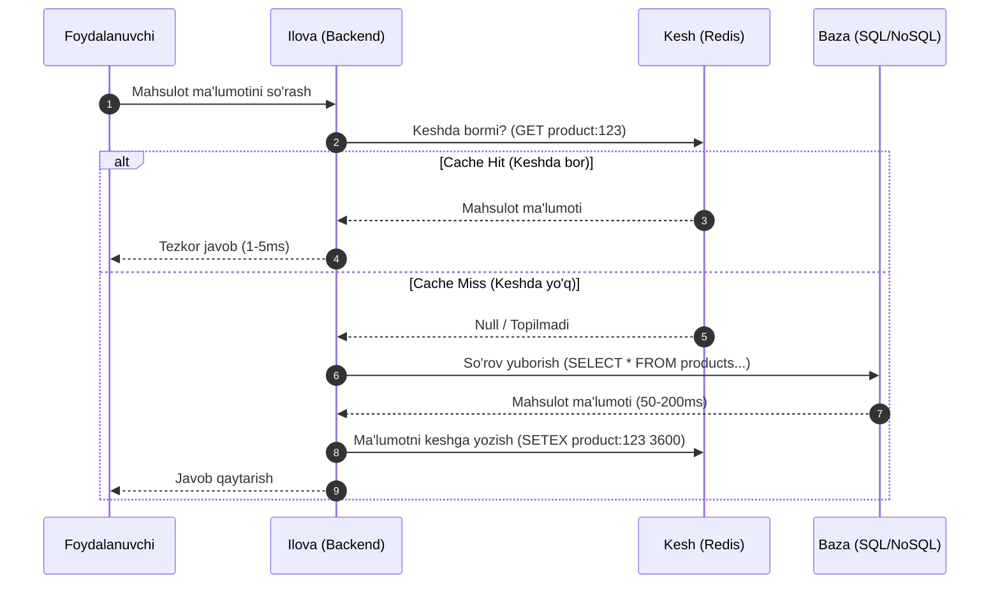

## 1. 💡 Sodda Tushuntirish va Analogiya

### Keshlash nima?
**Keshlash (Caching)** — bu ma'lumotlarni tez-tez so'ralganda tezkor va qulay joyda (odatda tezkor xotira - RAM) vaqtinchalik saqlash texnologiyasidir. Bu ma'lumotlar bazasiga (Database) tushadigan yuklamani kamaytiradi va dastur tezligini yuzlab barobar oshiradi.

### Real hayotiy analogiya
Tasavvur qiling, siz **oshxonada taom pishiryapsiz**:
* **Keshsiz holat:** Har safar sizga tuz, murch yoki pichoq kerak bo'lganda, uyingizdan chiqib, 2 km uzoqlikdagi **yirik supermarketga** (Ma'lumotlar bazasiga) borib kelasiz. Taom pishirish juda uzoq vaqt oladi va charchab qolasiz.
* **Keshli holat:** Siz ziravorlar va eng kerakli anjomlarni **oshxona stoliga** (Kesh/Redis) qo'yib qo'yasiz. Supermarketga faqat oshxona stolida yo'q bo'lgan narsalar uchun borasiz va ularni olib kelib, kelajakda tezroq foydalanish uchun stol ustiga joylashtirasiz.

### Redis nima?
**Redis (Remote Dictionary Server)** — bu in-memory (tezkor xotirada ishlaydigan), kalit-qiymat (Key-Value) ko'rinishidagi o'ta tezkor ma'lumotlar bazasi va kesh tizimidir. Ma'lumotlarni RAM-da saqlagani uchun o'qish va yozish operatsiyalari mikrosaniyalarda bajariladi.

---

## 2. 💻 Real Kod Misollari

### 1. Cache-Aside Strategiyasi (Express + Redis)
Eng keng tarqalgan keshlash strategiyasi:
```javascript
import { createClient } from 'redis';
import express from 'express';

const app = express();
const redisClient = createClient();
await redisClient.connect();

app.get('/api/products/:id', async (req, res) => {
  const { id } = req.params;
  const cacheKey = `product:${id}`;

  try {
    // 1. Keshdan ma'lumotni tekshiramiz (Cache Hit)
    const cachedData = await redisClient.get(cacheKey);
    if (cachedData) {
      console.log('Cache Hit!');
      return res.json(JSON.parse(cachedData));
    }

    // 2. Keshda yo'q bo'lsa, bazadan qidiramiz (Cache Miss)
    console.log('Cache Miss! Fetching from DB...');
    const product = await db.products.findById(id); // Simulyatsiya

    if (!product) {
      return res.status(404).json({ error: 'Mahsulot topilmadi' });
    }

    // 3. Kelajak uchun keshga yozamiz va 1 soat (3600s) TTL (Time To Live) beramiz
    await redisClient.setEx(cacheKey, 3600, JSON.stringify(product));

    return res.json(product);
  } catch (error) {
    // Redis ishlamay qolsa ham tizim qulamasligi uchun catch ichida bazadan olish kerak
    console.error('Redis xatoligi:', error);
    const product = await db.products.findById(id);
    return res.json(product);
  }
});
```

### 2. Redis Data Types (Turli xil ma'lumot turlari)
Redis faqat oddiy stringlar emas, balki murakkab tuzilmalarni ham qo'llab-quvvatlaydi:
```javascript
// Strings: Oddiy kalit-qiymat
await redisClient.set('user:101:name', 'Farhod');
const name = await redisClient.get('user:101:name'); // 'Farhod'

// Hashes: Obyektlarni saqlash uchun qulay
await redisClient.hSet('user:102', {
  name: 'Sardor',
  role: 'admin',
  age: '28'
});
const userFields = await redisClient.hGetAll('user:102'); 
// { name: 'Sardor', role: 'admin', age: '28' }

// Lists: Tartiblangan ro'yxatlar (Navbatlar uchun qulay)
await redisClient.rPush('jobs', 'job_1');
await redisClient.rPush('jobs', 'job_2');
const nextJob = await redisClient.lPop('jobs'); // 'job_1'

// Sets: Takrorlanmas elementlar to'plami
await redisClient.sAdd('tags:book', ['js', 'programming', 'js']); // 'js' faqat bir marta saqlanadi
const tags = await redisClient.sMembers('tags:book'); // ['js', 'programming']
```

### 3. Session Store (Sessiyalarni saqlash)
Gorizontal kengayuvchi tizimlarda sessiyani markazlashgan Redis-da saqlash:
```javascript
import session from 'express-session';
import RedisStore from 'connect-redis';

app.use(session({
  store: new RedisStore({ client: redisClient }),
  secret: 'my-super-secret-key',
  resave: false,
  saveUninitialized: false,
  cookie: {
    secure: false, // HTTPS uchun true qiling
    maxAge: 1000 * 60 * 60 * 24 // 1 kun
  }
}));
```

---

## 3. ⚙️ Qanday Ishlaydi (Under the Hood)

### Kesh Strategiyalari (Caching Strategies)
1. **Cache-Aside (Lazy Loading):** Ilova birinchi navbatda keshni o'qiydi. Agar ma'lumot bo'lsa (Hit) qaytaradi. Bo'lmasa (Miss), bazadan o'qib keshga yozadi. Eng ko'p ishlatiladigan usul.
2. **Read-Through:** Ilova kesh provayderidan so'raydi. Kesh provayderi o'zi orqa fonda bazadan ma'lumotni o'qib, keshlab, keyin ilovaga qaytaradi.
3. **Write-Through:** Ma'lumot yozilayotganda avval keshga, keyin bazaga darhol yoziladi. O'qish tez, lekin yozish biroz sekinlashadi.
4. **Write-Behind (Write-Back):** Ma'lumot avval tezkorlik bilan keshga yoziladi, ma'lum vaqt o'tganidan keyin navbat orqali bazaga asinxron sinxronizatsiya qilinadi. Bazani o'ta tez yozishga yordam beradi, lekin server o'chib qolsa ma'lumot yo'qolish xavfi bor.

### Redis arxitekturasi va Single-Threaded ishlashi
Redis **Single-Threaded** (bir oqimli) tizimdir. U barcha so'rovlarni navbatma-navbat bajaradi.
* **Nega tez ishlaydi?** Chunki u CPU-ni oqimlararo almashtirish (context switching) va lock (qulflash) operatsiyalari bilan charchatmaydi. Eng asosiysi, u to'liq operativ xotirada (RAM) ishlaydi va non-blocking I/O (Multiplexing) yordamida soniyasiga 100,000+ so'rovni bajara oladi.

### Keshni tozalash qoidalari (Eviction Policies)
Xotira to'lib ketganda Redis eski ma'lumotlarni o'chirishni boshlaydi. Buning bir nehcha algoritmlari bor:
* **LRU (Least Recently Used):** Eng uzoq vaqt davomida ishlatilmagan (eskirgan) elementlar o'chiriladi.
* **LFU (Least Frequently Used):** Eng kam chastotada (kam marta) chaqirilgan elementlar o'chiriladi.
* **FIFO (First In, First Out):** Birinchi bo'lib keshga kirgan element birinchi o'chiriladi.
* **Volatile-TTL:** Faqat TTL (yashash muddati) berilgan kalitlar orasidan eng kam muddati qolganini o'chirish.

---

## 4. ❌ Ko'p Uchraydigan Xatolar (Junior Mistakes)

### 1. Keshni Yangilay Olmaslik (Stale Data / Cache Invalidation)
Ma'lumotlar bazasida profil yoki narx o'zgarganda keshni yangilamaslik (yoki o'chirmaslik). Natijada foydalanuvchiga eski ma'lumotlar ko'rinib qoladi.
* *Tuzatish:* Bazada ma'lumot o'zgarishi bilan mos kesh kalitini `redis.del(key)` orqali o'chirib tashlang.

### 2. Kesh Bo'roni (Cache Stampede / Dog-piling)
Keshning TTL muddati tugashi bilan (masalan, eng ko'p kiriladigan bosh sahifa kesh muddati tugaganda) parallel ravishda minglab so'rovlar bazaga borib, bazani qotirib qo'yishi.
* *Tuzatish:* Kesh muddatini tasodifiy kichik sonlar bilan o'zgartirish (Jitter) yoki kesh tugashidan oldin orqa fonda asinxron yangilab borish.

### 3. Keshga TTL (Time To Live) bermaslik
Keshga yozilgan ma'lumotlarga yashash muddatini belgilamaslik xotirani tezda to'ldiradi va server qotishiga sabab bo'ladi.
* *Tuzatish:* Har doim oqilona TTL qo'ying (masalan, 15 daqiqa yoki 1 soat).

---

## 5. 💬 12 ta Intervyu Savollari

**1. Cache Hit va Cache Miss nima?**
Javob: Cache Hit — so'ralgan ma'lumot keshda topilishi va tez qaytarilishi. Cache Miss — ma'lumot keshda topilmay bazaga so'rov yuborilishi.

**2. Nima uchun Redis-ni oddiy obyektdan (Node.js global variable) kesh sifatida afzal ko'rishadi?**
Javob: Chunki ob'ekt faqat bitta Node.js jarayoni xotirasida yashaydi. Agar gorizontal kengaytirilsa, har bir serverda alohida kesh bo'lib qoladi. Redis esa markazlashtirilgan bo'lib, barcha serverlar uchun yagona manbadir.

**3. Redis single-threaded bo'lsa, qanday qilib o'ta yuqori tezlikka erishadi?**
Javob: Non-blocking I/O multiplexing yordamida va ma'lumotlar xotirada (RAM) saqlangani sababli diskka yozish kechikishlaridan xoli bo'ladi.

**4. Redis-da ma'lumotlarni doimiy (persistent) saqlash mumkinmi?**
Javob: Ha, RDB (Redis Database snapshots) va AOF (Append Only File) mexanizmlari orqali ma'lumotlarni diskka yozib borish mumkin.

**5. Cache Invalidation (Keshni tozalash) nima va u nega qiyin?**
Javob: Bu bazadagi ma'lumotlar yangilanganda keshdagi nusxasini ham o'chirish yoki yangilashdir. Qiyinligi — tizimning barcha qismlarida sinxronlikni ta'minlashda.

**6. Redis-dagi Hash ma'lumot turining oddiy String-dan afzalligi nimada?**
Javob: Hash obyekt shaklidagi ma'lumotlarni saqlaydi va uning faqat bitta maydonini (field) butun obyektni qayta yozmasdan o'zgartirish imkonini beradi. Xotirani ham tejaydi.

**7. Kesh Penetratsiyasi (Cache Penetration) nima va uni qanday hal qilish mumkin?**
Javob: Bazada umuman mavjud bo'lmagan kalitlarni (masalan, salbiy ID-lar) qayta-qayta so'rash orqali bazaga yuklama verish. Yechim: Mavjud bo'lmagan kalitlarni ham qisqa muddatga (masalan, null qiymat bilan) keshlab qo'yish yoki Bloom Filter ishlatish.

**8. LRU va LFU kesh o'chirish qoidalarining farqi nimada?**
Javob: LRU eng uzoq vaqt ishlatilmagan kalitni o'chiradi. LFU esa eng kam chastotada (kam martaba) ishlatilgan kalitni o'chiradi.

**9. Redis-da `SETEX` va `SET` buyruqlarining farqi nimada?**
Javob: `SET` kalit qiymatini yozadi. `SETEX` esa qiymat yozish bilan birga uning yashash muddatini (TTL soniyalarda) atomar tarzda belgilaydi.

**10. Redis-ni Message Queue (Xabarlar navbati) sifatida ishlatsa bo'ladimi?**
Javob: Ha, Redis List (`LPUSH`/`RPOP`), Pub/Sub mexanizmi yoki zamonaviy Redis Streams yordamida navbatlarni tashkil qilish mumkin.

**11. Nima uchun kesh sifatida sessiyalarni saqlaganda xavfsizlikka e'tibor berish kerak?**
Javob: Chunki sessiya ma'lumotlari foydalanuvchining shaxsiy ma'lumotlari yoki tokenlarini saqlaydi. Redis xavfsiz tarmog'ida bo'lishi va tashqi dunyoga ochiq bo'lmasligi shart.

**12. Cache Avalanche (Kesh ko'chkisi) nima?**
Javob: Bir vaqtning o'zida juda ko'p kesh kalitlarining TTL muddati tugashi yoki Redis serverining o'chib qolishi natijasida barcha so'rovlarning bir lahzada bazaga borib, uni yiqitishi.

---

## 6. 🛠️ Amaliy Topshiriqlar

Mashqlar bo'limida siz quyidagi vazifalarni bajarasiz:
1. Vaqtinchalik keshni simulyatsiya qiluvchi sodda JavaScript sinfi yoki funksiyasini yozish.
2. LRU kesh cheklovini hisobga oluvchi mexanizm yaratish.
3. Express middleware uchun Cache-Aside wrapper funksiyasini qurish.

---

## 7. 📝 12 ta Mini Test

Dars yakunidagi quizzes bo'limida 12 ta test orqali bilimlaringizni sinab ko'ring.

---

## 8. 🎯 Real Project Case Study

### Katta yuklamali internet do'kon uchun Cache-Aside yechimi
Agar saytingizga soniyasiga 5000 so'rov kelsa va har bir so'rov ma'lumotlar bazasiga SQL `JOIN` so'rovi yuborsa, baza tezda qulaydi. Quyidagi wrapper yordamida har qanday asinxron ma'lumot olish funksiyasini avtomatik keshlovchi wrapper yaratish mumkin:

```javascript
async function getCachedData(redis, key, ttl, fetchFunction) {
  // 1. Keshdan qidirish
  const cached = await redis.get(key);
  if (cached) {
    return JSON.parse(cached);
  }

  // 2. Keshda bo'lmasa, ma'lumotni asil manbadan olish
  const freshData = await fetchFunction();

  // 3. Keshga yozish
  if (freshData) {
    await redis.setEx(key, ttl, JSON.stringify(freshData));
  }

  return freshData;
}
```

---

## 9. 🧠 Vizual ko'rinish (Architecture Diagram)

Quyida Cache-Aside strategiyasi qanday ishlashi ko'rsatilgan:



---

## 10. 📌 Cheat Sheet

### Asosiy Redis buyruqlari

| Buyruq | Vazifasi | Misol |
| :--- | :--- | :--- |
| `SET key val` | Kalitga qiymat yozish | `SET user:1 "Ali"` |
| `GET key` | Kalit qiymatini o'qish | `GET user:1` |
| `DEL key` | Kalitni keshdan o'chirish | `DEL user:1` |
| `EXISTS key` | Kalit borligini tekshirish | `EXISTS user:1` |
| `EXPIRE key sec` | Kalitga yashash muddati berish | `EXPIRE user:1 60` |
| `SETEX key sec val` | Yashash muddati bilan yozish | `SETEX user:1 60 "Ali"` |
| `TTL key` | Qolgan yashash vaqtini bilish | `TTL user:1` |
| `FLUSHALL` | Barcha keshni tozalash | `FLUSHALL` |
