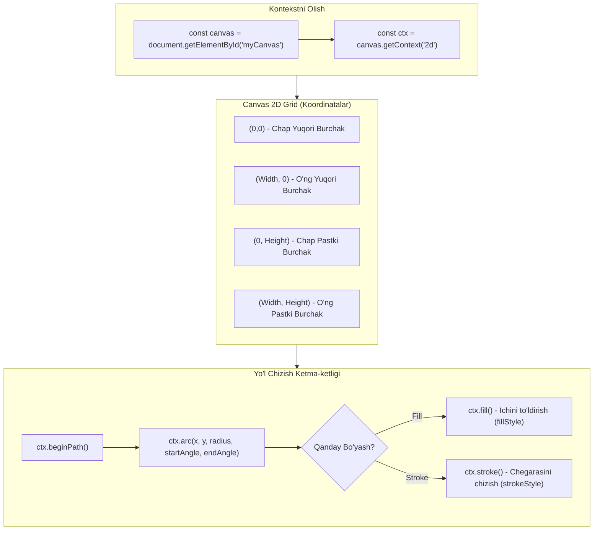

## 1. 💡 Sodda Tushuntirish va Analogiya

### HTML5 Canvas nima?
**HTML5 Canvas API** — bu veb-sahifada JavaScript yordamida dinamik ravishda grafikalar, rasmlar, o'yin sahnalari va animatsiyalarni chizish imkonini beruvchi texnologiyadir. U HTML-dagi `<canvas>` tegi orqali yaratiladi va asosan pikselga asoslangan (rastrli) chizmalar uchun ishlatiladi.

### Real hayotiy analogiya
Tasavvur qiling, siz **rassomlik ustaxonasi**dasiz:
* **Mato (Canvas - `<canvas>` tegi):** Bu rassomning bo'sh oq matosi. Mato o'z-o'zidan hech narsa chiza olmaydi, u shunchaki ma'lum kenglik va balandlikka ega bo'lgan joy (ramka) xolos.
* **Rassom va uning cho'tkasi (Context - `getContext('2d')`):** Bu JavaScript kodi orqali boshqariladigan obyektdir. U matoga borib shakllarni chizadi, ranglarni bo'yaydi (`fillStyle`), chiziq qalinligini belgilaydi va matoni tozalaydi.

---

## 2. 💻 Real Kod Misollari

### 1. Basic Example: To'rtburchaklar chizish
HTML5 Canvas-da eng oddiy shakl to'rtburchakdir. Quyidagi kodda canvas sozlanadi va to'ldirilgan hamda chegaralangan to'rtburchaklar chiziladi:

```html
<canvas id="myCanvas" width="400" height="200" style="border:1px solid #000;"></canvas>

<script>
  // 1. Canvas elementini va uning 2D kontekstini olamiz
  const canvas = document.getElementById('myCanvas');
  const ctx = canvas.getContext('2d');

  // 2. To'ldirilgan (Filled) to'rtburchak chizish
  ctx.fillStyle = '#FF5733'; // Bo'yash rangini o'rnatamiz
  ctx.fillRect(20, 20, 150, 100); // x=20, y=20 koordinatadan boshlab, eni 150, bo'yi 100

  // 3. Chegarali (Stroke) to'rtburchak chizish
  ctx.strokeStyle = '#007BFF'; // Chegara chizig'i rangi
  ctx.lineWidth = 5; // Chiziq qalinligi
  ctx.strokeRect(220, 20, 150, 100); // x=220, y=20 koordinatada chizish
</script>
```

### 2. Intermediate Example: Yo'l (Path) va shakllar chizish
Murakkab shakllar chizish uchun yo'llar (paths) ishlatiladi. Quyidagi misolda chiziqlar va to'liq aylana chizish ko'rsatilgan:

```javascript
// Kontekstni olish (yuqoridagi misoldan)
const canvas = document.getElementById('myCanvas');
const ctx = canvas.getContext('2d');

// 1. Uchburchak chizish
ctx.beginPath(); // Yangi yo'l boshlash
ctx.moveTo(100, 50); // Cho'tkani (100, 50) nuqtaga olib borish
ctx.lineTo(150, 150); // (150, 150) nuqtagacha chiziq chizish
ctx.lineTo(50, 150); // (50, 150) nuqtagacha chiziq chizish
ctx.closePath(); // Uchburchakni yopish (boshlang'ich nuqtaga avtomatik chiziq tortish)

ctx.fillStyle = 'green';
ctx.fill(); // Ichini yashil rangga bo'yash
ctx.strokeStyle = 'black';
ctx.stroke(); // Chegarasini chizish

// 2. Aylana chizish (Arc)
ctx.beginPath();
// arc(x, y, radius, startAngle, endAngle)
// Burchaklar radianlarda o'lchanadi. 360 daraja = Math.PI * 2
ctx.arc(300, 100, 50, 0, Math.PI * 2);
ctx.fillStyle = 'rgba(255, 0, 0, 0.5)'; // Yarim shaffof qizil
ctx.fill();
ctx.stroke();
```

### 3. Advanced Example: Canvas-da Animatsiya
Animatsiya yaratish uchun biz har bir kadrda canvasni tozalaymiz, obyektning koordinatalarini yangilaymiz va uni qaytadan chizamiz. Buning uchun `requestAnimationFrame` eng mos keladigan usuldir:

```html
<canvas id="animCanvas" width="400" height="200" style="border:1px solid #ccc;"></canvas>

<script>
  const canvas = document.getElementById('animCanvas');
  const ctx = canvas.getContext('2d');

  let x = 50; // Koptokning boshlang'ich X koordinatasi
  let dx = 2; // X bo'yicha harakat tezligi (piksel/kadr)
  const radius = 20;

  function animate() {
    // 1. Har bir kadrda canvasni tozalaymiz
    ctx.clearRect(0, 0, canvas.width, canvas.height);

    // 2. Aylana shaklini chizamiz
    ctx.beginPath();
    ctx.arc(x, 100, radius, 0, Math.PI * 2);
    ctx.fillStyle = '#9b59b6';
    ctx.fill();
    ctx.stroke();

    // 3. Keyingi kadr uchun X koordinatasini o'zgartiramiz
    x += dx;

    // 4. Chegaradan qaytish tekshiruvi (Bouncing effect)
    if (x + radius > canvas.width || x - radius < 0) {
      dx = -dx; // Yo'nalishni qarama-qarshiga o'zgartiramiz
    }

    // 5. Keyingi kadrni chaqiramiz
    requestAnimationFrame(animate);
  }

  // Animatsiyani boshlaymiz
  animate();
</script>
```

---

## 3. ⚙️ Qanday Ishlaydi (Under the Hood)

### Pikselma-piksel chizish (Raster Graphics)
Canvas piksellardan iborat matritsadir. SVG-dan farqli o'laroq, Canvas-ga chizilgan har qanday shakl (masalan, aylana yoki to'rtburchak) chizib bo'lingach, alohida obyekt (DOM tugun) sifatida saqlanib qolmaydi. Canvas uni shunchaki piksellar to'plami sifatida ko'radi va u haqidagi barcha ma'lumotlarni (masalan: "bu aylanami yoki chiziqmi") unutadi. 
Agar aylananing rangini o'zgartirmoqchi bo'lsangiz, uni eski o'rnidan tozalab, yangidan chizishingiz kerak.

### Render Loop va GPU Tezlashishi (Hardware Acceleration)
Zamonaviy brauzerlar Canvas-dagi operatsiyalarni bajarishda grafik protsessordan (GPU) foydalanadi. Bu degani, murakkab grafikalar va minglab piksellarni sekundiga 60 marta (60fps) qayta chizish protsessorni (CPU) ortiqcha qiynovsiz, grafik chip yordamida tez va silliq bajariladi.

### Retina (HiDPI) Ekranlar muammosi
Retina displeylarda bitta mantiqiy piksel (CSS pikseli) orqasida bir nechta jismoniy piksellar yotadi (`window.devicePixelRatio`). Agar Canvas elementining jismoniy o'lchami uning chizish o'lchamiga to'g'ri kelmasa, chiziqlar xira va piksel-piksel bo'lib ko'rinadi. Buni tuzatish uchun canvasning ichki kengligini jismoniy o'lchamga ko'paytirib, CSS o'lchamini esa kichikroq saqlash kerak bo'ladi.

---

## 4. ❌ Ko'p Uchraydigan Xatolar (Junior Mistakes)

### 1. Canvas o'lchamini faqat CSS orqali o'rnatish
Eng ko'p uchraydigan xato — Canvas elementining kengligi va balandligini HTML atributi o'rniga CSS style orqali berishdir.
* **XATO:**
  ```html
  <!-- Bu tasvirning juda cho'zilib va xiralashib ketishiga olib keladi -->
  <canvas id="myCanvas" style="width: 500px; height: 500px;"></canvas>
  ```
* **TUSHUNTIRISH:** Canvas ikki xil o'lchamga ega: ichki chizish maydoni o'lchami (`width` va `height` HTML atributlari orqali, sukut bo'yicha `300x150`) va tashqi ko'rinish o'lchami (CSS style). CSS orqali berilgan o'lcham 300x150 bo'lgan rasmni 500x500 gacha cho'zib yuboradi.
* **TO'G'RI:**
  ```html
  <canvas id="myCanvas" width="500" height="500"></canvas>
  ```

### 2. `ctx.beginPath()` metodini ishlatishni unutish
Yangi yo'l chizganda eski yo'lni yopmaslik chizmalarning buzilishiga olib keladi.
* **XATO:**
  ```javascript
  ctx.arc(50, 50, 30, 0, Math.PI * 2);
  ctx.stroke();
  
  // Yangi aylana chizmoqchimiz, lekin beginPath() yo'q
  ctx.arc(150, 50, 30, 0, Math.PI * 2);
  ctx.strokeStyle = 'red';
  ctx.stroke(); // Birinchi aylana ham qizil bo'lib qayta chiziladi!
  ```
* **TO'G'RI:**
  ```javascript
  ctx.beginPath();
  ctx.arc(50, 50, 30, 0, Math.PI * 2);
  ctx.stroke();

  ctx.beginPath(); // Yangi yo'l
  ctx.arc(150, 50, 30, 0, Math.PI * 2);
  ctx.strokeStyle = 'red';
  ctx.stroke();
  ```

### 3. Animatsiyalarda Canvasni tozalashni unutish
Animatsiya kadrlarini yangilashda eski kadrlarni o'chirmaslik.
* **XATO:**
  ```javascript
  function draw() {
    // clearRect ishlatilmadi
    ctx.fillRect(x, 10, 50, 50);
    x += 5;
  }
  ```
  Natijada to'rtburchak harakatlanmaydi, balki o'ng tomonga qarab uzun lenta kabi cho'zilib chizilib ketadi.
* **TO'G'RI:**
  ```javascript
  function draw() {
    ctx.clearRect(0, 0, canvas.width, canvas.height); // Ekranni tozalaymiz
    ctx.fillRect(x, 10, 50, 50);
    x += 5;
  }
  ```

---

## 5. 💬 12 ta Intervyu Savollari

### Junior
1. **Savol:** HTML5 Canvas nima va uning asosiy vazifasi nima?
   * **Javob:** Canvas — bu HTML elementi bo'lib, uning ichida JavaScript kodlari yordamida har xil shakllar, tasvirlar va animatsiyalarni piksellar darajasida chizish mumkin.

2. **Savol:** Canvas-da 2D chizish kontekstini qanday qo'lga kiritamiz?
   * **Javob:** Canvas elementidan `.getContext('2d')` metodini chaqirish orqali chizish vositalari va sozlamalarini o'z ichiga olgan kontekst obyektini olamiz.

3. **Savol:** `fillRect` va `strokeRect` o'rtasidagi farq nima?
   * **Javob:** `fillRect` ichi to'ldirilgan to'rtburchak chizadi, `strokeRect` esa ichi bo'sh, faqat chegaralari chizilgan to'rtburchak chizadi.

4. **Savol:** Canvas koordinatalar tizimi qanday tuzilgan?
   * **Javob:** Chap yuqori burchak (0,0) nuqta hisoblanadi. O'ngga qarab X koordinatasi, pastga qarab esa Y koordinatasi o'sib boradi.

### Middle
5. **Savol:** Nima uchun Canvas o'lchamini CSS o'rniga HTML atributlari orqali belgilash kerak?
   * **Javob:** Chunki HTML atributlari canvasning haqiqiy ichki chizish piksellar o'lchamini belgilaydi. CSS o'lchami esa uni shunchaki cho'zib ko'rsatadi, bu esa tasvir sifatini buzadi.

6. **Savol:** `beginPath()` va `closePath()` metodlarining vazifasi nimada?
   * **Javob:** `beginPath()` chizish uchun yangi yo'lni boshlaydi va oldingi yo'l xotirasini tozalaydi. `closePath()` esa joriy chizilayotgan yo'lning oxirgi nuqtasini uning boshlang'ich nuqtasi bilan to'g'ri chiziq yordamida birlashtirib, shaklni yopadi.

7. **Savol:** Animatsiyalar uchun nima sababdan `setTimeout` o'rniga `requestAnimationFrame` afzal ko'riladi?
   * **Javob:** `requestAnimationFrame` brauzerning ekran yangilanish tezligiga (refresh rate, odatda 60Hz) moslashib ishlaydi va sahifa faol bo'lmaganda (boshqa tabga o'tilganda) animatsiyani to'xtatib turadi, bu esa batareya va xotirani tejaydi, animatsiyani silliq qiladi.

8. **Savol:** Context-dagi `save()` va `restore()` metodlari nima uchun kerak?
   * **Javob:** `save()` kontekstning joriy holatini (ranglar, transformatsiyalar, chiziq qalinliklari va h.k.) stack xotirasiga saqlaydi. `restore()` esa eng oxirgi saqlangan holatni qayta tiklaydi. Bu boshqa shakllarni chizishda sozlamalar buzilib ketmasligi uchun qo'l keladi.

### Senior
9. **Savol:** Retina (HiDPI) ekranlarda Canvas chizmalarining xiralashib qolish muammosini kod yordamida qanday hal qilish mumkin?
   * **Javob:** Buning yechimi `window.devicePixelRatio`ni aniqlab, canvasning ichki o'lchamlarini (`width` va `height` atributlarini) ushbu koeffitsiyentga ko'paytirish, lekin uning CSS o'lchamlarini dastlabki holatida saqlashdir. Shuningdek, kontekstni ham `.scale(ratio, ratio)` yordamida masshtablash kerak:
     ```javascript
     const rect = canvas.getBoundingClientRect();
     const ratio = window.devicePixelRatio || 1;
     canvas.width = rect.width * ratio;
     canvas.height = rect.height * ratio;
     ctx.scale(ratio, ratio);
     ```

10. **Savol:** `OffscreenCanvas` nima va u qachon foyda beradi?
    - **Javob:** `OffscreenCanvas` — bu ekran ekranidan tashqarida (orqa fonda) chizish imkonini beruvchi va **Web Worker**-lar ichida ham ishlay oladigan canvas turi. U og'ir grafik hisob-kitoblarni asosiy JavaScript thread-ini bloklamasdan bajarish uchun juda foydali.

11. **Savol:** Canvas-ni tasvir sifatida saqlamoqchi bo'lganimizda qanday xavfsizlik muammolari (Tainted Canvas) yuzaga kelishi mumkin?
    - **Javob:** Agar canvas-ga boshqa domendagi rasm yuklab chizilgan bo'lsa (CORS ruxsatisiz), canvas "ifloslangan" (`tainted`) deb hisoblanadi. Bunday holatda `canvas.toDataURL()` yoki `ctx.getImageData()` chaqirilganda xavfsizlik cheklovlari (SecurityError) yuzaga keladi. Buni rasmni yuklashda `img.crossOrigin = "anonymous"` sozlash orqali hal qilish mumkin.

12. **Savol:** Canvas ichidagi aniq shakllarning bosilishini (click/hover) qanday aniqlash (Hit Testing) mumkin?
    - **Javob:** Har bir shakl alohida DOM elementi bo'lmagani uchun biz canvas-ga click eventini qo'shib, sichqoncha koordinatalarini olamiz. Keyin har bir shaklning koordinatasi bilan solishtiramiz. Murakkab yo'llar uchun kontekstning `ctx.isPointInPath(x, y)` metodidan foydalanib, berilgan sichqoncha nuqtasi chizilgan yo'l ichiga tushadimi yoki yo'qmi shuni tekshirish mumkin.

---

## 6. 🛠️ Amaliy Topshiriqlar

Dars bo'yicha amaliy kodlash vazifalari `/Users/farhod/Desktop/github/js-uz/scratch/canvas_exercises.json` faylida berilgan. Quyidagi diagrammada Canvas-ning koordinatalar tizimi va chizish bosqichlari sxematik ko'rsatilgan.



---

## 7. 📝 12 ta Mini Test

Darsni qay darajada o'zlashtirganingizni tekshirish uchun `/Users/farhod/Desktop/github/js-uz/scratch/canvas_quizzes.json` faylidagi 12 ta test savollariga javob bering.

---

## 8. 🎯 Real Project Case Study: Elektron Imzo Taxtachasi (E-Signature Pad)

Ushbu loyihada foydalanuvchilar sichqoncha yoki sensorli ekran (sensor panel) orqali canvas ustiga bemalol rasm/imzo chiza oladilar. Shuningdek, imzoni tozalash va uni rasm shaklida yuklab olish imkoniyati yaratilgan.

```html
<!DOCTYPE html>
<html lang="uz">
<head>
  <meta charset="UTF-8">
  <title>Elektron Imzo Taxtachasi</title>
  <style>
    body {
      font-family: Arial, sans-serif;
      text-align: center;
      padding: 20px;
    }
    #signature-pad {
      border: 2px dashed #34495e;
      background-color: #f9f9f9;
      cursor: crosshair;
      border-radius: 8px;
    }
    .controls {
      margin-top: 15px;
    }
    button {
      padding: 10px 20px;
      margin: 0 5px;
      font-size: 16px;
      cursor: pointer;
      border: none;
      border-radius: 4px;
      background-color: #2ecc71;
      color: white;
    }
    button.clear {
      background-color: #e74c3c;
    }
  </style>
</head>
<body>

  <h1>Elektron Imzo Taxtachasi</h1>
  <canvas id="signature-pad" width="500" height="250"></canvas>

  <div class="controls">
    <button class="clear" id="clear-btn">Tozalash</button>
    <button id="save-btn">Yuklab olish (PNG)</button>
  </div>

  <script>
    const canvas = document.getElementById('signature-pad');
    const ctx = canvas.getContext('2d');
    const clearBtn = document.getElementById('clear-btn');
    const saveBtn = document.getElementById('save-btn');

    let drawing = false;

    // Chizish chizig'ining sozlamalari
    ctx.strokeStyle = '#2c3e50';
    ctx.lineWidth = 3;
    ctx.lineCap = 'round'; // Chiziq uchlarini yumaloq qiladi
    ctx.lineJoin = 'round'; // Chiziqlar birlashgan joyini tekislaydi

    // Chizishni boshlash
    function startDrawing(e) {
      drawing = true;
      draw(e); // Nuqtani bosgan joyda ham chizishni boshlash uchun
    }

    // Chizishni to'xtatish
    function stopDrawing() {
      drawing = false;
      ctx.beginPath(); // Keyingi safar yangi chiziq boshlanishi uchun
    }

    // Koordinatalarni hisoblash
    function getCoords(e) {
      const rect = canvas.getBoundingClientRect();
      // Sichqoncha yoki Touch holatiga qarab koordinatalarni ajratish
      const clientX = e.touches ? e.touches[0].clientX : e.clientX;
      const clientY = e.touches ? e.touches[0].clientY : e.clientY;
      return {
        x: clientX - rect.left,
        y: clientY - rect.top
      };
    }

    // Chizish amali
    function draw(e) {
      if (!drawing) return;

      const coords = getCoords(e);
      ctx.lineTo(coords.x, coords.y);
      ctx.stroke();
      ctx.beginPath();
      ctx.moveTo(coords.x, coords.y);
    }

    // Sichqoncha hodisalari (Mouse Events)
    canvas.addEventListener('mousedown', startDrawing);
    canvas.addEventListener('mouseup', stopDrawing);
    canvas.addEventListener('mouseleave', stopDrawing);
    canvas.addEventListener('mousemove', draw);

    // Touch (Mobil ekranlar) hodisalari
    canvas.addEventListener('touchstart', (e) => {
      e.preventDefault(); // Sahifaning siljib ketishini oldini oladi
      startDrawing(e);
    });
    canvas.addEventListener('touchend', stopDrawing);
    canvas.addEventListener('touchmove', (e) => {
      e.preventDefault();
      draw(e);
    });

    // Tozalash tugmasi
    clearBtn.addEventListener('click', () => {
      ctx.clearRect(0, 0, canvas.width, canvas.height);
    });

    // PNG formatida saqlash
    saveBtn.addEventListener('click', () => {
      // Rasmni base64 ko'rinishida olamiz
      const dataURL = canvas.toDataURL('image/png');
      const link = document.createElement('a');
      link.download = 'imzo.png';
      link.href = dataURL;
      link.click();
    });
  </script>
</body>
</html>
```

---

## 9. 🚀 Performance va Optimization

### 1. Subpixel chizishdan qochish
Canvas-da koordinatalar bilan ishlashda kasr sonlardan (masalan: `x = 10.45`, `y = 20.8`) foydalanish antialiasing algoritmiga sabab bo'lib, unumdorlikni pasaytiradi va chiziqlarni xiralashtiradi. Har doim koordinatalarni butun sonlarga keltirib chizing:
```javascript
// Yomon:
ctx.fillRect(x, y, w, h); // Agar x va y kasr bo'lsa xiralashadi

// Yaxshi:
ctx.fillRect(Math.round(x), Math.round(y), w, h);
```

### 2. State o'zgarishlarini minimallashtirish
Kontekst sozlamalari (`fillStyle`, `strokeStyle`, `shadowColor` va h.k.) ni o'zgartirish qimmat operatsiyadir. Agar bir xil rangdagi ko'plab shakllarni chizmoqchi bo'lsangiz, avval hamma shakllarni yo'lga qo'shib, keyin bitta `fill()` yoki `stroke()` chaqiring:
```javascript
// Yomon:
for(let i=0; i<100; i++) {
  ctx.beginPath();
  ctx.fillStyle = 'blue';
  ctx.arc(i*10, 50, 5, 0, Math.PI*2);
  ctx.fill();
}

// Yaxshi:
ctx.beginPath();
ctx.fillStyle = 'blue';
for(let i=0; i<100; i++) {
  ctx.moveTo(i*10 + 5, 50); // Cho'tkani aylanalar boshlanishiga to'g'irlaymiz
  ctx.arc(i*10, 50, 5, 0, Math.PI*2);
}
ctx.fill(); // Hammasini bir martada bo'yash
```

### 3. Murakkab statik sahnalarni keshga olish
Agar o'yinda yoki animatsiyada o'zgarmas murakkab orqa fon bo'lsa, uni har bir kadrda qaytadan chizmang. Uni alohida ko'rinmas canvasga (`OffscreenCanvas` yoki HTML-da yaratilgan, lekin DOM-ga qo'shilmagan `document.createElement('canvas')` ga) chizib, asosiy canvasga faqat `ctx.drawImage(bgCanvas, 0, 0)` yordamida o'tkazib qo'ying.

---

## 10. 📌 Cheat Sheet

### Canvas, SVG va WebGL solishtiruvi

| Xususiyat | Canvas (2D) | SVG | WebGL (3D) |
| :--- | :--- | :--- | :--- |
| **Turi** | Rastrli (pikselli) | Vektorli | Rastrli (3D/2D GPU tezlashtirilgan) |
| **DOM bilan aloqa** | Yo'q (shunchaki bitta element) | Ha (har bir shakl DOM tuguni) | Yo'q (bitta element) |
| **Unumdorlik (ko'p obyektlar bilan)** | Yuqori | Past (DOM kattalashib ketadi) | Juda yuqori (Hardware accelerated) |
| **Foydalanish sohalari** | 2D o'yinlar, tezkor grafikalar, imzolar | Logotiplar, diagrammalar, piktogrammalar | 3D o'yinlar, murakkab data vizualizatsiya |
| **O'rganish qiyinligi** | Oson-o'rta | Oson | Juda qiyin (matematika va shaderlar) |

### Context 2D Metodlar to'plami ( Cheat Sheet )

* `ctx.beginPath()` — Yangi chizish yo'lini boshlaydi.
* `ctx.moveTo(x, y)` — Chizmasdan sichqonchani/cho'tkani ko'rsatilgan nuqtaga ko'chiradi.
* `ctx.lineTo(x, y)` — Boshlang'ich nuqtadan berilgan koordinatagacha chiziq tortadi.
* `ctx.arc(x, y, r, sAngle, eAngle)` — Aylana yoki yoy chizadi.
* `ctx.rect(x, y, w, h)` — To'rtburchak yo'lini yaratadi.
* `ctx.fill()` — Yo'l bilan belgilangan shakl ichini bo'yaydi (`fillStyle` rangida).
* `ctx.stroke()` — Yo'l chegarasini chizadi (`strokeStyle` rangida).
* `ctx.clearRect(x, y, w, h)` — Ko'rsatilgan to'rtburchak maydon piksellarini o'chiradi.
* `ctx.save()` — Kontekstning barcha joriy holatlarini (sozlamalarini) xotirada saqlaydi.
* `ctx.restore()` — Xotiradan eng oxirgi saqlangan holatni qaytarib tiklaydi.
