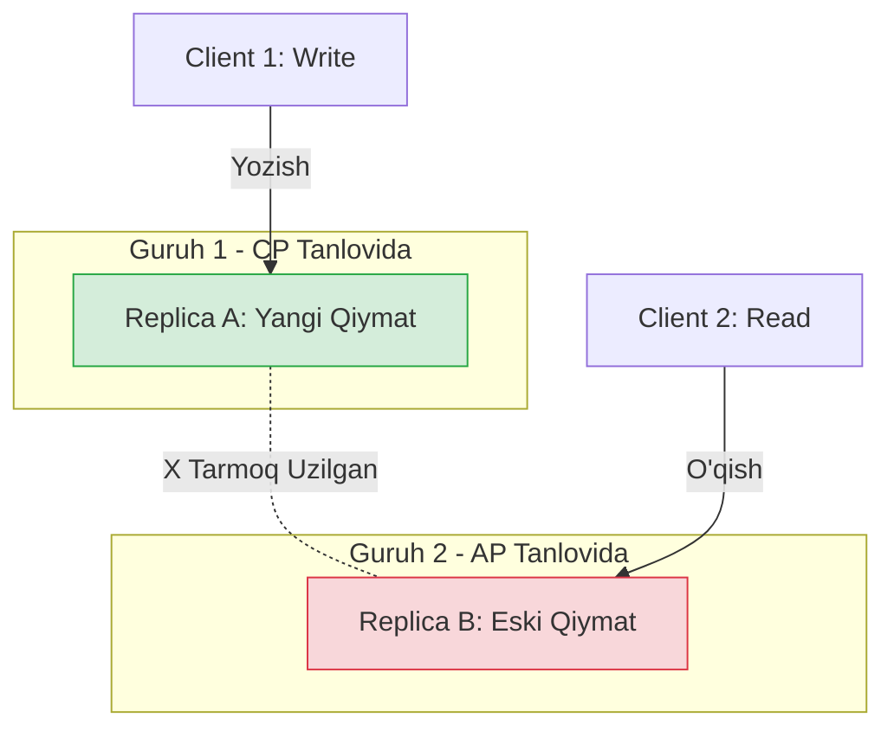
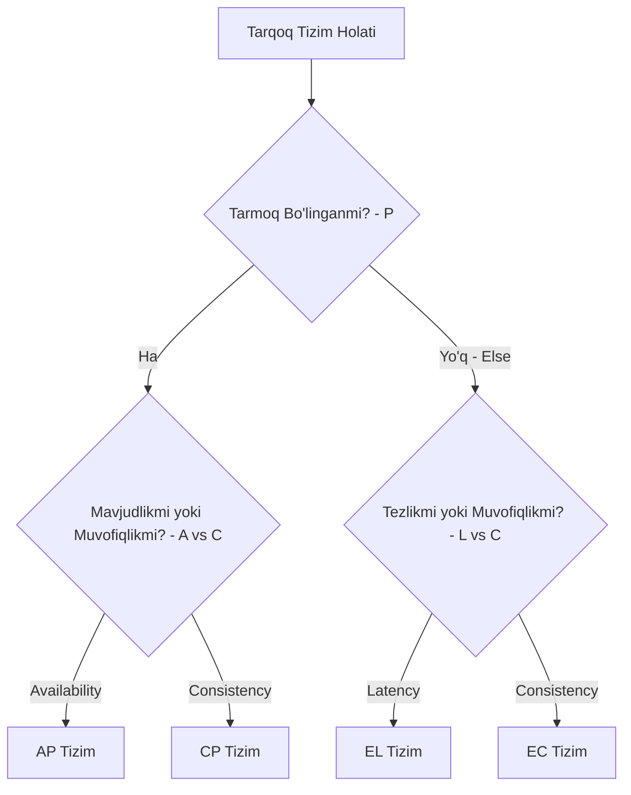

## 1. 💡 Sodda Tushuntirish va Analogiya

Tasavvur qiling, siz va do'stingiz (Ali va Vali) birgalikda eslatmalar xizmatini yo'lga qo'ydingiz. Mijozlar sizga telefon qilib, eslatmalar qoldirishadi yoki oldingi yozilganlarini so'rashadi. Sizlar alohida xonalarda o'tirasizlar, lekin har safar yangi yozuv yozilganda, bir-biringizga qog'oz orqali xabar yuborib, daftarlaringizni sinxronlab turasiz.

Kunlardan bir kun, xonalaringiz orasidagi yo'lak yopilib qoldi va qog'oz almasha olmay qoldingiz. Bu **Tarmoq Bo'linishi (Network Partition - P)** holatidir. Shunda telefon jiringladi:

*   **Mijoz Aliga qo'ng'iroq qilib, yangi eslatma yozdirdi:** Ali buni yozib oldi. Lekin u Vali bilan bog'lana olmaydi.
*   **Keyin mijoz Valiga qo'ng'iroq qilib, o'sha eslatmani so'radi:** Vali nima qilishi kerak?
    1.  **CP (Consistency + Partition Tolerance) Tanlovi:** Vali: "Kechirasiz, hozir Alining xonasi bilan aloqa uzilgan, sizga aniq ma'lumot berolmayman" deb javob beradi. Tizim xizmat ko'rsatishni rad etadi (Availability yo'qoladi), lekin noto'g'ri ma'lumot ham bermaydi (Muvofiqlik/Consistency saqlanadi).
    2.  **AP (Availability + Partition Tolerance) Tanlovi:** Vali: "Menda bor oxirgi ma'lumot mana bu..." deb javob beradi. Vali mijozga tezda javob beradi (Availability saqlanadi), lekin bu ma'lumot eskirgan bo'lishi mumkin, chunki u Alining yangi yozganidan bexabar (Consistency yo'qoladi).

---

## 2. 💻 Real Kod Misollari

JavaScript-da tarmoq bo'linishi va replikalar o'rtasidagi kelishmovchilikni simulyatsiya qilamiz:

```javascript
class DistributedNode {
  constructor(name) {
    this.name = name;
    this.data = null;
    this.version = 0;
    this.connectedNodes = new Set();
  }

  connect(node) {
    this.connectedNodes.add(node);
  }

  disconnect(node) {
    this.connectedNodes.delete(node);
  }

  write(value) {
    this.data = value;
    this.version += 1;
    
    // Boshqa ulangan replikalarga tarqatish (Replication)
    let replicatedCount = 1;
    for (let peer of this.connectedNodes) {
      peer.receiveUpdate(value, this.version);
      replicatedCount++;
    }
    return replicatedCount;
  }

  receiveUpdate(value, version) {
    if (version > this.version) {
      this.data = value;
      this.version = version;
    }
  }

  read() {
    return { data: this.data, version: this.version };
  }
}

// Tarmoqni simulyatsiya qilish
const replicaA = new DistributedNode("Replica-A");
const replicaB = new DistributedNode("Replica-B");

// Oddiy holatda replikalar ulangan
replicaA.connect(replicaB);
replicaB.connect(replicaA);

// Oddiy yozish
replicaA.write("Salom Dunyo");
console.log(replicaB.read().data); // "Salom Dunyo" (Sinxronlangan)

// Tarmoq uzilishi (Partition)
replicaA.disconnect(replicaB);
replicaB.disconnect(replicaA);

// A replikaga yangi ma'lumot yozamiz
replicaA.write("Yangi Xabar");

// B replikadan o'qiymiz
console.log(replicaB.read().data); // "Salom Dunyo" (Eski ma'lumot! Consistency buzildi - AP holati)
```

---

## 3. ⚙️ Qanday Ishlaydi (Under the Hood)

### CAP Teoremasi
2000-yilda Eric Brewer tomonidan taqdim etilgan CAP teoremasi tarqoq tizimlar quyidagi uchta kafolatdan faqat **ikkitasini** bir vaqtning o'zida ta'minlay olishini isbotlaydi:

1.  **Consistency (C - Muvofiqlik):** Har bir o'qish so'rovi eng oxirgi yozilgan ma'lumotni yoki xatolikni qaytaradi. Barcha tugunlar bir vaqtda mutlaqo bir xil ma'lumotni ko'radi.
2.  **Availability (A - Mavjudlik):** Ishlayotgan har qanday tugun xatoliksiz javob qaytarishi kerak (lekin bu javob eng oxirgi yozilgan ma'lumot bo'lishi shart emas).
3.  **Partition Tolerance (P - Bo'linishga Chidamlilik):** Tugunlar o'rtasida tarmoq xabarlari yo'qolgan yoki kechikkan holatda ham tizim ishlashda davom etadi.

> [!IMPORTANT]
> Real dunyo tarmoqlarida uzilishlar (P) muqarrar. Shuning uchun bizda hech qachon **CA** tizim bo'lmaydi. Biz faqat **CP** yoki **AP** tizimni tanlashimiz mumkin.

### PACELC Teoremasi
CAP faqat tarmoq bo'lingan (Partition) holatni tasvirlaydi. Oddiy ish rejimida (Partition yo'q paytda) nima bo'ladi? Buni **PACELC** tushuntiradi:

Agar **P** (Partition) bo'lsa, tizim **A** (Availability) yoki **C** (Consistency) tanlaydi;
**E**lse (Aks holda, normal holatda), tizim **L** (Latency - Tezkorlik) yoki **C** (Consistency - Kuchli muvofiqlik) o'rtasida tanlov qilishi kerak.

*   **MongoDB (PC/EC):** Bo'linishda Consistency-ni tanlaydi, normal holatda ham tezlikdan ko'ra Consistency-ni (EC) afzal ko'radi.
*   **Cassandra (PA/EL):** Bo'linishda Availability-ni tanlaydi, normal holatda ham minimal kechikish (Latency - EL) uchun eventual consistency-dan foydalanib ishlaydi.

### Quorum Formulalari (W + R > N)
Tarqoq tizimlarda ma'lumotlar to'g'riligini saqlash uchun kvorum (Quorum) ishlatiladi:
*   $N$: Replikalar (tugunlar) soni.
*   $W$: Yozish muvaffaqiyatli deb hisoblanishi uchun tasdiqlashi kerak bo'lgan replikalar soni.
*   $R$: O'qish so'rovida so'raladigan replikalar soni.

Agar **$W + R > N$** bo'lsa, o'qish to'plami va yozish to'plami kamida bitta umumiy replikaga ega bo'ladi va siz har doim **kuchli consistency (strong consistency)**ga ega bo'lasiz. Aks holda ($W + R \le N$), **eventual consistency** yuzaga keladi.

---

## 4. ❌ Ko'p Uchraydigan Xatolar (Junior Mistakes)

1.  **"Men CA tizim yaratdim" deyish:** Ko'pchilik bitta server va bitta ma'lumotlar bazasidan iborat tizimni CA deb o'ylaydi. Ammo tarqoq bo'lmagan tizimlarda CAP qo'llanilmaydi. Agar tizim tarqoq bo'lsa, tarmoq uzilishi muqarrar, demak CA variant sifatida mavjud emas.
2.  **ACID Muvofiqligi (C) bilan CAP Muvofiqligi (C) ni adashtirish:** ACID-dagi Consistency bu ma'lumotlar bazasining schema va constraint qoidalariga (masalan, unique key, foreign key) mos kelishidir. CAP-dagi Consistency esa tarqoq replikalar orasidagi ma'lumotlarning bir xilligidir (Linearizability).
3.  **W + R parametrlarini noto'g'ri sozlash:** Masalan, $N=3$, $W=1$, $R=1$ qilib qo'yish. Bu holda tizim juda tez ishlaydi (Latency past), lekin o'qish paytida eski (stale) ma'lumot qaytishi ehtimoli juda yuqori bo'ladi, chunki $1 + 1 \le 3$.

---

## 5. 💬 12 ta Intervyu Savollari

1.  **CAP teoremasi nima va undagi 3 ta harf nimani anglatadi?**
    Tarqoq tizimlarda Consistency (Muvofiqlik), Availability (Mavjudlik) va Partition Tolerance (Bo'linishga chidamlilik) kafolatlaridan faqat ikkitasini bir vaqtda ta'minlash mumkinligini ko'rsatadigan teorema.
2.  **Nima uchun real tizimlarda CA (Consistency + Availability) bo'lishi mumkin emas?**
    Chunki real jismoniy tarmoqlarda uzilishlar (Partitions) yuz berishi tabiiy holat. P-dan qochib bo'lmagani uchun, faqat CP yoki AP tanlanishi shart.
3.  **Linearizability nima?**
    CAP-dagi kuchli Consistency (Muvofiqlik) ning sinonimi. Har qanday o'qish operatsiyasi eng oxirgi yozilgan qiymatni qaytarishi kafolatidir.
4.  **PACELC teoremasi nima va u CAP-ni qanday kengaytiradi?**
    PACELC teoremasi tarmoq bo'linishi yo'q paytdagi (normal holatda) Latency (tezkorlik) va Consistency (muvofiqlik) o'rtasidagi kelishuvni ham hisobga oladi.
5.  **Eventual Consistency nima?**
    Yozish amalga oshirilgandan so'ng, tizim replikalari ma'lum vaqt ichida yangilanadi, ammo darhol emas. Vaqt o'tishi bilan barcha replikalar baribir bir xil qiymatga keladi.
6.  **Quorum o'qish va yozish formulasi qanday? Kuchli consistency uchun shart nima?**
    Formula: $W + R > N$. Bunda yozish tasdiqlanadigan tugunlar ($W$) va o'qiladigan tugunlar ($R$) yig'indisi umumiy tugunlar ($N$) sonidan katta bo'lishi kerak.
7.  **Agar $W=1, R=1, N=3$ bo'lsa, qanday consistency turi yuzaga keladi va nima uchun?**
    Eventual consistency yuzaga keladi. Chunki $1 + 1 \le 3$, yozilgan va o'qilgan tugunlar mutlaqo boshqa-boshqa bo'lishi mumkin.
8.  **Cassandra qanday tizim (PACELC bo'yicha)?**
    Cassandra PA/EL tizim hisoblanadi. Tarmoq bo'linganda u Availability-ni, normal holatda esa Latency-ni (tezlikni) afzal ko'radi.
9.  **MongoDB qanday tizim (PACELC bo'yicha)?**
    MongoDB PC/EC tizimdir. Tarmoq bo'linganda ham, normal holatda ham u ma'lumotlar muvofiqligini (Consistency) birinchi o'ringa qo'yadi.
10. **Network Partition (Tarmoq bo'linishi) deganda nimani tushunasiz?**
    Tarmoqdagi uzilish tufayli serverlar (tugunlar) guruhining bir-biri bilan aloqasi yo'qolishi, lekin har bir guruh ichidagi serverlar o'z holicha ishlashda davom etishi.
11. **Spanner qaysi CAP guruhiga kiradi va u qanday qilib yuqori mavjudlikni ta'minlaydi?**
    Spanner CP tizim hisoblanadi, lekin u TrueTime API (atom soatlari) va GPS orqali tarmoq kechikishlarini minimal qilib, amalda deyarli 99.999% mavjudlikni (Availability) ko'rsatadi.
12. **Read Repair nima?**
    O'qish jarayonida replikalardan eski ma'lumot aniqlanganda, fon rejimida uni eng yangi versiya bilan yangilab qo'yish jarayoni.

---

## 6. 🛠️ Amaliy Topshiriqlar

Dars uchun tayyorlangan coding mashqlari orqali tarqoq tizim sozlamalarini tekshirishni, PACELC klassifikatorini yaratishni va tarmoq bo'linganda so'rovlarni marshrutlashni o'rganing.

---

## 7. 📝 12 ta Mini Test

Testlar bo'limida CAP va PACELC teomalari bo'yicha bilimlaringizni sinab ko'ring.

---

## 8. 🎯 Real Project Case Study

### DynamoDB vs MongoDB
Yirik elektron tijorat platformasida ikki xil komponent mavjud:
1.  **Savat (Shopping Cart):** Foydalanuvchi mahsulot qo'shganda tezkorlik juda muhim. Agar tarmoq bo'linsa ham savat ishlashi kerak. Buning uchun **AP (Eventual Consistency / DynamoDB)** mos keladi.
2.  **To'lov tizimi (Checkout/Payment):** Bu yerda pul hisob-kitobi ketadi. Xatolikka yo'l qo'yib bo'lmaydi. Ikki marta pul yechilmasligi yoki balans noto'g'ri ko'rinmasligi uchun **CP (Strong Consistency / MongoDB yoki Spanner)** tanlanadi.

---

## 9. 🧠 Vizual ko'rinish (Architecture Diagram)

### Tarmoq Bo'linishi (Partition) Paytida CAP Tanlovi



### PACELC Qaror Qabul Qilish Daraxti



---

## 10. 📌 Cheat Sheet

### CAP va PACELC bo'yicha Tizimlar Xaritasi

| Tizim | CAP Turi | PACELC Turi | Asosiy Xususiyati |
| :--- | :--- | :--- | :--- |
| **Cassandra** | AP | PA / EL | Yuqori yozish tezligi, eventual consistency |
| **MongoDB** | CP | PC / EC | Relyatsion bo'lmagan, lekin kuchli consistency |
| **DynamoDB** | AP | PA / EL | Sozlanadigan kvorum, normal holatda juda tez |
| **Spanner** | CP | PC / EC | Global miqyosda kuchli consistency (TrueTime API) |

### Quorum Sozlamalari Jadvali ($N=3$ replika uchun)

| W | R | Turi | Xavf darajasi / Afzalligi |
| :--- | :--- | :--- | :--- |
| **3** | **1** | Kuchli Consistency | Yozish sekin (barcha replikalar kutiladi), o'qish juda tez |
| **2** | **2** | Kuchli Consistency | Optimal muvozanat ($2+2 > 3$) |
| **1** | **3** | Kuchli Consistency | Yozish juda tez, o'qish sekin (hamma replika so'raladi) |
| **1** | **1** | Eventual Consistency | Eng tezkor, lekin eski ma'lumot o'qish xavfi juda yuqori |
