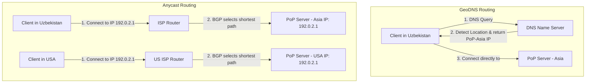

## 1. 💡 Sodda Tushuntirish va Analogiya

### CDN (Content Delivery Network) nima?
**CDN (Kontent yetkazib berish tarmog'i)** — bu dunyo bo'ylab tarqalgan serverlar tarmog'i bo'lib, veb-saytning statik va dinamik fayllarini (rasmlar, videolar, JS/CSS fayllar, HTML) foydalanuvchiga eng yaqin joylashgan server orqali yetkazib beradi. Bu serverlar joylashgan har bir nuqta **PoP (Point of Presence)** deb ataladi.

### Real hayotiy analogiya (CDN)
Tasavvur qiling, siz **Toshkentdasiz** va **Nyu-Yorkdagi** katta onlayn do'kondan kitob sotib olmoqchisiz:
* **CDN-siz holat:** Kitob har safar buyurtma qilinganda Amerika omboridan Toshkentga pochtadan yuboriladi. Yetib kelishi 10 kun davom etadi (yuqori kechikish - Latency).
* **CDN-li holat:** Onlayn do'kon kitoblarining nusxalarini butun dunyo bo'ylab, shu jumladan **Toshkentdagi mahalliy kitob do'koniga** (PoP/Edge server) oldindan joylashtiradi. Siz kitobni buyurtma qilganingizda, u Amerika omboridan emas, balki uyingiz yaqinidagi mahalliy do'kondan darhol yetkaziladi (kichik kechikish - 1-2 soat yoki daqiqalar).

### Edge Computing nima?
**Edge Computing (Chekka hisoblashlar)** — bu mantiqiy kodlarni va hisob-kitoblarni markaziy serverda (Origin) emas, balki foydalanuvchiga eng yaqin bo'lgan CDN serverlarida (Edge) bajarish texnologiyasidir. Bu xuddi mahalliy kitob do'konidagi sotuvchi kitobni shunchaki berib yubormay, uning ichiga sizning ismingizni yozib (dinamik mantiq) sovg'a qilib berishiga o'xshaydi.

---

## 2. 💻 Real Kod Misollari

### 1. Edge Worker (Cloudflare Workers uslubida sodda marshrutlash va sarlavhalar)
Edge worker-da so'rovni tahlil qilish va maxsus sarlavhalar qo'shish:
```javascript
// Edge Worker kiruvchi so'rovlarni boshqaradi
addEventListener('fetch', event => {
  event.respondWith(handleRequest(event.request));
});

async function handleRequest(request) {
  const url = new URL(request.url);
  
  // 1. Agar foydalanuvchi rasmlar so'rayotgan bo'lsa va brauzeri WebP qo'llab-quvvatlasa
  const acceptHeader = request.headers.get('Accept') || '';
  if (url.pathname.endsWith('.png') && acceptHeader.includes('image/webp')) {
    // Rasm formatini dinamik ravishda WebP ga almashtirish
    const webpUrl = request.url.replace('.png', '.webp');
    return fetch(webpUrl);
  }

  // 2. Oddiy so'rovlarni kesh sarlavhalari bilan qaytarish
  const response = await fetch(request);
  const newHeaders = new Headers(response.headers);
  
  // CDN keshini 1 kun (86400s), foydalanuvchi brauzerini esa 1 soat (3600s) kesh qilishga majburlash
  newHeaders.set('Cache-Control', 'public, max-age=3600, s-maxage=86400');
  
  return new Response(response.body, {
    status: response.status,
    statusText: response.statusText,
    headers: newHeaders
  });
}
```

### 2. Query String-larni normalizatsiya qilish (Kesh samaradorligini oshirish)
Foydalanuvchilar query parametrlarni xohlagan tartibda yozishi mumkin. Quyidagi funksiya kesh kaliti farqlanib ketishini oldini oladi:
```javascript
function normalizeCacheKey(requestUrl) {
  const url = new URL(requestUrl);
  
  // Parametrlarni alifbo tartibida saralaymiz
  const sortedParams = Array.from(url.searchParams.entries()).sort((a, b) => a[0].localeCompare(b[0]));
  
  const searchParams = new URLSearchParams();
  for (const [key, value] of sortedParams) {
    searchParams.append(key.toLowerCase(), value.toLowerCase());
  }
  
  url.search = searchParams.toString();
  return url.toString(); // Yagona tartiblangan kesh kaliti
}

const key1 = normalizeCacheKey("https://api.uz/data?b=2&a=1");
const key2 = normalizeCacheKey("https://api.uz/data?a=1&b=2");
console.log(key1 === key2); // true -> Ikkala so'rov ham bitta keshga tushadi!
```

---

## 3. ⚙️ Qanday Ishlaydi (Under the Hood)

### Anycast va GeoDNS Routing

CDN foydalanuvchini eng yaqin PoP-ga yo'naltirishda asosan ikkita usuldan foydalanadi:

1. **GeoDNS (DNS-based routing):**
   * Foydalanuvchi nom serveridan (DNS) IP manzil so'raganda, DNS tizimi foydalanuvchining IP manziliga qarab geografik joylashuvini aniqlaydi va unga o'sha hududga eng yaqin bo'lgan PoP serverining IP manzilini qaytaradi.
   * *Kamchiligi:* DNS keshlash tizimi tufayli marshrut tez o'zgarmasligi mumkin.

2. **Anycast Routing (Network-based routing):**
   * Dunyo bo'ylab barcha PoP serverlariga **bir xil yagona IP manzil** beriladi.
   * Internet routerlari (BGP protokoli orqali) foydalanuvchi so'rovini tarmoqdagi eng yaqin masofada joylashgan PoP serveriga avtomatik yo'naltiradi.
   * *Afzalligi:* Juda tezkor va ishonchli (agar bitta PoP o'chsa, tarmoq darhol so'rovlarni navbatdagi eng yaqin PoP-ga yo'naltiradi).

### V8 Isolates va Node.js Virtual Konteynerlari farqi

Edge Computing tez ishlashining siri uning izolyatsiya texnologiyasida:
* **Node.js Konteynerlari (masalan, Docker yoki VM):** Har bir so'rov uchun to'liq operatsion tizim virtualizatsiyasi yoki alohida Node.js jarayoni (process) ishga tushadi. Bu ko'p xotira (100MB+) va vaqt (Cold Start: 100ms dan bir necha soniyagacha) talab qiladi.
* **V8 Isolates:** Google V8 JavaScript dvigateli bitta umumiy operatsion tizim jarayonida minglab kichik va alohida JavaScript kontekstlarini (Isolates) yarata oladi. Har bir isolate o'zining xotirasi va o'zgaruvchilariga ega, lekin ular OS darajasida yangi jarayon boshlamaydi. Natijada **Cold Start < 1ms** va xotira sarfi atigi bir necha Kilobaytni tashkil etadi.

### Cache Eviction Policies (Keshdan o'chirish qoidalari)
CDN serverlari xotirasi cheklangan. Kesh to'lganda qaysi fayllarni o'chirishni tizim quyidagi algoritmlar bilan hal qiladi:
* **LRU (Least Recently Used):** Eng uzoq vaqt davomida hech kim so'ramagan ma'lumotlarni o'chirish.
* **LFU (Least Frequently Used):** Eng kam chastotada (kam marta) so'ralgan ma'lumotlarni o'chirish.

---

## 4. 🧪 Bosqichma-bosqich Amaliy Mashq

Keling, CDN Edge kesh funksionalligini va `stale-while-revalidate` logikasini simulyatsiya qiluvchi tizim yozamiz.

```javascript
// Edge serverdagi kesh ombori
const edgeCache = new Map();

// Origin server (Asil ma'lumot manbai) simulyatsiyasi
async function fetchFromOrigin(endpoint) {
  console.log(`[Origin] Og'ir SQL so'rov bajarilmoqda: ${endpoint}`);
  await new Promise(resolve => setTimeout(resolve, 500)); // 500ms kutish
  return { data: `Yangilangan ma'lumot (${endpoint})`, fetchedAt: Date.now() };
}

// Edge CDN funksiyasi
async function cdnEdgeHandler(endpoint) {
  const now = Date.now();
  const cached = edgeCache.get(endpoint);

  // 1. Kesh mavjud va hali eskirgan emas (Max-Age: 5 soniya)
  if (cached && (now - cached.fetchedAt < 5000)) {
    console.log("[Edge CDN] Cache Hit! Darhol qaytarildi.");
    return cached.data;
  }

  // 2. Kesh eskirgan, lekin Stale-While-Revalidate oynasida (SWR: yana 10 soniya)
  if (cached && (now - cached.fetchedAt < 15000)) {
    console.log("[Edge CDN] Cache Stale! Eski ma'lumot qaytarildi, fonda yangilanmoqda...");
    
    // Fonda origin serverdan yangilash (Background Revalidation)
    fetchFromOrigin(endpoint).then(freshData => {
      edgeCache.set(endpoint, freshData);
      console.log(`[Edge CDN] Kesh yangilandi: ${endpoint}`);
    });
    
    return cached.data; // Kutishlarsiz eski kesh qaytadi
  }

  // 3. Cache Miss (Kesh umuman yo'q yoki juda eski)
  console.log("[Edge CDN] Cache Miss! Origin kutilmoqda...");
  const freshData = await fetchFromOrigin(endpoint);
  edgeCache.set(endpoint, freshData);
  return freshData.data;
}

// Dasturni sinab ko'rish:
async function runDemo() {
  console.log(await cdnEdgeHandler("/users")); // Cache Miss (Origin kutadi)
  console.log(await cdnEdgeHandler("/users")); // Cache Hit (Darhol javob beradi)
  
  // 6 soniya kutamiz (Kesh eskiradi, lekin SWR oralig'ida bo'ladi)
  await new Promise(r => setTimeout(r, 6000));
  console.log(await cdnEdgeHandler("/users")); // Cache Stale (Eski qiymat darhol qaytadi)
  
  // Fonda yangilanishni 1 soniya kutamiz
  await new Promise(r => setTimeout(r, 1000));
  console.log(await cdnEdgeHandler("/users")); // Cache Hit (Yangi qiymat qaytadi)
}

runDemo();
```

---

## 5. ⚠️ Ko'p Uchraydigan Xatolar va Ularni Tuzatish

### 1. `max-age` va `s-maxage` ni aralashtirib yuborish
* **Xato:** `Cache-Control: max-age=86400` deb yozib, CDN-dagi sahifani yangilay olmaslik. Foydalanuvchi brauzeri ham uni 1 kunga keshlab oladi va siz CDN-ni majburiy tozalasangiz ham brauzer yangi faylni ololmaydi.
* **Tuzatish:** Foydalanuvchi brauzeri uchun kichik muddat, CDN uchun esa katta muddat belgilang:
  ```http
  Cache-Control: public, max-age=3600, s-maxage=86400
  ```

### 2. Kesh kalitida URL case-sensitivligini hisobga olmaslik
* **Xato:** CDN `/about` va `/ABOUT` manzillarini alohida sahifa deb hisoblaydi va origin-ga ortiqcha yuklama beradi.
* **Tuzatish:** So'rovlarni keshga tekshirishdan oldin ularni kichik harflarga o'tkazing:
  ```javascript
  const cleanPath = url.pathname.toLowerCase();
  ```

### 3. V8 Isolates ichida global o'zgaruvchilarda sessiya saqlash
* **Xato:** Edge worker ichida global o'zgaruvchi yaratib, foydalanuvchi sessiyasini saqlash. V8 isolate-lar har safar o'chib-yonishi yoki boshqa PoP serverida ishga tushishi mumkin.
* **Tuzatish:** Edge workers mutlaqo **Stateless** (holatsiz) bo'lishi kerak. Holatni saqlash uchun tashqi Edge Key-Value (masalan, Cloudflare KV, Redis) dan foydalaning.

---

## 6. 📝 Qisqacha Xulosa (Cheat Sheet)

| Atama / Sarlavha | Nima vazifa bajaradi | Asosiy xususiyati |
| :--- | :--- | :--- |
| **PoP (Point of Presence)** | Geografik server markazi | Foydalanuvchiga eng yaqin CDN tuguni |
| **Anycast Routing** | Tarmoq darajasida eng yaqin serverga yo'naltirish | Bitta IP manzil hamma stansiyada ishlatiladi |
| **V8 Isolate** | JavaScript kontekst izolatsiyasi | Cold start < 1ms, xotira sarfi minimal |
| **s-maxage** | CDN kesh vaqti | Brauzer keshiga ta'sir qilmaydi |
| **stale-while-revalidate** | Eskirgan keshni ko'rsatib, fonda yangilash | UX (foydalanuvchi tajribasi) uchun ideal |
| **Cache Purging** | Keshni majburiy tozalash | Baza o'zgarganda zudlik bilan chaqiriladi |

---

## 7. ❓ Savollar va Javoblar

### 1. Nima uchun dynamic ma'lumotlar bazasini to'liq Edge serverda saqlab bo'lmaydi?
Ma'lumotlar bazasini dunyo bo'ylab yuzlab nuqtalarga tarqatish (Replication) CAP teoremasiga ko'ra write (yozish) amallarida sinxronizatsiya muammolarini keltirib chiqaradi. Shuning uchun mantiq edge-da, og'ir yozish bazalari esa markaziy hududlarda (ko'p hollarda Read-Replica-lar bilan birga) saqlanadi.

### 2. Edge Worker va Serverless (masalan, AWS Lambda) farqi nimada?
AWS Lambda odatda an'anaviy konteyner yoki VM-larda ishlaydi va cold start vaqti 100ms dan bir necha soniyagacha bo'lishi mumkin. Edge worker (Cloudflare Workers) V8 Isolates texnologiyasini ishlatadi, cold start deyarli 0ms ga teng va u foydalanuvchiga eng yaqin CDN tarmog'ida ishlaydi.

---

## 8. 🎯 Real Project Case Study

### Global E-Commerce loyihasini Edge Computing yordamida tezlashtirish

**Muammo:** Saytga kirgan foydalanuvchining mamlakatiga qarab narxlarni turli valyutada ko'rsatish va A/B test o'tkazish kerak. Markaziy server Nyu-Yorkda joylashgan bo'lib, har bir foydalanuvchini aniqlash 300ms kechikish beradi.

**Yechim:**
1. **Routing at the Edge:** Kiruvchi so'rovni Edge Worker tutib oladi.
2. **GeoIP Detection:** Edge worker foydalanuvchi kelgan IP manzildan uning davlatini (masalan, O'zbekiston) millisekund ichida aniqlaydi.
3. **Cookie-based A/B testing:** Worker foydalanuvchi brauzerida `ab-group` cookie bormi yoki yo'qligini tekshiradi, bo'lmasa uni dinamik tarzda guruhga (A yoki B) ajratadi.
4. **Header Injection:** Asl serverga (Origin) so'rov yuborishdan oldin, Edge worker so'rov sarlavhalariga `X-User-Country: UZ` va `X-AB-Group: B` qiymatlarini qo'shadi.
5. **Caching:** Origin qaytargan sahifani CDN keshida `Vary: X-User-Country, X-AB-Group` sarlavhasi yordamida alohida-alohida keshlaydi.

Natijada, keyingi o'zbekistonlik va B guruhidagi foydalanuvchilar markaziy serverga bormasdan, javobni Edge serverdan 10ms da oladi.

---

## 9. 🧠 Vizual ko'rinish (Architecture Diagram)

### GeoDNS vs Anycast Routing



---

## 10. 📌 Cheat Sheet

### Eng muhim HTTP Caching Sarlavhalari

* **`Cache-Control: public`** — Kontentni brauzer ham, CDN ham keshlasa bo'ladi.
* **`Cache-Control: private`** — Faqat foydalanuvchi brauzeri keshlaydi (CDN keshlamasligi shart).
* **`Cache-Control: no-store`** — Kontentni hech qayerda keshlab bo'lmaydi (har doim origin-dan olinadi).
* **`Cache-Control: max-age=X`** — Foydalanuvchi brauzeri keshni yangilamasdan ishlatishi mumkin bo'lgan maksimal soniya.
* **`Cache-Control: s-maxage=Y`** — CDN-lar keshni saqlab turishi kerak bo'lgan muddat.
* **`stale-while-revalidate=Z`** — Kesh eskirgandan so'ng yana necha soniya davomida eski kontentni ko'rsatishga ruxsat berish muddati (fonda revalidation ketayotganda).
* **`Vary: HeaderName`** — CDN-ga berilgan sarlavha qiymatlariga ko'ra keshni alohida nusxalarda saqlashni buyuradi (masalan: `Vary: Accept-Encoding, User-Agent`).
