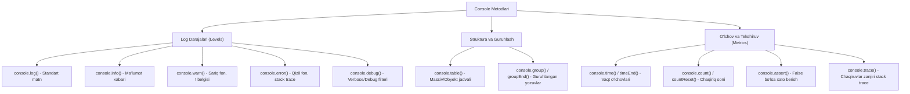

## 1. 💡 Sodda Tushuntirish va Analogiya

### Console nima?
* **Console (Konsol):** Bu kodimizning ishlash jarayonini kuzatish, xatolarni aniqlash va qidirish (debugging) hamda ma'lumotlarni tahlil qilish uchun mo'ljallangan maxsus brauzer (yoki Node.js terminal) panelidir.
* **Console metodlari:** JavaScript-da konsol bilan ishlash uchun faqatgina `console.log()` emas, balki turli vazifalarga ixtisoslashgan o'nlab boshqa metodlar (masalan: ogohlantirishlar, jadvallar, guruhlashlar) mavjud.

### Real hayotiy analogiya
Tasavvur qiling, siz **avtomobil boshqarib bormoqdasiz**:
* **console.log():** Avtomobilning old oynasi. Siz u orqali faqat yo'lni ko'rasiz (oddiy umumiy ma'lumot).
* **console.warn():** Dashboard-da (asboblar panelida) **yoqilg'i tugayotgani haqidagi sariq ogohlantirish chirog'i** yonishi (ogohlantirish, lekin mashina hali harakatda).
* **console.error():** **Dvigatel buzilgani haqidagi qizil chiroq (Check Engine)** va mashina to'xtab qolishi (kritik xatolik va stack trace).
* **console.table():** Avtomobil yukxonasidagi narsalar ro'yxati va ularning o'lchamlari ko'rsatilgan **tartibli varaq (jadval)**.
* **console.group():** Safar davomida qilgan xarajatlaringizni **"Yoqilg'i", "Oziq-ovqat" va "Mehmonxona" papkalariga (guruhlariga)** ajratib solib qo'yish.

---

## 2. 💻 Real Kod Misollari

### 1. Basic Example (Log darajalari va CSS stillari)
Konsolda turli rangdagi xabarlar va `%c` yordamida shaxsiy dizayn berish:
```javascript
// Standart xabar
console.log("Bu oddiy foydali xabar.");

// Ma'lumot xabari (Ba'zi brauzerlarda maxsus belgi bilan chiqadi)
console.info("Tizim muvaffaqiyatli ishga tushirildi.");

// Sariq rangli ogohlantirish xabari
console.warn("Diqqat! Kesh xotirasi to'lish arafasida.");

// Qizil rangli xatolik xabari
console.error("Ulanish rad etildi! Server bilan aloqa yo'q.");

// CSS yordamida konsoldagi matnni bezatish (%c specifier yordamida)
console.log(
  "%cDIQQAT!%c Bu xavfsiz emas.", 
  "color: red; font-size: 20px; font-weight: bold;", 
  "color: yellow; font-size: 14px;"
);
```

### 2. Intermediate Example (console.table va console.group)
Obyektlar massivini jadval shaklida va loglarni guruhlab chiqarish:
```javascript
const developers = [
  { id: 1, name: "Farhod", role: "Fullstack", experience: 5 },
  { id: 2, name: "Jasur", role: "Frontend", experience: 3 },
  { id: 3, name: "Kamola", role: "Mobile Developer", experience: 4 }
];

// Massivni chiroyli jadval ko'rinishida chiqarish
console.table(developers);

// Loglarni guruhlash
function fetchUserData() {
  console.group("Foydalanuvchi ma'lumotlarini olish jarayoni");
  console.log("Serverga so'rov yuborildi...");
  console.log("Foydalanuvchi topildi: Jasur");
  
  console.groupCollapsed("Qo'shimcha sozlamalar");
  console.log("Mavzu: Dark mode");
  console.log("Til: O'zbekcha");
  console.groupEnd(); // Ichki guruh tugashi
  
  console.log("Jarayon muvaffaqiyatli yakunlandi.");
  console.groupEnd(); // Tashqi guruh tugashi
}

fetchUserData();
```

### 3. Advanced Example (Vaqt o'lchash, count va assertion tekshiruvi)
Dastur ishlash vaqtini o'lchash, chaqiruvlarni sanash va shartni tekshirish:
```javascript
// 1. Shartni tekshirish (console.assert)
// Agar shart false bo'lsa xato beradi, true bo'lsa hech narsa chiqarmaydi
const age = 15;
console.assert(age >= 18, "Foydalanuvchi voyaga yetmagan!");

// 2. Chaqiruvlar sonini sanash (console.count)
function buttonClick() {
  console.count("Tugma bosildi");
}
buttonClick(); // Tugma bosildi: 1
buttonClick(); // Tugma bosildi: 2
console.countReset("Tugma bosildi"); // Hisoblagichni nollash
buttonClick(); // Tugma bosildi: 1

// 3. Ishlash vaqtini o'lchash (console.time)
console.time("Loop vaqti");
let sum = 0;
for (let i = 0; i < 1000000; i++) {
  sum += i;
}
console.timeEnd("Loop vaqti"); // Ekranga: Loop vaqti: X.XX ms formatida chiqaradi
```

---

## 3. ⚠️ Muammo va Nima uchun Muhimligi

### Qaysi muammolarni hal qiladi?
1. **Tartibsiz konsol outputi:** Katta loyihalarda yuzlab loglar aralashib ketadi. `console.error` va `console.warn` yordamida xato va ogohlantirishlarni qidirish osonlashadi.
2. **Nesting chalkashliklari:** Obyektlar ichidagi obyektlarni visual tarzda o'qish qiyin. `console.group` loglarni daraxtsimon qilib yig'ishga yordam bersa, `console.table` massiv va datalarni osongina solishtirishga imkon beradi.
3. **Ishlash unumdorligini o'lchash:** Dasturning sekin ishlayotgan qismini `console.time()` va `console.timeEnd()` orqali aniq millisekundgacha o'lchash mumkin.
4. **Kodning bajarilish zanjirini tekshirish:** Murakkab callback yoki asinxron funksiyalar qaysi ketma-ketlikda ishga tushayotganini `console.trace()` yordamida call stack orqali ko'rish imkonini beradi.

---

## 4. ❌ Ko'p Uchraydigan Xatolar (Junior Mistakes)

### 1. Production kodida console.log yozuvlarini qoldirib ketish
#### Muammo:
Bu nafaqat dastur tezligini pasaytiradi (log yozish resurs talab qiladi), balki foydalanuvchiga loyihaning ichki arxitekturasi va API ma'lumotlarini oshkor qilib qo'yadi.
#### Tuzatish:
Webpack, Vite yoki boshqa build vositalari yordamida production-da `console` metodlarini avtomatik o'chirib tashlaydigan plaginlarni ishlatish yoki custom logger yozish.

### 2. console.groupEnd() ni yopishni unutish
#### Muammo:
`console.group()` chaqirilib, oxirida `console.groupEnd()` bilan yopilmasa, undan keyingi yozilgan barcha loglar o'sha guruh ichiga kirib ketadi va konsol iyerarxiyasi buziladi.
#### Tuzatish:
Har safar guruh ochganda, uning yopilishini zudlik bilan ta'minlash.

### 3. Obyektlarni konsolga chiqarishda Reference muammosi
#### Muammo:
`console.log(myObj)` yozganda brauzer obyektning ayni paytdagi holatini emas, balki konsolda ochilgan paytdagi holatini (reference bo'yicha) ko'rsatishi mumkin.
```javascript
const user = { name: "Ali" };
console.log(user); // Ekranda { name: "Vali" } ko'rinishi mumkin!
user.name = "Vali";
```
#### Tuzatish:
Obyektning nusxasini (snapshot) chiqarish uchun `console.log(JSON.parse(JSON.stringify(user)))` yoki `console.table(user)` dan foydalanish.

### 4. console.time va console.timeEnd yorliqlarini har xil yozish
#### Muammo:
Taymer nomi bir xil bo'lmasa, dastur ishlash vaqtini o'lchab bo'lmaydi va xatolik yuzaga keladi.
```javascript
console.time("timer-1");
// kod...
console.timeEnd("timer-2"); // Xato! Timer 'timer-2' does not exist
```

---

## 5. 💬 12 ta Intervyu Savollari

### Junior (1–4)
1. **Savol:** `console.log` va `console.error` o'rtasidagi asosiy farq nima?
   * **Javob:** `console.log` oddiy xabarlar uchun ishlatiladi. `console.error` esa xabarni qizil fonda, xatolik belgisi va to'liq chaqiruvlar zanjiri (stack trace) bilan ko'rsatadi.
2. **Savol:** `console` obyekti JavaScript standartining (ECMAScript) bir qismimi?
   * **Javob:** Yo'q. `console` obyekti ECMA-262 standartiga kirmaydi. Bu brauzerlar va Node.js tomonidan taqdim etiladigan host muhit API-sidir.
3. **Savol:** `console.table` qanday ma'lumot turlarini chiroyli qilib jadval ko'rinishida chiqaradi?
   * **Javob:** Obyektlar massivi, massivlar massivi yoki kalit-qiymat ko'rinishidagi oddiy obyektlarni jadval shaklida chiqaradi.
4. **Savol:** Konsoldagi barcha yozuvlarni dasturiy ravishda qanday tozalash mumkin?
   * **Javob:** `console.clear()` metodini chaqirish orqali.

### Middle (5–8)
5. **Savol:** `console.group` va `console.groupCollapsed` farqi nima?
   * **Javob:** `console.group` ochilganda konsoldagi guruh sukut bo'yicha yoyilgan (open) holatda bo'ladi. `console.groupCollapsed` esa yig'ilgan (collapsed) holatda bo'lib, foydalanuvchi uni o'zi bosib ochishi kerak bo'ladi.
6. **Savol:** `%c` konsolda qanday maqsadlarda ishlatiladi? Misol keltiring.
   * **Javob:** Konsoldagi matnlarni bezash (CSS stillar berish) uchun. Misol: `console.log('%cSalom', 'color: green; font-weight: bold')`.
7. **Savol:** Kodning ma'lum bir qismi qancha vaqt davomida ishlaganini konsol orqali qanday o'lchaymiz?
   * **Javob:** O'lchanayotgan qism boshida `console.time('label')` va yakunida `console.timeEnd('label')` metodlarini chaqirish orqali.
8. **Savol:** `console.assert()` qanday ishlaydi va oddiy `if` tekshiruvidan nima farqi bor?
   * **Javob:** `console.assert(condition, message)` birinchi parametrda berilgan shart `false` bo'lsagina konsolga xatolik xabarini chiqaradi. U shart `false` bo'lsa dasturni to'xtatmaydi, shunchaki xato logini yozadi.

### Senior (9–12)
9. **Savol:** Production muhitda console metodlarini qanday qilib butunlay o'chirish yoki filtrlash mumkin?
   * **Javob:** Global `window.console` obyektining metodlarini bo'sh funksiyaga tenglash orqali:
     `if (process.env.NODE_ENV === 'production') { console.log = () => {}; console.warn = () => {}; console.error = () => {}; }`
10. **Savol:** Nega ba'zan brauzer konsolida obyektlarni `console.log` qilganda noto'g'ri yoki keyinchalik o'zgargan qiymatlar ko'rinadi? Buni qanday hal qilamiz?
    * **Javob:** Chunki konsol obyektga reference saqlaydi va lazy evaluation qiladi. Obyekt konsolda ochilganda uning joriy holati yuklanadi. Buni obyektni deep clone qilish orqali (`JSON.parse(JSON.stringify(obj))`) yoki `console.dir()` orqali hal qilish mumkin.
11. **Savol:** Node.js da `console.log` va `console.error` qayerga yozadi?
    * **Javob:** Node.js-da `console.log` tizimning standart chiqish oqimiga (`stdout`), `console.error` esa standart xatolik chiqish oqimiga (`stderr`) yozadi. Bu esa terminal orqali xatolarni alohida faylga yo'naltirish imkonini beradi.
12. **Savol:** Custom console obyektini qanday yaratish mumkin (masalan, faylga yozadigan loger)?
    * **Javob:** Node.js da `new console.Console(stdoutStream, stderrStream)` yordamida o'zingizning shaxsiy oqimlaringizga bog'langan custom `Console` klassini yaratishingiz mumkin.

---

## 6. 🛠️ Amaliy Topshiriqlar

Bu bo'limda siz turli konsol metodlaridan foydalanib dastur holatlarini kuzatish va unumdorlikni o'lchash bo'yicha mashqlarni bajarasiz.

### Konsol Metodlarining Vizual Modeli
Quyidagi diagrammada turli xil konsol metodlari, ularning log darajalari va qanday vizual natija berishi ko'rsatilgan:



---

## 7. 📝 12 ta Mini Test

Ushbu dars bo'yicha o'zlashtirgan bilimlaringizni sinab ko'rish uchun mo'ljallangan 12 ta test savollari.

---

## 8. 🎯 Real Project Case Study

### Production-ready Logger Utility (Tizimli Loger yordamchisi)
Haqiqiy loyihalarda har bir log muhim hisoblanadi. Biz loyiha muhitini (development yoki production) hisobga oluvchi, loglarni chiroyli formatda va ranglar bilan chiqaruvchi loger yordamchisini yozamiz.

```javascript
const Logger = {
  // Loyiha production ekanligini aniqlash
  isProd: typeof window !== "undefined" 
    ? window.location.hostname !== "localhost" 
    : process.env.NODE_ENV === "production",

  // Maxsus log yaratish funksiyasi
  log(message, data = "") {
    if (this.isProd) return; // Production-da loglarni ko'rsatmaymiz
    console.log(
      `%c[LOG] %c${message}`, 
      "color: #2ecc71; font-weight: bold;", 
      "color: inherit;", 
      data
    );
  },

  // Ogohlantirish xabari
  warn(message, data = "") {
    if (this.isProd) return;
    console.warn(`[WARN] ${message}`, data);
  },

  // Xatolik xabari
  error(message, errorObj = "") {
    // Xatolarni production-da ham chiqarish yoki Sentry kabi xizmatga yuborish mumkin
    console.error(`[ERROR] ${message}`, errorObj);
  },

  // Guruh log
  group(label, callback) {
    if (this.isProd) {
      callback();
      return;
    }
    console.group(`%c[GROUP] ${label}`, "color: #3498db; font-weight: bold;");
    try {
      callback();
    } finally {
      console.groupEnd();
    }
  }
};

// Foydalanish:
Logger.log("Foydalanuvchi tizimga kirdi", { id: 42 });
Logger.warn("Kutilmagan parametr uzatildi");
Logger.error("Tizimda xatolik yuz berdi", new Error("DB Connection Failed"));

Logger.group("API So'rovi", () => {
  Logger.log("So'rov yuborildi...");
  Logger.log("Status: 200 OK");
});
```

---

## 9. 🚀 Performance va Optimization

1. **IO operatsiyalarining qimmatligi:** Konsolga log yozish (ayniqsa murakkab obyektlarni `console.table` yoki katta hajmdagi ma'lumotlarni chiqarish) sinxron visual operatsiya bo'lib, u asosiy render oqimini (Main Thread) bloklashi mumkin. Yuqori chastotali looplarda log yozishdan saqlaning.
2. **Memory Leaks (Xotira oqishi):** `console.log(DOMNode)` orqali DOM elementlarini konsolga chiqarish, sahifadan o'chirib yuborilgan elementlarning xotiradan butunlay tozalanmasligiga (Detached DOM) olib keladi, chunki konsol ularning referencelarini saqlab qoladi (DevTools ochiq turganda).
3. **Lazy Evaluation muammolari:** JSON ko'rinishidagi ma'lumotlar bilan ishlashda kutilmagan natijalarni oldini olish uchun log yozishda `JSON.parse(JSON.stringify(obj))` uslubini qo'llash tavsiya etiladi.

---

## 10. 📌 Cheat Sheet

| Metod | Asosiy vazifasi | Kod misoli |
| :--- | :--- | :--- |
| `console.log()` | Oddiy ma'lumotlarni chop etish | `console.log("Salom");` |
| `console.info()` | Axborot xabarlarini chiqarish | `console.info("Yuklandi");` |
| `console.warn()` | Sariq rangli ogohlantirish | `console.warn("Ogohlantirish");` |
| `console.error()` | Qizil rangli xatolik va stack trace | `console.error("Xato yuz berdi");` |
| `console.table()` | Massiv/Obyektni jadvalda ko'rsatish | `console.table(users);` |
| `console.group()` | Guruhni ochish | `console.group("API");` |
| `console.groupEnd()`| Guruhni yopish | `console.groupEnd();` |
| `console.time()` | Taymerni ishga tushirish | `console.time("t-1");` |
| `console.timeEnd()` | Taymerni to'xtatish va vaqtni chiqarish | `console.timeEnd("t-1");` |
| `console.count()` | Chaqiruvlar sonini sanash | `console.count("tugma");` |
| `console.assert()` | Shart false bo'lsa xato yozish | `console.assert(x > 0, "x manfiy");` |
| `console.trace()` | Funksiya call stack-ni chiqarish | `console.trace();` |
| `console.clear()` | Konsol ekranini tozalash | `console.clear();` |
