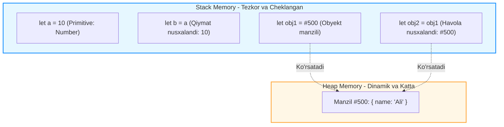

## 1. 💡 Sodda Tushuntirish va Analogiya

### Ma'lumotlar turlari (Data Types) nima?
JavaScript-da har bir o'zgaruvchi ma'lum bir qiymatni o'zida saqlaydi va bu qiymat o'ziga xos turga (tardagi ma'lumotga) ega bo'ladi. JavaScript-da ma'lumotlar turlari ikki guruhga bo'linadi:
1. **Primitive (Oddiy) turlar:** Qiymatlari oddiy va o'zgarmas (immutable) bo'lgan turlardir. Ular xotiraning **Stack** qismida saqlanadi.
2. **Reference (Havola) turlar:** Murakkabroq ma'lumotlar (obyektlar, massivlar, funksiyalar) bo'lib, ularning hajmi va tarkibi o'zgarishi mumkin (mutable). Ular xotiraning **Heap** qismida saqlanadi, Stack-da esa faqat ularga ko'rsatib turuvchi havola (manzil) joylashadi.

---

### Real hayotiy analogiya

* **Primitive type (Qiymat bo'yicha nusxalash) analogiyasi — Naqd pul:**
  Tasavvur qiling, sizda 100 ming so'mlik banknota bor (`let a = 100000`). Siz do'stingizga xuddi shunday 100 ming so'mlik boshqa banknotani berdingiz (`let b = a`). Endi do'stingiz o'zidagi pulni sarflasa yoki ustiga yozsa ham, sizning hamyoningizdagi banknota o'zgarmaydi. Ular bir-biridan mustaqil (copy by value).

* **Reference type (Havola bo'yicha nusxalash) analogiyasi — Seyf kaliti:**
  Tasavvur qiling, sizda qimmatbaho buyumlar saqlanadigan bitta seyf (Heap-dagi obyekt) bor va uning kaliti sizda turibdi (`let key1 = #123`). Siz do'stingizga xuddi shu kalitning nusxasini berdingiz (`let key2 = key1`). Endi do'stingiz o'z kaliti bilan seyfni ochib, ichidagi narsalarni o'zgartirsa (masalan, pul qo'shsa yoki olsa), siz o'z kalitingiz bilan ochganingizda ham o'sha o'zgarishlarni ko'rasiz, chunki seyf bitta, unga olib boruvchi kalitlar (havolalar) esa ikkita.

---

## 2. 💻 Real Kod Misollari

### 1. Basic Example (Primitive turlar — Qiymat bo'yicha nusxalash)
```javascript
let num1 = 50;
let num2 = num1; // Qiymat nusxalandi (50 alohida joyga yozildi)

num2 = 100; // num2 o'zgardi, num1 ga ta'siri yo'q

console.log(num1); // 50
console.log(num2); // 100
```

### 2. Intermediate Example (Reference turlar — Havola bo'yicha nusxalash)
```javascript
const user1 = { name: "Sardor", age: 22 };
const user2 = user1; // Obyekt emas, uning xotiradagi manzili nusxalandi

user2.name = "Rustam"; // user2 orqali obyekt ichidagi qiymat o'zgartirildi

console.log(user1.name); // "Rustam" (user1 ham o'zgardi!)
console.log(user1 === user2); // true (ikkalasi ham bitta obyektga ko'rsatmoqda)
```

### 3. Advanced Example (Symbol va BigInt)
* **Symbol** — mutlaqo unikal kalitlar yaratish uchun ishlatiladi:
```javascript
const id1 = Symbol("user_id");
const id2 = Symbol("user_id");

console.log(id1 === id2); // false (tavsifi bir xil bo'lsa ham, ular mutlaqo boshqa-boshqa)

const appUser = {
  [id1]: 101, // obyektning yashirin/unikal xususiyati sifatida
  name: "Jasur"
};
console.log(appUser[id1]); // 101
```

* **BigInt** — xavfsiz butun son chegarasidan (`Number.MAX_SAFE_INTEGER`) katta sonlar uchun:
```javascript
const normalNumber = 9007199254740991; // Chegara son
console.log(normalNumber + 1); // 9007199254740992
console.log(normalNumber + 2); // 9007199254740992 (Xato! Aniqlik yo'qoldi)

// BigInt ishlatilishi:
const bigIntNum = 9007199254740991n; // oxiriga 'n' qo'yiladi
console.log(bigIntNum + 1n); // 9007199254740992n
console.log(bigIntNum + 2n); // 9007199254740993n (Aniq va to'g'ri!)
```

---

## 3. ⚠️ Muammo va Nima uchun Muhimligi

### Qaysi muammoni hal qiladi va nima uchun buni bilish shart?
1. **Unutilmagan mutatsiyalar (Bugs):** Agar reference turlarning nusxalanish mexanizmini tushunmasangiz, React yoki Redux kabi holat (state) boshqaruv tizimlarida kutilmagan xatolarga duch kelasiz. Masalan, obyektni to'g'ridan-to'g'ri o'zgartirsangiz, React state o'zgarganini sezmaydi (chunki havola manzili o'zgarmagan bo'ladi) va sahifani qayta render qilmaydi.
2. **Xotirani samarali boshqarish:** Stack va Heap xotiralarining ishlash tezligi har xil. Stack xotirasi juda tez ishlaydi va uning o'lchami cheklangan. Heap esa katta hajmdagi dinamik ma'lumotlarni saqlaydi. Dasturingiz xotiradan to'g'ri foydalanishi va "memory leak" (xotira oqib ketishi) sodir bo'lmasligi uchun havolalarni vaqtida o'chirish muhimdir.

---

## 4. ❌ Ko'p Uchraydigan Xatolar (Junior Mistakes)

### 1. Obyektlarni shunchaki `=` yordamida nusxalash
* **Noto'g'ri (Original ham o'zgaradi):**
  ```javascript
  const original = { score: 10 };
  const copy = original;
  copy.score = 99;
  ```
* **To'g'ri (Sayoz nusxa olish):**
  ```javascript
  const copy = { ...original }; // Spread operator yordamida yangi obyekt yaratish
  copy.score = 99; // Endi original o'zgarmaydi
  ```

### 2. `null` qiymatining turini `typeof` yordamida tekshirishga urinish
* **Noto'g'ri:**
  ```javascript
  if (typeof value === "object") {
    // Agar kiritilgan qiymat null bo'lsa ham bu yerga kirib ketadi!
  }
  ```
* **To'g'ri:**
  ```javascript
  if (value !== null && typeof value === "object") {
    // Null bo'lmagan haqiqiy obyektlar uchun tekshiruv
  }
  ```

### 3. Ikki xil obyektni qiymatlari bo'yicha `===` bilan solishtirish
* **Noto'g'ri:**
  ```javascript
  console.log({} === {}); // false (chunki xotiradagi manzillari boshqa-boshqa)
  console.log([1, 2] === [1, 2]); // false
  ```
* **To'g'ri:**
  Obyektlarni solishtirish uchun ularning xususiyatlarini birma-bir solishtirish yoki chuqur solishtirish (`JSON.stringify` yoki yordamchi funksiyalar) yordamida tekshirish kerak.

---

## 5. 💬 12 ta Intervyu Savollari

### Junior (1–4)
1. **Savol:** JavaScript-da nechta ma'lumot turi bor?
   * **Javob:** 8 ta ma'lumot turi mavjud: String, Number, Boolean, Null, Undefined, Symbol, BigInt (bular primitive) va Object (reference).
2. **Savol:** Primitive va Reference turlarning farqi nimada?
   * **Javob:** Primitive turlar qiymat bo'yicha nusxalanadi va Stack-da saqlanadi (o'zgarmas). Reference turlar esa havola (manzil) bo'yicha nusxalanadi va Heap xotirada saqlanadi (o'zgartiriluvchan).
3. **Savol:** Nima uchun `typeof null` natijasi `'object'` chiqadi?
   * **Javob:** Bu JavaScript tilining birinchi versiyalaridan qolib ketgan tarixiy xato (bug) bo'lib, orqaga moslik (backward compatibility) buzilmasligi uchun tuzatilmagan.
4. **Savol:** `undefined` va `null` orasidagi farq nima?
   * **Javob:** `undefined` - o'zgaruvchi e'lon qilingan ammo unga qiymat berilmaganligini anglatadi. `null` esa ataylab qiymat yo'qligini bildirish uchun qo'lda beriladigan qiymatdir.

### Middle (5–8)
5. **Savol:** `Symbol` nima va u qayerda qo'llaniladi?
   * **Javob:** Symbol - mutlaqo takrorlanmas unikal identifikator yaratuvchi primitive turdir. U obyektlarda nomlar to'qnashuvining oldini olish uchun yopiq/unikal xususiyatlar yozishda ishlatiladi.
6. **Savol:** `Number` turi bilan qanday muammo bor va `BigInt` uni qanday hal qiladi?
   * **Javob:** `Number` turi 64-bitli floating point bo'lgani sababli `2^53 - 1` dan katta sonlar bilan ishlashda aniqlikni yo'qotadi. `BigInt` esa istalgancha katta butun sonlar bilan aniq matematik amallarni bajarishga imkon beradi.
7. **Savol:** Obyektlarni chuqur nusxalash (Deep Copy) uchun qaysi o'rnatilgan JS funksiyasidan foydalanamiz?
   * **Javob:** Zamonaviy JavaScript-da `structuredClone(obj)` funksiyasidan foydalaniladi. U ichma-ich obyektlarni ham xavfsiz nusxalaydi.
8. **Savol:** `Object.freeze()` metodidan keyin obyekt tarkibidagi ichki obyektlarni o'zgartirsa bo'ladimi?
   * **Javob:** Ha, chunki `Object.freeze()` faqat obyektning birinchi darajasini (shallow freeze) muzlatadi. Ichki obyektlar hamon o'zgartirilishi mumkin. Ularni muzlatish uchun rekursiv tarzda muzlatish kerak.

### Senior (9–12)
9. **Savol:** JavaScript dvigateli (V8) Stack va Heap xotirani qanday boshqaradi?
   * **Javob:** Stack qat'iy tartibdagi tezkor xotira bo'lib, kontekst o'chganda (masalan, funksiya bajarilib bo'lingach) undagi primitive qiymatlar avtomatik tarzda tozalanadi. Heap xotiradagi obyektlar esa Garbage Collector (Axlat yig'uvchi) tomonidan faqat ularga hech qanday havola (reference) qolmagandagina tozalanadi.
10. **Savol:** Nima uchun `const arr = []` massiviga element qo'shish mumkin, lekin `const x = 5` qiymatini o'zgartirib bo'lmaydi?
    * **Javob:** Chunki `const` o'zgaruvchining xotira manziliga (reference) yangi qiymat yozilishini taqiqlaydi. Massiv `push` qilinganda uning manzili o'zgarmaydi, faqat Heap-dagi ma'lumoti o'zgaradi. Son primitive bo'lgani uchun uni o'zgartirish yangi manzilni talab qiladi, bu esa `const` qoidasiga to'g'ri kelmaydi.
11. **Savol:** JavaScript-da Primitive turlarda qanday qilib metodlar (`str.toUpperCase()`) chaqirilishi mumkin? Axir ular obyekt emasku?
    * **Javob:** Primitive qiymat ustida metod chaqirilganda, JavaScript vaqtincha uni o'rab turuvchi obyektga (Wrapper Object: masalan `String`, `Number`) o'raydi, metodni bajaradi va zudlik bilan u vaqtinchalik obyektni yo'qotadi. Bu jarayon "autoboxing" deyiladi.
12. **Savol:** Xotiradagi obyektdan havola yo'qolishiga qaramasdan Garbage Collector uni tozalamasligi qachon yuz beradi (Memory Leak)?
    * **Javob:** Bu hodisa asosan closures (yopilmalar), global o'zgaruvchilar, o'chirilmagan `setInterval` yoki DOM-dan o'chirilgan lekin JS obyektida saqlanib qolgan havolalar (detached DOM elements) tufayli yuz beradi.

---

## 6. 🛠️ Amaliy Topshiriqlar

Quyidagi Mermaid diagrammasi JavaScript-da Primitive va Reference turlarining xotirada qanday saqlanishi va nusxalanishini yaqqol ko'rsatib beradi.



* **Qiymat bo'yicha nusxalash (Primitive):** `a` va `b` Stack-da alohida joy egallaydi. `b` ning o'zgarishi `a` ga ta'sir qilmaydi.
* **Havola bo'yicha nusxalash (Reference):** `obj1` va `obj2` Stack-da bir xil `#500` manzilini saqlaydi. Har ikkisi ham Heap-dagi bitta obyektga murojaat qiladi. Shuning uchun bittasini o'zgartirish ikkinchisiga ham ta'sir qiladi.

---

## 7. 📝 12 ta Mini Test

Dars yakunidagi testlar va savollar orqali bilimlaringizni sinab ko'ring.

---

## 8. 🎯 Real Project Case Study

### React State Immutability va Obyektlarni yangilash
React-da state yangilanishini tekshirish uchun "Shallow Comparison" (yuzaki tekshiruv) ishlatiladi. Agar siz state obyektini to'g'ridan-to'g'ri o'zgartirsangiz, React renderingni yangilamaydi.

#### Xato usul (React renderingni o'tkazib yuboradi):
```javascript
const [user, setUser] = useState({ name: "Ali", role: "User" });

const promoteUser = () => {
  user.role = "Admin"; // Mutatsiya! Obyekt ichi o'zgardi, lekin uning xotira manzili o'sha-o'sha.
  setUser(user); // React o'zgarishni sezmaydi, chunki user === user (manzili bir xil).
};
```

#### To'g'ri usul (Immutability qoidasiga rioya qilingan):
```javascript
const promoteUser = () => {
  // Yangi xotira manziliga ega yangi nusxa (spread operator yordamida)
  setUser({
    ...user,
    role: "Admin"
  }); // React yangi manzilni ko'radi va sahifani qayta render qiladi.
};
```

---

## 9. 🚀 Performance va Optimization

* **Stack va Heap tezligi:** Stack xotirasidan ma'lumot olish juda tez bajariladi. Heap xotiradan ma'lumot qidirish va ularni tozalash (Garbage Collection) nisbatan og'irroq protsess hisoblanadi. Shuning uchun keraksiz obyektlar yaratishdan qoching.
* **Taqqoslash tezligi:** Primitive qiymatlarni taqqoslash bit darajasida tez bajariladi. Reference qiymatlarni solishtirishda faqat ularning Stack-dagi 64-bitli manzillari solishtiriladi, bu ham juda tez. Biroq ikki obyektning ichki qiymatlarini tekshirish uchun qilinadigan rekursiv solishtirish (deep equality) dastur tezligini pasaytiradi.
* **`structuredClone` ehtiyotkorligi:** Bu funksiya `JSON.parse(JSON.stringify())` dan tezroq va xavfsizroq ishlasa-da, juda katta obyektlarni tez-tez nusxalash kadrlar tushib ketishiga (lag) olib keladi.

---

## 10. 📌 Cheat Sheet

| Ma'lumot turi | Turi (Typeof) | Saqlanish joyi | Nusxalanish usuli | O'zgaruvchanligi (Mutability) | Misol |
| :--- | :--- | :--- | :--- | :--- | :--- |
| **Number** | `"number"` | Stack | Qiymat bo'yicha | Immutable (O'zgarmas) | `42`, `3.14` |
| **String** | `"string"` | Stack | Qiymat bo'yicha | Immutable (O'zgarmas) | `"Salom"` |
| **Boolean** | `"boolean"` | Stack | Qiymat bo'yicha | Immutable (O'zgarmas) | `true`, `false` |
| **Null** | `"object"` (bug) | Stack | Qiymat bo'yicha | Immutable (O'zgarmas) | `null` |
| **Undefined** | `"undefined"` | Stack | Qiymat bo'yicha | Immutable (O'zgarmas) | `undefined` |
| **Symbol** | `"symbol"` | Stack | Qiymat bo'yicha | Immutable (O'zgarmas) | `Symbol("id")` |
| **BigInt** | `"bigint"` | Stack | Qiymat bo'yicha | Immutable (O'zgarmas) | `100n` |
| **Object** | `"object"` | Heap (havola Stack-da) | Havola bo'yicha | Mutable (O'zgaruvchan) | `{ name: "Ali" }`, `[1, 2]` |
