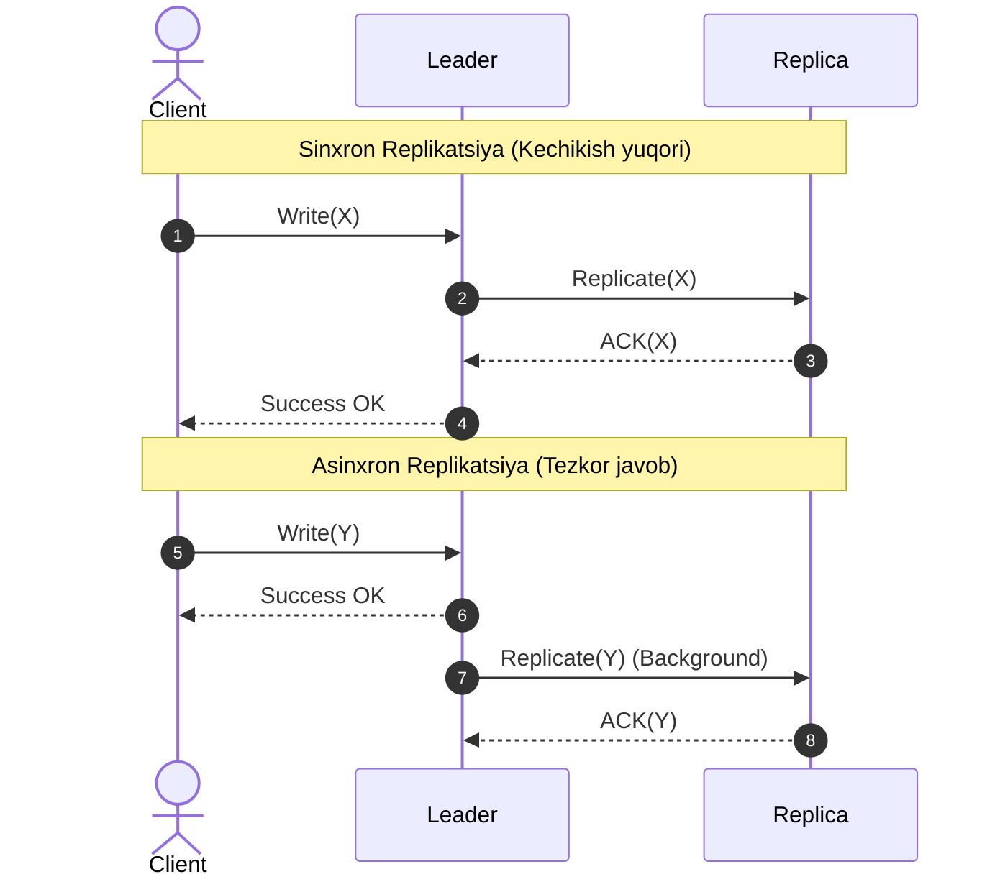
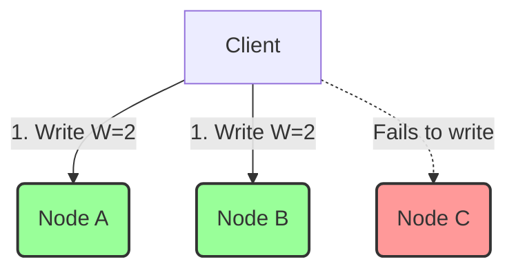

## 1. 💡 Sodda Tushuntirish va Analogiya

Tasavvur qiling, siz katta bir kutubxona mudirisiz. Kutubxonangizda juda noyob va mashhur ma'lumotnoma kitobi bor. Har kuni yuzlab odamlar kelib ushbu kitobni o'qishni xohlashadi. 

Agar kitob bitta bo'lsa:
1. Odamlar navbatda turib qolishadi (Kechikish/Latency).
2. Agar o'sha yagona kitob ustiga tasodifan suv to'kilib yaroqsiz bo'lib qolsa, kutubxona ishdan to'xtaydi (Single Point of Failure).

Ushbu muammoni hal qilish uchun siz kitobdan yana 3 ta nusxa tayyorlaysiz va ularni turli xonalarga qo'yasiz. Endi odamlar nusxalarni parallel o'qiy olishadi. 

**Database Replication (Ma'lumotlar bazasi replikatsiyasi)** — bu ma'lumotlarni bir nechta serverlarda (tugunlarda) bir xil holatda saqlash jarayonidir. U tizimning tezligini (Read throughput) oshiradi va bitta server o'chib qolsa ham tizim ishlashini davom ettirishini kafolatlaydi (High Availability).

---

## 2. 💻 Real Kod Misoli (Replikatsiya Sinxronizatsiyasi)

Quyida Sodda Leader-Replica (Active-Passive) replikatsiya modeli keltirilgan:

```javascript
class DatabaseNode {
  constructor(id, isLeader = false) {
    this.id = id;
    this.isLeader = isLeader;
    this.store = new Map();
  }

  write(key, value) {
    if (!this.isLeader) {
      throw new Error("Faqat Leader tugunga yozish mumkin!");
    }
    this.store.set(key, value);
  }

  read(key) {
    return this.store.get(key);
  }
}

class ReplicationManager {
  constructor(leader, replicas) {
    this.leader = leader;
    this.replicas = replicas;
  }

  // Sinxron replikatsiya: barcha replikalar tasdiqlamaguncha foydalanuvchiga muvaffaqiyat xabari berilmaydi
  async writeSynchronous(key, value) {
    // 1. Leader-ga yozish
    this.leader.write(key, value);

    // 2. Barcha replikalarga parallel ravishda yozish
    const promises = this.replicas.map(async (replica) => {
      // Simulyatsiya qilingan tarmoq kechikishi
      await new Promise(resolve => setTimeout(resolve, Math.random() * 50));
      replica.store.set(key, value);
    });

    await Promise.all(promises);
    return "Sinxron yozish muvaffaqiyatli yakunlandi";
  }

  // Asinxron replikatsiya: Leader-ga yozilgan zahoti javob qaytariladi, replikalarga fonda yuboriladi
  writeAsynchronous(key, value) {
    // 1. Leader-ga yozish
    this.leader.write(key, value);

    // 2. Replikalarga orqa fonda yuborish
    this.replicas.forEach(async (replica) => {
      await new Promise(resolve => setTimeout(resolve, 100)); // kechikish
      replica.store.set(key, value);
    });

    return "Asinxron yozish qabul qilindi (fonda replikatsiya ketmoqda)";
  }
}
```

---

## 3. ⚙️ Qanday Ishlaydi (Under the Hood)

### Replikatsiya mexanizmlari (Mechanics)
1. **Synchronous Replication (Sinxron):** Leader foydalanuvchidan yozish so'rovini olgach, uni barcha replikalarga yuboradi va ularning barchasidan "muvaffaqiyatli yozildi" degan tasdiq (ACK) kelmaguncha foydalanuvchiga javob qaytarmaydi.
   * *Afzalligi:* Ma'lumot yo'qolmaydi (Zero Data Loss), kuchli moslik (Strong Consistency).
   * *Kamchiligi:* Bitta replika sekin ishlasa yoki tarmoqdan uzilsa, butun yozish jarayoni to'xtab qoladi (High Latency & Low Availability).
2. **Asynchronous Replication (Asinxron):** Leader yozish so'rovini o'ziga yozadi va mijozga darhol "OK" javobini qaytaradi. Ma'lumotlar replikalarga fonda (background queue) yuboriladi.
   * *Afzalligi:* Yuqori tezlik (Low Write Latency).
   * *Kamchiligi:* Agar Leader ma'lumot replikalarga yetib bormasdan oldin o'chib qolsa (crash), yozilgan ma'lumotlar butunlay yo'qoladi.
3. **Semi-synchronous Replication (Yarim-sinxron):** Leader kamida bitta (yoki ma'lum bir miqdordagi) replikadan tasdiq olgach mijozga javob qaytaradi, qolganlariga esa asinxron replikatsiya qilinadi.

### Replikatsiya Topologiyalari
* **Single-Leader (Active-Passive):** Barcha yozishlar (write) faqat bitta Leader tugunga yuboriladi. Read so'rovlari esa yuklamani kamaytirish uchun replikalarga yo'naltirilishi mumkin.
* **Multi-Leader (Active-Active):** Bir nechta Leader tugunlar yozishlarni parallel qabul qiladi. Ular o'rtasida ma'lumotlarni sinxronlash va konfliktlarni (Conflict Resolution) hal qilish kerak bo'ladi.
* **Leaderless (Dynamo-style):** Aniq bir Leader yo'q. Har qanday yozish yoki o'qish so'rovi klasterdagi bir nechta tugunga parallel yuboriladi. Bu yerda **Quorum** tushunchasi ishlatiladi:
  $$R + W > N$$
  Bu yerda $N$ - replikalar soni, $W$ - muvaffaqiyatli yozilishi kerak bo'lgan tugunlar soni, $R$ - o'qilishi kerak bo'lgan tugunlar soni. Agar ushbu tengsizlik bajarilsa, o'qish paytida kamida bitta eng oxirgi yozilgan qiymatni o'qish kafolatlanadi.

### Replication Lag Guarantees (Kafolatlar)
Asinxron replikatsiyada replikalar ma'lum muddat sekinroq yangilanishi mumkin (Replication Lag). Bu quyidagi muammolarga olib keladi:
1. **Read-after-write Consistency:** Foydalanuvchi ma'lumotni o'zgartirgandan keyin sahifani yangilasa, o'zgarishini ko'ra olishi shart. Buni hal qilish uchun foydalanuvchining o'z profili kabi ma'lumotlarini har doim Leader-dan o'qish talab qilinishi mumkin.
2. **Monotonic Reads:** Agar foydalanuvchi bir necha marta sahifani yangilasa, vaqt orqaga ketib qolgandek tuyulmasligi kerak (ya'ni yangilangan ma'lumotni ko'rib, keyin yana eski ma'lumotga ega replica-dan ma'lumot o'qib qolmasligi lozim). Bunga mijozni har doim bitta replica-ga yo'naltirish (masalan, sessiya ID-ga qarab hashlash) orqali erishiladi.
3. **Consistent Prefix Reads:** Agar ma'lumotlar ma'lum bir ketma-ketlikda yozilsa (masalan, Savol va Javob), ular o'quvchiga ham o'sha tartibda ko'rinishi kerak.

### Failover va Split-brain xavfi
Agar Leader ishdan chiqsa, replikalardan biri yangi Leader etib saylanishi kerak (Failover). Agar tarmoq bo'linib qolsa (Network Partition) va ikki qism ham o'zini Leader deb hisoblasa, bu **Split-brain** muammosini keltirib chiqaradi.

---

## 4. ❌ Keng tarqalgan xatolar (Junior Mistakes)

1. **Replication Lag-ni hisobga olmaslik:** Asinxron replikada yozib bo'lingach, darhol replikadan o'qishga harakat qilish va ma'lumot topilmaganda dasturni xato berishi.
2. **Split-Brain e'tiborsiz qoldirilishi:** Ikkita Leader parallel ravishda bir xil primary key bilan yozishlarni qabul qilib, ma'lumotlar butunlay chalkashib ketishi.
3. **Quorum formulasini noto'g'ri hisoblash:** Leaderless tizimlarda $R + W \le N$ qilib qo'yilsa, eskirgan ma'lumotlar o'qilishini (stale reads) hisobga olmaslik.

---

## 5. 🏢 Real tizimlarda qo'llanilishi

* **PostgreSQL Streaming Replication:** Tranzaksiyalar jurnali (Write-Ahead Log - WAL) yordamida sinxron yoki asinxron replikatsiyani amalga oshiradi.
* **Galera Cluster (MySQL):** Multi-leader synchronous replication taqdim qiladi.
* **Apache Cassandra va DynamoDB:** Leaderless arxitekturaga ega bo'lib, sozlanuvchan quorum (Tunable Quorum) va Merkle Tree yordamida Anti-Entropy sinxronizatsiyasidan foydalanadi.

---

## 6. 🛠️ Amaliy Topshiriqlar

Amaliy topshiriqlarni quyida exercises bo'limida bajaring.

---

## 7. 📝 12 ta Mini Test

Bilimingizni testlar yordamida tekshiring.

---

## 8. 🎯 Real Project Case Study: GitHub-ning MySQL replikatsiya lag boshqaruvi

GitHub juda katta miqdorda o'qish yuklamasiga ega. Ular asinxron MySQL replikalaridan foydalanishadi. Agar replikatsiya lagi (lag) 1 soniyadan oshib ketsa, GitHub tizimi foydalanuvchilar uchun yozish-o'qish yo'llarini dinamik o'zgartiradi va ma'lumotlarni faqat Leader-dan o'qishga majburlaydi. Bu orqali foydalanuvchilarga eskirgan ma'lumot ko'rsatilishining oldi olinadi.

---

## 9. 🧠 Vizual Grafik / Mermaid diagramma

### Sinxron vs Asinxron replikatsiya vaqti


### Leaderless Quorum Read/Write


---

## 10. 📌 Cheat Sheet

| Atama | Ta'rifi | Asosiy xususiyati |
| :--- | :--- | :--- |
| **Sinxron Replikatsiya** | Barcha replica yozilishini kutadi | Xavfsiz, lekin sekin |
| **Asinxron Replikatsiya** | Yozish Leader-ga tushgach ACK qaytariladi | Juda tez, lekin data loss xavfi bor |
| **Read-after-write** | Yozgan ma'lumotini darhol o'qiy olish kafolati | O'qishni Leader-dan yoki cache orqali qilish |
| **Monotonic Reads** | Vaqt bo'yicha orqaga qaytmaslik kafolati | Foydalanuvchini faqat bitta replica-dan o'qitish |
| **Quorum Formula** | $R + W > N$ | Stale read bo'lmasligini kafolatlash formulasi |
