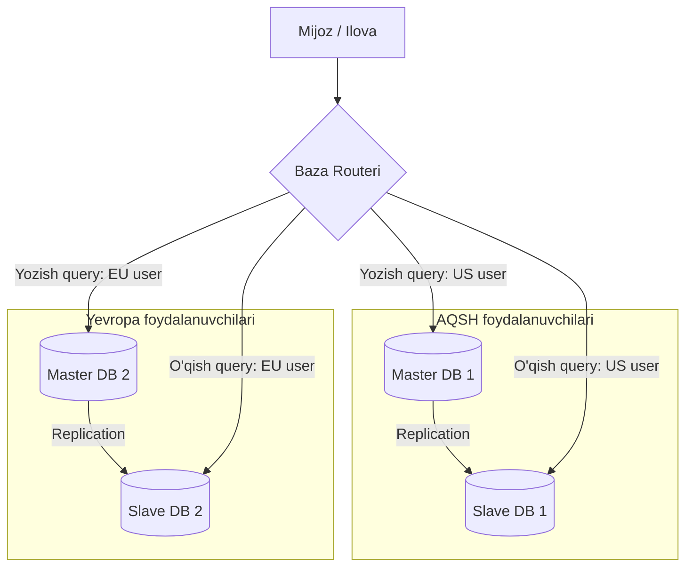

## 1. 💡 Sodda Tushuntirish va Analogiya

Tasavvur qiling, sizda kichik bir kutubxona bor va unga kuniga 10 ta odam keladi. Bitta kutubxonachi (baza) barcha kitoblarni saqlashga va odamlarga tarqatishga osongina ulguradi.

Vaqt o'tib, kutubxonaga kuniga 10,000 ta odam kela boshladi va kitoblar soni milliondan oshdi. Endi bitta kutubxonachi ulgurmayapti. Bizda ikkita yo'l bor:

1. **Vertikal masshtablash (Vertical Scaling / Scale Up):** Kutubxonachiga kuchliroq kompyuter olib berish, tezroq yugurishni o'rgatish yoki tezkorroq ishlaydigan yangi kutubxonachi yollash. Ammo buning ham jismoniy chegarasi bor.
2. **Gorizontal masshtablash (Horizontal Scaling / Scale Out):** Ko'plab kutubxonachilarni yollash va kitoblarni ular o'rtasida bo'lib chiqish.

### Asosiy atamalar analogiyasi:
- **Master-Slave Replication:** Kutubxona mudiri (Master) barcha yangi kitoblarni qabul qiladi va ro'yxatga oladi. Yordamchi kutubxonachilar (Slaves) esa faqat kitoblarni odamlarga o'qish uchun tarqatishadi (Read-only).
- **Partitioning (Bo'limlarga ajratish):** Kutubxonadagi kitoblarni janrlariga qarab turli javonlarga ajratish (masalan, badiiy adabiyot alohida, ilmiy adabiyot alohida).
- **Sharding:** Kitoblar shunchalik ko'pki, ularni bitta binoga sig'dirib bo'lmaydi. Biz kitoblarni alifbo tartibida (A-D, E-H va hokazo) turli binolarga (serverlarga) bo'lib joylashtiramiz.
- **Distributed Transactions (Tarqatilgan Tranzaksiyalar - 2PC/3PC):** Bir vaqtning o'zida ikkita turli binodagi kitoblarni almashtirish uchun barcha mas'ul shaxslar kelishib, bir ovozdan rozilik berishi kerak.

---

## 2. 💻 Real Kod Misollari

Quyida ma'lumotlar bazasini masshtablash tushunchalarini simulyatsiya qiluvchi sodda JavaScript kodlari keltirilgan:

### Misol 1: Read-Write Split (O'qish va yozishni ajratish)
Yozish so'rovlarini Master-ga, o'qish so'rovlarini esa tasodifiy Slave-ga yo'naltirish:

```javascript
class DatabaseRouter {
  constructor(masterNode, slaveNodes) {
    this.master = masterNode;
    this.slaves = slaveNodes;
  }

  // So'rov turi bo'yicha server tanlash
  executeQuery(query) {
    if (query.type === 'WRITE') {
      console.log(`Yozish so'rovi Master serverga yuborilmoqda: ${query.sql}`);
      return this.master.write(query.data);
    } else if (query.type === 'READ') {
      // Slave serverlar orasidan tasodifiy birini tanlash (Load Balancing)
      const randomSlave = this.slaves[Math.floor(Math.random() * this.slaves.length)];
      console.log(`O'qish so'rovi Slave serverga yuborilmoqda: ${query.sql}`);
      return randomSlave.read(query.condition);
    }
  }
}
```

### Misol 2: Hash-based Sharding (Kalit bo'yicha sharding)
Foydalanuvchi ID-siga qarab uni qaysi ma'lumotlar bazasi serveriga yozishni aniqlash:

```javascript
function getShardServer(userId, totalShards) {
  // Foydalanuvchi ID-sini raqamga o'tkazish (agar satr bo'lsa hash hisoblanadi)
  let hash = 0;
  const idStr = String(userId);
  for (let i = 0; i < idStr.length; i++) {
    hash = idStr.charCodeAt(i) + ((hash << 5) - hash);
  }
  
  // Shard indeksini aniqlash (musbat son bo'lishini ta'minlash)
  const shardIndex = Math.abs(hash) % totalShards;
  return `db-shard-${shardIndex}`;
}

console.log(getShardServer("user_9921", 3)); // Masalan: db-shard-1
console.log(getShardServer("user_4410", 3)); // Masalan: db-shard-0
```

---

## 3. ⚙️ Qanday Ishlaydi (Under the Hood)

### 1. Vertikal vs Gorizontal Masshtablash
- **Vertical Scaling (Scale Up):** CPU, RAM yoki SSD hajmini oshirish. Oson, lekin qimmat va fizik chegaralari bor (yagona server ma'lum bir nuqtadan keyin kattalasholmaydi).
- **Horizontal Scaling (Scale Out):** Tizimga ko'proq serverlar qo'shish. Cheksiz kengaytirish imkonini beradi, lekin dastur arxitekturasini murakkablashtiradi.

### 2. Master-Slave Replication
Ma'lumotlar xavfsizligi va o'qish tezligini oshirish uchun bir nechta serverda ma'lumot nusxalarini saqlash:
- **Master (Primary):** Barcha yozish (`INSERT`, `UPDATE`, `DELETE`) operatsiyalarini qabul qiladi. O'zgarishlar logini yuritadi.
- **Slave (Replica):** Master-dagi o'zgarishlarni sinxron yoki asinxron tarzda o'ziga nusxalaydi. Faqat o'qish (`SELECT`) so'rovlariga javob beradi.
- **Replication Lag:** Master-ga yozilgan ma'lumot Slave-ga yetib borguncha ketadigan vaqt oralig'i. Agar asinxron replikatsiya bo'lsa, foydalanuvchi yozgan ma'lumotini darhol o'qiganda eskirgan ma'lumotni ko'rishi mumkin.

### 3. Sharding va Partitioning
- **Database Partitioning:** Bitta server ichida katta jadvalni kichikroq qismlarga bo'lish. Masalan, yil bo'yicha jadvallarni ajratish (`orders_2024`, `orders_2025`).
- **Database Sharding:** Ma'lumotlarni gorizontal ravishda bir-biri bilan bog'lanmagan mustaqil jadvallarga bo'lib, har xil jismoniy serverlarga (shard-larga) joylashtirish.
- **Sharding kaliti (Shard Key):** Ma'lumot qaysi shard-ga borishini aniqlovchi ustun (masalan, `user_id` yoki `country_code`). To'g'ri kalit tanlash juda muhim, aks holda bitta serverga haddan tashqari ko'p yuklama tushadi (**Hotspot** muammosi).

### 4. Distributed Transactions (2PC va 3PC)
Bir nechta serverdagi ma'lumotlarni o'zgartirishda ma'lumotlar yaxlitligini (consistency) saqlash algoritmlari:
- **Two-Phase Commit (2PC):**
  1. **Prepare Phase:** Koordinator barcha ishtirokchi serverlardan "tranzaksiyani bajarishga tayyormisiz?" deb so'raydi. Hamma "tayyorman" desa keyingi bosqichga o'tiladi.
  2. **Commit Phase:** Koordinator barchaga "tasdiqlang (commit)" buyrug'ini yuboradi. Agar birortasi rad etsa, hammasi bekor qilinadi (abort). Kamchiligi: bloklanishga olib keladi (agar koordinator o'chib qolsa, ishtirokchilar kutib qoladi).
- **Three-Phase Commit (3PC):** 2PC-ning bloklanish muammosini hal qilish uchun oraliq `Pre-Commit` bosqichini qo'shadi va taym-autlar yordamida ishlaydi.

---

## 4. ❌ Ko'p Uchraydigan Xatolar (Junior Mistakes)

1. **Replikatsiya kechikishini (Replication Lag) hisobga olmaslik:** Yangi post yozgan foydalanuvchi darhol sahifani yangilaganida postini ko'rmasligi mumkin. Buni oldini olish uchun foydalanuvchining o'z yozgan ma'lumoti ma'lum vaqtgacha (yoki keshdan) Master-dan o'qitilishi kerak.
2. **Noto'g'ri Shard kaliti (Shard Key) tanlash:** Masalan, foydalanuvchining mamlakati bo'yicha shard tanlansa, 90% foydalanuvchi bitta davlatdan bo'lsa, bitta shard serveri yonib ketadi, qolganlari esa bo'sh turadi.
3. **Cross-Shard Join qilishga urinish:** Ikki xil shard serverdagi ma'lumotlarni `JOIN` qilish juda qimmat va sekin operatsiya. Shuning uchun ma'lumotlarni denormalizatsiya qilish yoki to'g'ri loyihalash kerak.
4. **2PC-ni haddan tashqari ko'p ishlatish:** Tarqatilgan tranzaksiyalar juda sekin ishlaydi va tizim samaradorligini keskin pasaytiradi. Ularning o'rniga asinxron ravishda **Saga Pattern** yoki **Eventual Consistency** (oxir-oqibat muvofiqlik) ishlatish tavsiya etiladi.

---

## 5. 💬 12 ta Intervyu Savollari

**1. Vertikal va gorizontal masshtablash farqi nimada?**
Vertikal masshtablash (Scale Up) bitta server resurslarini (RAM, CPU) oshiradi. Gorizontal masshtablash (Scale Out) yangi serverlar qo'shadi.

**2. Sharding nima va u partitioning-dan nimasi bilan farq qiladi?**
Partitioning ma'lumotlarni bitta server ichida bo'laklarga ajratadi. Sharding esa ma'lumotlarni turli xil jismoniy serverlarga (baza nusxalariga) bo'lib yuboradi.

**3. Sharding kaliti (Shard Key) nima va nima uchun u muhim?**
Bu ma'lumot qaysi shard-ga yozilishini aniqlaydigan ustun. Noto'g'ri tanlansa, tizimda tengsizlik (hotspots) yuzaga keladi.

**4. Master-Slave replikatsiyasida yozish va o'qish operatsiyalari qanday taqsimlanadi?**
Yozish operatsiyalari faqat Master serverga bajariladi. O'qish operatsiyalari esa yuklamani kamaytirish uchun Slave serverlarga yo'naltiriladi.

**5. Replication Lag nima va u qanday muammo tug'diradi?**
Master-dagi o'zgarishlar Slave-ga sinxronlanmagan vaqt oralig'i. Bu vaqtda foydalanuvchi yangilangan ma'lumot o'rniga eski ma'lumotni ko'rib qolishi mumkin.

**6. Shared-Nothing Architecture (Hech narsa baham ko'rilmaydigan arxitektura) nima?**
Har bir shard serveri o'z CPU, RAM va diskiga ega bo'lib, boshqa shard-lar bilan umumiy resursga ega bo'lmaydi. Bu mustaqillikni ta'minlaydi.

**7. Consistent Hashing sharding-da nima uchun kerak?**
Tizimga yangi shard serveri qo'shilganda yoki mavjud server o'chganida, barcha ma'lumotlarni qaytadan boshqa serverlarga ko'chirmaslik (minimal ko'chirish) uchun kerak.

**8. 2PC (Two-Phase Commit) qanday ishlaydi va uning asosiy kamchiligi nimada?**
Prepare va Commit fazalaridan iborat. Kamchiligi: Agar koordinator o'chib qolsa, ishtirokchilar bloklanib, resurslarni bo'shatmay turadi.

**9. Eventual Consistency nima?**
Tizimdagi barcha nusxalar darhol emas, balki ma'lum bir vaqt o'tgach bir xil holatga kelishi kafolati.

**10. Hotspot (Issiq nuqta) muammosi nima?**
Ma'lumotlar noto'g'ri taqsimlanishi natijasida bitta shard serveriga haddan tashqari ko'p so'rov tushib, qolgan serverlar bo'sh qolishi.

**11. NoSQL ma'lumotlar bazalari nega oson masshtablanadi?**
Chunki ularda qat'iy munosabatlar (joins) yo'q va relyatsion cheklovlarsiz ma'lumotlarni shard-larga bo'lish ancha sodda.

**12. Saga pattern nima va u qachon ishlatiladi?**
Mikroxizmatlarda distributed tranzaksiyalarni boshqarish uchun ishlatiladi. U har bir servisda mahalliy tranzaksiyani bajaradi va xato bo'lsa, kompensatsiya qiluvchi tranzaksiyani ishga tushiradi.

---

## 6. 🛠️ Amaliy Topshiriqlar

Bilimingizni sinab ko'rish uchun quyidagi topshiriqlarni bajaring.

---

## 7. 📝 12 ta Mini Test

Mavzuni o'zlashtirish darajangizni mini testlar orqali tekshiring.

---

## 8. 🎯 Real Project Case Study

### Uber-ning Ma'lumotlar Bazasi (Schemaless)
Uber sayohatlar va haydovchilar ma'lumotlarini saqlash uchun MySQL-dan foydalangan, biroq tizim kattalashgach, u gorizontal kengaya olmagan. Ular o'zlarining shaxsiy **Schemaless** deb nomlangan sharded bazasini yaratdilar.
- **Yechim:** Sayohatlar ID-si (Trip UUID) bo'yicha ma'lumotlar sharding qilindi.
- **Natija:** Barcha sayohat ma'lumotlari dunyo bo'ylab yuzlab serverlarga teng taqsimlandi. Sayohat boshlanganda barcha ma'lumotlar faqat bitta shard-ga yoziladi, bu esa cross-shard operatsiyalarga ehtiyoj qoldirmadi.

---

## 9. 🧠 Vizual ko'rinish (Architecture Diagram)

Quyida Master-Slave replikatsiyasi va Sharding arxitekturasi ko'rsatilgan:



---

## 10. 📌 Cheat Sheet

| Masshtablash turi | Tavsifi | Afzalligi | Kamchiligi |
| :--- | :--- | :--- | :--- |
| **Vertikal (Scale Up)** | Server apparat qismini kuchaytirish | Tizim kodi o'zgarmaydi | Chegaralangan va juda qimmat |
| **Gorizontal (Scale Out)** | Yangi serverlar qo'shish | Cheksiz masshtablanish | Kod murakkabligi oshadi |

| Tushuncha | Maqsadi | Qo'llanilishi |
| :--- | :--- | :--- |
| **Replication** | Yuqori chidamlilik va o'qishni tezlashtirish | Master-ga yozish, Slave-dan o'qish |
| **Sharding** | Ma'lumotlar hajmini jismoniy serverlarga bo'lish | Shard kaliti yordamida routing |
| **2PC / 3PC** | Tarqatilgan bazalarda tranzaksiyalar yaxlitligi | Prepare va Commit fazalari orqali |
