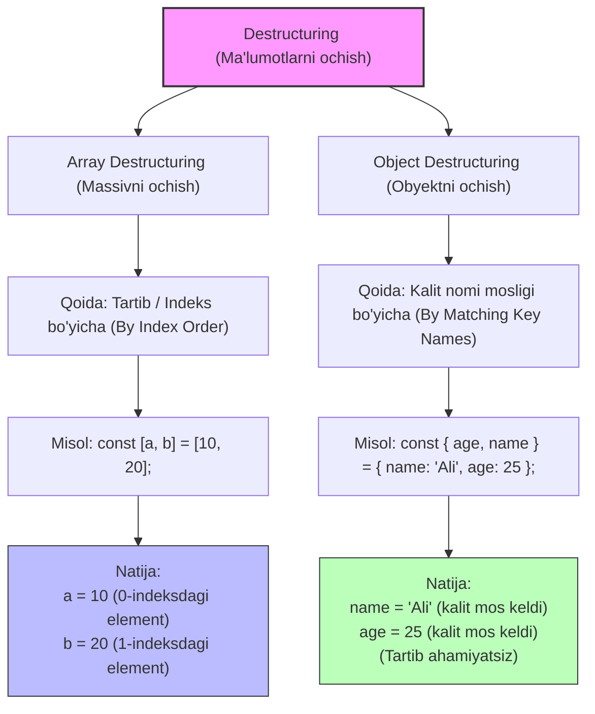

## 1. 💡 Sodda Tushuntirish va Analogiya

### Destructuring (Ma'lumotlarni ochish) nima?
**Destructuring** (Destruptizatsiya yoki Ma'lumotlarni ochish) — bu ES6 (ECMAScript 2015) standartida JavaScript-ga kiritilgan qulay va ixcham sintaksis bo'lib, u massivlar (arrays) ichidagi elementlarni yoki obyektlar (objects) ichidagi xossalarni osongina ajratib olib, alohida o'zgaruvchilarga yuklash imkonini beradi.

### Real hayotiy analogiya
Tasavvur qiling, siz sayohatdan qaytdingiz va uyingizda **chamodoningizni ochyapgansiz (unpacking)**:
* **Eski usul (Destructuring-siz):** Siz chamodonni ochib, kiyimlarni bittalab qidirasiz: *"Mana bu shim, uni shkafga ilaman. Mana bu ko'ylak, uni ham ilaman..."* Har bir kiyimni alohida qo'lga olib, alohida joylashtirasiz.
* **Yangi usul (Destructuring orqali):** Chamadon maxsus bo'limlarga ega. Siz chamodonni ochishingiz bilan, bitta harakatda o'ng bo'limdagi shimni va chap bo'limdagi ko'ylakni birdaniga kerakli o'zgaruvchilarga (shkaflarga) joylab qo'yasiz.

Massivlarni ochish **avtobus navbatiga** o'xshaydi: birinchi tushgan odam birinchi o'rindiqqa o'tiradi, ikkinchisi esa ikkinchisiga (indeks yoki tartib bo'yicha).
Obyektlarni ochish esa **pochta qutilariga** o'xshaydi: har bir qutining ustida ism yozilgan. Siz ismga qarab xatingizni olasiz, kim birinchi kelgani yoki qaysi tartibda turganining ahamiyati yo'q (kalit nomlari mosligi bo'yicha).

---

## 2. 💻 Real Kod Misollari

### 1. Basic Example (Oddiy massiv va obyektlarni ochish)
```javascript
// Massivni destruptizatsiya qilish (Array Destructuring)
const fruits = ['olma', 'anor', 'behi'];
const [first, second] = fruits;

console.log(first);  // 'olma'
console.log(second); // 'anor'

// Obyektni destruptizatsiya qilish (Object Destructuring)
const user = { name: 'Ali', age: 25 };
const { name, age } = user;

console.log(name); // 'Ali'
console.log(age);  // 25
```

### 2. Intermediate Example (Qayta nomlash, default qiymatlar va ichma-ich (nested) obyektlar)
```javascript
const settings = { theme: 'dark', dimensions: { width: 1024, height: 768 } };

// 1. Qayta nomlash (theme -> appTheme)
// 2. Default qiymat (language bo'lmasa 'uz' qiymati olinadi)
// 3. Ichma-ich obyektni ochish (dimensions ichidagi width va height)
const { 
  theme: appTheme, 
  language = 'uz',
  dimensions: { width, height } 
} = settings;

console.log(appTheme); // 'dark'
console.log(language); // 'uz' (chunki settings ichida language yo'q edi)
console.log(width);    // 1024
console.log(height);   // 768
```

### 3. Advanced Example (Funksiya parametrlari va Rest (`...`) operatori)
```javascript
// Obyektni funksiya parametri sifatida qabul qilish va darhol destruptizatsiya qilish
function displayProfile({ name, role = 'user', ...otherInfo }) {
  console.log(`Foydalanuvchi: ${name}, Roli: ${role}`);
  console.log(`Qolgan ma'lumotlar:`, otherInfo);
}

const userObj = {
  name: 'Vali',
  age: 28,
  city: 'Toshkent',
  skills: ['JS', 'React']
};

displayProfile(userObj);
// Konsolga chiqadi:
// Foydalanuvchi: Vali, Roli: user
// Qolgan ma'lumotlar: { age: 28, city: 'Toshkent', skills: ['JS', 'React'] }

// Ikki o'zgaruvchi qiymatini uchinchi o'zgaruvchisiz almashtirish (swapping)
let a = 1, b = 2;
[a, b] = [b, a];
console.log(a, b); // 2, 1
```

---

## 3. ⚠️ Muammo va Nima uchun Muhimligi

### Destructuring qanday muammoni hal qiladi?
ES6 ga qadar obyektlar yoki massivlar bilan ishlashda har bir qiymatni alohida o'zgaruvchiga olinganda kod juda cho'zilib ketardi.

#### Eski usul (Destructuring-siz):
```javascript
const car = { brand: 'Tesla', model: 'Model 3', year: 2023 };
const brand = car.brand;
const model = car.model;
const year = car.year;
```
Agar obyekt juda murakkab va ichma-ich bo'lsa, har bir xossaga `car.details.engine.type` shaklida murojaat qilish zerikarli va takrorlanuvchi kod ko'payishiga olib kelardi.

#### Yangi usul (Destructuring bilan):
```javascript
const { brand, model, year } = car;
```
Bu sintaksis kod satrlarini qisqartiradi, kodning o'qilishini yaxshilaydi va funksiyalarga parametr uzatishda positional argumentlar (tartibga bog'liq parametrlar) muammosini hal qiladi.

---

## 4. ❌ Ko'p Uchraydigan Xatolar (Junior Mistakes)

### 1. `null` yoki `undefined` qiymatlarni ochishga urinish
Agar obyekt yoki massiv o'rniga `null`/`undefined` qiymat kelsa, JS dvigateli xatolik (`TypeError`) tashlaydi.
* **Xato:**
  ```javascript
  const user = null;
  const { name } = user; // TypeError: Cannot destructure property 'name' of 'null'
  ```
* **Tuzatish:** Defensive programming (himoyaviy kodlash) yoki default obyekt ishlatish:
  ```javascript
  const user = null;
  const { name } = user || {}; // Xatolik bermaydi, name = undefined bo'ladi
  ```

### 2. O'zgaruvchini e'lon qilib bo'lingandan keyin obyekt destruptizatsiyasini xato bajarish
Agar o'zgaruvchi oldindan yaratilgan bo'lsa, qavssiz destruptizatsiya xatolik beradi.
* **Xato:**
  ```javascript
  let name;
  { name } = { name: 'Ali' }; // SyntaxError: Unexpected token '='
  ```
* **Tuzatish:** Butun ifodani qavs ichiga olish kerak:
  ```javascript
  let name;
  ({ name } = { name: 'Ali' }); // OK
  ```

### 3. Qayta nomlash (renaming) va standart qiymat (default value) sintaksisini chalkashtirish
* **Xato:**
  ```javascript
  // Default qiymat va yangi nom o'rni almashib ketgan
  const { name = 'Mehmon': userName } = user; // SyntaxError
  ```
* **Tuzatish:** Avval ikki nuqta bilan qayta nomlanadi, keyin tenglik bilan default qiymat beriladi:
  ```javascript
  const { name: userName = 'Mehmon' } = user; // To'g'ri
  ```

---

## 5. 💬 12 ta Intervyu Savollari

### Junior (1–4)
1. **Savol:** Destructuring nima va u qachon kiritilgan?
   * **Javob:** Destructuring — bu massiv elementlari yoki obyekt xossalarini alohida o'zgaruvchilarga ajratib olish imkonini beruvchi sintaksis bo'lib, u ES6 (2015) da taqdim etilgan.
2. **Savol:** Destructuring-da default qiymat qanday beriladi?
   * **Javob:** Tenglik operatori (`=`) yordamida beriladi. Masalan: `const [a = 1] = [];` yoki `const { b = 2 } = {};`.
3. **Savol:** Obyekt xossasini ajratib olayotganda uni qanday qilib yangi nomli o'zgaruvchiga yuklash mumkin?
   * **Javob:** Ikki nuqta (`:`) yordamida. Masalan: `const { originalName: newName } = obj;`.
4. **Savol:** Massiv destruptizatsiyasida ba'zi elementlarni tashlab ketish (skip) qanday amalga oshiriladi?
   * **Javob:** Vergullar yordamida element o'rni bo'sh qoldiriladi. Masalan: `const [first, , third] = [1, 2, 3];` (bu yerda `2` tashlab ketildi).

### Middle (5–8)
5. **Savol:** Uchinchi o'zgaruvchisiz ikkita o'zgaruvchi qiymatini qanday almashtirish mumkin?
   * **Javob:** Massiv destruptizatsiyasidan foydalanib: `[a, b] = [b, a];`.
6. **Savol:** Ichma-ich joylashgan (nested) obyektlarni ochishda qanday xavf bor?
   * **Javob:** Agar tashqi obyekt mavjud bo'lmasa (ya'ni `undefined` bo'lsa), ichki obyektni ochishga urinish `TypeError` xatoligini beradi. Buni oldini olish uchun tashqi darajaga ham default obyekt biriktiriladi: `const { address: { city } = {} } = user;`.
7. **Savol:** Rest (`...`) operatori destruptizatsiyada nima ish qiladi?
   * **Javob:** Ajratib olingan xossalar yoki elementlardan ortib qolgan barcha qiymatlarni yangi obyekt yoki massivga yig'ib beradi.
8. **Savol:** Funksiya parametrlarida destructuring ishlatishning qanday afzalligi bor?
   * **Javob:** Argumentlar tartibi (positional arguments) chalkashib ketishining oldini oladi, kodni ancha qisqartiradi va default qiymatlar berishni osonlashtiradi.

### Senior (9–12)
9. **Savol:** `null` yoki `undefined` qiymatni destruptizatsiya qilganda nima uchun TypeError sodir bo'ladi?
   * **Javob:** Chunki JavaScript-da `null` va `undefined` qiymatlar ustida property lookup (xossani izlash) amalini bajarib bo'lmaydi va ular obyektga o'girila olmaydi.
10. **Savol:** Dinamik kalit nomlari (computed property names) orqali destruptizatsiya qilsa bo'ladimi? Misol keltiring.
    * **Javob:** Ha, to'rtburchak qavslar yordamida dinamik kalit nomlarini ochish mumkin:
      ```javascript
      const key = 'role';
      const { [key]: userRole } = { role: 'admin' };
      console.log(userRole); // 'admin'
      ```
11. **Savol:** `const [first, ...rest] = "Hello";` kodi nima qaytaradi va nega?
    * **Javob:** Natijada `first = "H"` va `rest = ["e", "l", "l", "o"]` bo'ladi. Chunki satrlar (strings) iteratsiya qilinuvchi (iterable) hisoblanadi va massiv destruptizatsiyasi ularning har bir harfini massiv elementi kabi ochadi.
12. **Savol:** Destructuring nusxalashda chuqur (deep copy) yoki yuza (shallow copy) nusxa yaratadimi?
    * **Javob:** Yuza nusxa (shallow copy) yaratadi. Agar destruptizatsiya qilinayotgan obyekt ichida boshqa obyektlar (reference tiplar) bo'lsa, ularning faqat xotiradagi manzillari (references) nusxalanadi va ular o'zaro bog'liq bo'lib qoladi.

---

## 6. 🛠️ Amaliy Topshiriqlar

Quyidagi Mermaid sxemasida obyekt va massiv destruptizatsiyasining ishlash prinsiplari va ular o'rtasidagi asosiy farqlar (tartibga bog'liqlik va kalit mosligi) ko'rsatilgan:



---

## 7. 📝 12 ta Mini Test

Dars oxiridagi testlar va savollar orqali destruptizatsiyaning nozik jihatlari va JavaScript-da ma'lumotlar bilan ishlash bo'yicha bilimlaringizni sinab ko'ring.

---

## 8. 🎯 Real Project Case Study

### API Javoblarini Qayta Ishlash va Default Sozlamalar
Real loyihalarda ko'pincha tashqi API dan murakkab JSON javoblari keladi. Quyidagi misolda biz destruptizatsiya yordamida foydalanuvchi ma'lumotlarini qulay tarzda ajratib olamiz va agar ba'zi muhim sozlamalar kelmasa, ularga xavfsiz boshlang'ich qiymatlarni beramiz:

```javascript
function processApiResponse(response) {
  // Obyekt bo'lmasa xatolik bermasligi uchun default {} ishlatamiz
  const {
    status = 'error',
    data: {
      id,
      profile: { firstName, lastName, avatarUrl = 'default-avatar.png' } = {},
      settings: { theme = 'light', notifications: { email = true } = {} } = {}
    } = {}
  } = response || {};

  if (status !== 'success') {
    throw new Error('API muvaffaqiyatsiz yakunlandi');
  }

  return {
    userId: id,
    fullName: `${firstName} ${lastName}`,
    avatar: avatarUrl,
    theme,
    sendEmail: email
  };
}

const mockResponse = {
  status: 'success',
  data: {
    id: 42,
    profile: { firstName: 'Diyor', lastName: 'Karimov' },
    settings: { theme: 'dark' }
  }
};

const processed = processApiResponse(mockResponse);
console.log(processed);
/*
Natija:
{
  userId: 42,
  fullName: 'Diyor Karimov',
  avatar: 'default-avatar.png', // API-da yo'q edi, default olindi
  theme: 'dark',
  sendEmail: true               // Ichki obyektda yo'q edi, default olindi
}
*/
```

---

## 9. 🚀 Performance va Optimization

* **Kompilyatsiya (Transpilation):** Agar siz loyihada eski brauzerlarni qo'llab-quvvatlash uchun Babel ishlatayotgan bo'lsangiz, ES6 destructuring sintaksisi eski ES5 ko'rinishiga (oddiy variable assignment va property lookup-ga) o'giriladi. Bu kod hajmini biroz oshirishi mumkin, lekin zamonaviy JS dvigatellarida destructuring bevosita optimallashtirilgan.
* **Xotira (Memory Allocation):** Obyektni destruptizatsiya qilayotganda rest (`...rest`) operatoridan foydalanish yangi obyekt yaratilishiga va undagi barcha qolgan xossalarning nusxalanishiga (shallow copy) olib keladi. Agar loyihada juda katta obyektlar bilan yuqori chastotali sikllarda (millionlab marta) rest operatori ishlatilsa, bu xotiraga yuklama berishi mumkin. Bunday holatlarda oddiy xossalarga to'g'ridan-to'g'ri murojaat qilish afzalroq.

---

## 10. 📌 Cheat Sheet

| Vazifa / Sintaksis | Misol | Izoh |
| :--- | :--- | :--- |
| **Oddiy massivni ochish** | `const [x, y] = [1, 2];` | Tartib bo'yicha o'zlashtiriladi (`x = 1`, `y = 2`) |
| **Elementlarni tashlab ketish** | `const [a, , b] = [1, 2, 3];` | Ikkinchi element tashlab ketiladi (`a = 1`, `b = 3`) |
| **Default qiymat berish** | `const [a = 5] = [];` | Agar element bo'lmasa, `5` qiymati beriladi |
| **Oddiy obyektni ochish** | `const { name } = user;` | Kalit nomi bo'yicha moslashtiriladi |
| **Qayta nomlash (Rename)** | `const { age: userAge } = user;` | `age` xossasi `userAge` o'zgaruvchisiga olinadi |
| **Nested (Ichma-ich) ochish** | `const { loc: { lat } } = user;` | Ichki obyektning `lat` xossasini ochadi |
| **Rest operatori (Massiv)** | `const [first, ...rest] = [1, 2, 3];` | `rest` o'zgaruvchisi `[2, 3]` massivini oladi |
| **Rest operatori (Obyekt)** | `const { id, ...details } = product;` | `details` obyektida `id`dan tashqari hamma xossalar qoladi |
