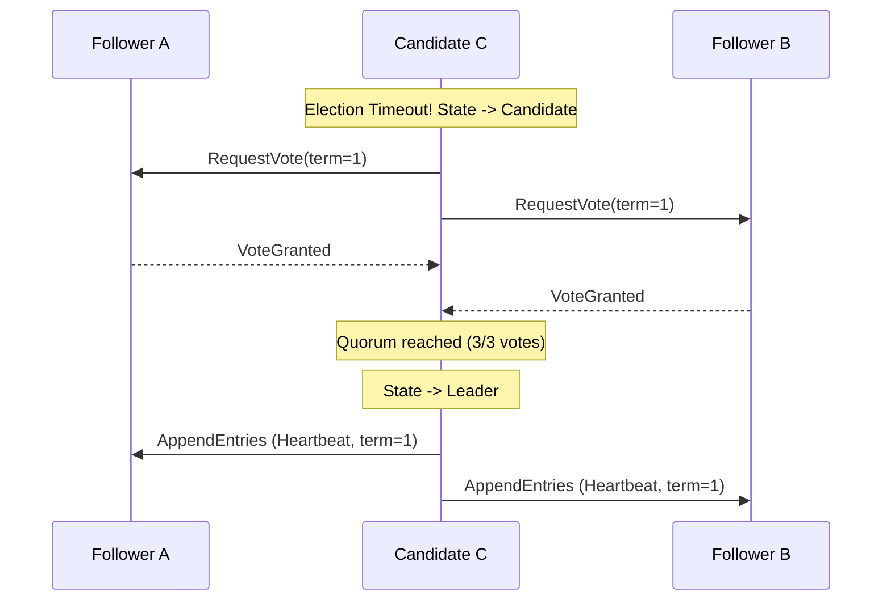

## 1. 💡 Sodda Tushuntirish va Analogiya

Taqsimlangan tizimlarda bir nechta mustaqil kompyuterlar (tugunlar yoki node'lar) umumiy bir qarorga kelishi kerak. Masalan, qaysi ma'lumot oxirgi va to'g'ri ekanligi yoki hozirda klasterda kim "Lider" ekanligini kelishib olish zarur. Bu jarayon **Distributed Consensus (Taqsimlangan Konsensus)** deb ataladi.

### Saylov Komissiyasi analogiyasi:
Tasavvur qiling, 5 ta hakamdan iborat hay'at a'zolari bor. Ular umumiy bayonnomaga yangi qoidalarni kiritishi kerak.
- Agar hakamlar o'rtasidagi telefon liniyasi uzilib qolsa va ular guruhlarga bo'linib ketsa (tarmoq bo'linishi - network partition), qanday qaror qabul qilinadi?
- Qoida oddiy: Qaror qabul qilinishi uchun kamida **Kvorum (ko'pchilik)**, ya'ni kamida 3 ta hakam (5 ning yarmidan ko'pi) rozilik berishi shart.
- Agar 2 ta hakam bir xonada, 3 ta hakam ikkinchi xonada qolib ketsa, faqat 3 ta hakam bo'lgan xonadagilar qaror qabul qila oladi, chunki ular ko'pchilikni tashkil etadi. 2 ta hakam bo'lgan xona esa qaror qabul qilishni to'xtatib turadi. Bu **Split-brain (ikki xil boshqaruv)** muammosini oldini oladi.

---

## 2. 💻 Real Kod Misollari

Quyida Raft konsensus algoritmining soddalashtirilgan Liderlik va Kvorumni aniqlash tizimi keltirilgan:

```javascript
class RaftNode {
  constructor(id, totalNodes) {
    this.id = id;
    this.totalNodes = totalNodes;
    this.term = 0;
    this.state = "Follower"; // Follower, Candidate, Leader
    this.votesReceived = 0;
  }

  // Heartbeat kelganda Follower holatida qoladi yoki yangi termni qabul qiladi
  receiveHeartbeat(leaderId, leaderTerm) {
    if (leaderTerm >= this.term) {
      this.term = leaderTerm;
      this.state = "Follower";
      return true;
    }
    return false;
  }

  // Saylov boshlash
  startElection() {
    this.state = "Candidate";
    this.term += 1;
    this.votesReceived = 1; // o'ziga o'zi ovoz beradi
    console.log(`Node ${this.id} term ${this.term} uchun saylov boshladi!`);
  }

  // Ovoz berish qoidasi
  requestVote(candidateId, candidateTerm) {
    if (candidateTerm > this.term) {
      this.term = candidateTerm;
      this.state = "Follower";
      return true; // Ovoz beradi
    }
    return false; // Rad etadi
  }

  // Ovozlar kvorumga yetganini tekshirish
  checkQuorum() {
    const requiredVotes = Math.floor(this.totalNodes / 2) + 1;
    if (this.votesReceived >= requiredVotes) {
      this.state = "Leader";
      return true;
    }
    return false;
  }
}
```

---

## 3. ⚙️ Qanday Ishlaydi (Under the Hood)

### 1. Paxos vs Raft:
- **Paxos:** Birinchi keng tarqalgan konsensus algoritmi. Matematik jihatdan mukammal bo'lsa-da, uni tushunish va amalda qo'llash o'ta murakkab.
- **Raft:** Paxos bilan bir xil xavfsizlik va samaradorlikni ta'minlaydi, lekin tushunish va loyihalash oson bo'lishi uchun maxsus ishlab chiqilgan. Raft tizimni aniq qismlarga bo'ladi: Lider saylovi, Loglarni replikatsiya qilish va Xavfsizlik.

### 2. Raft Node Holatlari:
- **Follower (Ergashuvchi):** Lider yoki Candidate'lardan kelayotgan so'rovlarga faqat javob beradi. Agar belgilangan vaqt ichida heartbeat kelmasa, Candidate holatiga o'tadi.
- **Candidate (Nomzod):** Yangi saylov boshlaydi, boshqa tugunlardan ovoz so'raydi.
- **Leader (Lider):** Barcha mijoz so'rovlarini qabul qiladi, loglarni replikatsiya qiladi va vaqti-vaqti bilan Heartbeat yuboradi.

### 3. Log Replication (Loglarni nusxalash):
Mijoz Liderga buyruq yuborganda, Lider uni dastlab o'z logiga yozadi, lekin **commit** (yakuniy tasdiqlash) qilmaydi. U ushbu logni barcha Follower'larga AppendEntries RPC orqali yuboradi. Qachonki ko'pchilik (Kvorum) tugunlar logni muvaffaqiyatli saqlaganini tasdiqlasa, Lider logni commit qiladi va Follower'larga ham commit qilishni buyuradi.

---

## 4. ❌ Ko'p Uchraydigan Xatolar (Junior Mistakes)

1. **Juft sonli tugunlar bilan klaster yaratish:** Klasterda 4 ta tugun bo'lsa, kvorum uchun 3 ta ovoz kerak. Agar tarmoq teng 2 ga bo'linsa (2 vs 2), hech bir taraf kvorum yig'a olmaydi va butun tizim ishdan to'xtaydi. Shuning uchun har doim toq sonli (3, 5, 7) tugunlardan foydalanish tavsiya etiladi.
2. **Split-brain sharoitida eski Liderni cheklamaslik:** Eski Lider tarmoq bo'linishi tufayli boshqa tugunlardan ajralib qolganda ham o'zini Lider deb hisoblab mijozlardan ma'lumot qabul qilaverishi mumkin. Raft buni term raqamlari orqali hal qiladi. Yangi tarmoq segmentida saylangan yangi Liderning term raqami baland bo'ladi va eski lider buni bilgan zaxoti Follower holatiga tushadi.

---

## 5. 💬 12 ta Intervyu Savollari

**1. Distributed Consensus nima?**
Taqsimlangan tizimda bir nechta mustaqil mashinalarning yagona holat yoki ma'lumot bo'yicha kelishuvga erishish jarayoni.

**2. Quorum (Kvorum) qanday hisoblanadi?**
Tizimdagi umumiy tugunlar sonining yarmidan ko'pini tashkil etuvchi minimal miqdor: $Q = \lfloor N/2 \rfloor + 1$.

**3. Split-brain ssenariysi nima?**
Tarmoq bo'linishi sababli klaster ikki guruhga ajralib, har bir guruh o'z liderini saylab, bir-biridan mustaqil ravishda ish yuritishi.

**4. Raft-da nomzod (Candidate) qanday qilib Lider bo'ladi?**
Tugunlarning ko'pchiligidan (Kvorumdan) tasdiqlovchi ovoz olganida.

**5. Paxos algoritmining Raft'dan farqi nimada?**
Paxos ancha murakkab tuzilishga ega va holatlarga bo'linmagan. Raft esa tushunarli va boshqarish oson bo'lishi uchun Leader saylovi va Log replikatsiyasini alohida bosqichlarga ajratgan.

**6. Heartbeat nima va u nima uchun kerak?**
Lider tomonidan o'zining tirik ekanligini bildirish va boshqa tugunlarni saylov boshlashdan to'xtatish uchun yuboriladigan bo'sh AppendEntries so'rovi.

**7. Raft-da loglar qachon commit qilingan hisoblanadi?**
Lider log nusxasini klasterdagi ko'pchilik (kvorum) tugunlarga muvaffaqiyatli replikatsiya qilgandan keyin.

**8. Nima uchun klasterda 3 yoki 5 ta tugun bo'lishi afzal, 4 ta esmas?**
Chunki 3 ta tugunda ham, 4 ta tugunda ham kvorum 3 ga teng. 4 ta tugunli tizim ortiqcha resurs talab qilsa-da, bardoshlilikni (fault tolerance) oshirmaydi.

**9. Zookeeper, etcd va Consul o'rtasidagi umumiylik nima?**
Ularning barchasi taqsimlangan konsensus algoritmlaridan (Raft yoki Zab) foydalanib, konfiguratsiya va service discovery uchun barqaror key-value ma'lumotlar omborini taqminlaydi.

**10. Saylov taymauti (Election Timeout) nima?**
Follower liderdan heartbeat kutadigan vaqt oralig'i. Agar shu vaqtda heartbeat kelmasa, u o'zini Candidate deb e'lon qiladi.

**11. Raft-da "term" (davr) nima vazifani bajaravi?**
Term - bu mantiqiy soat vazifasini bajaruvchi monoton o'sib boruvchi son bo'lib, eski va yangi ma'lumotlarni, shuningdek, eskirgan liderlarni aniqlashga yordam beradi.

**12. Agar Follower'ning logi Lidernikidan farq qilsa nima bo'ladi?**
Lider o'z logini to'g'ri deb hisoblaydi va Follower logidagi nomuvofiqliklarni o'z logi bilan majburiy ravishda qayta yozib to'g'rilaydi.

---

## 6. 🛠️ Amaliy Topshiriqlar

Amaliy topshiriqlarni quyida exercises bo'limida bajaring.

---

## 7. 📝 12 ta Mini Test

Testlar orqali bilimingizni tekshiring.

---

## 8. 🎯 Real Project Case Study

### etcd va Kubernetes Arxitekturasi
Kubernetes o'zining barcha holatlari, konfiguratsiyalari va metadata ma'lumotlarini saqlash uchun **etcd** key-value omboridan foydalanadi. etcd esa klaster barqarorligini ta'minlash uchun **Raft** konsensus algoritmidan foydalanadi. Agar etcd kvorumni yo'qotsa (masalan, 3 tadan 2 ta node o'chsa), Kubernetes yangi resurslar yaratish yoki holatni o'zgartirish so'rovlarini qabul qila olmay qoladi. Bu real loyihalarda konsensusning qanchalik muhimligini ko'rsatadi.

---

## 9. 🧠 Vizual ko'rinish (Architecture Diagram)



---

## 10. 📌 Cheat Sheet

| Atama | Ta'rif | Koddagi ifodasi |
| :--- | :--- | :--- |
| **Quorum** | Qaror qabul qilish uchun kerakli minimal ovoz | `Math.floor(n / 2) + 1` |
| **Heartbeat** | Liderning faolligini bildiruvchi davriy signal | `setInterval(sendHeartbeat, interval)` |
| **Split-Brain** | Tarmoq bo'linishi sababli ikkita lider paydo bo'lishi | `partitionA.hasLeader && partitionB.hasLeader` |
| **Term** | Raft-da saylov va liderlik davrini bildiruvchi son | `node.term++` |
