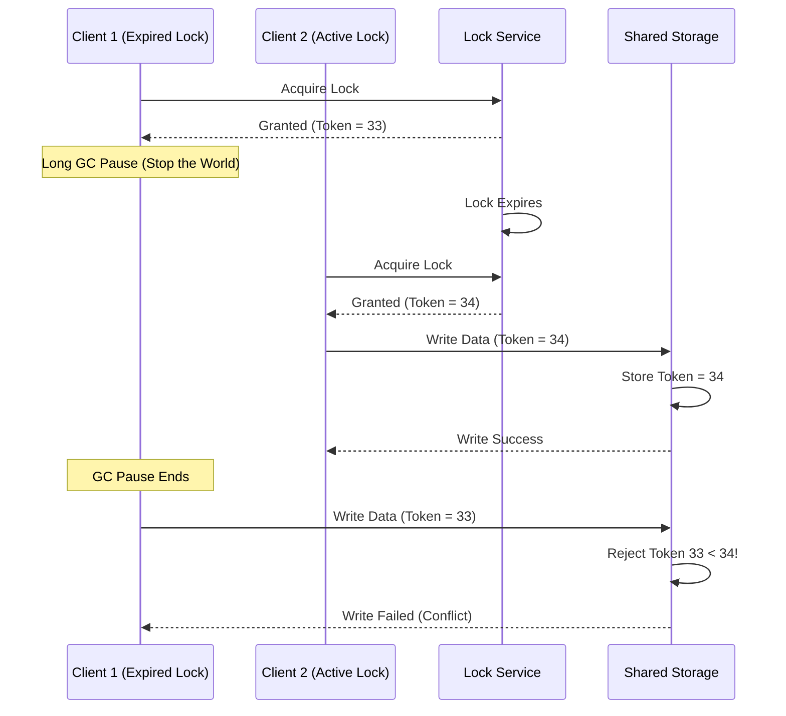

## 1. 💡 Sodda Tushuntirish va Analogiya

### Taqsimlangan Bloklash (Distributed Locking) nima?
**Taqsimlangan bloklash (Distributed Locking)** — bu bir nechta alohida serverlar, konteynerlar yoki mikroservislar ishlayotgan muhitda bitta umumiy va bo'linmas resursga (masalan, fayl, ma'lumotlar bazasi satri yoki tashqi to'lov API-si) bir vaqtda faqat bitta jarayon murojaat qilayotganini kafolatlash mexanizmidir. Bu sinxronizatsiya tushunchasining tarmoq/tizim darajasidagi variantidir.

### Real hayotiy analogiya
Tasavvur qiling, siz **ofisdagi umumiy yig'ilishlar xonasidan (meeting room)** foydalanmoqchisiz:
* **Bloklamasdan ishlash (Pessimistik ssenariy):** Bir vaqtning o'zida uchta xodim turli eshiklardan xonaga bostirib kiradi. Xonadagi doskaga har kim o'z yozuvini yozib yuboradi. Natijada betartiblik (Race Condition) yuzaga keladi.
* **Bloklash (Locking) tizimi:** Xona eshigiga **elektron qulf** o'rnatilgan. Xonaga kirmoqchi bo'lgan xodim kalit-kartani (token) bosib eshikni yopib oladi (Lock acquire). U ishini tugatmaguncha boshqalar kira olmaydi. Ishi tugagach, eshikni ochib qo'yadi (Lock release).
* **Taqsimlangan (Distributed) holat:** Agar ofis bitta emas, balki dunyoning turli shaharlarida joylashgan va barchasi bir vaqtda bitta virtual xonani bron qilmoqchi bo'lsa, bizga barcha shaharlar uchun yagona, markaziy bron qilish tizimi (Distributed Lock Manager) kerak bo'ladi.

---

## 2. 💻 Real Kod Misollari

### 1. Redis-da yagona tugunli sodda blokirovka (Single Instance SETNX)
Eng oddiy blokirovka olish va xavfsiz bo'shatish (Lua skript orqali):
```javascript
import { createClient } from 'redis';
const redis = createClient();
await redis.connect();

async function acquireLock(lockKey, token, ttlMs) {
  // NX - faqat kalit bo'lmasa o'rnatish, PX - muddati millisekundda
  const acquired = await redis.set(lockKey, token, {
    NX: true,
    PX: ttlMs
  });
  return acquired === 'OK';
}

async function releaseLock(lockKey, token) {
  // Lua skript yordamida faqat o'zimizga tegishli tokenni atomar tekshirib o'chiramiz
  const luaScript = `
    if redis.call("get", KEYS[1]) == ARGV[1] then
      return redis.call("del", KEYS[1])
    else
      return 0
    end
  `;
  const result = await redis.eval(luaScript, {
    keys: [lockKey],
    arguments: [token]
  });
  return result === 1;
}
```

### 2. Fencing Token yordamida ma'lumotlar bazasiga xavfsiz yozish
Taqsimlangan blokirovka muddati o'tib ketgan taqdirda ham bazani himoyalash:
```javascript
// Ma'lumotlar bazasida jadval tuzilishi simulyatsiyasi:
// { id: 1, value: "data", last_fencing_token: 42 }

async function writeToDatabase(dbClient, resourceId, fencingToken, value) {
  // Tranzaksiya ichida tekshiramiz: faqat kelgan token kattaroq bo'lsa yangilaymiz
  const result = await dbClient.query(
    `UPDATE resources 
     SET value = $1, last_fencing_token = $2 
     WHERE id = $3 AND last_fencing_token < $2`,
    [value, fencingToken, resourceId]
  );
  
  if (result.rowCount === 0) {
    throw new Error("Split-Brain yoki muddati o'tgan blokirovka aniqlandi! Yozish rad etildi.");
  }
  return true;
}
```

---

## 3. ⚙️ Qanday Ishlaydi (Under the Hood)

### Taqsimlangan bloklash turlari

1. **Ma'lumotlar bazasiga asoslangan (Database-backed Locks):**
   * **Qanday ishlaydi:** Bazada maxsus jadval yaratiladi (`lock_name UNIQUE`). Blokirovka olish uchun `INSERT` qilinadi, bo'shatish uchun `DELETE`. Yoki PostgreSQL-da `SELECT ... FOR UPDATE` ishlatiladi.
   * **Kamchiligi:** Sekin, TTL mexanizmini qo'lda boshqarish qiyin (agar klient o'chib qolsa, lock abadiy qolib ketishi mumkin).

2. **Redis-ga asoslangan (SETNX va Redlock):**
   * **SETNX (Single instance):** Bitta Redis tugunida ishlaydi. O'ta tezkor, ammo Redis tuguni ishdan chiqsa, blokirovka tizimi ishlamay qoladi.
   * **Redlock (Salvatore Sanfilippo):** 5 ta mustaqil Redis tugunida parallel ravishda blokirovka olishga harakat qilinadi. Ko'pchilik (kamida 3 ta) tugunda muvaffaqiyatli bo'lsa va bunga ketgan vaqt TTL-dan kichik bo'lsa, blokirovka olingan hisoblanadi.

3. **Konsensus tizimlariga asoslangan (ZooKeeper va etcd):**
   * **ZooKeeper:** Klient va server o'rtasida faol sessiya ochiladi va **Ephemeral Nodes** (vaqtinchalik tugunlar) yaratiladi. Agar klient o'chib qolsa (heartbeat yo'qolsa), tugun avtomatik o'chadi.
   * **etcd:** **Leases (ijara)** mexanizmi orqali ishlaydi. Klient ma'lum vaqt uchun ijara oladi va uni doimiy uzaytirib turadi (keep-alive).

### Fencing Tokens (To'siq belgilari) mexanizmi
Martin Kleppmann tomonidan taklif qilingan bu mexanizm, blokirovka boshqaruvchisidan har safar lock olinganda monoton o'suvchi raqam (fencing token) olishni talab qiladi.



---

## 4. 🧪 Bosqichma-bosqich Amaliy Mashq

### Keling, bazada inventarni xavfsiz kamaytirish (Inventory Reduction) tizimini quramiz

Faraz qilaylik, bizda maxsulotlar ombori bor. Bir vaqtda kelgan 2 ta so'rov maxsulot sonini kamaytirmoqchi. Biz buni optimistik blokirovka va fencing token yordamida amalga oshiramiz.

```javascript
// 1. Simulyatsiya qilingan baza
const database = {
  inventory: {
    product_101: { stock: 10, version: 1 }
  }
};

// 2. Maxsulot sonini xavfsiz kamaytirish funksiyasi
function updateStockOptimistic(productId, quantityToReduce, expectedVersion) {
  const product = database.inventory[productId];
  
  if (!product) {
    return { success: false, reason: "Mahsulot topilmadi" };
  }
  
  // Versiyani tekshiramiz (Optimistic locking)
  if (product.version !== expectedVersion) {
    return { success: false, reason: "Ziddiyat aniqlandi! Versiya mos kelmadi." };
  }
  
  if (product.stock < quantityToReduce) {
    return { success: false, reason: "Omborda yetarli mahsulot yo'q" };
  }
  
  // Yangilash
  product.stock -= quantityToReduce;
  product.version += 1; // Versiya oshiriladi
  
  return { success: true, newStock: product.stock, newVersion: product.version };
}

// 3. Ishlatib ko'rish
const client1_version = database.inventory.product_101.version; // 1

// Client 1 jarayoni boshlandi, lekin biroz sekinlashdi
setTimeout(() => {
  const res1 = updateStockOptimistic("product_101", 3, client1_version);
  console.log("Client 1 natijasi:", res1);
}, 100);

// Client 2 zudlik bilan ishni yakunladi
const client2_version = database.inventory.product_101.version; // 1
const res2 = updateStockOptimistic("product_101", 5, client2_version);
console.log("Client 2 natijasi:", res2); // Success: true
```

---

## 5. ⚠️ Ko'p Uchraydigan Xatolar va Ularni Tuzatish

### 1. Blokirovkaga TTL (Time-To-Live) bermaslik
* **Xavf:** Agar blokirovka olgan server ishini tugatmasdan turib to'satdan o'chib qolsa (crash), blokirovka abadiy qolib ketadi va boshqa hech kim u resursga kira olmaydi.
* **Tuzatish:** Har doim oqilona muddat bilan TTL belgilang.

### 2. Oddiy `DEL` yordamida lockni o'chirish (Token tekshirmasdan)
* **Xavf:** Client-A lock oldi. Client-A ning ishi cho'zilib ketdi, lock o'chib ketdi (TTL tugadi). Client-B lock oldi. Client-A nihoyat ishini tugatib, shunchaki `DEL lock_key` qildi. Natijada Client-B ning locki o'chib ketadi!
* **Tuzatish:** Har doim tasodifiy token yarating va lockni faqat shu token mos kelsagina (Lua skript orqali atomar tarzda) o'chiring.

### 3. Redlock-da soat og'ishini hisobga olmaslik
* **Xavf:** Redlock serverlarning tizim soatlariga tayanadi. Agar serverlardan birining soati to'satdan NTP sinxronizatsiyasi tufayli oldinga sakrab ketsa, u yerdagi lock muddati tezroq tugab qolishi mumkin.
* **Tuzatish:** Soat og'ish koeffitsiyentini (clock drift bound) hisobga olib, lock yashash muddatidan chegirib tashlang.

---

## 6. 📝 Qisqacha Xulosa (Cheat Sheet)

| Tizim turi | Asosiy mexanizm | Kuchli tomoni | Zaif tomoni |
| :--- | :--- | :--- | :--- |
| **SQL Database** | `SELECT ... FOR UPDATE` | Tranzaksion xavfsizlik | Sekin ishlaydi, shkalalanishi qiyin |
| **Redis (SETNX)** | In-memory key-value | Juda yuqori tezlik, past kechikish | Tugun o'chsa lock yo'qoladi |
| **Redis (Redlock)** | Multi-node consensus | Yuqori chidamlilik (High availability) | Soat og'ishi va GC pause ta'sir qiladi |
| **ZooKeeper / etcd** | Session & Ephemerals / Leases | Kuchli konsensus, CP model (CAP theorem) | Tizim murakkabligi, yuqori resurs talabi |

---

## 7. ❓ Savollar va Javoblar

### 1. Martin Kleppmann va Salvatore o'rtasidagi bahsning mohiyati nima?
Bahs distributed lock-larning ishonchliligi haqida edi. Kleppmann asinxron tarmoqlar, clock drift va Garbage Collection (GC) pauzalari sababli Redlock algoritmi mutlaqo ishonchli emasligini va so'nggi bosqichda baribir **Fencing Token** kerakligini isbotlagan. Salvatore esa ko'p holatlarda Redlock yetarli darajada xavfsiz ekanini himoya qilgan.

### 2. Lock TTL vaqti qanday tanlanadi?
TTL qiymati kutilayotgan vazifa bajarilish vaqtidan ancha katta bo'lishi kerak. Masalan, agar vazifa 2 soniya olsa, TTL 10 soniya etib belgilanadi. Agar vazifa muddati noaniq bo'lsa, **lock renewal loop (watchdog)** ishlatiladi.

---

## 8. 🧠 O'z-o'zini Tekshirish

1. Agar klient blokirovka olgandan so'ng 15 soniya GC pauzaga (Stop-the-world) tushib qolsa, lock muddati 10 soniya bo'lsa nima sodir bo'ladi?
2. Fencing Token nima uchun monoton o'suvchi bo'lishi shart? Nega shunchaki tasodifiy UUID yetarli emas?
3. Redlock algoritmida blokirovka o'rnatish uchun ketgan vaqt lock TTL vaqtidan ayrilishi nima uchun muhim?

---

## 9. 🚀 Amaliy Topsiriq

Quyidagi mashqlar yordamida taqsimlangan bloklash (Distributed Locking) bo'yicha ko'nikmalaringizni sinab ko'ring.

---

## 10. 📌 Cheat Sheet

### Asosiy qoidalar:
1. **Faqat o'zingiznikini o'chiring:** Lock release qilganda token tekshiring.
2. **Fencing Token ishlating:** Saqlash tizimida oxirgi yozilgan tokendan kichik tokenlar rad etilishi kerak.
3. **Soat og'ishi xavfi:** Redis Redlock-ga to'liq ishonmang, kuchli konsensus kerak bo'lsa etcd yoki ZooKeeper tanlang.
4. **watchdog (auto-renewal):** Uzoq vazifalarda lockni vaqti-vaqti bilan uzaytirib turing.
