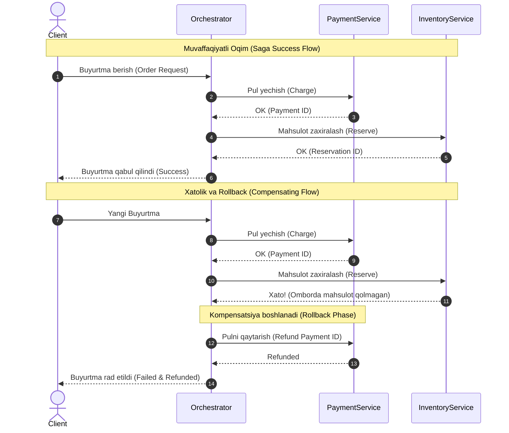

## 1. 💡 Sodda Tushuntirish va Analogiya

### Taqsimlangan Tranzaksiya nima?
Monolit dasturda ma'lumotlar bitta ma'lumotlar bazasida saqlanadi. Agar foydalanuvchi buyurtma bersa, uning hisobidan pul yechish va ombordan mahsulotni kamaytirish bitta tranzaksiya (ACID) ichida osongina bajariladi: yoki ikkalasi ham muvaffaqiyatli bo'ladi, yoki ikkalasi ham bekor qilinadi.

Mikroservislar arxitekturasida esa vaziyat boshqacha. Pul yechish servisi (Payment Service) boshqa bazada, ombor servisi (Inventory Service) esa butunlay boshqa bazada va boshqa serverda joylashgan. Ularning har biri o'zining mahalliy tranzaksiyasiga ega. Agar pul yechilsa-yu, lekin ombordan mahsulotni kamaytirishda xatolik yuz bersa, tizim muvozanatdan chiqib ketadi (pul ketdi, mahsulot yo'q). 

**Taqsimlangan tranzaksiya** — bu bir nechta mustaqil tarmoq tugunlari va bazalarida bajariladigan operatsiyalarning yaxlitligini ta'minlash usulidir.

### Real hayotiy analogiya
Tasavvur qiling, siz **to'y tashkil qilyapsiz**:
1. **Restoran buyurtma qilish** kerak.
2. **San'atkorlarni chaqirish** kerak.

* **Sinxron (2PC) usul:** Siz restoran menejeri va san'atkor bilan bir vaqtda qo'ng'iroq qilib, uch tomonlama aloqaga chiqasiz. "Ikkalangiz ham 15-iyun kuni bo'shmisiz?" deb so'raysiz. Ikkalasi ham "Ha, tayyorman" deb javob bergandan keyingina (Prepare phase), siz "Kelishdik, shartnomani imzolaymiz" deysiz (Commit phase). Agar bittasi band bo'lsa, hammasi bekor bo'ladi.
* **Asinxron (Saga) usul:** Siz avval restoranga borib behuda bo'lmasligi uchun pul to'laysiz (1-qadam). Keyin san'atkorga qo'ng'iroq qilasiz (2-qadam). Agar san'atkor band bo'lib chiqsa, siz restoranga qaytib borib shartnomani bekor qilasiz va pulingizni qaytarib olasiz (Kompensatsiya tranzaksiyasi).

---

## 2. 💻 Real Kod Misollari

Quyida taqsimlangan tranzaksiyalarning asosiy prinsiplarini ko'rsatuvchi sodda JavaScript misollari keltirilgan.

### 1. Saga Orchestrator Simulyatsiyasi (Kompensatsiya bilan)
Orkestrator har bir qadamni ketma-ket bajaradi. Agar biron-bir qadam xato bilan tugasa, u avvalgi qadamlarni bekor qilish uchun kompensatsiya funksiyalarini chaqiradi:

```javascript
class OrderSagaOrchestrator {
  constructor(paymentService, inventoryService) {
    this.payment = paymentService;
    this.inventory = inventoryService;
  }

  async executeOrder(orderId, userId, amount, items) {
    const steps = [];

    try {
      // 1-Qadam: To'lovni amalga oshirish
      console.log("1. To'lov qilinmoqda...");
      const paymentId = await this.payment.charge(userId, amount);
      steps.push({
        name: 'PAYMENT',
        rollback: () => this.payment.refund(paymentId, amount)
      });

      // 2-Qadam: Ombordan zaxira qilish
      console.log("2. Ombordan mahsulot zaxiralanmoqda...");
      const reservationId = await this.inventory.reserve(items);
      steps.push({
        name: 'INVENTORY',
        rollback: () => this.inventory.release(reservationId)
      });

      console.log("Saga muvaffaqiyatli yakunlandi!");
      return { success: true, paymentId, reservationId };

    } catch (error) {
      console.error("Saga-da xatolik yuz berdi:", error.message);
      await this.rollback(steps);
      return { success: false, error: error.message };
    }
  }

  async rollback(steps) {
    console.log("Kompensatsiya tranzaksiyalari (Rollback) boshlanmoqda...");
    // Qadamlarni teskari tartibda bekor qilamiz
    for (let i = steps.length - 1; i >= 0; i--) {
      try {
        await steps[i].rollback();
        console.log(`${steps[i].name} bekor qilindi.`);
      } catch (rollbackError) {
        // Haqiqiy tizimda bu yerda xabar navbatiga qayta urinish uchun yuboriladi yoki ogohlantirish beriladi
        console.error(`Kritik xato: ${steps[i].name} rollback qilib bo'lmadi!`, rollbackError.message);
      }
    }
  }
}
```

### 2. Idempotentlik Middleware-i (Idempotency Key)
Tarmoqdagi kechikishlar tufayli mijoz so'rovni qayta yuborganda, serverda bitta operatsiya ikki marta bajarilib ketmasligi uchun idempotency kalitidan foydalaniladi:

```javascript
const processedRequests = new Set();

function processPaymentIdempotent(idempotencyKey, amount, accountId) {
  if (processedRequests.has(idempotencyKey)) {
    console.log(`So'rov allaqachon bajarilgan (${idempotencyKey}). Keshdan javob qaytariladi.`);
    return { status: "ALREADY_PROCESSED", idempotencyKey };
  }

  // To'lovni amalga oshirish
  console.log(`Hisobdan ${amount} yechildi. Account: ${accountId}`);
  processedRequests.add(idempotencyKey);

  return { status: "SUCCESS", idempotencyKey };
}
```

---

## 3. ⚙️ Qanday Ishlaydi (Under the Hood)

### 1. ACID vs BASE
An'anaviy monolit bazalar **ACID** modeliga amal qiladi. Taqsimlangan tizimlar esa ko'pincha **BASE** modelini tanlashadi:
* **ACID (Atomicity, Consistency, Isolation, Durability):** Ma'lumotlarning har lahzada 100% to'g'ri va mos (consistent) bo'lishini kafolatlaydi.
* **BASE (Basically Available, Soft state, Eventual consistency):**
  * **Basically Available:** Tizim doimo ishchi holatda bo'ladi, ba'zi qismlar uzilgan bo'lsa ham javob beradi.
  * **Soft state:** Ma'lumotlar vaqtinchalik mos bo'lmagan holatda turishi mumkin (masalan, to'lov bo'ldi, lekin omborda hali yangilanmadi).
  * **Eventual consistency:** Bir oz vaqt o'tgach, barcha tizimlar bir-biriga mos holatga keladi (Oxir-oqibat moslik).

### 2. Two-Phase Commit (2PC) va Three-Phase Commit (3PC)
* **2PC (Ikki fazali tasdiqlash):**
  * **Prepare:** Koordinator barcha tugunlarga "Yozishga tayyormisiz?" deb so'raydi. Tugunlar resurslarni qulflab (lock) "Tayyorman" yoki "Yo'q" deb javob beradi.
  * **Commit/Abort:** Agar hamma "Tayyorman" desa, koordinator "Commit" yuboradi. Agar bitta tugun rad etsa, hammasiga "Abort" yuboradi.
  * **Kamchiligi:** Bloklanish muammosi. Agar Prepare-dan keyin koordinator o'chib qolsa, barcha tugunlar resurslarni qulflangan holatda abadiy kutib qoladi.
* **3PC (Uch fazali tasdiqlash):** Bloklanishni kamaytirish uchun oraliq `Pre-Commit` bosqichini va taym-autlarni qo'shadi, lekin tarmoq bo'linishi (network partition) bo'lganda baribir xatoliklarga olib kelishi mumkin.

### 3. Saga Pattern
Saga - bu bir nechta mahalliy tranzaksiyalar zanjiridir. Agar bitta qadam muvaffaqiyatsiz bo'lsa, oldingi qadamlarning ta'sirini yo'qotish uchun kompensatsiya tranzaksiyalari chaqiriladi.
* **Choreography (Xoreografiya):** Markaziy boshqaruvchi yo'q. Har bir servis o'z ishini tugatib, xabar navbatiga (masalan, RabbitMQ, Kafka) voqea chiqaradi. Keyingi servis bu voqeani eshitib ishni davom ettiradi. Sodda, lekin kuzatish (monitoring) juda qiyin.
* **Orchestration (Orkestratsiya):** Markaziy boshqaruvchi (Orchestrator) mavjud. U qaysi servis qachon chaqirilishini va xato bo'lsa qanday bekor qilinishini boshqaradi. Tizim murakkab, lekin tranzaksiya holatini kuzatish oson.

### 4. Transactional Outbox Pattern
Mikroservis o'z bazasiga ma'lumot yozganda va ayni vaqtda xabar navbatiga event yuborganda muammo bo'lishi mumkin: baza tranzaksiyasi muvaffaqiyatli bo'ladi, lekin tarmoq xatosi tufayli event yuborilmay qoladi.
**Outbox Pattern** yordamida:
1. Biznes ma'lumot va yuborilishi kerak bo'lgan event bitta mahalliy tranzaksiyada xuddi shu bazaning maxsus `outbox` jadvaliga yoziladi.
2. Alohida orqa fondagi jarayon (Message Relayer) ushbu `outbox` jadvalini o'qiydi va xabarlarni brokerga yuboradi. Yuborilgach, jadvaldan o'chiradi yoki statusini o'zgartiradi. Bu **kamida bir marta yetkazib berish (at-least-once delivery)** kafolatini beradi.

---

## 4. 🧪 Bosqichma-bosqich Amaliy Mashq

Keling, tranzaksion Outbox patterns ishlashini simulyatsiya qiluvchi tizim yozamiz.

```javascript
// Simulyatsiya qilingan Ma'lumotlar Bazasi
const db = {
  users: {},
  outbox: [], // Xabarlar jadvali
  
  // Mahalliy tranzaksiya simulyatsiyasi
  runTransaction(callback) {
    try {
      callback();
      console.log("Mahalliy tranzaksiya tasdiqlandi (Commit)!");
    } catch (e) {
      console.error("Mahalliy tranzaksiya bekor qilindi (Rollback)!", e.message);
      this.outbox = []; // oddiy rollback simulyatsiyasi
    }
  }
};

// 1. Foydalanuvchini ro'yxatdan o'tkazish va voqeani outbox-ga yozish
function registerUser(userId, email) {
  db.runTransaction(() => {
    // A'zolar jadvaliga yozish
    db.users[userId] = { email, active: true };
    
    // Outbox jadvaliga event yozish
    db.outbox.push({
      id: Math.random().toString(36).substr(2, 9),
      aggregateType: "USER",
      eventType: "USER_REGISTERED",
      payload: JSON.stringify({ userId, email }),
      processed: false
    });
  });
}

// 2. Outbox Processor (Message Relayer)
function processOutbox(messageBroker) {
  const pending = db.outbox.filter(msg => !msg.processed);
  
  pending.forEach(msg => {
    try {
      messageBroker.publish(msg.eventType, JSON.parse(msg.payload));
      msg.processed = true; // Yuborilgan deb belgilash
      console.log(`Event ${msg.eventType} brokerga yuborildi.`);
    } catch (err) {
      console.error(`Brokerga xabar yuborishda xato:`, err.message);
    }
  });
}

// Ishga tushirish testi
const mockBroker = {
  publish: (event, payload) => console.log(`[BROKER] Qabul qilindi: ${event}`, payload)
};

registerUser("u-001", "dev@example.com");
processOutbox(mockBroker);
```

---

## 5. ⚠️ Ko'p Uchraydigan Xatolar va Ularni Tuzatish

### 1. Kompensatsiya tranzaksiyasining muvaffaqiyatsiz bo'lishi (Rollback failure)
Saga rollback jarayonida bitta servis o'chib qolsa, nima qilish kerak?
* **Junior yondashuv:** Faqatgina `try/catch` yozib, xatolikni konsolga chiqaradi va rollback-ni to'xtatadi. Natijada tizim yarim-bekor qilingan holatda qoladi.
* **Senior yondashuv:** Rollback funksiyalarini idempotent qilib yozadi va xato bo'lsa, ularni qayta ishlovchi navbatga (dead-letter queue) solib qo'yadi yoki avtomatik qayta urinish (retry policy) mexanizmini qo'shadi.

### 2. Idempotentlikning yo'qligi
Agar tarmoq uzilishi sababli foydalanuvchiga javob bormay qolsa, foydalanuvchi tugmani yana bosadi. Agar to'lov so'rovi idempotent bo'lmasa, foydalanuvchidan ikki marta pul yechiladi.
* **Xato kod:**
  ```javascript
  app.post('/pay', (req, res) => {
    chargeUser(req.body.userId, req.body.amount); // Har safar chaqirilganda pul yechaveradi
    res.send({ success: true });
  });
  ```
* **Tuzatilgan kod:**
  ```javascript
  app.post('/pay', async (req, res) => {
    const { idempotencyKey, userId, amount } = req.body;
    const existing = await db.payments.findOne({ idempotencyKey });
    if (existing) {
      return res.send(existing.response);
    }
    const result = await chargeUser(userId, amount);
    await db.payments.create({ idempotencyKey, response: result });
    res.send(result);
  });
  ```

---

## 6. 📝 Qisqacha Xulosa (Cheat Sheet)

| Yondashuv | Afzalligi | Kamchiligi | Qachon ishlatiladi |
| :--- | :--- | :--- | :--- |
| **Two-Phase Commit (2PC)** | Kuchli moslik (Strong Consistency), oson dasturlash | Bloklanish, sekin ishlash, tarmoq xatolariga sezgirlik | Yuqori moslik talab etadigan moliya operatsiyalarida |
| **Saga Orchestration** | Markaziy nazorat, jarayonlarni kuzatish oson, BASE modeliga mos | Orkestrator yagona nosozlik nuqtasi bo'lishi mumkin | Murakkab biznes jarayonlari va ko'p bosqichli buyurtmalarda |
| **Saga Choreography** | Servislar orasida bog'liqlik yo'q (loose coupling), yuqori unumdorlik | Tizim zanjirini tushunish va kuzatish juda qiyin | Oddiy, bir necha bosqichli asinxron event-driven tizimlarda |
| **Outbox Pattern** | "Kamida bir marta" yetkazish kafolati, bazaviy tranzaksiyalar xavfsizligi | Outbox jadvalini muntazam tekshirish resurs talab qiladi | Mikroservislardan event-driven xabar yuborishda |

---

## 7. ❓ Savollar va Javoblar

### 1. Saga patterns orqali ACID tranzaksiyasini to'liq almashtirsa bo'ladimi?
Yo'q. Saga-da "Isolation" (Izolyatsiya) yo'q. Ya'ni, tranzaksiya hali to'liq yakunlanmasdan turib, boshqa foydalanuvchilar qisman bajarilgan ma'lumotlarni ko'rib turishi mumkin (Soft state). Shuning uchun u BASE modeliga tegishli.

### 2. Idempotency kaliti nima va uni qayerda generatsiya qilish kerak?
Idempotency kaliti (odatda UUID) mijoz (frontend yoki API chaqiruvchi servis) tomonidan generatsiya qilinadi. U so'rov sarlavhasida (header) `Idempotency-Key` sifatida yuboriladi va server tomonidan bazada tekshiriladi.

---

## 8. 🧠 O'z-o'zini Tekshirish

1. Mikorvislar arxitekturasida nega an'anaviy `BEGIN TRANSACTION` va `COMMIT` ishlamaydi?
2. 2PC ning Prepare va Commit fazalarida koordinator o'chib qolsa, qanday muammo yuzaga keladi?
3. Saga patterns doirasida kompensatsiya tranzaksiyasi nima va u oddiy rollback-dan qanday farq qiladi?
4. Transactional Outbox patterns nima uchun "at-least-once" (kamida bir marta) yetkazib berishni kafolatlaydi, "exactly-once" ni emas?

---

## 9. 🚀 Amaliy Topsiriq

Quyidagi mashqlar va testlar yordamida taqsimlangan tizimlarda tranzaksiyalarni boshqarish bo'yicha amaliy bilimlaringizni tekshiring va mustahkamlang.

---

## 10. 📊 Tizim Arxitekturasi (Mermaid Diagram)

Quyida Saga patterns doirasidagi muvaffaqiyatli tranzaksiya va xatolik sababli kompensatsiya qilish (rollback) oqimi tasvirlangan:


