## 1. 💡 Sodda Tushuntirish va Analogiya

### ES6+ nima?
**ES6+ (ECMAScript 2015 va undan keyingi versiyalar)** — bu JavaScript dasturlash tilining rivojlanish jarayonida qo'shilgan zamonaviy, qulay va qisqa sintaktik imkoniyatlaridir. Ular kod hajmini sezilarli darajada qisqartirib, xavfsiz, oson o'qiladigan va professional loyihalar yozishga yordam beradi.

### Real hayotiy analogiya
Tasavvur qiling, siz **eski mexanik yozuv mashinkasidan** (eski JS - ES5) zamonaviy **smartfon yoki noutbukka** (ES6+) o'tdingiz:
* **Eski yozuv mashinkasi (ES5):** Biror xato qilsangiz yoki matnni nusxalamoqchi bo'lsangiz, hammasini boshidan yozishga majbur edingiz (ortiqcha kodlar, uzun sintaksislar).
* **Smartfon/Noutbuk (ES6+):** Endi sizda avtomatik to'ldirish (Arrow funksiyalar), nusxalash/joylash tugmalari (Spread/Rest operatori), tayyor andozalar (Template Literals) va ma'lumotlarni oson ajratish (Destructuring) kabi qulayliklar bor. Ishingiz ancha osonlashdi va vaqtingiz tejaldi.

---

## 2. 💻 Real Kod Misollari

### 1. Basic Example (let/const, Template Literals va Object Property Shorthand)
O'zgaruvchilarni blok ko'lamida e'lon qilish, matnlarni dinamik birlashtirish va obyekt kalitlarini qisqa yozish:
```javascript
const name = "Ali";
const age = 25;

// Eski usul (ES5):
// var user = { name: name, age: age };
// var info = "Ismi: " + name + ", Yoshi: " + age;

// ES6+ usuli:
const user = { name, age }; // Object Property Shorthand
const info = `Ismi: ${name}, Yoshi: ${age}`; // Template Literals
```

### 2. Intermediate Example (Destructuring, Rest/Spread va Arrow Functions)
Ma'lumotlarni massiv yoki obyektlardan tezkor ajratish va funksiyalarni qisqa yozish:
```javascript
// Obyekt destructuring va Default qiymat
const settings = { theme: "dark" };
const { theme, fontSize = "16px" } = settings;

// Arrow Function va Rest/Spread operatorlari
const sumAll = (...numbers) => {
  // numbers bu yerda massiv bo'lib yig'iladi (Rest)
  return numbers.reduce((acc, curr) => acc + curr, 0);
};

const defaultNums = [1, 2, 3];
const allNums = [...defaultNums, 4, 5]; // Massivni yoyish (Spread)
const total = sumAll(...allNums); // 15
```

### 3. Advanced Example (Classes, ES Modules va Yangi Obyekt/Massiv Metodlari)
Obyektga yo'naltirilgan dasturlash, modullik va oxirgi yillardagi (ES2020-ES2023) qulayliklar:
```javascript
// O'zgaruvchan klasslar (Classes)
export class Developer {
  constructor(name, lang) {
    this.name = name;
    this.lang = lang;
  }
  
  greet() {
    return `${this.name} ${this.lang} dasturchisi.`;
  }
}

// Zamonaviy metodlar (findLast, Object.fromEntries, Nullish Assignment)
const scores = [10, 20, 30, 40];
const lastHigh = scores.findLast(s => s > 25); // 40 (ES2023)

const userEntries = [["username", "nodir1"], ["role", "user"]];
const userObj = Object.fromEntries(userEntries); // { username: "nodir1", role: "user" } (ES2019)

const config = { volume: null };
config.volume ??= 50; // volume nullish bo'lgani uchun 50 ga teng bo'ladi (ES2021)
```

---

## 3. ⚠️ Muammo va Nima uchun Muhimligi

### Qaysi muammolarni hal qiladi?
ES6+ paydo bo'lishidan oldin JavaScript bir qator noqulayliklarga ega edi:
1. **Scope (Ko'lam) chalkashligi:** `var` faqat funksiya doirasiga ega bo'lib, blok (`if`, `for`) ichidan tashqariga sizib chiqardi (Scope pollution). Bu kutilmagan xatoliklarga olib kelardi.
2. **String ulanishi (String concatenation):** Matn ichiga o'zgaruvchilarni qo'shish uchun `+` belgisidan foydalanish satrlarning o'qilishini qiyinlashtirar va sintaktik xatolarga yo'l ochar edi.
3. **Merosxo'rlikning qiyinligi:** Obyektga yo'naltirilgan dasturlashda prototiplar (`prototype`) orqali klass yaratish sintaktik jihatdan juda og'ir edi.
4. **Modullik yo'qligi:** JavaScript kodlarini alohida fayllarga ajratib yuklash (import/export) uchun uchinchi tomon kutubxonalariga (RequireJS, CommonJS) bog'lanib qolingan edi.

### Nima uchun muhim?
Zamonaviy JS loyihalarini (React, Vue, Node.js va h.k.) ES6+ xususiyatlarisiz tasavvur qilib bo'lmaydi. U kodning tozaligi, xavfsizligi va xotira boshqaruvini yangi bosqichga ko'tardi hamda transpilyatorlar (Babel) yordamida eski brauzerlarda ham barqaror ishlashni ta'minladi.

---

## 4. ❌ Ko'p Uchraydigan Xatolar (Junior Mistakes)

### 1. Arrow funksiyalarda `this` kontekstini noto'g'ri tushunish
Arrow funksiyalar shaxsiy `this` kontekstiga ega emas, balki uni o'zi joylashgan tashqi (leksik) muhitdan oladi.
* **Xato:**
  ```javascript
  const obj = {
    counter: 0,
    increment: () => {
      this.counter++; // 'this' global window yoki undefined obyektga ishora qiladi!
    }
  };
  obj.increment(); // obj.counter hali ham 0 bo'lib qoladi
  ```
* **Tuzatish:**
  ```javascript
  const obj = {
    counter: 0,
    increment() { // Oddiy metod sintaksisi
      this.counter++;
    }
  };
  obj.increment(); // obj.counter = 1
  ```

### 2. `const` bilan e'lon qilingan obyekt va massivlarni qayta o'zlashtirish (Re-assignment)
`const` o'zgarmas o'zgaruvchi yaratadi, lekin u obyekt yoki massiv ichidagi ma'lumotlar o'zgarishini taqiqlamaydi.
* **Xato:**
  ```javascript
  const user = { name: "Anvar" };
  user = { name: "Jasur" }; // TypeError: Assignment to constant variable!
  ```
* **Tuzatish:**
  ```javascript
  const user = { name: "Anvar" };
  user.name = "Jasur"; // Muammo yo'q, ichki xususiyatni o'zgartirish mumkin
  ```

### 3. `Rest` va `Spread` operatorlarini chalkashtirish
Ikkalasi ham `...` ko'rinishida yoziladi, biroq vazifalari mutlaqo teskari.
* **Tushuntirish:** 
  * `Spread` (yoyish) massiv yoki obyekt ichidagi elementlarni bittalab tarqatib yuboradi.
  * `Rest` (yig'ish) esa alohida argumentlarni bitta massiv qilib yig'ib oladi.

---

## 5. 💬 12 ta Intervyu Savollari

### Junior Level
1. **Savol:** `let` va `const` o'rtasidagi farq nima?
   * **Javob:** Ikkalasi ham blok ko'lamiga (block scope) ega. `let` orqali yaratilgan o'zgaruvchining qiymatini keyinchalik o'zgartirish mumkin, `const` esa o'zgarmas bo'lib, unga qayta qiymat o'zlashtirib bo'lmaydi.
2. **Savol:** Template literal nima va u qanday yaratiladi?
   * **Javob:** Backtick `` ` `` belgilari yordamida yoziladigan va ichida `${o'zgaruvchi}` sintaksisi orqali dinamik qiymatlarni qabul qiladigan satr turidir. U ko'p qatorli matnlarni ham qo'llab-quvvatlaydi.
3. **Savol:** Arrow funksiyalar bilan oddiy funksiyalar o'rtasidagi asosiy farqlar nimada?
   * **Javob:** Arrow funksiyalar shaxsiy `this`, `arguments` va `super` kalit so'zlariga ega emas, ularni konstruktor sifatida `new` yordamida chaqirib bo'lmaydi va yozilishi qisqaroq.
4. **Savol:** Obyektlarni destructuring qilish nima?
   * **Javob:** Obyekt xossalarini alohida o'zgaruvchilarga juda qisqa va qulay tarzda ajratib olish sintaksisidir. Masalan: `const { name, age } = user;`.

### Middle Level
5. **Savol:** Rest va Spread operatorlarining farqini misol bilan tushuntiring.
   * **Javob:** Spread elementlarni yoyadi (`[...arr1, ...arr2]`), Rest esa yig'ib massiv qiladi (`function sum(...args)`).
6. **Savol:** `??=` (Logical Nullish Assignment) qanday ishlaydi?
   * **Javob:** Chap tomondagi o'zgaruvchi faqat `null` yoki `undefined` bo'lsa, o'ng tomondagi qiymatni o'zlashtiradi. Falsy bo'lgan `0`, `""` yoki `false` qiymatlarini o'zgartirmaydi.
7. **Savol:** `Object.fromEntries()` metodining vazifasi nima?
   * **Javob:** U kalit-qiymat ko'rinishidagi massivlar juftligini (`[['a', 1], ['b', 2]]`) qaytadan oddiy obyektga (`{ a: 1, b: 2 }`) o'giriydi.
8. **Savol:** JavaScript-da `class` nima? U shunchaki "Syntactic Sugar"mi?
   * **Javob:** Ha, JavaScript-dagi `class` prototipga asoslangan merosxo'rlik (prototypical inheritance) mexanizmining ustiga qurilgan qulay sintaktik qobiqdir. Dvigatel uni orqa fonda prototipli funksiyalarga o'giriydi.

### Senior Level
9. **Savol:** Arrow funksiyalarda `this` qanday aniqlanadi? Uni `bind`, `call` yoki `apply` yordamida o'zgartirsa bo'ladimi?
   * **Javob:** Arrow funksiyalardagi `this` uning qayerda chaqirilganiga emas, qayerda yaratilganiga bog'liq (Lexical scope). Uni `bind`, `call` yoki `apply` yordamida majburan o'zgartirib bo'lmaydi.
10. **Savol:** ES Modullari (ESM) va CommonJS (CJS) farqi nimada?
    * **Javob:** ESM (`import/export`) statik tarzda tahlil qilinadi va kompilyatsiya bosqichida yuklanadi. CommonJS (`require/module.exports`) esa dinamik bo'lib, kod bajarilayotgan vaqtda (runtime) yuklanadi. ESM asinxron yuklanishni qo'llab-quvvatlaydi va Tree-Shaking uchun qulay.
11. **Savol:** Temporal Dead Zone (TDZ) nima va u dvigatel darajasida qanday amalga oshiriladi?
    * **Javob:** TDZ — `let`/`const` o'zgaruvchilari joylashgan blok boshlanishidan to o'zgaruvchi haqiqiy e'lon qilingan qatorgacha bo'lgan hududdir. Dvigatel blokga kirganda barcha o'zgaruvchilarni xotirada yaratadi, lekin e'lon qilish qatoriga yetguncha ularni "uninitialized" holatida saqlaydi va murojaat qilinganda xato beradi.
12. **Savol:** `.at()` metodi manfiy indekslarni qanday aniqlaydi va uning oddiy massiv indeksatsiyasidan farqi nimada?
    * **Javob:** `.at(-1)` massiv oxiridan elementni qaytaradi. Orqa fonda u indeks manfiy bo'lsa, unga massiv uzunligini qo'shib hisoblaydi (`length + index`). Oddiy kvadrat qavslarda (`arr[-1]`) esa manfiy indeks obyekt kaliti sifatida qidiriladi va `undefined` qaytadi.

---

## 6. 🛠️ Amaliy Topshiriqlar

Quyidagi diagramma yordamida modern JavaScript (ES6+) imkoniyatlarini visual tarzda eslab qoling.

### ES6+ Asosiy Imkoniyatlari Xaritasi

```mermaid
graph TD
    ES6["ES6+ Asosiy Imkoniyatlari"] --> Scope["O'zgaruvchilar (let/const)"]
    ES6 --> Arrow["Arrow Functions (=>)"]
    ES6 --> Template["Template Literals (Backticks)"]
    ES6 --> Destruct["Destructuring (Obyekt/Array)"]
    ES6 --> RestSpread["Rest / Spread (...)"]
    ES6 --> OOP["Klasslar (OOP)"]
    ES6 --> Mod["Modullar (import/export)"]

    Scope --> Scope1["let: Blok ko'lami, o'zgaruvchan"]
    Scope --> Scope2["const: Blok ko'lami, o'zgarmas havola"]
    Arrow --> Arrow1["Qisqa sintaksis"]
    Arrow --> Arrow2["Leksik 'this' konteksti"]
    Template --> Temp1["Dinamik interpolatsiya ${var}"]
    Template --> Temp2["Ko'p qatorli matnlar"]
    Destruct --> Dest1["Obyektdan xossani ajratish"]
    Destruct --> Dest2["Massivdan indeks bo'yicha ajratish"]
    RestSpread --> Rest1["Rest: Parametrlarni yig'ish"]
    RestSpread --> Spread1["Spread: Nusxalash va birlashtirish"]
    OOP --> Class1["class, constructor, extends"]
    Mod --> Mod1["ES Modules (import/export)"]
```



### Amaliy Mashq:
Ma'lumotlarni zamonaviy usulda qayta ishlovchi modul yozing:
1. Destructuring yordamida obyekt ichidagi parametrlarni ajratib oling va ularga boshlang'ich qiymat bering.
2. Rest operatori yordamida kelgan barcha qo'shimcha parametrlarni bitta massivga yig'ing.
3. Template literal yordamida natijani chiroyli matn shakliga keltiring.

> [!TIP]
> Doimo dastur yozayotganda standart sifatida `const` dan foydalaning. Agar o'zgaruvchining qiymati o'zgarishi kerak bo'lsa, `let` ishlating. `var` kalit so'zini ishlatishdan butunlay qoching, chunki u kutilmagan xatoliklar va global soha ifloslanishiga (scope pollution) olib keladi.

---

## 7. 📝 12 ta Mini Test

Mavzu bo'yicha olgan bilimlaringizni sinab ko'rish uchun maxsus testlar to'plami tayyorlangan. Mavzuga oid `es6Features_quizzes.json` va `es6Features_exercises.json` fayllari yordamida o'z bilimlaringizni chuqur tekshirib olishingiz mumkin.

---

## 8. 🎯 Real Project Case Study

### Loyihada API response ma'lumotlarini normalizatsiya qilish va modullashtirish

Haqiqiy loyihalarda backenddan keladigan JSON ma'lumotlar ko'pincha to'liq bo'lmaydi yoki chalkash tuzilishga ega bo'ladi. Quyidagi kodda foydalanuvchilar ro'yxatini tozalash, default qiymatlar o'rnatish va ularni eksport qilish uchun ES6+ imkoniyatlaridan foydalanamiz:

```javascript
// userHelper.js (ES Module)

// Foydalanuvchi ma'lumotlarini tozalash va default sozlash funksiyasi
export const normalizeUsers = (rawUsers = []) => {
  return rawUsers.map(({ id, details = {}, permissions = [] }) => {
    // 1. Destructuring va Default qiymat
    const { name = "Noma'lum foydalanuvchi", email } = details;
    
    // 2. Nullish Coalescing va Spread operatori
    const userEmail = email ?? "pochta@yoq.uz";
    const userPermissions = permissions.length > 0 ? permissions : ["read"];

    // 3. Object Property Shorthand va yangi obyekt qaytarish
    return {
      id,
      name,
      email: userEmail,
      permissions: [...userPermissions], // Massivdan nusxa olish
      createdAt: new Date().getFullYear()
    };
  });
};

// Foydalanish:
const rawData = [
  { id: 1, details: { name: "Shaxzod" }, permissions: ["read", "write"] },
  { id: 2, details: { email: "nodir@mail.com" } }
];

const cleanUsers = normalizeUsers(rawData);
console.log(cleanUsers);
/* Natija:
[
  { id: 1, name: 'Shaxzod', email: 'pochta@yoq.uz', permissions: ['read', 'write'], createdAt: 2026 },
  { id: 2, name: "Noma'lum foydalanuvchi", email: 'nodir@mail.com', permissions: ['read'], createdAt: 2026 }
]
*/
```

---

## 9. 🚀 Performance va Optimization

1. **Arrow funksiyalar va xotira:** Arrow funksiyalar shaxsiy prototype obyektiga ega bo'lmagani uchun oddiy funksiyalarga qaraganda xotiradan juda ozgina kamroq joy egallaydi. Biroq, ularni tsikl yoki React render funksiyasi ichida har safar qayta yaratish xotira va ishlash tezligiga salbiy ta'sir ko'rsatishi mumkin.
2. **ES Modules va Tree-Shaking:** ESM statik tuzilishga ega bo'lgani uchun zamonaviy yig'uvchilar (Vite, Webpack, Rollup) loyihadagi ishlatilmagan kodlarni (dead code) aniqlab, yakuniy build fayldan o'chirib yubora oladi. Bu jarayon **Tree-Shaking** deyiladi.
3. **Const va V8 Engine optimizatsiyasi:** JIT kompilyatorlar `const` orqali e'lon qilingan o'zgaruvchilarni tahlil qilishda osonroq optimizatsiya qiladi, chunki ularning qiymatlari yoki havolalari o'zgarmasligi oldindan kafolatlanadi.

---

## 10. 📌 Cheat Sheet

| Xususiyat / Operator | Sintaksis | Qisqacha tavsifi | Qo'shilgan yili |
| :--- | :--- | :--- | :--- |
| **let / const** | `let a = 1; const b = 2;` | Blok ko'lamidagi o'zgaruvchilar | ES6 (2015) |
| **Arrow Functions** | `const f = () => {}` | Leksik `this` ga ega qisqa funksiyalar | ES6 (2015) |
| **Template Literals** | `` `Salom ${name}` `` | Dinamik va ko'p qatorli matnlar | ES6 (2015) |
| **Destructuring** | `const {x, y} = obj;` | Obyekt yoki massivdan xossalarni tez ajratish | ES6 (2015) |
| **Rest / Spread** | `...args` / `[...arr]` | Elementlarni yig'ish yoki yoyish | ES6 (2015/2018) |
| **Classes** | `class User {}` | Prototiplarga asoslangan OOP qobig'i | ES6 (2015) |
| **Nullish Assignment**| `a ??= b` | Faqat nullish bo'lsa qiymat o'zlashtirish | ES2021 |
| **Array findLast** | `arr.findLast(fn)` | Massiv oxiridan elementni qidirish | ES2023 |
