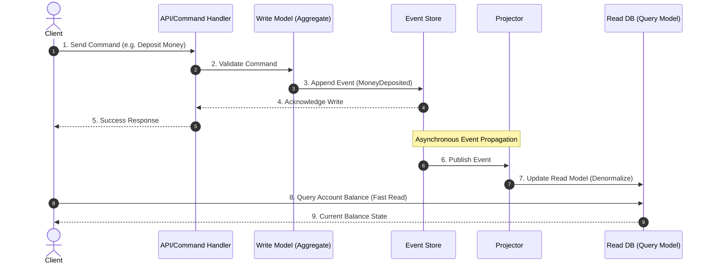

## 1. 💡 Sodda Tushuntirish va Analogiya

Tizim dizaynida an'anaviy ma'lumotlar bazasi bilan ishlashda biz faqat joriy holatni (Current State) saqlaymiz. Masalan, foydalanuvchi balansida $100 bor. Agar u yana $50 qo'shsa, bazadagi qiymat $150 ga yangilanadi (UPDATE). Lekin bu balans ushbu holatga kelgunicha qanday bosqichlarni bosib o'tgani haqidagi tarixiy ma'lumot yo'qoladi.

**Event Sourcing** va **CQRS** ushbu muammoni hal qiladi:

### Analogiya: Bank Daftarchasi (Ledger) vs Seif
* **An'anaviy CRUD:** Bu seifga o'xshaydi. Seifni ochasiz, ichida qancha pul borligini ko'rasiz va pul qo'shib/olib yopasiz. Siz faqat oxirgi pul miqdorini bilasiz.
* **Event Sourcing:** Bu bank daftarchasi yoki buxgalteriya kitobiga o'xshaydi. Unda hech narsa o'chirilmaydi va o'zgartirilmaydi (Immutable). Har bir tranzaksiya alohida yozib boriladi:
  1. *Foydalanuvchi hisob ochdi (+100 USD)*
  2. *Foydalanuvchi pul o'tkazdi (-30 USD)*
  3. *Foydalanuvchi pul kiritdi (+80 USD)*
  Joriy balansni bilish uchun siz boshidan boshlab barcha amallarni qayta hisoblab chiqasiz: `100 - 30 + 80 = 150`.
* **CQRS (Command Query Responsibility Segregation):** Bu yozish va o'qish vazifalarini alohida-alohida ajratishdir.
  Tasavvur qiling, bankda bitta buxgalter faqat yangi tranzaksiyalarni kitobga tez-tez yozib boradi (**Command / Write Model**). Ikkinchi buxgalter esa mijozlarga hisobot (balans, oylik statistika) ko'rsatish uchun bu yozilgan ma'lumotlarni chiroyli jadvallarga jamlab beradi (**Query / Read Model**).

---

## 2. 💻 Real Kod Misollari

Quyida Event Sourcing va CQRS oqimining Javascript-dagi soddalashtirilgan simulyatsiyasi keltirilgan:

```javascript
// 1. Event Store (Faqat qo'shiladigan voqealar ombori)
class EventStore {
  constructor() {
    this.events = [];
    this.subscribers = [];
  }

  append(event) {
    this.events.push(event);
    this.notify(event);
  }

  notify(event) {
    this.subscribers.forEach(sub => sub(event));
  }

  subscribe(subscriber) {
    this.subscribers.push(subscriber);
  }

  getEvents(aggregateId) {
    return this.events.filter(e => e.aggregateId === aggregateId);
  }
}

// 2. Write Model (Command Handler va Aggregate)
class BankAccountAggregate {
  constructor(id, eventStore) {
    this.id = id;
    this.eventStore = eventStore;
  }

  // Biznes qoidalar (Command validations)
  deposit(amount) {
    if (amount <= 0) throw new Error("Miqdor musbat bo'lishi kerak");
    this.eventStore.append({
      id: Math.random().toString(36).substr(2, 9),
      aggregateId: this.id,
      type: 'MoneyDeposited',
      data: { amount },
      timestamp: Date.now()
    });
  }

  withdraw(amount, currentBalance) {
    if (amount <= 0) throw new Error("Nol yoki undan kam pul yechib bo'lmaydi");
    if (currentBalance < amount) throw new Error("Mablag' yetarli emas");
    this.eventStore.append({
      id: Math.random().toString(36).substr(2, 9),
      aggregateId: this.id,
      type: 'MoneyWithdrawn',
      data: { amount },
      timestamp: Date.now()
    });
  }
}

// 3. Read Model (Query / Projection)
class AccountReadModelProjector {
  constructor() {
    this.readDatabase = {}; // Masalan: { accountId: { balance: 150 } }
  }

  project(event) {
    const { aggregateId, type, data } = event;
    if (!this.readDatabase[aggregateId]) {
      this.readDatabase[aggregateId] = { balance: 0 };
    }

    switch (type) {
      case 'MoneyDeposited':
        this.readDatabase[aggregateId].balance += data.amount;
        break;
      case 'MoneyWithdrawn':
        this.readDatabase[aggregateId].balance -= data.amount;
        break;
    }
  }

  getBalance(accountId) {
    return this.readDatabase[accountId] ? this.readDatabase[accountId].balance : 0;
  }
}

// Ishlatilishi:
const store = new EventStore();
const projector = new AccountReadModelProjector();

// Read model voqealarga obuna bo'ladi (Projection)
store.subscribe(event => projector.project(event));

// Bank agregatini yaratamiz
const accountId = "ACC-999";
const account = new BankAccountAggregate(accountId, store);

// Komandalar yuboramiz (Write model orqali)
account.deposit(100);
account.deposit(50);
account.withdraw(30, projector.getBalance(accountId));

// O'qish so'rovi (Query read model-dan amalga oshiriladi)
console.log("Joriy balans:", projector.getBalance(accountId)); // Natija: 120
```

---

## 3. ⚙️ Qanday Ishlaydi (Under the Hood)

### Write vs Read Models
* **Write (Command) Model:** Faqat ma'lumotlarni o'zgartiradigan buyruqlarni qabul qiladi. Biznes mantiq (validation, invariant) shu yerda tekshiriladi. U o'zining joriy holatini faqat yangi voqealarni yozish uchun tekshiradi.
* **Read (Query) Model:** O'qish so'rovlari uchun optimallashgan ma'lumotlar bazasi yoki keshi. Bu baza foydalanuvchi interfeysiga kerakli formatda oldindan tayyorlanib (denormalized) saqlanadi.

### Event Stores
Event Store — bu faqat ma'lumot qo'shiladigan (**append-only**) va o'zgarmas (**immutable**) log faylidir. Oddiy SQL bazalarda buni `INSERT` yordamida, yoki maxsus Event Store-lar (EventStoreDB, Apache Kafka) yordamida amalga oshirish mumkin. Unda hech qachon `UPDATE` yoki `DELETE` bajarilmaydi.

### Event Replay va Projections
Read Model buzilib qolsa yoki yangi ko'rinishdagi ma'lumotlar bazasi (masalan, ElasticSearch yoki Graph DB) kerak bo'lib qolsa, barcha tarixiy voqealarni boshidan boshlab o'qib chiqish (**Event Replay**) orqali yangi proyeksiyalarni noldan yaratish mumkin.

### Eventual Consistency (Yakuniy Moslik)
Yozish modeli voqeani Event Store-ga yozganidan so'ng, ushbu voqea asinxron ravishda Read Model-ga yuboriladi. Bunda yozish va o'qish modellari o'rtasida mikrosaniyalar darajasida kechikish bo'lishi mumkin. Bu holat **Eventual Consistency** (ma'lumotlarning vaqt o'tishi bilan moslashishi) deb ataladi.

### Snapshots (Tezkor Nusxa)
Agarda akkauntda millionlab tranzaksiyalar bo'lsa, har safar joriy balansni hisoblash uchun millionta voqeani qayta o'qish (replay) juda ko'p resurs talab qiladi. Buni optimallashtirish uchun har $N$-chi voqeadan keyin joriy holatning nusxasi (**Snapshot**) olinadi va keyingi safar faqat oxirgi snapshot + undan keyin kelgan yangi voqealar o'qiladi.

---

## 4. ❌ Ko'p Uchraydigan Xatolar (Junior Mistakes)

1. **Event o'rniga Command-larni saqlash:**
   * *Xato:* `{"type": "ChangeEmailCommand", "email": "a@b.com"}` ko'rinishida saqlash. Command rad etilishi mumkin.
   * *To'g'ri:* Faqat muvaffaqiyatli sodir bo'lgan voqealarni saqlash kerak: `{"type": "EmailChanged", "email": "a@b.com"}`. Event - bu o'tmishda sodir bo'lgan inkor etib bo'lmas fakt.
2. **Idempotentlikni hisobga olmaslik:**
   * Voqealar tarmoq orqali uzatilganda, ba'zida bitta voqea Read Model-ga ikki marta yetib borishi mumkin (*at-least-once delivery*). Agar sizda idempotentlik tekshiruvi bo'lmasa, foydalanuvchining hisobidan ikki marta pul yechib yuborilishi yoki ikki marta xabar yuborilishi mumkin.
3. **Optimistik Konkurentlikni unitish (Race Conditions):**
   * Bir vaqtda kelgan ikkita buyruq balansni noto'g'ri o'zgartirishi mumkin. Har bir voqeaga `version` raqamini biriktirish va yozish paytida joriy versiya kutilgan versiya bilan mosligini tekshirish shart (**Optimistic Concurrency Control**).

---

## 5. 💬 12 ta Intervyu Savollari

**1. Event Sourcing nima?**
Ma'lumotlarning faqat oxirgi holatini emas, balki unda sodir bo'lgan barcha o'zgarishlar (voqealar) tarixini ketma-ketlikda saqlash arxitektura namunasidir.

**2. CQRS nima?**
Command Query Responsibility Segregation — ma'lumotlarni o'zgartiruvchi operatsiyalar (Commands) va ma'lumotlarni o'quvchi operatsiyalar (Queries) uchun alohida modellar va bazalarni ishlatishdir.

**3. Nima uchun Event-larni o'zgartirib yoki o'chirib bo'lmaydi?**
Chunki voqealar (Events) o'tmishda sodir bo'lgan haqiqiy faktlardir. Tarixni o'zgartirib bo'lmaydi. Xatolar faqat kompensatsiyalovchi yangi voqealar orqali tuzatiladi.

**4. Snapshot nima va u nima uchun kerak?**
Katta hajmdagi voqealar zanjirini qayta o'qishni (replay) tezlashtirish uchun tizim holatining ma'lum bir vaqtdagi nusxasini saqlash usulidir.

**5. Read Model qanday yangilanadi?**
Event Store-ga yozilgan yangi voqealar proyektorlar (Projectors) orqali tinglanadi va o'qish ma'lumotlar bazasidagi mos jadvallar/hujjatlar yangilanadi.

**6. Eventual Consistency nima?**
Yozilgan ma'lumotlarning asinxron qayta ishlanishi sababli o'qish modelida bir necha millisoniyadan so'ng aks etishi va yakunda baribir sinxronlashishi.

**7. Event Sourcing-da optimistik konkurentlik qanday ta'minlanadi?**
Har bir agregat yoki voqealar oqimiga versiya raqami beriladi. Yangi voqeani yozayotganda kutilayotgan oxirgi versiya bazadagi versiya bilan solishtiriladi, mos kelmasa tranzaksiya bekor qilinadi.

**8. Saga patterni Event Sourcing bilan qanday bog'lanadi?**
Saga bir nechta mikroxizmatlar bo'ylab tarqalgan tranzaksiyalarni boshqaradi va voqealar zanjiri (Event-driven) orqali kompensatsiyalovchi tranzaksiyalarni ishga tushiradi.

**9. Upcasting nima?**
Eski voqea sxemalarini (masalan, v1) dastur ishlayotgan vaqtda (on-the-fly) yangi sxemaga (v2) o'zgartirib, kodga moslashtirish jarayonidir.

**10. CQRS-ning asosiy kamchiliklari nimada?**
Tizimning murakkabligi oshishi, kodlar ko'payishi, eventual consistency muammolari va turli bazalarni boshqarish qiyinchiliklari.

**11. Qachon Event Sourcing-dan foydalanmaslik kerak?**
Oddiy CRUD (yaratish, o'qish, yangilash, o'chirish) tizimlarida, tarixiy ma'lumotlar va audit talab qilinmaydigan oddiy loyihalarda.

**12. Idempotent Event Handler nima?**
Bitta voqeani necha marta qayta ishlamasin, read modelda faqat bir marta ta'sir ko'rsatadigan va bir xil natija beradigan handler.

---

## 6. 🛠️ Amaliy Topshiriqlar

Quyida siz Event Sourcing va CQRS tizimining fundamental mantiqlarini JS tilida yozib sinab ko'rasiz.

---

## 7. 📝 12 ta Mini Test

Darsni qanchalik yaxshi tushunganingizni tekshirish uchun testlarni yeching.

---

## 8. 🎯 Real Project Case Study

### E-Commerce buyurtma berish va inventarizatsiya tizimi
Yirik internet do'konda foydalanuvchi buyurtma berganida:
1. `OrderAggregate` biznes qoidalarni tekshiradi (masalan, maxsulot zaxirada bormi).
2. Tizim `OrderCreated` voqeasini Event Store-ga yozadi.
3. Inventory Service ushbu voqeani tinglab, ombordan mahsulotni band qiladi va `InventoryReserved` voqeasini chiqaradi.
4. Read Model esa foydalanuvchiga buyurtma holatini "Kutilmoqda" yoki "Muvaffaqiyatli" ko'rinishida tezkor ko'rsatib turish uchun asinxron yangilanib boradi.

---

## 9. 🧠 Vizual ko'rinish (Architecture Diagram)



---

## 10. 📌 Cheat Sheet

| Atama | Vazifasi | O'zgaruvchanligi |
| :--- | :--- | :--- |
| **Command** | Biror ishni bajarish niyati (Validate qilinadi, rad etilishi mumkin) | Yo'q (Faqat balans/identifikatorlar) |
| **Event** | O'tmishda sodir bo'lgan fakt (Rad etib bo'lmaydi) | Immutable (O'zgarmas) |
| **Aggregate** | Biznes qoidalari va o'zgarishlar yig'indisi | Joriy holat xotirada saqlanadi |
| **Event Store** | Faqat voqealarni yozuvchi ombor | Append-Only |
| **Projector** | Voqealarni o'qib, o'qish bazasini yangilovchi komponent | Stateless / Dynamic |
| **Read DB** | O'qish so'rovlari uchun optimallashgan baza | O'zgaruvchan (Denormalized) |
