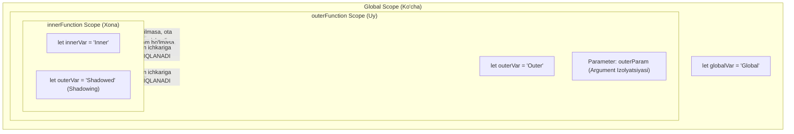

## 1. 💡 Sodda Tushuntirish va Analogiya

### Funksiya Qamrovi (Function Scope) nima?
JavaScript-da har safar yangi funksiya yaratganingizda, u o'ziga xos **yopiq hudud** (qamrov yoki scope) yaratadi. 
* Funksiya ichida e'lon qilingan o'zgaruvchilar (xoh `var`, xoh `let` yoki `const` bo'lsin) va funksiyaga uzatilgan argumentlar faqat shu funksiyaning **ichida** ishlaydi.
* Tashqi dunyo (ya'ni funksiya tashqarisidagi kodlar) bu o'zgaruvchilarni ko'ra olmaydi va ularga to'g'ridan-to'g'ri murojaat qila olmaydi.

### Real hayotiy analogiya
Tasavvur qiling, siz **shaxsiy xonadonsiz**:
* **Global Scope (Ko'cha):** Hamma uchun ochiq joy. Bu yerda turgan e'lonlar taxtasini ko'chada yurgan har bir kishi o'qishi mumkin.
* **Function Scope (Xonadon):** Sizning uyingiz. Uyingiz ichidagi jihozlar, masalan, stol ustidagi shaxsiy kundalik faqat uydagilarga (funksiya ichiga) ko'rinadi. Ko'chadan turib (tashqi global scope-dan) hech kim sizning uyingiz ichidagi narsalarni ko'ra olmaydi.
* **Argument Isolation (Eshikdagi pochta qutisi):** Har bir xonadonning o'z pochta qutisi bor. Unga kelgan xatlar faqat shu xonadon a'zolari uchun va boshqa qo'shnilar (boshqa funksiya chaqiriqlari) ularni o'qiy olmaydi.

---

## 2. 💻 Real Kod Misollari

### 1. Basic Example (Sodda Lokal O'zgaruvchi)
Funksiya ichida e'lon qilingan o'zgaruvchining tashqaridan yopiqligi:
```javascript
function showLocalSecret() {
  const secretCode = "JS-SCOPE-2026"; // Lokal o'zgaruvchi
  console.log("Funksiya ichida:", secretCode); // Ishlaydi
}

showLocalSecret();

// Tashqaridan murojaat qilib ko'ramiz:
console.log(secretCode); 
// Xatolik: ReferenceError: secretCode is not defined
```

### 2. Intermediate Example (Ichma-ich Funksiyalar va Scope Chain)
Ichki funksiyalar tashqi funksiya qamrovidagi o'zgaruvchilarga kira oladi, lekin teskarisi ishlamaydi:
```javascript
function parentFunction() {
  let parentVar = "Men otaman";

  function childFunction() {
    let childVar = "Men bolaman";
    // Ichki funksiya tashqi funksiyaning o'zgaruvchisini ko'ra oladi
    console.log("Child ichida parentVar:", parentVar); 
  }

  childFunction();

  // Tashqi funksiya ichki funksiyaning o'zgaruvchisini KO'RA OLMAYDI
  console.log(childVar); 
  // Xatolik: ReferenceError: childVar is not defined
}

parentFunction();
```

### 3. Advanced Example (Variable Shadowing va Parameter Isolation)
Agar bir xil nomli o'zgaruvchi globalda va lokalda bo'lsa, lokal o'zgaruvchi globalni yopib qo'yadi (Shadowing):
```javascript
let username = "GlobalJasur"; // Global o'zgaruvchi

function greet(username) {
  // Parametrdagi username global username-ni shadow (soyada qoldirish) qiladi
  console.log("Salom, " + username); 
}

greet("Lola"); // "Salom, Lola" chiqadi (Lokal parametr ustun)
console.log(username); // "GlobalJasur" chiqadi (Global o'zgaruvchi o'zgarmadi)
```

---

## 3. ⚙️ Qanday Ishlaydi (Under the Hood)

### Execution Context va Call Stack
JavaScript dvigateli kodni bajarayotganda har bir funksiya chaqiruvi uchun **Execution Context (Bajarilish Muhiti)** yaratadi:
1. Funksiya chaqirilganda, uning bajarilish muhiti **Call Stack**-ga yuklanadi.
2. Bu muhit o'zining **Lexical Environment (Leksik Muhit)** obyektiga ega bo'ladi. Leksik muhitda funksiya parametrlari va lokal o'zgaruvchilar saqlanadigan **Environment Record** bo'ladi.
3. Shuningdek, u o'zining **Outer Reference** (tashqi muhit ko'rsatkichi) orqali o'zidan tepada turgan ota qamrovga bog'lanadi. Buni **Scope Chain (Qamrovlar Zanjiri)** deyiladi.
4. Funksiya bajarilib bo'lingach, uning execution context-i Call Stack-dan o'chiriladi (pop qilinadi) va xotira bo'shatiladi (Garbage Collection).

> [!IMPORTANT]
> Funksiya e'lon qilingan paytning o'zida uning tashqi muhitga bo'lgan havolasi (Lexical Environment) biriktiriladi. Funksiya qayerdan chaqirilganidan qat'i nazar, u o'zi yaratilgan joydagi scope zanjiri bo'yicha o'zgaruvchilarni qidiradi.

---

## 4. ❌ Ko'p Uchraydigan Xatolar (Junior Mistakes)

### 1. Lokal o'zgaruvchini global deb o'ylash
#### Xato:
```javascript
function calculateSum(a, b) {
  let result = a + b;
}
calculateSum(5, 10);
console.log(result); // ReferenceError: result is not defined
```
#### To'g'ri usul:
Qiymatni tashqariga chiqarish uchun `return` kalit so'zidan foydalanish lozim:
```javascript
function calculateSum(a, b) {
  return a + b;
}
let result = calculateSum(5, 10);
console.log(result); // 15
```

### 2. Kalit so'zsiz e'lon qilish orqali Global Scope-ni ifloslantirish (Pollution)
#### Xato:
`strict mode` yoqilmagan holatda `var`, `let` yoki `const` ishlatmaslik o'zgaruvchini avtomatik global qilib qo'yadi.
```javascript
function initializeScore() {
  score = 100; // Kalit so'z yo'q!
}
initializeScore();
console.log(window.score); // 100 (Global ifloslandi)
```
#### To'g'ri usul:
Har doim o'zgaruvchilarni e'lon qilishda `let` yoki `const` represents ishlating va `"use strict";` rejimini yoqing.
```javascript
"use strict";
function initializeScore() {
  let score = 100; // Xavfsiz lokal o'zgaruvchi
}
```

---

## 5. 💬 12 ta Intervyu Savollari

### Junior
1. **Savol:** Function scope nima?
   * **Javob:** Funksiya ichida e'lon qilingan o'zgaruvchilar va parametrlarning faqat shu funksiya ichida ishlatilishi va tashqaridan yopiq bo'lishi.
2. **Savol:** Funksiya parametrlari qayerda saqlanadi?
   * **Javob:** Ular funksiyaning lokal qamrovida (Environment Record) saqlanadi va lokal o'zgaruvchi kabi ishlaydi.
3. **Savol:** Variable Shadowing nima?
   * **Javob:** Ichki scope-da tashqi scope-dagi o'zgaruvchi bilan bir xil nomli o'zgaruvchi yaratilganda, ichki o'zgaruvchi tashqi o'zgaruvchini to'sib (yashirib) qo'yishidir.
4. **Savol:** Qamrov zanjiri (Scope Chain) qanday ishlaydi?
   * **Javob:** JS dvigateli o'zgaruvchini dastlab lokal qamrovdan qidiradi, topolmasa ota qamrovga va eng oxirida global qamrovga murojaat qiladi.

### Middle
5. **Savol:** `let`/`const` va `var` o'rtasidagi qamrov bo'yicha farq nima?
   * **Javob:** `var` funksiya qamroviga ega (function-scoped), ya'ni u faqat funksiya ichida cheklanadi. `let` va `const` esa blok qamroviga ega (block-scoped), ya'ni ular istalgan `{}` bloklari ichida lokal bo'ladi.
6. **Savol:** Funksiya bajarilib bo'lingach, uning lokal o'zgaruvchilari nima bo'ladi?
   * **Javob:** Ularning bajarilish konteksti call stack-dan o'chiriladi va yopilishlar (closures) mavjud bo'lmasa, Garbage Collector ularni xotiradan tozalaydi.
7. **Savol:** `use strict` rejimi funksiya scope-dagi xatolarni qanday oldini oladi?
   * **Javob:** U kalit so'zsiz o'zgaruvchilarni e'lon qilishni taqiqlaydi va bunday holatda ReferenceError beradi.
8. **Savol:** Agar funksiya ichida `var x = 5` deb e'lon qilsak va keyin `if` bloki ichida `var x = 10` deb o'zgartirsak nima bo'ladi?
   * **Javob:** `var` block scope-ga ega emasligi sababli, u bitta umumiy lokal `x` bo'lib qoladi va qiymati 10 ga o'zgaradi.

### Senior
9. **Savol:** Lexical Environment obyektining tarkibiy qismlari nimalardan iborat?
   * **Javob:** Environment Record (lokal identifikatorlar xaritasi) va Outer Lexical Environment Reference (ota qamrovga havola).
10. **Savol:** `new Function('a', 'return a')` qamrovi qanday ishlaydi?
    * **Javob:** `new Function` yordamida yaratilgan funksiyalar doimo global qamrovga outer reference bog'laydi, ya'ni ular e'lon qilingan joyidagi leksik qamrovni ko'rmaydi.
11. **Savol:** Dynamic Scope va Lexical Scope farqi nima? JS qaysi biridan foydalanadi?
    * **Javob:** Lexical Scope o'zgaruvchilarning kod yozilgan paytdagi joylashuviga qarab scope-ni belgilaydi. Dynamic Scope esa chaqirilish vaqtiga qarab belgilaydi. JavaScript faqat Lexical Scope-dan foydalanadi.
12. **Savol:** Argument izolyatsiyasi nima uchun JavaScript-dagi funksional dasturlashda juda muhim?
    * **Javob:** Funksiya chaqirilganda uzatilgan argumentlar har bir chaqiruv uchun alohida execution context yaratgani sababli, bir chaqiruvdagi ma'lumotlar ikkinchi parallel chaqiruvga ta'sir qilmaydi (Side effects oldi olinadi).

---

## 6. 🛠️ Amaliy Topshiriqlar

Bu bo'limda siz funksiya qamrovi, argument shadowing va ichma-ich funksiyalar bilan ishlovchi 3 ta amaliy topshiriqni bajarasiz (Mashqlar alohida faylda keltirilgan).

Quyida nested funksiya e'lonlari va argument izolyatsiyasi qoidalarini tasvirlovchi diagramma berilgan:



---

## 7. 📝 12 ta Mini Test

Ushbu darsning yakunida bilimlarni mustahkamlash uchun 12 ta multiple-choice interaktiv testlar mavjud bo'lib, ular JSON faylida joylashtirilgan.

---

## 8. 🎯 Real Project Case Study

### Widget / Uchinchi tomon kutubxonalari uchun scope izolyatsiyasi
Eski JS loyihalarda ES modullar yo'q paytda, bir nechta kutubxonalar global scope-dagi o'zgaruvchilarni to'qnashtirib yubormasligi uchun **IIFE (Immediately Invoked Function Expression)** yordamida funksiya qamrovi yaratilgan.

```javascript
// Analytics widget kodi boshqa skriptlardan alohida xavfsiz qamrovda ishlaydi:
(function() {
  // Bu o'zgaruvchilar faqat ushbu IIFE ichida mavjud
  let requestCounter = 0;
  const apiKey = "ANALYTICS_KEY_999";
  
  function sendLog(data) {
    requestCounter++;
    console.log(`Log yuborildi. Jami: ${requestCounter}`);
  }
  
  // Faqat kerakli metodni globalga xavfsiz chiqaramiz:
  window.myAnalytics = {
    trackEvent: function(event) {
      sendLog(event);
    }
  };
})();

// Global scope-da requestCounter yoki apiKey ga to'g'ridan-to'g'ri kirib bo'lmaydi:
console.log(window.requestCounter); // undefined
```

---

## 9. 🚀 Performance va Optimization

### 1. Funksiya ichida funksiya yaratishdan ehtiyot bo'ling (Loop ichida)
Agar sikl (loop) ichida doimiy ravishda funksiya e'lon qilinsa, har safar yangi funksiya obyekti va yangi qamrov yaratiladi. Bu xotira sarfini ko'paytiradi.
#### Yomon performance:
```javascript
for (let i = 0; i < 1000; i++) {
  // Har safar yangi funksiya obyekti yaratiladi
  const process = (num) => num * 2;
  console.log(process(i));
}
```
#### Yaxshi performance:
```javascript
const process = (num) => num * 2; // Funksiya bir marta tashqarida yaratiladi
for (let i = 0; i < 1000; i++) {
  console.log(process(i));
}
```

---

## 10. 📌 Cheat Sheet

| Qamrov (Scope) turi | E'lon qilingan joyi | Tashqaridan kirish | Ta'rifi |
| :--- | :--- | :--- | :--- |
| **Global Scope** | Funksiyalardan tashqarida | Ha (hamma joydan) | Eng yuqori darajadagi umumiy scope |
| **Function Scope** | Funksiya bloki `{}` ichida | Yo'q | Faqat funksiya ichidagilar kira oladi |
| **Argument Isolation** | Funksiya parametrlari | Yo'q | Har bir chaqiruv uchun mustaqil argumentlar |
| **Shadowing** | Ichki qamrovda e'lon | Yo'q | Bir xil nomli tashqi o'zgaruvchini to'sib qo'yish |
