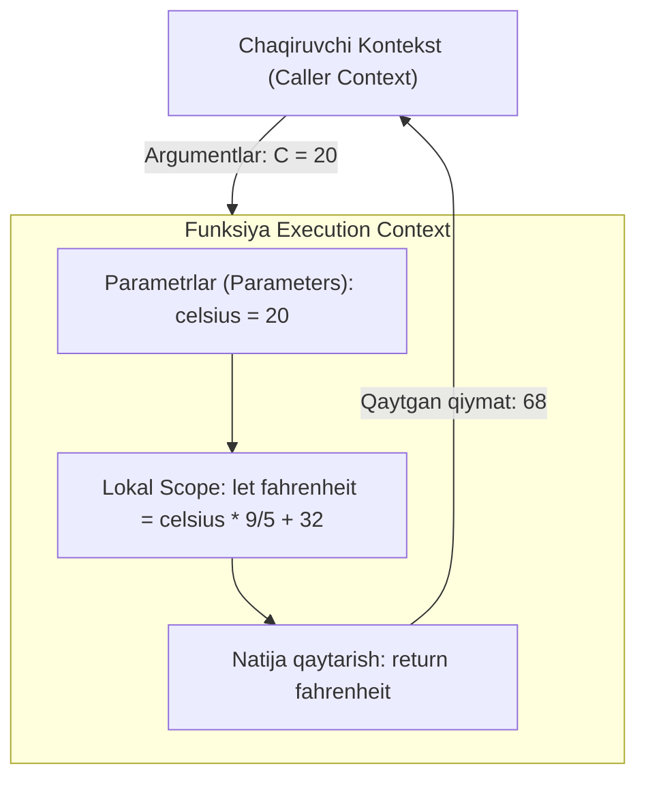

## 1. 💡 Sodda Tushuntirish va Analogiya

### Funksiya va Scope nima?
* **Funksiya (Function):** Bu dasturning biror-bir muayyan vazifani bajarishga mo'ljallangan, qayta-qayta ishlatilishi mumkin bo'lgan kod blokidir. Siz unga ma'lumot uzatasiz (argumentlar), u ma'lumotlarni qayta ishlaydi va natijani qaytaradi (return).
* **Scope (Qamrov doirasi):** Bu o'zgaruvchilar va funksiyalarning koddagi "ko'rinish" yoki ularga kirish huquqining doirasidir. Ya'ni, o'zgaruvchini qayerda e'lon qilganingizga qarab, uni kodning qaysi qismlarida ishlatish mumkinligi aniqlanadi.

### Real hayotiy analogiya
Tasavvur qiling, sizda **oshxona va taom tayyorlash mashinasi** bor:
* **Funksiya:** Bu mikser yoki oshxona kombaynidir. Siz unga **masalliqlarni solasiz** (parametrlar/argumentlar), u ularni **aralashtiradi** (kod bajarilishi) va sizga **sharbatsiz tayyor mahsulotni qaytaradi** (return).
* **Scope (Global va Local):** 
  * **Global Scope:** Sizning butun uyingiz. Uy ichidagi muzlatgichdagi mevalarni xohlagan xonangizda yoki mikser ichida ishlata olasiz.
  * **Local Scope (Oshxona/Mikser ichi):** Mikserning ichidagi pichoqlar yoki mikser idishiga solingan suv faqat o'sha mikser ichida mavjud. Siz mehmonxonada turib mikser ichidagi suvni to'g'ridan-to'g'ri ololmaysiz. Mikser yopilib, ishini tugatgandan so'ng u yerdagi lokal narsalar yo'qoladi.

---

## 2. 💻 Real Kod Misollari

### 1. Basic Example (Oddiy Funksiya e'loni va return)
```javascript
// Funksiya e'lon qilish (Function Declaration)
function calculateArea(width, height) {
  // width va height - parametrlar
  const area = width * height; // lokal o'zgaruvchi
  return area; // natijani qaytarish
}

// Funksiyani chaqirish va argumentlar uzatish
const room1 = calculateArea(5, 4); // 5 va 4 - argumentlar
console.log(room1); // 20
```

### 2. Intermediate Example (Scope farqi va Function Expression)
Global va Local scope o'rtasidagi bog'liqlik hamda funksiyani o'zgaruvchiga yuklash:
```javascript
const globalName = "Sardor"; // Global o'zgaruvchi

// Function Expression (Funksiya ifodasi)
const introduce = function() {
  const localRole = "Dasturchi"; // Lokal o'zgaruvchi
  
  console.log(`Mening ismim ${globalName}. Men ${localRole}man.`);
};

introduce(); // "Mening ismim Sardor. Men Dasturchiman."
// console.log(localRole); // ReferenceError: localRole is not defined (chunki u lokal scope-da)
```

### 3. Advanced Example (Arrow Function, Default Parameters, Rest Parameter)
Zamonaviy JavaScript (ES6+) imkoniyatlari:
```javascript
// Default parameters (standart qiymat) va Arrow function (ko'rsatkichli funksiya)
const greet = (name = "Mehmon") => `Salom, ${name}!`;
console.log(greet()); // "Salom, Mehmon!"
console.log(greet("Lobar")); // "Salom, Lobar!"

// Rest Parameter (...args) - istalgancha argumentni massiv shaklida qabul qilish
const sumAll = (...numbers) => {
  return numbers.reduce((total, num) => total + num, 0);
};

console.log(sumAll(10, 20, 30)); // 60
console.log(sumAll(1, 2, 3, 4, 5)); // 15
```

---

## 3. ⚙️ Qanday Ishlaydi (Under the Hood)

### Execution Context va Call Stack
JavaScript dvigateli funksiyalarni bajarishda quyidagi bosqichlardan o'tadi:
1. **Creation Phase (Yaratilish bosqichi):** Dastur ishga tushganda yoki funksiya chaqirilganda, yangi **Execution Context** (Bajarilish muhiti) yaratiladi. JavaScript dvigateli o'zgaruvchilar va funksiyalarni aniqlab, xotiradan joy ajratadi (bu jarayon **Hoisting** deb ataladi).
2. **Execution Phase (Bajarilish bosqichi):** Kod satrma-satr bajariladi, o'zgaruvchilarga qiymat yuklanadi va funksiya ichidagi amallar bajariladi.

Funksiya chaqirilganda, u **Call Stack** (chaqiriqlar to'plami) tepasiga joylashtiriladi. Funksiya bajarilib, `return` kalit so'zi bilan natija qaytargach, u stack-dan olib tashlanadi (pop) va nazorat uni chaqirgan kodga qaytadi.

> [!IMPORTANT]
> `let` va `const` yordamida e'lon qilingan o'zgaruvchilar **Block Scope** (blok qamrovi) ga ega bo'lib, `{}` qavslar ichida yopiq bo'ladi. `var` esa **Function Scope** ga ega bo'lib, blok qavslarni chetlab o'tadi, lekin funksiya ichida cheklanadi.

---

## 4. ❌ Ko'p Uchraydigan Xatolar (Junior Mistakes)

### 1. `return` yozishni unutish yoki noto'g'ri joylashtirish
#### Xato:
```javascript
function double(num) {
  const result = num * 2;
  // return yo'q
}
console.log(double(5)); // undefined
```
#### Tuzatish:
```javascript
function double(num) {
  return num * 2;
}
console.log(double(5)); // 10
```

### 2. Blok va Lokal scope o'zgaruvchilarini tashqaridan chaqirish
#### Xato:
```javascript
if (true) {
  let blockVariable = "Faqat shu blokda";
}
console.log(blockVariable); // ReferenceError
```
#### Tuzatish:
O'zgaruvchi qayerda ko'rinishi kerak bo'lsa, o'sha doirada (scope) yoki undan yuqoriroqda e'lon qiling:
```javascript
let blockVariable;
if (true) {
  blockVariable = "Qiymat o'zgartirildi";
}
console.log(blockVariable); // "Qiymat o'zgartirildi"
```

### 3. Parametr va Argumentlarni chalkashtirish
* **Parametr:** Funksiya e'lon qilinayotganda qavs ichida yoziladigan o'zgaruvchilar (masalan: `function add(a, b)` dagi `a` va `b`).
* **Argument:** Funksiya chaqirilganda parametrlar o'rniga uzatiladigan aniq qiymatlar (masalan: `add(5, 10)` dagi `5` va `10`).

---

## 5. 💬 12 ta Intervyu Savollari

### Junior
1. **Savol:** Function Declaration va Function Expression farqi nimada?
   * **Javob:** Function Declaration hoisting bo'ladi (uni e'londan oldin chaqirsa bo'ladi). Function Expression esa o'zgaruvchiga yuklanadi va hoisting bo'lmaydi.
2. **Savol:** Funksiyada default parametr nima va u qachon ishlatiladi?
   * **Javob:** Funksiya chaqirilganda argument berilmasa yoki `undefined` bo'lsa, parametrga avtomatik biriktiriladigan qiymatdir.
3. **Savol:** Funksiya ichida `return` kalit so'zidan keyin yozilgan kodlar ishlaydimi?
   * **Javob:** Yo'q, `return` funksiya bajarilishini darhol to'xtatadi va boshqa kodlarga o'tmaydi.
4. **Savol:** Global scope va Local scope nima?
   * **Javob:** Global scope - koddagi har qanday joydan kirish mumkin bo'lgan o'zgaruvchilar doirasi. Local scope esa faqat ma'lum bir funksiya yoki blok ichida ko'rinadigan doiradir.

### Middle
5. **Savol:** Rest parametr (`...args`) nima va u `arguments` obyektidan nimasi bilan farq qiladi?
   * **Javob:** Rest parameter haqiqiy massiv bo'lib, unga barcha massiv metodlarini (map, filter) qo'llash mumkin. `arguments` esa massivsimon obyekt bo'lib, massiv metodlariga ega emas va arrow funksiyalarda mavjud emas.
6. **Savol:** Shadowing (Soya solish) hodisasi nima?
   * **Javob:** Ichki (lokal) qamrovda e'lon qilingan o'zgaruvchining tashqi (global) qamrovdagi bir xil nomli o'zgaruvchini to'sib qo'yishidir.
7. **Savol:** Arrow funksiyaning an'anaviy funksiyalardan asosiy farqlari nimalar?
   * **Javob:** Arrow funksiyalar o'zining `this` va `arguments` obyektiga ega emas. Shuningdek ularni `new` kalit so'zi orqali constructor sifatida ishlatib bo'lmaydi.
8. **Savol:** Block Scope (`let`/`const`) va Function Scope (`var`) farqini tushuntiring.
   * **Javob:** `let` va `const` faqat jingalak qavslar `{}` ichida yashaydi. `var` esa faqat funksiya bilan chegaralanadi, oddiy `if` yoki `for` bloklaridan tashqariga chiqib keta oladi.

### Senior
9. **Savol:** JavaScript-da IIFE (Immediately Invoked Function Expression) nima va uning zamonaviy koddagi o'rni qanday?
   * **Javob:** IIFE e'lon qilingan zahoti darhol ishga tushadigan funksiyadir. Ilgari u global scope-ni ifloslantirmaslik va xususiy qamrov yaratish uchun ishlatilgan. Hozirgi kunda bu vazifani asosan ES modullar va blok qamrovlar (`let`/`const`) bajaradi.
10. **Savol:** Callback funksiya nima va u qanday ishlaydi?
    * **Javob:** Callback - parametr sifatida boshqa funksiyaga uzatib yuboriladigan va ma'lum bir amal yoki voqeadan keyin chaqiriladigan funksiyadir.
11. **Savol:** Pure Function (Sof funksiya) nima?
    * **Javob:** Bir xil argumentlar berilganda har doim bir xil natija qaytaradigan va tashqi muhitga hech qanday nojo'ya ta'sir (side effect) ko'rsatmaydigan funksiyadir.
12. **Savol:** Call Stack to'lib qolishi (Stack Overflow) qanday yuz beradi?
    * **Javob:** Rekursiv funksiya (o'z-o'zini chaqiruvchi) to'xtash shartisiz cheksiz marta chaqirilganda, Call Stack to'lib ketadi va dastur xatolik beradi (`Maximum call stack size exceeded`).

---

## 6. 🛠️ Amaliy Topshiriqlar

Bu bo'limda siz funksiyalarni amalda qo'llashni o'rganasiz. Quyidagi chizma funksiya chaqirilganda argumentlarning parametrlar bilan mos kelishi, lokal o'zgaruvchilar va natijaning qaytarilish zanjirini ko'rsatadi:



---

## 7. 📝 12 ta Mini Test

Bilimingizni sinash uchun `functions_quizzes.json` faylidagi 12 ta test savollarini javoblang. U yerda scope, parametrlar, arrow funksiyalar va return qiymatlari bo'yicha muhim savollar joy olgan.

---

## 8. 🎯 Real Project Case Study

### Savdo Savatchasi Hisoblagichi (Shopping Cart Calculator)
Haqiqiy loyihalarda mahsulotlar savatchasini hisoblash, chegirmalar va soliqlarni qo'llash uchun moslashuvchan funksiyalardan foydalaniladi. Quyidagi kodda biz funksiyalar yordamida savatchadagi umumiy summani hisoblaymiz:

```javascript
// Har bir mahsulot summasini hisoblovchi funksiya
const calculateItemTotal = (price, quantity = 1) => price * quantity;

// Savatchadagi umumiy summani hisoblovchi asosiy funksiya
function calculateCartTotal(cartItems, discountPercent = 0, taxPercent = 12) {
  let subtotal = 0;

  // Har bir mahsulot ustidan aylanib chiqamiz
  for (const item of cartItems) {
    subtotal += calculateItemTotal(item.price, item.quantity);
  }

  // Chegirmani hisoblaymiz
  const discountAmount = subtotal * (discountPercent / 100);
  const totalAfterDiscount = subtotal - discountAmount;

  // Soliqni hisoblaymiz
  const taxAmount = totalAfterDiscount * (taxPercent / 100);
  const finalTotal = totalAfterDiscount + taxAmount;

  return {
    subtotal: subtotal,
    discountAmount: discountAmount,
    taxAmount: taxAmount,
    finalTotal: finalTotal
  };
}

// Chaqirishga misol:
const myCart = [
  { price: 15000, quantity: 2 }, // 30000 UZS
  { price: 50000, quantity: 1 }  // 50000 UZS
];

const bill = calculateCartTotal(myCart, 10, 12); // 10% chegirma, 12% soliq
console.log(bill);
/*
Natija:
{
  subtotal: 80000,
  discountAmount: 8000,
  taxAmount: 8640,
  finalTotal: 80640
}
*/
```

---

## 9. 🚀 Performance va Optimization

* **Funksiyalarni sikl (loop) ichida yaratmang:** Sikl har safar aylanganda yangi funksiya obyekti yaratilishi xotira sarfini oshiradi. Funksiyani sikldan tashqarida e'lon qilib, ichida faqat chaqirish tavsiya etiladi.
* **Sof funksiyalar (Pure Functions) yozishga harakat qiling:** Sof funksiyalarni keshlashtirish (memoization) oson bo'ladi va ular dasturdagi boshqa o'zgaruvchilarni kutilmaganda o'zgartirib yubormaydi.
* **Kichik funksiyalar yarating:** Yagona mas'uliyat tamoyiliga (Single Responsibility Principle) muvofiq, bitta funksiya faqat bitta ishni mukammal darajada bajarishi lozim. Bu kodni testlash va o'qishni osonlashtiradi.

---

## 10. 📌 Cheat Sheet

| Funksiya turi | Sintaksis | Hoisting | `this` bog'lanishi | Qachon ishlatiladi |
| :--- | :--- | :--- | :--- | :--- |
| **Function Declaration** | `function foo() {}` | Ha | Dinamik (chaqirilgan joyga qarab) | Kodning istalgan joyidan chaqirish imkoni kerak bo'lganda |
| **Function Expression** | `const foo = function() {}` | Yo'q | Dinamik (chaqirilgan joyga qarab) | Funksiya faqat ma'lum shartdan keyin aniqlanishi kerak bo'lganda |
| **Arrow Function** | `const foo = () => {}` | Yo'q | Leksik (tashqi muhitdan oladi) | Callback-lar yozishda, qisqa bir qatorli amallarda, `this`ni yo'qotmaslik uchun |
