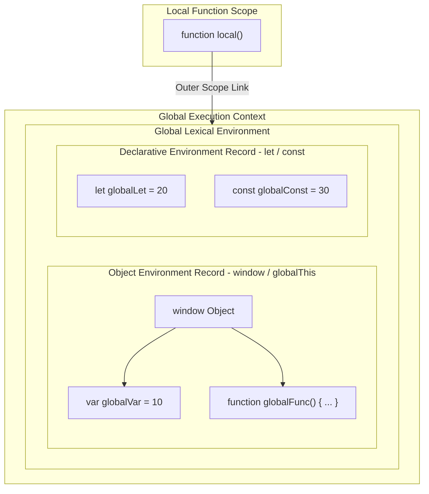

## 1. 💡 Sodda Tushuntirish va Analogiya

### Global Scope (Global qamrov) nima?
* **Global Scope:** Bu JavaScript dasturining eng tashqi doirasi (miqyosi) hisoblanadi. Har qanday funksiya yoki blok (`{}`) tashqarisida e'lon qilingan barcha o'zgaruvchilar va funksiyalar global qamrovga tegishli bo'ladi.
* **Kirish imkoniyati:** Global qamrovda e'lon qilingan o'zgaruvchilar dasturning istalgan joyidan (istalgan funksiya, blok yoki ichma-ich yozilgan kodlar ichidan) ko'rinadi va ularni o'qish yoki o'zgartirish mumkin.
* **Global Obyekt:** Kod bajariladigan muhitga qarab global o'zgaruvchilar maxsus obyektga biriktiriladi. Masalan, brauzerda bu `window` obyekti, Node.js-da `global` obyekti, universal standartda esa `globalThis` hisoblanadi.

### Real hayotiy analogiya
Tasavvur qiling, siz **shahar markaziy maydonidasiz**:
* **Global o'zgaruvchi — Shahar markazidagi ulkan e'lonlar taxtasi:** Bu taxtaga yozilgan ma'lumotni shahardagi istalgan odam (istalgan funksiya) ko'ra oladi va o'qiy oladi. Biroq, agar kimdir kelib taxtadagi ma'lumotni o'chirib, o'zinikini yozib ketsa (global o'zgaruvchini o'zgartirsa), bu butun shahar aholisi uchun o'zgarib ketadi.
* **Lokal o'zgaruvchi — Shaxsiy xonadondagi e'lon taxtasi:** Bu faqat o'sha uyda yashovchilar (funksiya ichidagilar) uchun ko'rinadi. Tashqaridagilar (global scope) bu taxtani ko'ra olmaydi.

---

## 2. 💻 Real Kod Misollari

### 1. Basic Example (Global o'zgaruvchi yaratish va undan foydalanish)
Global doirada o'zgaruvchi e'lon qilib, uni funksiya ichida ishlatish:
```javascript
// Global qamrovda e'lon qilingan o'zgaruvchilar
const siteName = "JavaScript Darslari";
let userCount = 150;

function displayStatus() {
  // Global o'zgaruvchilarga funksiya ichidan to'g'ridan-to'g'ri kirish
  console.log(`${siteName} loyihasida jami ${userCount} ta foydalanuvchi bor.`);
}

displayStatus(); // "JavaScript Darslari loyihasida jami 150 ta foydalanuvchi bor."
```

### 2. Intermediate Example (Global obyekt bilan bog'liqlik: var vs let/const)
Global doirada e'lon qilingan o'zgaruvchilarning global obyektga (`window` yoki `globalThis`) biriktirilishi:
```javascript
// var global obyekt xususiyatiga aylanadi
var globalVar = "Men window ichidaman!";

// let va const global obyektga biriktirilmaydi
let globalLet = "Men declarative scope-daman!";
const globalConst = "Men ham declarative scope-daman!";

console.log(window.globalVar);   // "Men window ichidaman!"
console.log(window.globalLet);   // undefined
console.log(window.globalConst); // undefined

// universal globalThis orqali tekshirish
console.log(globalThis.globalVar); // "Men window ichidaman!"
```

### 3. Advanced Example (Implicit Global va strict mode farqi)
Hech qanday kalit so'zsiz o'zgaruvchiga qiymat biriktirilganda u yashirincha globalga aylanib ketishi va buni qat'iy rejim orqali oldini olish:
```javascript
// 1. Strict rejim bo'lmaganda (default):
function createUser() {
  // var, let yoki const yozish unutilgan
  username = "ali123"; 
}
createUser();
console.log(window.username); // "ali123" (Kutilmagan global o'zgaruvchi yaratildi!)

// 2. Strict rejim yoqilganda:
function createAdmin() {
  "use strict";
  adminName = "valisher"; // ReferenceError: adminName is not defined
}
try {
  createAdmin();
} catch (e) {
  console.log("Xatolik ushlandi:", e.message);
}
```

---

## 3. ⚠️ Muammo va Nima uchun Muhimligi

### Qaysi muammoni hal qiladi va nima uchun buni bilish shart?
1. **Global Namespace Pollution (Global nomlar ifloslanishi):** Agar loyihada juda ko'p global o'zgaruvchilar ishlatilsa, turli skriptlar yoki uchinchi tomon kutubxonalari (masalan, jQuery, Google Analytics va boshqalar) bir xil nomdagi o'zgaruvchilarni yaratib, bir-birini o'chirib yuborishi mumkin. Bu kutilmagan bug'larga va dasturning sinishiga sabab bo'ladi.
2. **Xavfsizlik (Security):** Global o'zgaruvchilarga sahifadagi istalgan JavaScript kodi (shu jumladan konsol orqali foydalanuvchi ham) kirishi va o'zgartirishi mumkin. API kalitlari yoki maxfiy foydalanuvchi ma'lumotlarini global scope-da saqlash jiddiy xavfsizlik muammolarini tug'diradi.
3. **Kodni testlash qiyinligi:** Global o'zgaruvchiga bog'lanib qolgan funksiyalarni alohida (izolyatsiyalangan holatda) testlash (Unit testing) juda qiyinlashadi, chunki ularning natijasi tashqi muhitga bog'liq bo'ladi.

---

## 4. ❌ Ko'p Uchraydigan Xatolar (Junior Mistakes)

### 1. Loop (sikl) ichida kalit so'zsiz iterator ishlatish
Sikllarda o'zgaruvchi e'lon qilishda `let` yoki `var` yozishni unutish uni global qilib qo'yadi.
* **Noto'g'ri (Global i yaratiladi):**
  ```javascript
  function runLoop() {
    for (i = 0; i < 5; i++) {
      console.log(i);
    }
  }
  runLoop();
  console.log(window.i); // 5 (i global bo'lib qoldi va boshqa kodlarga xalaqit berishi mumkin)
  ```
* **To'g'ri:**
  ```javascript
  function runLoop() {
    for (let i = 0; i < 5; i++) {
      console.log(i);
    }
  }
  runLoop();
  // console.log(window.i); // undefined
  ```

### 2. O'zgaruvchilarni soyalash (Variable Shadowing) chalkashligi
Lokal scope-da global o'zgaruvchi bilan bir xil nomdagi o'zgaruvchi yaratilsa, global o'zgaruvchi "soya" ostida qoladi va unga funksiya ichidan to'g'ridan-to'g'ri kirib bo'lmaydi.
* **Misol:**
  ```javascript
  let score = 100;
  
  function updateScore() {
    let score = 50; // Yangi lokal o'zgaruvchi yaratildi, global score o'zgarmadi!
    score += 10;
    console.log("Lokal score:", score); // 60
  }
  
  updateScore();
  console.log("Global score:", score); // 100 (O'zgarmasdan qoldi)
  ```

### 3. Hamma narsani global scope-da saqlashga odatlanish
Dasturchilar ko'pincha qiymatlarni funksiyalararo uzatish oson bo'lishi uchun ularni global qilib qo'yadilar.
* **Tuzatish:** O'zgaruvchilarni funksiya parametrlari (arguments) va qaytuvchi qiymatlar (`return`) orqali uzatish lozim. Bu kodni toza va tushunarli qiladi.

---

## 5. 💬 12 ta Intervyu Savollari

### Junior (1–4)
1. **Savol:** Global scope nima?
   * **Javob:** Har qanday funksiya yoki blok tashqarisidagi eng yuqori darajadagi soha bo'lib, u yerda e'lon qilingan o'zgaruvchilarga dasturning barcha qismlaridan kirish mumkin.
2. **Savol:** Dasturda global o'zgaruvchilardan haddan tashqari ko'p foydalanishning qanday salbiy oqibatlari bor?
   * **Javob:** Nomlar to'qnashuvi (pollution), xavfsizlik zaifliklari, xotira oqishi (memory leaks) va kodni testlash hamda tushunishning qiyinlashishi.
3. **Savol:** `globalThis` nima va u nima uchun JS tarkibiga kiritilgan?
   * **Javob:** JavaScript har xil muhitlarda (brauzerda `window`, Node.js-da `global`, Web Worker-da `self`) turlicha global obyektlarga ega edi. `globalThis` barcha platformalar uchun yagona universal global obyekt havolasini ta'minlaydi.
4. **Savol:** "Implicit Global" nima va u qanday hosil bo'ladi?
   * **Javob:** Hech qanday deklaratsiya kalit so'zisiz (let, const, var) o'zgaruvchiga qiymat biriktirilganda (masalan, `x = 10`) u avtomatik ravishda global o'zgaruvchiga aylanib qolishidir.

### Middle (5–8)
5. **Savol:** Global doirada `var` va `let`/`const` yordamida yaratilgan o'zgaruvchilarning global obyekt bilan bog'liqligi qanday farq qiladi?
   * **Javob:** `var` global obyekt (window) xususiyatiga aylanadi (masalan, `window.myVar`), lekin `let` va `const` aylanmaydi. Ular global lexical environment-ning declarative record qismida saqlanadi.
6. **Savol:** Strict mode (`"use strict"`) yashirin globallarga qarshi qanday kurashadi?
   * **Javob:** Strict mode yoqilgan bo'lsa, e'lon qilinmagan o'zgaruvchiga qiymat yozishga urinish implicit global yaratish o'rniga `ReferenceError` xatoligini keltirib chiqaradi.
7. **Savol:** Node.js-da yozilgan faylning eng yuqori qismida e'lon qilingan o'zgaruvchi global obyektga qo'shiladimi?
   * **Javob:** Yo'q, chunki Node.js har bir faylni CommonJS moduli sifatida avtomatik ravishda maxsus funksiya o'rami (module wrapper) ichiga oladi. Shuning uchun u aslida lokal modul qamrovida bo'ladi.
8. **Savol:** Global qamrov ifloslanishini kamaytirish uchun qanday texnikalardan foydalaniladi?
   * **Javob:** IIFE (Immediately Invoked Function Expression) yordamida scope-ni yopish, JavaScript Modullari (ES Modules: `import`/`export`) va Namespace pattern'lardan foydalanish orqali.

### Senior (9–12)
9. **Savol:** V8 dvigatelining Garbage Collector (axlat yig'uvchi) tizimi global o'zgaruvchilarni qachon tozalaydi?
   * **Javob:** Global o'zgaruvchilar global obyekt orqali doimo "yetib boriladigan" (reachable) bo'lgani sababli, dastur yoki sahifa butunlay yopilmaguncha ular xotiradan o'chirilmaydi. Ularni qo'lda o'chirish uchun `window.x = null` yoki `delete window.x` (faqat implicit globallar uchun) qilish kerak.
10. **Savol:** Leksik muhit (Lexical Environment) nuqtai nazaridan global scope qismlarini tushuntiring.
    * **Javob:** Global Lexical Environment ikki qismdan iborat: `Object Environment Record` (bu `window` obyektiga bog'langan `var` va funksiyalarni boshqaradi) va `Declarative Environment Record` (bu `let`, `const` va `class` deklaratsiyalarini o'z ichiga oladi).
11. **Savol:** `eval()` orqali global scope-ni o'zgartirish nima uchun JS optimallashtiruvchi dvigatellariga (JIT compilers) salbiy ta'sir qiladi?
    * **Javob:** `eval()` dinamik ravishda global scope-da o'zgaruvchilar yaratishi yoki borlarini o'zgartirishi mumkin. Bu esa V8 kabi dvigatellarning statik tahlil (lexical scope analysis) qobiliyatini yo'qqa chiqaradi va kodni optimallashtirishni (inline caching) to'xtatadi.
12. **Savol:** Web Worker-lar global scope-da qanday cheklovlarga ega?
    * **Javob:** Web Worker-lar alohida thread-da (oqimda) ishlagani sababli ularning global scope-ida `window` obyekti mavjud emas. U yerda global obyekt sifatida `self` ishlatiladi va ular asosiy sahifaning global o'zgaruvchilariga to'g'ridan-to'g'ri kira olmaydi.

---

## 6. 🛠️ Amaliy Topshiriqlar

Quyidagi Mermaid diagrammasi global bajarilish muhiti (Global Execution Context) va undagi global o'zgaruvchilarning global obyekt (`window`/`globalThis`) hamda declarative muhitda qanday taqsimlanishini ko'rsatib beradi:



### Amaliy tushuntirish:
* **Object Environment Record:** Bu yerda global doiradagi `var` va funksiya e'lonlari (`function declaration`) joylashadi va ular to'g'ridan-to'g'ri `window` obyektining xususiyati sifatida saqlanadi.
* **Declarative Environment Record:** Global doiradagi `let`, `const` va `class` e'lonlari shu yerda saqlanadi. Ular xavfsiz va alohida saqlangani uchun `window` orqali ularga to'g'ridan-to'g'ri murojaat qilib bo'lmaydi.
* **Outer Scope Link:** Har qanday lokal funksiya o'zgaruvchini joriy doiradan topa olmasa, ushbu havola orqali global lexical environment-ga murojaat qiladi.

---

## 7. 📝 12 ta Mini Test

Dars yakunidagi testlar va savollar orqali bilimlaringizni sinab ko'ring.

---

## 8. 🎯 Real Project Case Study

### Uchinchi tomon SDK/Analytics tizimini xavfsiz integratsiya qilish
Tasavvur qiling, siz loyihangiz uchun tahliliy ma'lumotlarni yig'uvchi shaxsiy kutubxona (SDK) yozmoqchisiz. Agar siz barcha funksiya va konfiguratsiyalarni global scope-da e'lon qilsangiz, mijozning saytidagi boshqa kodlar ularni buzishi mumkin. Buni oldini olish uchun yagona global Namespace obyektini yaratib, qolgan hamma narsani IIFE ichiga yashiramiz:

```javascript
// Uchinchi tomon kutubxonalari uchun xavfsiz global namespace yaratish
(function(global) {
  // Global doiradan butunlay yashirin bo'lgan konfiguratsiya
  const privateConfig = {
    apiKey: "SEC-998877",
    endpoint: "https://api.analytics.uz/v1"
  };

  // Faqat bitta obyektni globalga chiqaramiz
  const TrackerSDK = {
    version: "1.0.0",
    
    sendEvent(eventName, data) {
      console.log(`[Tracker]: Event '${eventName}' sent to ${privateConfig.endpoint}`);
      // Asl tarmoq so'rovi bu yerda bajariladi
    }
  };

  // Global obyektga (window yoki globalThis) biriktiramiz
  global.TrackerSDK = TrackerSDK;

})(typeof window !== 'undefined' ? window : globalThis);

// Loyihada qo'llanilishi:
TrackerSDK.sendEvent("page_view", { path: "/home" });
// console.log(privateConfig); // ReferenceError (xavfsiz yashirilgan)
```

---

## 9. 🚀 Performance va Optimization

* **O'zgaruvchilarni lokalizatsiya qilish (Caching Global Variables):** Scope Chain bo'yicha global o'zgaruvchini qidirib topish lokal o'zgaruvchiga qaraganda sekinroq kechadi. Agar sikl ichida global o'zgaruvchiga juda ko'p murojaat qilayotgan bo'lsangiz, uni lokal o'zgaruvchiga o'zlashtirib olish tavsiya etiladi.
  ```javascript
  // Sekinroq usul:
  for (let i = 0; i < 100000; i++) {
    // Har bir iteratsiyada global window.location tekshiriladi
    if (window.location.host === "example.com") { /* ... */ }
  }
  
  // Tezroq va optimallashgan usul:
  const host = window.location.host; // Lokal keshga saqlash
  for (let i = 0; i < 100000; i++) {
    if (host === "example.com") { /* ... */ }
  }
  ```
* **V8 optimallashtirish cheklovlari:** Global o'zgaruvchilarga juda ko'p yozish dasturning statik optimallashtirilishiga (hidden classes va inline caches) to'sqinlik qiladi. Iloji boricha o'zgaruvchilarni funksiya va bloklar ichida saqlang.

---

## 10. 📌 Cheat Sheet

| Xususiyat / Deklaratsiya | `var` (Global Scope) | `let` / `const` (Global Scope) | Implicit Global (`x = 10`) |
| :--- | :--- | :--- | :--- |
| **Global obyektda (`window` / `globalThis`) mavjudligi** | Ha (`window.x`) | Yo'q (`undefined`) | Ha (`window.x`) |
| **Garbage Collector tomonidan o'chirilishi** | Dastur yopilmaguncha o'chirilmaydi | Dastur yopilmaguncha o'chirilmaydi | `delete window.x` orqali o'chirish mumkin |
| **Strict Mode yoqilgandagi holati** | Ruxsat etilgan | Ruxsat etilgan | `ReferenceError` xatoligini beradi |
| **Qamrov (Accessibility)** | Hamma joyda (Global) | Hamma joyda (Global) | Hamma joyda (Global) |
| **Hoisting (Ko'tarilish) tabiati** | `undefined` bilan ko'tariladi | TDZ (Temporal Dead Zone) ga tushadi | Ko'tarilmaydi (bajarilish vaqtida yaratiladi) |
