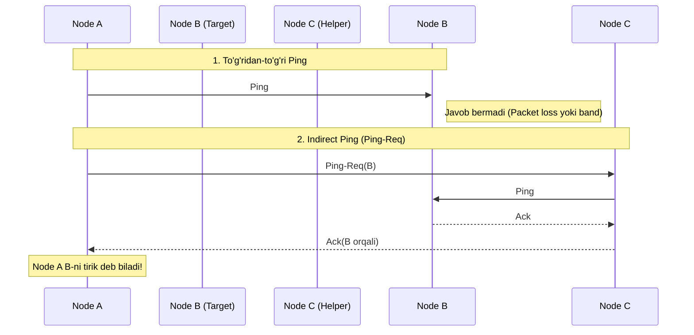
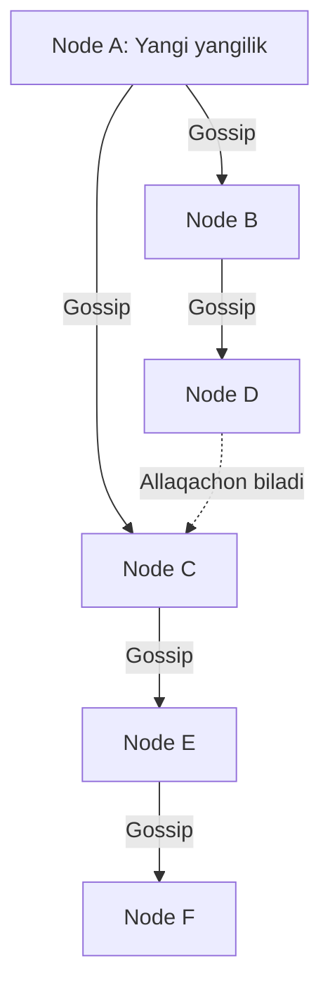

## 1. 💡 Sodda Tushuntirish va Analogiya

Taqsimlangan tizimlarda yuzlab yoki minglab serverlar (tugunlar) mavjud bo'lganda, ularning qaysi biri ishlayotgani va qaysi biri o'chganini (membership) aniqlash yoki yangi ma'lumotlarni barcha tugunlarga tezkor yetkazish juda qiyin. Agar bitta markaziy serverdan foydalanilsa, u tizimning zaif nuqtasi (single point of failure) va yuklama yuqori nuqtasiga (bottleneck) aylanadi.

**Gossip Protocol (Mish-mish Protokoli)** — bu markazlashtirilmagan, Peer-to-Peer (P2P) aloqa usuli bo'lib, u xuddi jamiyatda mish-mishlar qanday tarqalsa, ma'lumotlarni klaster bo'ylab shunday tarqatadi.

### Mish-mish analogiyasi:
Tasavvur qiling, maktabda 100 ta o'quvchi bor. Bir o'quvchi juda qiziq yangilik (mish-mish) bildi.
1. U tasodifiy 3 ta do'stiga borib bu gapni aytadi (Fan-out = 3).
2. O'sha 3 do'stning har biri yana o'z navbatida tasodifiy 3 tadan boshqa do'stlariga aytishadi.
3. Juda qisqa vaqt ichida deyarli butun maktab bu yangilikdan xabardor bo'ladi.
Hatto ba'zi do'stlar bu gapni boshqa joyda band bo'lgani yoki maktabga kelmagani uchun eshitmay qolsa ham, keyingi safar boshqalardan baribir eshitib oladi. Bu tizim juda va har qanday direktor (markaziy server) boshqaruvini talab qilmaydi.

---

## 2. 💻 Real Kod Misoli (Sodda Gossip Simulyatori)

Quyida tugunlarning tasodifiy sherik tanlab ma'lumot almashishi simulyatsiyasi keltirilgan:

```javascript
class GossipNode {
  constructor(id, allNodeIds) {
    this.id = id;
    this.allNodeIds = allNodeIds;
    this.store = {}; // Tugun saqlayotgan ma'lumotlar
  }

  // Yangi ma'lumot qabul qilish yoki yangilash
  updateData(key, value, version) {
    const current = this.store[key];
    if (!current || current.version < version) {
      this.store[key] = { value, version };
      return true; // Ma'lumot yangilandi
    }
    return false;
  }

  // Tasodifiy bitta tugunni tanlash (o'zidan tashqari)
  selectRandomPeer() {
    const peers = this.allNodeIds.filter(peerId => peerId !== this.id);
    if (peers.length === 0) return null;
    const randomIndex = Math.floor(Math.random() * peers.length);
    return peers[randomIndex];
  }

  // Gossip yuborish (Rumor Mongering)
  gossip(nodesMap, key) {
    const peerId = this.selectRandomPeer();
    if (!peerId) return;

    const peerNode = nodesMap.get(peerId);
    const localData = this.store[key];

    if (localData && peerNode) {
      // Sherik tugunga mahalliy ma'lumotni push qiladi
      peerNode.updateData(key, localData.value, localData.version);
    }
  }
}

// Klasterni sinab ko'rish
const nodeIds = ["Node_A", "Node_B", "Node_C", "Node_D"];
const nodes = new Map();

nodeIds.forEach(id => {
  nodes.set(id, new GossipNode(id, nodeIds));
});

// Node_A yangi ma'lumot oladi
nodes.get("Node_A").updateData("config_v1", "active", 1);

// Gossip jarayoni bir necha raund davom etadi
for (let round = 1; round <= 3; round++) {
  nodes.forEach(node => {
    node.gossip(nodes, "config_v1");
  });
}

console.log("Node_D holati:", nodes.get("Node_D").store["config_v1"]);
```

---

## 3. ⚙️ Qanday Ishlaydi (Under the Hood)

### Epidemic Broadcast Models
Gossip protokoli **Epidemiya (virus tarqalishi)** matematik modellariga asoslanadi. Klasterdagi tugunlar 3 ta holatda bo'lishi mumkin:
1. **Susceptible (Yuqishi mumkin):** Ma'lumotdan hali bexabar tugun.
2. **Infective (Yuqtiruvchi/Faol):** Ma'lumotni biladi va uni boshqalarga faol tarqatmoqda (Rumor Mongering).
3. **Removed (Sog'aygan/Nofaol):** Ma'lumotni biladi, lekin endi uni tarqatishni to'xtatgan.

### Anti-Entropy vs Rumor Mongering
* **Rumor Mongering (Mish-mish tarqatish):** Yangi ma'lumot kelganda, tugun uni tasodifiy $k$ ta tugunga yuboradi. Har safar allaqachon ma'lumotni biladigan tugunga duch kelganda, tarqatish ishtiyoqi kamayadi va ma'lum bir ehtimollik bilan tarqatish to'xtatiladi. Tarmoq trafigi minimal bo'ladi, lekin ba'zi tugunlar ma'lumotni ololmay qolish ehtimoli bor.
* **Anti-Entropy (Sinxronizatsiya):** Tugunlar davriy ravishda tasodifiy sherik tanlaydi va butun ma'lumotlar omborini solishtiradi (ko'pincha **Merkle Tree** yordamida). Bu barcha tugunlarning 100% bir xil ma'lumotga ega bo'lishini (eventual consistency) kafolatlaydi, ammo tarmoqqa yuqori yuklama beradi.

### SWIM Protocol (Structured Weakness-isolation Membership)
SWIM — bu tarmoq xizmatlarida a'zolikni (membership) saqlash va nosozliklarni aniqlash (failure detection) uchun ishlatiladigan juda mashhur gossip protokolidir. U 2 ta asosiy komponentdan iborat:

1. **Failure Detector (Nosozlikni aniqlash):**
   * **Ping:** $A$ tuguni $B$ tuguniga to'g'ridan-to'g'ri ping yuboradi. Agar javob (Ack) kelmasa, $A$ uni darhol o'chgan deb hisoblamaydi (tarmoq muammosi bo'lishi mumkin).
   * **Ping-Req (Indirect Ping):** $A$ tuguni bir nechta tasodifiy yordamchi tugunlarga ($C$ va $D$) so'rov yuboradi: *"Iltimos, sizlar ham B ga ping yuborib ko'ringlar-chi"*. Agar hech kim $B$ dan javob ololmasa, $B$ shubhali (`Suspect`) deb e'lon qilinadi.
2. **Suspicion Mechanism (Shubha mexanizmi):**
   * Agar tugun shubhali deb hisoblansa, unga ma'lum vaqt beriladi. Agar bu vaqt ichida tugun o'zining tirikligini isbotlovchi xabar yubormasa, u klasterdan o'chiriladi. Bu noto'g'ri xatolik signalini (false positive) kamaytiradi.



### Vector Clocks / Lamport Timestamps
Taqsimlangan tizimda global soat (real time clock) bo'lmagani uchun ma'lumotlarning qay biri yangi ekanligini bilish qiyin. Gossip protokollarida har bir ma'lumot o'zgarishi mantiqiy soat yoki versiya raqami bilan belgilanadi. **Vector Clocks** har bir tugunning klaster haqidagi soatlar ro'yxatini saqlaydi va konfliktlarni hal qilishga yordam beradi.

---

## 4. ❌ Keng tarqalgan xatolar (Junior Mistakes)

1. **Cheksiz tarqalish (Broadcast Storm):** Mish-mishlarni tarqatishda cheklov (TTL yoki max spread counter) qo'yilmasa, eski mish-mishlar ham cheksiz aylanib, tarmoqni to'ldirib yuboradi.
2. **TCP-ni haddan ortiq ishlatish:** Gossip xabarlari juda kichik va tez-tez bo'lgani uchun TCP handshake qo'shimcha yuklama (overhead) yaratadi. Shu sababli ko'pgina gossip protokollari UDP transportidan foydalanadi.
3. **Static Peer Lists:** Barcha tugunlar ro'yxatini statik qilish. Real klasterda tugunlar dinamik ravishda qo'shiladi va o'chadi. Shuning uchun membership gossip orqali bu ro'yxatni yangilab turish kerak.

---

## 5. 🏢 Real tizimlarda qo'llanilishi

* **Apache Cassandra:** Klaster a'zolarini aniqlash, ma'lumotlarni replikatsiya qilish va tugunlarning yuklamasini bilish uchun Gossip-dan foydalanadi.
* **HashiCorp Consul:** Klaster a'zoligi va nosozliklarni aniqlash uchun SWIM protokoliga asoslangan **Serf** kutubxonasidan foydalanadi.
* **Redis Cluster:** Tugunlar o'rtasida konfiguratsiya almashish va avtomatik nosozliklarni aniqlash (failover) uchun gossip aloqasini qo'llaydi.

---

## 6. 🛠️ Amaliy Topshiriqlar

Amaliy topshiriqlarni quyida exercises bo'limida bajaring.

---

## 7. 📝 12 ta Mini Test

Testlar orqali bilimingizni tekshiring.

---

## 8. 🎯 Real Project Case Study: Consul va Serf failure detection

Consul tizimida har bir server va agent har soniyada tasodifiy tugunlarga UDP paketlari orqali ping yuboradi. Agar javob ololmasa, u 3 ta tasodifiy tugunga `ping-req` yuboradi. Bu tarmoqning mahalliy uzilishlari tufayli noto'g'ri ogohlantirishlar (false alarms) berilishini oldini oladi.

---

## 9. 🧠 Klasterda Gossip Tarqalishi



---

## 10. 📌 Cheat Sheet

| Tushuncha | Vazifasi | Asosiy xususiyati |
| :--- | :--- | :--- |
| **Rumor Mongering** | Mish-mish tarqatish | Tez tarqalish, kam trafik |
| **Anti-Entropy** | To'liq holat sinxronizatsiyasi | Merkle daraxtlari yordamida to'liq mustahkamlik |
| **SWIM** | A'zolik va xatoliklarni aniqlash | Ping + Ping-Req orqali shubha hosil qilish |
| **Fan-out** | Bitta raundda tanlanadigan sheriklar soni | O(log N) tarqalish tezligini belgilaydi |
