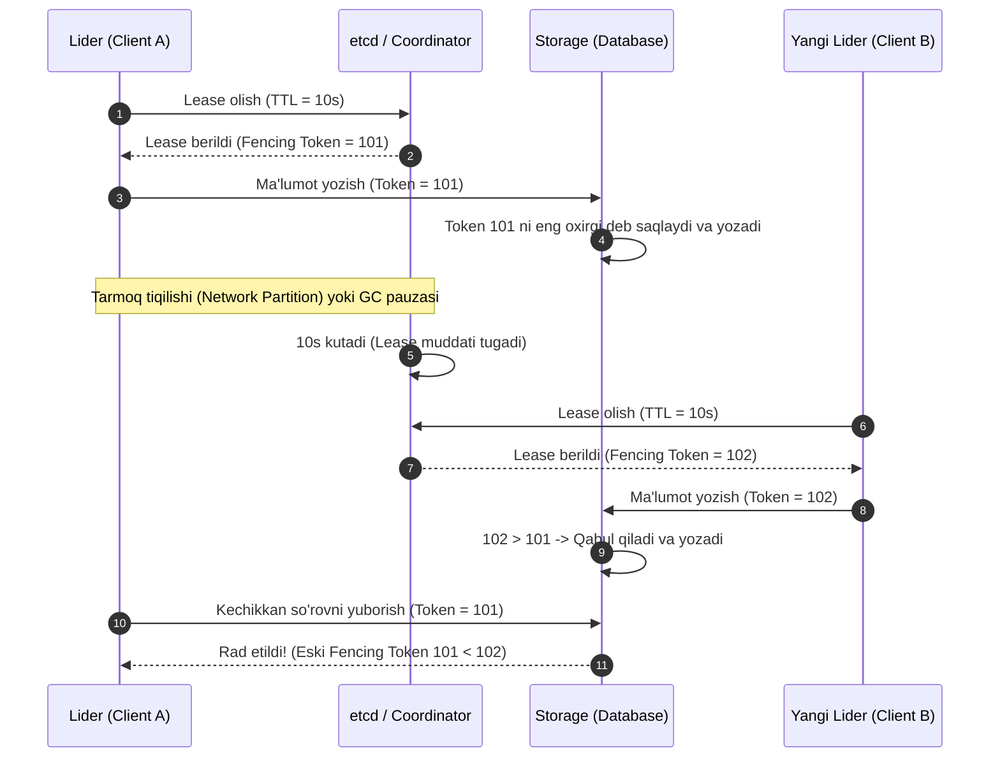

## 1. 💡 Sodda Tushuntirish va Analogiya

Taqsimlangan tizimlarda (Distributed Systems) serverlar, ma'lumotlar bazalari va mikroservislar doimiy ravishda bir-biri bilan aloqa qilib turadi. Biroq, tarmoq nosozliklari yoki serverlarning to'satdan qulashi (crash) sababli, qaysi server "tirik" (alive) va qaysi biri "o'lik" (dead) ekanligini aniqlash juda qiyin. Ushbu muammoni hal qilish uchun **Heartbeats** (Yurak urishi) va **Leases** (Ijara) mexanizmlari ishlatiladi.

### Oddiy Analogiya:

*   **Heartbeats (Yurak urishi):** Tasavvur qiling, siz qorovulxona bilan har 10 soniyada ratsiya orqali gaplashib turibsiz. Siz shunchaki "Men shu yerdaman, hammasi yaxshi" deb turasiz. Agar qorovul sizdan 30 soniya davomida hech qanday signal olmasa, u sizni hushidan ketgan yoki biror falokatga uchragan deb hisoblaydi va qutqaruvchilarni chaqiradi.
*   **Leases (Ijara):** Tasavvur qiling, siz kutubxonadan juda noyob kitobni faqat 1 soatga ijaraga oldingiz. Agar siz uni yana ishlatmoqchi bo'lsangiz, 1 soat tugashidan oldin ijara muddatini uzaytirishingiz (renew) kerak. Agar belgilangan vaqt tugasa va siz kelmasangiz, kutubxonachi kitobni boshqa odamga berib yuboradi. Siz kitobni ushlab turgan bo'lsangiz ham, endi unga egalik huquqingiz yo'q.

---

## 2. 💻 Real Kod Misollari

JavaScript (Node.js) orqali Heartbeat va Lease mexanizmlarini modellashtirish:

### 1. Heartbeat Tracker (Tugun holatini kuzatuvchi)
```javascript
class HeartbeatTracker {
  constructor(timeoutMs) {
    this.timeoutMs = timeoutMs;
    this.nodes = new Map(); // nodeId -> lastHeartbeatTimestamp
  }

  // Tugundan kelgan heartbeat signalini qayd etish
  ping(nodeId) {
    this.nodes.set(nodeId, Date.now());
  }

  // Barcha faol bo'lmagan (o'lik) tugunlarni aniqlash
  checkFailures() {
    const now = Date.now();
    const deadNodes = [];
    for (const [nodeId, lastSeen] of this.nodes.entries()) {
      if (now - lastSeen > this.timeoutMs) {
        deadNodes.push(nodeId);
      }
    }
    return deadNodes;
  }
}
```

### 2. Lease Manager (Ijara mexanizmi)
```javascript
class LeaseManager {
  constructor() {
    this.lease = null; // { ownerId, expiresAt }
  }

  // Ijarani olish yoki yangilashga urinish
  acquireOrRenew(ownerId, ttlMs) {
    const now = Date.now();
    if (!this.lease || now > this.lease.expiresAt) {
      // Ijara bo'sh yoki muddati tugagan bo'lsa yangi egaga beriladi
      this.lease = { ownerId, expiresAt: now + ttlMs };
      return true;
    } else if (this.lease.ownerId === ownerId) {
      // Eski ega muddati tugamasdan turib ijarani uzaytiradi (Keep-alive)
      this.lease.expiresAt = now + ttlMs;
      return true;
    }
    return false; // Ijara boshqa birovda va hali muddati tugamagan
  }
}
```

---

## 3. ⚙️ Qanday Ishlaydi (Under the Hood)

### Heartbeats vs Leases: Farqlar jadvali
| Xususiyat | Heartbeats | Leases |
| :--- | :--- | :--- |
| **Maqsad** | Tugunning tirikligini aniqlash (Failure Detection) | Resursga egalik qilish huquqini boshqarish (Resource Allocation / Lock) |
| **Tashabbuskor** | Asosan kuzatiluvchi tugun (push) yoki monitor (pull) | Ijarani oluvchi mijoz (Client) |
| **Vaqt bo'yicha cheklov** | Mavjud emas (faqat signal yuboriladi) | Aniq muddat (TTL - Time To Live) mavjud |
| **Xavfsizlik** | Split-brain holatida resurslarni himoya qilolmaydi | Fencing token bilan birga split-brain xavfini yo'qotadi |

### Phi Accrual Failure Detector (Shubha shkalasi)
An'anaviy failure detector'lar qat'iy timeout (masalan, 5 soniya) ishlatadi. Tarmoqda yuklama oshganda bu noto'g'ri signallarga (false positive) sabab bo'ladi.
**Phi Accrual Failure Detector** (Cassandra va Akka tizimlarida qo'llaniladi) kelgan heartbeat'lar orasidagi interval tarixiga asoslanib, tugunning o'chganlik ehtimolini ($\Phi$ - Phi shkalasi bo'yicha) dinamik hisoblab boradi. Tizim doimiy o'zgaruvchan tarmoq sharoitlariga moslashadi.

### Clock Drift (Soatlar og'ishi) muammosi
Lease mexanizmi vaqtga (TTL) tayanadi. Taqsimlangan tizimlarda turli mashinalarning tizim soatlari (system clocks) bir oz farq qilishi mumkin. Agar ijarani beruvchi va oluvchining soatlari bir xil bo'lmasa, bir tugun ijarani hali tugamadi deb o'ylasa, boshqasi uni allaqachon muddati o'tgan deb boshqa tugunga berib yuborishi mumkin. Buni oldini olish uchun soat og'ishi xatolik chegarasidan katta bo'lgan **Fencing Tokens** (oshib boruvchi raqamlar) qo'shiladi.

---

## 4. ❌ Ko'p Uchraydigan Xatolar (Junior Mistakes)

1. **Juda qisqa Heartbeat Timeout belgilash:** Tarmoq bir soniyaga sekinlashsa yoki Garbage Collection (GC) ishga tushsa, sog'lom tugunlar ham "o'lik" deb e'lon qilinadi va tizimda behuda qayta yuklash (failover storms) boshlanadi.
2. **Fencing Token'larsiz Lease'dan foydalanish:** Junior dasturchilar lock yoki lease muddati tugagach, eski lider boshqa yozish amallarini bajarmaydi deb taxmin qilishadi. Lekin u tarmoq tormozlanishi sababli kechikib, yangi lider yozgan ma'lumotlar ustidan yozib yuborishi mumkin (Dirty write).
3. **Keep-alive loopini asinxron boshqarmaslik:** Ijara yangilash so'rovlari navbatda turib qolsa va o'z vaqtida yuborilmasa, tugun hali ishlayotgan bo'lsa ham ijarani yo'qotadi.

---

## 5. 💬 12 ta Intervyu Savollari

1. **Heartbeat nima va u qanday muammoni hal qiladi?**
   Tugunning ishlayotganini davriy ravishda xabar berish orqali tarmoqdagi nosozliklar va qulashlarni aniqlash imkonini beradi.
2. **Lease (Ijara) an'anaviy Lock'dan nimasi bilan farq qiladi?**
   An'anaviy lock egasi qulab tushsa, lock abadiy qulflanib qolishi mumkin. Lease esa aniq TTL (vaqt cheklovi)ga ega bo'lib, egasi qulasa ham vaqt o'tishi bilan avtomat bo'shaydi.
3. **Fencing Token nima va u nima uchun kerak?**
   Bu har bir ijara yangilanganda oshib boruvchi monoton hisoblagich. U split-brain holatida eski liderning bazaga eski ma'lumot yozishini taqiqlash uchun xizmat qiladi.
4. **Phi Accrual Failure Detector qanday ishlaydi?**
   U qat'iy timeout o'rniga, kelgan signallar intervalining statistik tahliliga ko'ra tugunning qulash ehtimolini foizda (Phi) hisoblaydi.
5. **Clock Drift (Soatlar farqi) Leases tizimiga qanday ta'sir qiladi?**
   Tugunlar orasidagi soatlar mutanosib bo'lmasa, ijara muddatini hisoblashda xatolik yuz beradi va bir vaqtda ikki lider paydo bo'lishiga olib kelishi mumkin.
6. **etcd ephemeral keys konsepsiyasi nima?**
   etcd-dagi kalitlar ma'lum bir lease'ga bog'lanadi. Agar lease yangilanmay muddati tugasa, shu lease'ga ulangan barcha kalitlar avtomatik o'chib ketadi.
7. **Keep-alive nima?**
   Ijara muddati tugashidan oldin uni davriy ravishda uzaytirish uchun yuboriladigan so'rovlar zanjiri.
8. **Consul-da session qanday yaratiladi va boshqariladi?**
   Mijoz Consul-da session ochadi va unga TTL biriktiradi. Mijoz har safar keep-alive yuborganida session faol bo'lib turadi, aks holda u bilan bog'liq lock'lar yechiladi.
9. **Kubernetes-da Node Lease qayerda ishlatiladi?**
   Klasterdagi Node'larning holatini tekshirish va boshqaruv paneli (Control Plane)ga o'zining sog'lom ekanligini tez-tez va kam trafik bilan bildirish uchun ishlatiladi.
10. **Garbage Collection (GC) pauzalari failure detection'ga qanday xalaqit beradi?**
    GC ishga tushganda dasturning barcha oqimlari (threads) to'xtaydi ("Stop-the-world"). Bu vaqtda heartbeat yuborilmaydi va boshqa tugunlar uni o'lik deb o'ylashi mumkin.
11. **Split-Brain holati nima?**
    Tarmoq ikkiga bo'linib qolishi natijasida, har ikkala bo'lingan qism o'zini mustaqil lider deb e'lon qilishi va bir vaqtning o'zida qarama-qarshi qarorlar qabul qilishi.
12. **Master-Worker arxitekturasida Heartbeat qaysi yo'nalishda yuboriladi?**
    Odatda Worker tugunlar Master tugunga davriy ravishda push (Heartbeat) yuborishadi, ba'zida Master o'zi so'rov yuborib turadi (Pull).

---

## 6. 🛠️ Amaliy Topshiriqlar

Topshiriqlarni bajarish uchun pastdagi mashqlar bo'limiga o'ting.

---

## 7. 📝 12 ta Mini Test

Test savollariga javob berish orqali olingan bilimlaringizni sinab ko'ring.

---

## 8. 🎯 Real Project Case Study

### Kubernetes Node Leases
Eski Kubernetes versiyalarida har bir Node o'z holatini `NodeStatus` orqali API Serverga yuborar edi. Bu juda katta ob'ekt bo'lib, klasterda minglab Node'lar bo'lganda etcd omborini va tarmoqni haddan tashqari yuklab yuborardi.
Hozirgi Kubernetes tizimida har bir Node uchun maxsus kichik hajmli `Lease` ob'ekti (`coordination.k8s.io` API guruhi) yaratilgan. Node'lar o'zlarining tirikliklarini shu kichik ob'ekt muddatini uzaytirish orqali tasdiqlaydi. Bu tarmoq trafigini va etcd yuklamasini 90% dan ko'proqqa kamaytirdi.

---

## 9. 🧠 Vizual ko'rinish (Architecture Diagram)



---

## 10. 📌 Cheat Sheet

| Atama | Kalit So'z | Asosiy Vazifasi |
| :--- | :--- | :--- |
| **Heartbeat** | Status, Ping | Tugunning ishlayotganligini aniqlash |
| **Lease** | TTL, Auto-release | Resursni xavfsiz va vaqtinchalik ijaraga berish |
| **Fencing Token** | Monotonic ID | Eskirgan ijara egalarining yozishlarini rad etish |
| **Clock Drift** | Soatlar og'ishi | Tizimlar o'rtasidagi vaqt farqi xavfi |
| **Keep-alive** | Refresh Loop | Ijara tugamasdan turib uni yangilab turish |
