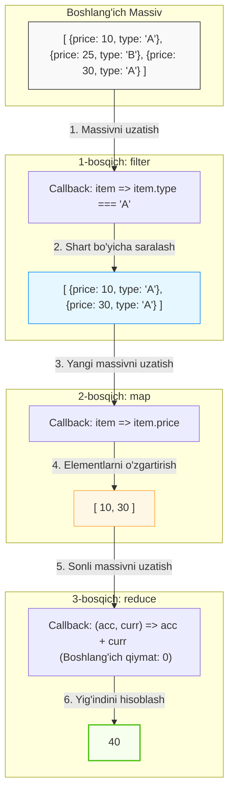

## 1. 💡 Sodda Tushuntirish va Analogiya

### Higher-Order Array Methods (Massivlar uchun Yuqori Tartibli Metodlar) nima?
Higher-order array metodlari — bu massiv elementlarini aylanish (iteratsiya qilish) jarayonini avtomatlashtiradigan va parametr sifatida boshqa funksiyani (callback) qabul qiladigan metodlardir. Oldin biz massiv elementlarini aylanish uchun `for` yoki `while` tsikllaridan foydalangan bo'lsak, endi maxsus tayyor metodlar orqali kodni qisqaroq, o'qilishi osonroq va xatolardan xoli qilamiz.

### Real hayotiy analogiya
Tasavvur qiling, siz **maktab direktorisiz** va sizda **o'quvchilar ro'yxati** bor:
* **`forEach` (Shunchaki tanishish):** Siz sinfdagi har bir o'quvchining oldiga borib salomlashib chiqasiz, lekin ulardan hech narsa talab qilmaysiz va yangi ro'yxat tuzmaysiz.
* **`map` (Kiyintirish):** Siz har bir o'quvchiga yangi maktab formasini berib, kiyintirib, **yangi formadagi o'quvchilar ro'yxatini** yaratasiz. Asl o'quvchilar o'zgargani yo'q, lekin sizda yangi ko'rinishdagi o'quvchilar ro'yxati paydo bo'ldi.
* **`filter` (Saralash):** Siz ro'yxatdan faqat a'lochi o'quvchilarni alohida ajratib, **a'lochilarning yangi ro'yxatini** tuzasiz.
* **`reduce` (Birlashtirish/Jamlash):** Siz har bir o'quvchidan darsliklar uchun to'lov pullarini yig'ib olasiz va oxirida bitta umumiy jamg'armani (bitta qiymat: summani) olasiz.

---

## 2. 💻 Real Kod Misollari

### 1. Basic Example (forEach va map metodlari)
Massiv elementlari bilan ishlash va ularni o'zgartirib yangi massiv olish:
```javascript
const numbers = [1, 2, 3, 4];

// 1. forEach() - shunchaki har bir elementni konsolga chiqarish
numbers.forEach(num => console.log(num * 2)); 
// Konsol: 2, 4, 6, 8 (lekin forEach o'zidan hech narsa qaytarmaydi, ya'ni undefined)

// 2. map() - elementlarni 2 ga ko'paytirib yangi massiv olish
const doubled = numbers.map(num => num * 2);
console.log(doubled); // [2, 4, 6, 8]
console.log(numbers); // [1, 2, 3, 4] (asl massiv o'zgarmadi!)
```

### 2. Intermediate Example (filter va find metodlari)
Massiv ichidan ma'lumotlarni saralash va qidirish:
```javascript
const users = [
  { id: 1, name: 'Ali', age: 17 },
  { id: 2, name: 'Vali', age: 20 },
  { id: 3, name: 'Sardor', age: 25 }
];

// 1. filter() - yoshi 18 dan katta bo'lgan barcha foydalanuvchilarni olish
const adults = users.filter(user => user.age >= 18);
console.log(adults); 
// [{ id: 2, name: 'Vali', age: 20 }, { id: 3, name: 'Sardor', age: 25 }]

// 2. find() - IDsi 2 ga teng bo'lgan birinchi foydalanuvchini olish (obyektning o'zi qaytadi)
const userVali = users.find(user => user.id === 2);
console.log(userVali); // { id: 2, name: 'Vali', age: 20 }

// 3. findIndex() - yoshi 20 ga teng bo'lgan element indeksini topish
const index = users.findIndex(user => user.age === 20);
console.log(index); // 1
```

### 3. Advanced Example (reduce va zanjir hosil qilish - Pipeline Chaining)
Reduce yordamida yig'indini hisoblash hamda map va filter metodlarini zanjir shaklida ketma-ket ulash:
```javascript
const cart = [
  { name: 'Noutbuk', price: 1000, category: 'tech' },
  { name: 'Telefon', price: 500, category: 'tech' },
  { name: 'Kitob', price: 20, category: 'books' }
];

// 1. reduce() - barcha mahsulotlar narxi yig'indisini hisoblash
const totalSum = cart.reduce((accumulator, currentItem) => {
  return accumulator + currentItem.price;
}, 0); // 0 - accumulator ning boshlang'ich qiymati
console.log(totalSum); // 1520

// 2. Chaining (Zanjirlash) - texnik mahsulotlarni filtrlab, ularga 10% chegirma berish va narxlarini olish
const discountedTech = cart
  .filter(item => item.category === 'tech')
  .map(item => item.price * 0.9);

console.log(discountedTech); // [900, 450]
```

---

## 3. ⚙️ Qanday Ishlaydi (Under the Hood)

### Callback funksiyalarning bajarilish mexanizmi
Higher-order metodlar chaqirilganda, JS dvigateli massiv elementi ustida ichki tsikl (loop) hosil qiladi. Dvigatel har bir qadamda biz taqdim etgan callback funksiyani chaqiradi va unga quyidagi 3 ta argumentni uzatadi:
1. `currentValue` (Hozirgi element)
2. `index` (Hozirgi element indeksi)
3. `array` (Metod chaqirilgan asl massivning o'zi)

Masalan, `.map(item => item * 2)` yozganimizda, dvigatel orqa fonda quyidagiga o'xshash operatsiyani bajaradi:
```javascript
// Map metodining soddalashtirilgan polyfill (orqa fonda ishlash prinsipi)
Array.prototype.myMap = function(callback) {
  const result = [];
  for (let i = 0; i < this.length; i++) {
    // Callback chaqirilib, natijasi yangi massivga qo'shiladi
    result.push(callback(this[i], i, this));
  }
  return result;
};
```

### Reduce metodidagi akkumulyator (Accumulator) qanday ishlaydi?
`.reduce()` metodining ishlashi boshqacha. U massivni aylanib chiqib, yagona yakuniy qiymat (son, string, obyekt yoki boshqa massiv) hosil qiladi.
* **Boshlang'ich qiymat (initialValue) berilganda:** Akkumulyator (`acc`) ushbu boshlang'ich qiymatga teng bo'ladi va tsikl 0-indeksdagi elementdan boshlanadi.
* **Boshlang'ich qiymat berilmaganda:** Akkumulyator massivning 0-indeksdagi elementiga teng bo'lib qoladi va tsikl 1-indeksdan boshlanadi. *Agarda massiv bo'sh bo'lsa va boshlang'ich qiymat berilmagan bo'lsa, TypeError xatosi sodir bo'ladi.*

---

## 4. ❌ Ko'p Uchraydigan Xatolar (Junior Mistakes)

### 1. `.map()` callback funksiyasida `return` yozishni unutib qo'yish
* **Noto'g'ri (Qiymatlar undefined bo'lib qoladi):**
  ```javascript
  const numbers = [1, 2, 3];
  const doubled = numbers.map(num => {
    num * 2; // return yozilmadi!
  });
  console.log(doubled); // [undefined, undefined, undefined]
  ```
* **To'g'ri:**
  ```javascript
  const numbers = [1, 2, 3];
  // Arrow funksiyada figurali qavssiz yozilsa, return avtomatik bajariladi:
  const doubled = numbers.map(num => num * 2);
  // Yoki figurali qavs bilan:
  // const doubled = numbers.map(num => { return num * 2; });
  console.log(doubled); // [2, 4, 6]
  ```

### 2. Har doim `.map()` ishlatish (hatto yangi massiv kerak bo'lmasa ham)
* **Noto'g'ri (Samarasiz xotira sarfi):**
  ```javascript
  const numbers = [1, 2, 3];
  // Maqsad faqat konsolga chiqarish, lekin map yangi massiv yaratib xotirani band qiladi:
  numbers.map(num => console.log(num));
  ```
* **To'g'ri (Faqat tsikl kerak bo'lsa `forEach` yoki `for...of` ishlating):**
  ```javascript
  const numbers = [1, 2, 3];
  numbers.forEach(num => console.log(num));
  ```

### 3. Callback ichida asl massivni yoki akkumulyatorni mutatsiyaga (o'zgarishga) uchratish
* **Noto'g'ri (Asl ma'lumotlar buziladi):**
  ```javascript
  const users = [{ name: 'Ali' }, { name: 'Vali' }];
  const updated = users.map(user => {
    user.name = user.name.toUpperCase(); // Asl obyektdagi name ham o'zgarib ketadi!
    return user;
  });
  ```
* **To'g'ri (Nusxa olib o'zgartirish - Immutability):**
  ```javascript
  const users = [{ name: 'Ali' }, { name: 'Vali' }];
  const updated = users.map(user => ({
    ...user,
    name: user.name.toUpperCase()
  })); // Yangi obyekt nusxasi qaytadi
  ```

---

## 5. 💬 12 ta Intervyu Savollari

### Junior Darajasi (1–4)
1. **Savol:** Higher-order array metodlari nima va ular oddiy `for` tsiklidan nimasi bilan farq qiladi?
   * **Javob:** Bu metodlar o'ziga argument sifatida boshqa bir funksiyani (callback) qabul qiladi. Ular deklarativ (declarative) yozuv uslubini ta'minlaydi, ya'ni biz qanday aylanishni emas, balki element ustida nima amal bajarilishini yozamiz. Bu kodni o'qish va yuritishni osonlashtiradi.
2. **Savol:** `.map()` va `.forEach()` metodlarining asosiy farqi nimada?
   * **Javob:** `.map()` har bir element uchun callback bajarib, natijalardan yangi massiv qaytaradi (immutability). `.forEach()` esa shunchaki elementlarni aylanib chiqadi va har doim `undefined` qaytaradi.
3. **Savol:** `.filter()` metodi shartga mos element topa olmasa nima qaytaradi? `.find()`chi?
   * **Javob:** `.filter()` shartga mos hech narsa topilmasa bo'sh massiv `[]` qaytaradi. `.find()` esa shartga mos birinchi elementni topsa o'sha element qiymatini, topa olmasa `undefined` qaytaradi.
4. **Savol:** Arrow funksiyani `.map()` ichida qisqa yozganda nima uchun figurali qavslar `{}` ishlatsak `return` yozishimiz shart?
   * **Javob:** Strelkali funksiyalarda figurali qavs blok (body) ochadi. Agar blok ochilsa, JavaScript natijani qaytarish uchun aniq `return` kalit so'zini talab qiladi. Qavslarsiz yozilganda esa `return` avtomatik (implicit return) tarzda sodir bo'ladi.

### Middle Darajasi (5–8)
5. **Savol:** `.reduce()` metodidagi accumulator (akkumulyator) nima vazifani bajaradi va boshlang'ich qiymat (initialValue) berish nega muhim?
   * **Javob:** Akkumulyator oldingi iteratsiyadan qaytgan natijani o'zida yig'ib boradi. Boshlang'ich qiymat berish akumulyatorning ilk holatini va o'zgaruvchi turini (son, massiv, obyekt va h.k.) belgilaydi. Agar boshlang'ich qiymat berilmasa, u massivning birinchi elementiga teng bo'lib qoladi va bo'sh massivlar holatida TypeError xatosi sodir bo'ladi.
6. **Savol:** `.some()` va `.every()` metodlari nima qaytaradi va ular qanday optimallashtirilgan?
   * **Javob:** Ikkala metod ham boolean (`true`/`false`) qiymat qaytaradi. Ular short-circuit (qisqa tutashuv) mexanizmi bilan ishlaydi: `.some()` massivda kamida bitta true shartni topsa, aylanishni to'xtatadi; `.every()` esa bitta false shartni topsa, zudlik bilan aylanishni to'xtatib false qaytaradi.
7. **Savol:** Chaining (zanjirlash) nima va uning qanday salbiy tomonlari bo'lishi mumkin?
   * **Javob:** Chaining — bu massiv metodlarini (masalan, `filter().map().reduce()`) ketma-ket ulashdir. Salbiy tomoni shundaki, har bir oraliq metod (filter, map) xotirada yangi oraliq massiv yaratadi, bu juda katta hajmdagi massivlarda performance (samaradorlik) va xotira muammolariga olib kelishi mumkin.
8. **Savol:** `const arr = [1, 2, 3]; arr.map(parseInt)` kodi bajarilganda natija qanday bo'ladi va nega?
   * **Javob:** Natija `[1, NaN, NaN]` bo'ladi. Sababi `.map()` callback funksiyasiga 3 ta argument uzatadi: `(element, index, array)`. `parseInt` esa ikkita argument qabul qiladi: `parseInt(string, radix)`. Natijada `parseInt(1, 0)` -> `1`, `parseInt(2, 1)` -> `NaN` (radix 1 bo'lolmaydi), `parseInt(3, 2)` -> `NaN` (2 lik sanoq tizimida 3 raqami yo'q) bo'lib ishlaydi.

### Senior Darajasi (9–12)
9. **Savol:** Higher-order metodlaridagi callback ichida asinxron amallar (masalan `async/await` yoki `Promise`) ishlatilsa nima sodir bo'ladi?
   * **Javob:** Higher-order metodlar (masalan `map`, `forEach`) asinxron callbacklar tugashini kutmaydi. `.map(async x => ...)` chaqirilsa, u darhol Promise'lar massivini (`Promise[]`) qaytaradi. Asinxron massiv aylanishlarida ketma-ketlikni kutish uchun `for...of` tsikli yoki parallel bajarish uchun `Promise.all(arr.map(...))` ishlatish kerak.
10. **Savol:** Massivlarni transformatsiya qilishda nima uchun `.reduce()` metodini eng universal metod deb atashadi?
    * **Javob:** Chunki `.reduce()` yordamida qolgan barcha yuqori tartibli metodlarni (map, filter, find, forEach, every, some) qayta yozish va modellashtirish mumkin. U har qanday ma'lumot turini boshqa har qanday ma'lumot turiga (yagona son, massiv, murakkab obyekt) transformatsiya qilish kuchiga ega.
11. **Savol:** Katta hajmdagi ma'lumotlarni qayta ishlashda zanjirli metodlar (map, filter) o'rniga qanday optimallash usullarini qo'llash mumkin?
    * **Javob:** Zanjirlarni bitta `.reduce()` ga birlashtirish orqali massivni faqat bir marotaba aylanish mumkin. Yoki klassik `for` tsiklidan foydalanish eng yuqori tezlikni beradi. Bundan tashqari, Generatorlardan yoki transducer (transductions) yondashuvidan foydalanib oraliq massivlar yaratilishining oldini olish mumkin.
12. **Savol:** `thisArg` parametri nima va uni strelkali callback funksiyalar bilan birga ishlatishda qanday muammo bor?
    * **Javob:** `thisArg` — ko'pgina massiv metodlarining ikkinchi ixtiyoriy argumenti bo'lib, callback funksiya ichidagi `this` kalit so'zi qaysi obyektga ishora qilishini belgilaydi. Muammo shundaki, arrow funksiyalar o'zining shaxsiy `this` kontekstiga ega emas (leksik context), shuning uchun arrow funksiya ishlatilganda `thisArg` mutlaqo ishlamaydi. Buni faqat klassik `function()` kalit so'zi yordamida yozilgan callbacklar bilan ishlatish lozim.

---

## 6. 🛠️ Amaliy Topshiriqlar

Quyidagi Mermaid diagrammasi massiv ma'lumotlarini transformatsiya qilish (Pipeline) jarayonini tasvirlaydi. Bu yerda dastlabki massiv filter orqali saralanadi, map orqali shakli o'zgartiriladi va reduce yordamida yakuniy yagona qiymatga jamlanadi. Callback funksiyalar har bir bosqichda qanday rol o'ynashini ko'rishingiz mumkin:



* **Filter:** Callback har bir element uchun rostlik qiymatini qaytaradi. Rost (`true`) bo'lsa element qoladi, aks holda tushib qoladi.
* **Map:** Callback har bir elementni oladi va uning o'rniga yangi qiymat qaytaradi. Massiv uzunligi o'zgarmaydi.
* **Reduce:** Callback akkumulyator va joriy elementni qabul qilib, ularni bitta yakuniy qiymatga jamlaydi.

---

## 7. 📝 12 ta Mini Test

Darsimizning quizzes bo'limida higher-order metodlar, xotira optimizatsiyasi va callback kontekstlari bo'yicha tayyorlangan 12 ta test savolini yechib, bilimingizni sinab ko'ring. Har bir savolda to'g'ri javob bilan birga batafsil tushuntirish berilgan.

---

## 8. 🎯 Real Project Case Study

### Elektron do'kon uchun Buyurtma ma'lumotlarini qayta ishlash (Analytics Pipeline)
Katta hajmdagi tranzaksiyalar va buyurtmalarni tahlil qilishda higher-order array metodlarini zanjir shaklida ishlatish juda qo'l keladi. Quyidagi misolda biz tranzaksiyalar ro'yxatidan faqat muvaffaqiyatli yakunlangan (`completed`) va ma'lum bir sana doirasidagi buyurtmalarni olamiz, so'ngra foydalanuvchilar sotib olgan mahsulotlar bo'yicha umumiy daromadni kategoriyalar kesimida hisoblaymiz:

```javascript
const orders = [
  { id: 101, status: 'completed', category: 'electronics', amount: 1200, tax: 50 },
  { id: 102, status: 'pending', category: 'clothing', amount: 150, tax: 10 },
  { id: 103, status: 'completed', category: 'electronics', amount: 800, tax: 30 },
  { id: 104, status: 'completed', category: 'books', amount: 45, tax: 2 },
  { id: 105, status: 'failed', category: 'electronics', amount: 500, tax: 20 },
  { id: 106, status: 'completed', category: 'clothing', amount: 300, tax: 15 }
];

// Bizga faqat 'completed' bo'lgan buyurtmalar bo'yicha umumiy sof daromad (amount + tax) kerak.
// Buni ketma-ket filter va reduce yordamida toza usulda bajaramiz:

const completedRevenue = orders
  .filter(order => order.status === 'completed')
  .reduce((acc, order) => {
    const totalAmount = order.amount + order.tax;
    
    // Kategoriya bo'yicha guruhlaymiz va yig'indini hisoblaymiz
    if (!acc[order.category]) {
      acc[order.category] = 0;
    }
    acc[order.category] += totalAmount;
    
    // Umumiy summana ham hisoblab boramiz
    acc.grandTotal = (acc.grandTotal || 0) + totalAmount;
    
    return acc;
  }, {});

console.log("Kategoriyalar bo'yicha hisobot:", completedRevenue);
/*
Natija:
{
  electronics: 2080,
  books: 47,
  clothing: 315,
  grandTotal: 2442
}
*/
```

---

## 9. 🚀 Performance va Optimization

Massivlar ustida yuqori tartibli metodlarni qo'llashda quyidagi qoidalarga rioya qilish kod tezligini sezilarli darajada oshiradi:

1. **Zanjirlashning xotira qiymati (Intermediate Arrays memory allocation):**
   Agarda sizda 100,000 ta elementdan iborat massiv bo'lsa, `.filter().map()` zanjirini bajarish xotirada yana ikkita yangi massiv yaratilishiga sabab bo'ladi.
   * **Yechim:** Bir necha bosqichli amallarni bitta `.reduce()` ichiga jamlang. Shunda massiv faqat 1 marta aylanadi va ortiqcha xotira ajratilmaydi.
2. **Klassik Looplar vs Higher Order ($O(N)$ vs $O(N)$):**
   Algoritmik jihatdan ikkalasi ham chiziqli vaqt oladi. Biroq, micro-benchmarklarda klassik `for` tsikli higher-order metodlariga qaraganda 2–10 baravar tezroq ishlashi mumkin. Sababi, higher-order metodlar har bir element uchun yangi funksiya chaqiruvi (function call overhead) va stack'ni band qilishni talab qiladi.
3. **Short-Circuit funksiyalaridan unumli foydalanish:**
   Agar sizga massivda shartga mos keladigan bitta element bor-yo'qligi kerak bo'lsa, `.filter().length > 0` deb yozmang! U butun massivni aylanib chiqadi. Buning o'rniga `.some()` ishlating. U shart bajarilishi bilanoq tsiklni to'xtatadi.

> [!TIP]
> Agar loyihangiz real-time ma'lumotlar yoki o'ta katta massivlar (masalan, Canvas grafik chizmalari yoki katta ma'lumotlar bazasi replikatsiyasi) bilan ishlayotgan bo'lsa, higher-order metodlar o'rniga oddiy `for` tsiklidan foydalanish maqsadga muvofiq. Kundalik veb-ilovalarda esa o'qilishi oson bo'lganligi sababli `map`/`filter`/`reduce` metodlaridan foydalangan ma'qul.

---

## 10. 📌 Cheat Sheet

| Metod | Asosiy Vazifasi | Callback Qaytarishi Kerak Bo'lgan Qiymat | Metod Qaytaradigan Yakuniy Qiymat | Asl Massivni O'zgartiradimi? | Short-Circuit (Tez To'xtash)? |
| :--- | :--- | :--- | :--- | :--- | :--- |
| **`forEach`** | Elementlarni shunchaki aylanib chiqish | Kerak emas (inobatga olinmaydi) | `undefined` | Yo'q | Yo'q |
| **`map`** | Elementlarni o'zgartirib yangi massiv hosil qilish | Yangi element qiymati | Yangi o'zgartirilgan massiv | Yo'q | Yo'q |
| **`filter`** | Shartga mos keladigan elementlarni saralash | Truthy / Falsy (rost yoki yolg'on) | Saralangan yangi massiv | Yo'q | Yo'q |
| **`reduce`** | Elementlarni bitta yagona qiymatga yig'ish | Navbatdagi akkumulyator qiymati | Yig'ilgan yakuniy qiymat | Yo'q | Yo'q |
| **`find`** | Shartga mos birinchi elementni qidirish | Truthy / Falsy | Topilgan element qiymati yoki `undefined` | Yo'q | **Ha** (topishi bilan to'xtaydi) |
| **`findIndex`**| Shartga mos birinchi element indeksini qidirish | Truthy / Falsy | Topilgan element indeksi yoki `-1` | Yo'q | **Ha** (topishi bilan to'xtaydi) |
| **`some`** | Shartga mos kamida bitta element borligini tekshirish | Truthy / Falsy | `true` yoki `false` | Yo'q | **Ha** (`true` topilsa darhol to'xtaydi) |
| **`every`** | Barcha elementlar shartga mos kelishini tekshirish | Truthy / Falsy | `true` yoki `false` | Yo'q | **Ha** (`false` topilsa darhol to'xtaydi) |
