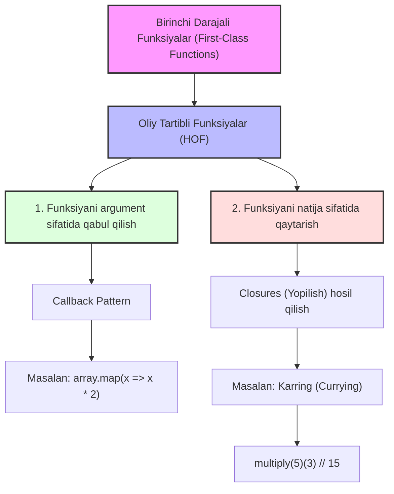

## 1. 💡 Sodda Tushuntirish va Analogiya

### Higher-Order Functions va Currying nima?
* **First-Class Functions (Birinchi darajali funksiyalar):** JavaScript-da funksiyalar boshqa har qanday qiymat (son, satr, obyekt) kabi teng huquqlidir. Ularni o'zgaruvchilarga saqlash, boshqa funksiyalarga argument qiblyuborish yoki funksiyadan qaytarish mumkin.
* **Higher-Order Function (HOF - Oliy tartibli funksiya):** Kamida bitta funksiyani parametr (argument) sifatida qabul qiladigan yoki natija sifatida yangi funksiya qaytaradigan funksiyadir.
* **Currying (Karring):** Bir nechta argument qabul qiladigan funksiyani bittadan argument oladigan zanjirli funksiyalar ketma-ketligiga aylantirish uslubidir.

### Real hayotiy analogiya

1. **Higher-Order Function (Ish boshqaruvchi):**
   Tasavvur qiling, siz bir **tashkilot direktorisiz (HOF)**. Siz o'zingiz jismoniy ishlar bilan shug'ullanmaysiz. Buning o'rniga, ishchini chaqirib unga topshiriq berasiz (**callback qabul qilasiz**) yoki yangi loyiha uchun alohida boshqaruvchi tayinlab, uni ishga tushirasiz (**funksiya qaytarasiz**).

2. **Currying (Muddatli to'lov / Bo'lib to'lash):**
   Siz do'kondan qimmatbaho noutbuk sotib olmoqchisiz. Noutbukning to'liq narxini birdaniga to'lash o'rniga (barcha argumentlarni birdan berish), siz har oy ma'lum bir qismini to'lab borasiz (birinchi oy `a`, keyingi oy `b` argumentlarini alohida berasiz). Oxirgi to'lovni qilganingizdan keyingina noutbuk butunlay sizniki bo'ladi (yakuniy natija qaytadi).

---

## 2. 💻 Real Kod Misollari

### 1. Basic Example (Funksiyani argument qabul qiluvchi HOF)
Massiv aylanib chiquvchi yoki biror amalni berilgan marta takrorlovchi oliy tartibli funksiya:
```javascript
function repeat(n, action) {
  for (let i = 0; i < n; i++) {
    action(i); // Callback funksiyasi parametr sifatida chaqirilmoqda
  }
}

// Qadam ko'rsatkichini konsolga chiqaruvchi callback uzatildi
repeat(3, (index) => {
  console.log(`Qadam: ${index}`);
});
// Natija:
// Qadam: 0
// Qadam: 1
// Qadam: 2
```

### 2. Intermediate Example (Funksiya qaytaruvchi HOF va Currying)
Dinamik ravishda ko'paytirish funksiyalarini yaratuvchi oliy tartibli funksiya va arrow syntax orqali yozilgan Currying:
```javascript
// Oddiy funksiya qaytarish
function createMultiplier(factor) {
  return function(num) {
    return num * factor; // 'factor' o'zgaruvchisi closure orqali eslab qolinadi
  };
}

const double = createMultiplier(2);
console.log(double(10)); // 20

// Arrow syntax yordamida zanjirli Currying:
const multiply = a => b => a * b;
const multiplyByFive = multiply(5); // Partial application: a = 5 bog'landi

console.log(multiplyByFive(4)); // 20
console.log(multiply(3)(7));    // 21
```

### 3. Advanced Example (Funksiyalar kompozitsiyasi - Pipe)
Kichik funksiyalarni birlashtirib, konveyer (pipeline) hosil qiluvchi oliy tartibli funksiya:
```javascript
const cleanText = str => str.trim();
const uppercase = str => str.toUpperCase();
const emphasize = str => `*** ${str} ***`;

// Pipe funksiyasi chapdan o'ngga qarab ketma-ketlikni bajaradi
const pipe = (...funcs) => (initialValue) => funcs.reduce((value, fn) => fn(value), initialValue);

// Yangi formatlovchi funksiya hosil qilamiz
const formatStatus = pipe(cleanText, uppercase, emphasize);

console.log(formatStatus("   active   ")); // "*** ACTIVE ***"
```

---

## 3. ⚙️ Qanday Ishlaydi (Under the Hood)

### First-Class Functions xotirada
JavaScript dvigateli funksiyalarni oddiy obyektlar kabi boshqaradi. Funksiyalar xotiraning **Heap** (dasta) qismida saqlanadi. Biz funksiyani boshqasiga parametr qiblyuborganda, funksiyaning butun tanasi emas, balki uning xotiradagi havolasi (**reference**) uzatiladi.

### Closures va Leksik Muhit (Lexical Environment)
Qachonki oliy tartibli funksiya o'zidan ichki funksiyani qaytarsa, u nafaqat kodni, balki shu funksiya yaratilgan vaqtdagi barcha tashqi o'zgaruvchilarni o'z ichiga olgan **Lexical Environment**ni ham "yopib" (muhrlab) oladi. 
Karring zanjirining har bir bosqichida yangi yopilishlar (closures) hosil bo'bo'ladi. Masalan, `multiply(5)(3)` chaqirilganda:
1. `multiply(5)` chaqirilib, `a = 5` bo'lgan Leksik muhit yaratiladi va ichki funksiya qaytariladi.
2. Qaytarilgan funksiya xotirada saqlanadi. U tashqaridagi `a` o'zgaruvchisiga havola tutib turadi.
3. Keyingi `(3)` chaqirig'i bajarilganda, u `b = 3` ni oladi va yopilishdagi `a` (5) bilan ko'paytiradi.

> [!IMPORTANT]
> Karring qilingan funksiyalar va HOFlar ko'p miqdorda chaqirilganda, har safar yangi funksiya obyektlari va leksik muhitlar yaratiladi. Bu esa Garbage Collector (axlat yig'uvchi) uchun qo'shimcha ish yukini keltirib chiqaradi.

---

## 4. ❌ Ko'p Uchraydigan Xatolar (Junior Mistakes)

### 1. Callback uzatish o'rniga uni darhol chaqirib yuborish
Dasturchilar ko'pincha funksiya havolasini (reference) uzatish o'rniga qavslarni qo'yib, uni darhol chaqirib yuborishadi.
* **Xato:**
  ```javascript
  function sayHi(name) {
    console.log(`Salom, ${name}`);
  }
  // sayHi('Anvar') zudlik bilan ishlaydi va undefined qaytaradi
  setTimeout(sayHi('Anvar'), 1000); 
  ```
* **Tuzatish:**
  ```javascript
  // Reference yuboriladi yoki arrow funksiya ichiga olinadi
  setTimeout(() => sayHi('Anvar'), 1000);
  ```

### 2. Currying chaqirig'ida argumentlar qavsini noto'g'ri qo'yish
Karring funksiyani chaqirishda oddiy funksiyalar kabi bitta qavs ichida argumentlarni yozish.
* **Xato:**
  ```javascript
  const add = a => b => a + b;
  console.log(add(2, 3)); // b => 2 + b funksiyasini qaytaradi (son emas!)
  ```
* **Tuzatish:**
  ```javascript
  console.log(add(2)(3)); // 5
  ```

### 3. Obyekt metodlarini callback qilib berganda `this` yo'qolishi
* **Xato:**
  ```javascript
  const user = {
    name: "Toshpo'lat",
    greet() { console.log(`Men ${this.name}`); }
  };
  function executeAction(callback) {
    callback(); // Bu yerda this global obyektga yoki undefined-ga aylanadi
  }
  executeAction(user.greet); // "Men undefined"
  ```
* **Tuzatish:**
  ```javascript
  // bind yordamida context-ni qotirib qo'yamiz
  executeAction(user.greet.bind(user)); // "Men Toshpo'lat"
  ```

---

## 5. 💬 12 ta Intervyu Savollari

### Junior
1. **Savol:** JavaScript-da "First-Class Functions" (Birinchi darajali funksiyalar) nimani anglatadi?
   * **Javob:** Funksiyalar boshqa har qanday ma'lumot turi (number, string) kabi qiymat deb hisoblanadi. Ularni o'zgaruvchiga o'zlashtirish, parametr sifatida uzatish va boshqa funksiyadan qaytarish mumkin.
2. **Savol:** Higher-Order Function (Oliy tartibli funksiya) nima?
   * **Javob:** Boshqa funksiyani argument qabul qiladigan yoki o'zidan yangi funksiya qaytaradigan funksiyaga aytiladi.
3. **Savol:** Callback funksiya nima?
   * **Javob:** Boshqa funksiyaga argument qilib yuborilgan va ma'lum shart/hodisa bajarilgandan keyin chaqiriladigan funksiyadir.
4. **Savol:** Karring (Currying) jarayoni nima va u qanday yoziladi?
   * **Javob:** Ko'p argumentli funksiyani bittadan argument oluvchi ketma-ket funksiyalarga ajratish. Masalan: `const add = a => b => a + b;`.

### Middle
5. **Savol:** Currying va Partial Application (Qisman qo'llash) o'rtasidagi farq nimada?
   * **Javob:** Currying funksiyani har safar faqat bittagina argument oladigan qismlarga bo'ladi (`f(a)(b)(c)`). Partial application esa bir nechta argumentni oldindan bog'lab, qolgan bir nechta argumentni kutadigan funksiya qaytaradi (`f(a, b)(c, d)`).
6. **Savol:** Massivlarning qaysi built-in metodlari HOF hisoblanadi?
   * **Javob:** `.map()`, `.filter()`, `.reduce()`, `.forEach()`, `.some()`, `.every()`, `.sort()`, `.find()`. Chunki ularning hammasi callback qabul qiladi.
7. **Savol:** Obyekt metodini callback qilib boshqa HOF-ga berganimizda `this` qanday o'zgaradi? Uni qanday hal qilish mumkin?
   * **Javob:** Metod alohida chaqirilgani uchun uning `this` konteksti yo'qoladi. Buni `.bind(obj)` orqali bog'lash yoki arrow funksiya `() => obj.method()` yordamida hal qilish mumkin.
8. **Savol:** Karring yozishda closures (yopilishlar) qanday rol o'ynaydi?
   * **Javob:** Zanjirdagi ichki funksiyalar ota funksiya qabul qilgan argumentlarni (leksik muhitni) yopilish orqali eslab qoladi va eng oxirgi chaqiriqqacha saqlaydi.

### Senior
9. **Savol:** Funksiyalar kompozitsiyasidagi `compose` va `pipe` funksiyalari o'rtasida qanday farq bor?
   * **Javob:** `compose` funksiyalarni o'ngdan chapga qarab (matematik `f(g(x))` kabi) bajaradi. `pipe` esa chapdan o'ngga qarab (konveyer kabi) bajaradi.
10. **Savol:** Dinamik yoki cheksiz karring (infinite currying) qanday amalga oshiriladi (masalan, `sum(1)(2)(3)...()`)?
    * **Javob:** Ichki funksiya o'zini qaytarishi va agar argument kelmasa yig'indini berishi kerak. Masalan:
      ```javascript
      const sum = a => b => b !== undefined ? sum(a + b) : a;
      console.log(sum(1)(2)(3)()); // 6
      ```
11. **Savol:** V8 dvigateli doimiy ravishda dinamik yaratiladigan (HOF-dan qaytadigan) anonim funksiyalarni qanday optimallashtiradi va uning qanday xavfi bor?
    * **Javob:** Dinamik yaratilgan funksiyalar uchun V8 har safar yangi funksiya obyekti yaratadi, bu ularni "hot path" (tez-tez chaqiriladigan) kodda ishlatganda inline kesh (Inline Cache) optimallashini cheklashi va xotirani to'ldirishi mumkin.
12. **Savol:** HOF yordamida Decorator Pattern-ni qanday amalga oshirish mumkin?
    * **Javob:** Asl funksiyani o'zgartirmasdan, uning atrofini yangi logika bilan o'rab oladigan HOF yoziladi. Masalan, funksiya necha millisekund ishlaganini o'lchaydigan decorator tayyorlash mumkin.

---

## 6. 🛠️ Amaliy Topshiriqlar

Bu bo'limda oliy tartibli funksiyalarni qo'llash, karring va qisman qo'llash (partial application) bo'yicha mashqlarni bajarasiz.

### Funksiya Abstratsiya Patternlari

Quyidagi Mermaid diagrammasida oliy tartibli funksiyalar va ularning turlari (argument qabul qilish, yangi funksiya qaytarish, closures) ko'rsatilgan:



---

## 7. 📝 12 ta Mini Test

Dars bo'yicha o'zlashtirgan bilimlaringizni tekshirish uchun mo'ljallangan test topshiriqlari.

---

## 8. 🎯 Real Project Case Study

### Keshlovchi (Memoization) Decorator HOF
Katta loyihalarda og'ir hisob-kitoblar yoki API so'rovlarining natijalarini keshda saqlash muhim ahamiyatga ega. Biz oliy tartibli funksiya (HOF) yordamida har qanday funksiyani keshlaydigan decorator yozamiz:

```javascript
function memoize(fn) {
  const cache = new Map(); // Kesh closure (yopilish) ichida yashirin saqlanadi

  return function(...args) {
    const key = JSON.stringify(args); // Argumentlarni kalitga aylantiramiz

    if (cache.has(key)) {
      console.log(`[Keshdan olindi] Kalit: ${key}`);
      return cache.get(key);
    }

    console.log(`[Yangi hisob-kitob] Kalit: ${key}`);
    const result = fn(...args);
    cache.set(key, result);
    return result;
  };
}

// Amaliy foydalanish:
const slowMultiply = (a, b) => {
  // Simulyatsiya: og'ir ish
  let sum = 0;
  for(let i = 0; i < 1e7; i++) { sum += i; } 
  return a * b;
};

const fastMultiply = memoize(slowMultiply);

console.log(fastMultiply(5, 10)); // [Yangi hisob-kitob]... -> 50
console.log(fastMultiply(5, 10)); // [Keshdan olindi]...  -> 50 (darhol javob qaytadi)
console.log(fastMultiply(2, 3));  // [Yangi hisob-kitob]... -> 6
```

---

## 9. 🚀 Performance va Optimization

1. **Xotira sarfi (Memory Retention):**
   HOF-dan qaytarilgan funksiyalar (va ularning yopilishlari) xotirada uzoq vaqt qolib ketishi mumkin. Agar siz yaratilgan ichki funksiyani global o'zgaruvchida saqlasangiz, u bog'langan barcha tashqi o'zgaruvchilar ham Garbage Collector tomonidan tozalanmaydi. Loyihada ishlatib bo'lingandan so'ng havolani tozalashni (`fn = null`) unutmang.

2. **Loop ichida funksiya yaratmaslik:**
   Sikl (loop) ichida oliy tartibli funksiyani chaqirib funksiya hosil qilish yoki callback yaratish judayam ko'p resurs talab qiladi.
   * **Yomon:**
     ```javascript
     for (let i = 0; i < 1000; i++) {
       // Har safar yangi funksiya obyektini yaratadi
       btn.addEventListener('click', () => doSomething(i)); 
     }
     ```
   * **Yaxshi:**
     ```javascript
     const handler = (i) => () => doSomething(i);
     // Yoki logikani alohida joyda bir marta yaratish
     ```

---

## 10. 📌 Cheat Sheet

| Tushuncha | Qisqa Tavsif | Misol |
| :--- | :--- | :--- |
| **First-Class Functions** | Funksiyalarning qiymat kabi boshqarilishi | `const myFn = () => {};` |
| **Higher-Order Function** | Funksiya qabul qiluvchi yoki qaytaruvchi funksiya | `const run = cb => cb();` |
| **Currying** | `f(a, b)` ni `f(a)(b)` ko'rinishiga keltirish | `const add = a => b => a + b;` |
| **Partial Application** | Argumentlarning bir qismini oldindan biriktirish | `const addFive = add(5);` |
| **Function Composition** | Funksiyalarni ketma-ketlik konveyeriga ulash | `const pipe = (f, g) => x => g(f(x));` |
