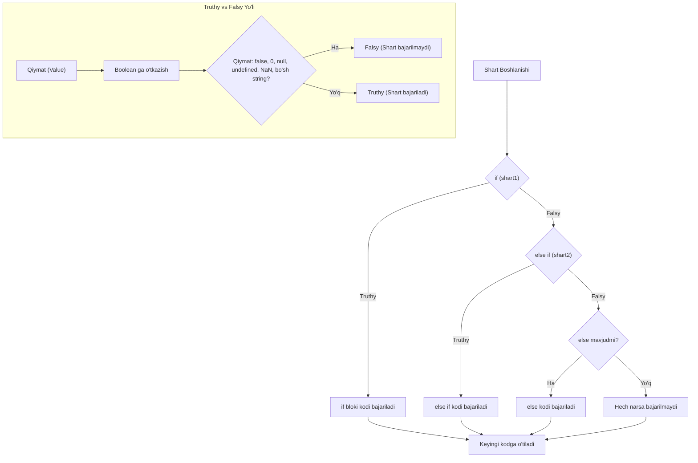

## 1. 💡 Sodda Tushuntirish va Analogiya

### Shart Operatorlari nima?
Dasturlashda ko'pincha ma'lum bir sharoitga qarab turli xil harakatlarni amalga oshirish kerak bo'ladi. JavaScript-da buni amalga oshirish uchun **shart operatorlari (`if`, `else if`, `else`)** ishlatiladi. Ular kompyuterga: "Agar mana bu shart to'g'ri bo'lsa, bu ishni qil, aks holda boshqa ishni bajar" degan ko'rsatmani beradi.

### Real hayotiy analogiya
Tasavvur qiling, siz **ertalab ko'chaga chiqmoqchisiz**:
* **`if` (Agar):** Ob-havo yomg'irli bo'lsa, soyabon olasiz (`if (yomg'ir) { soyabon_ol() }`).
* **`else if` (Yoki bo'lmasa):** Yomg'ir yog'mayotgan bo'lsa-yu, lekin qor bo'lsa, issiq kiyinasiz (`else if (qor) { issiq_kiyin() }`).
* **`else` (Aks holda):** Agar yuqoridagilarning hech biri bo'lmasa (masalan, havo shunchaki quyoshli bo'lsa), oddiy kiyimda chiqaverasiz (`else { oddiy_chiq() }`).

---

## 2. 💻 Real Kod Misollari

### 1. Basic Example (Oddiy `if-else` tekshiruvi)
Foydalanuvchining yoshiga qarab kirish ruxsatini tekshirish:
```javascript
const age = 19;

if (age >= 18) {
  console.log("Xush kelibsiz! Tizimga kirishga ruxsat berildi.");
} else {
  console.log("Kechirasiz, tizimga kirish uchun yoshingiz yetarli emas.");
}
```

### 2. Intermediate Example (Bir nechta shartlar: `else if`)
Talabaning bahosini foiziga qarab aniqlash:
```javascript
const score = 85;

if (score >= 90) {
  console.log("Sizning bahongiz: A");
} else if (score >= 80) {
  console.log("Sizning bahongiz: B");
} else if (score >= 70) {
  console.log("Sizning bahongiz: C");
} else {
  console.log("Siz imtihondan o'ta olmadingiz.");
}
```

### 3. Advanced Example (Nested shartlar va Ternary / Short-circuit kombinatsiyasi)
Foydalanuvchining hisobidagi mablag'ni tekshirish va xaridni amalga oshirish:
```javascript
const user = {
  isVIP: true,
  balance: 150,
  hasActiveDiscount: false
};

const price = 100;

// Shartli narxni belgilash (Ternary operator)
const finalPrice = user.isVIP ? price * 0.8 : price;

if (user.balance >= finalPrice) {
  // Nested (ichma-ich) shart
  if (user.hasActiveDiscount) {
    console.log("Xarid amalga oshdi va qo'shimcha bonus taqdim etildi!");
  } else {
    console.log("Xarid muvaffaqiyatli yakunlandi.");
  }
} else {
  console.log("Hisobingizda mablag' yetarli emas.");
}
```

---

## 3. ⚙️ Qanday Ishlaydi (Under the Hood)

### Truthy va Falsy tushunchasi
JavaScript `if (shart)` ichidagi ifodani baholayotganda, natijani avtomatik ravishda **Boolean** (`true` yoki `false`) turiga o'tkazadi. Bu jarayon **Type Coercion** (tur majburlash) deb ataladi.

Tizimda shart doimo `false` deb qabul qiladigan sanoqli qiymatlar mavjud, ular **Falsy qiymatlar** deyiladi:
1. `false` (boolean false)
2. `0` va `-0` (raqam nol)
3. `0n` (BigInt nol)
4. `""`, `''`, `\`` (bo'sh satr)
5. `null` (qiymat mavjud emasligi)
6. `undefined` (aniqlanmagan qiymat)
7. `NaN` (Not-a-Number, raqam emas)

Qolgan barcha qiymatlar, jumladan bo'sh massiv `[]`, bo'sh obyekt `{}`, har qanday matn (hatto ichida bo'shliq bo'lsa ham `" "`), manfiy sonlar ham **Truthy qiymatlar** hisoblanadi va `if` blokini ishga tushiradi.

---

## 4. ❌ Ko'p Uchraydigan Xatolar (Junior Mistakes)

### 1. Qiymat yuklash (`=`) bilan taqqoslash operatorini (`===`) adashtirish
* **Xato:**
  ```javascript
  let isAdmin = false;
  if (isAdmin = true) { // '=' ishlatildi! Bu amal har doim 'true' qaytaradi
    console.log("Siz adminsiz."); // Bu har doim ishlaydi!
  }
  ```
* **To'g'ri:**
  ```javascript
  let isAdmin = false;
  if (isAdmin === true) { // Yoki shunchaki if (isAdmin)
    console.log("Siz adminsiz.");
  }
  ```

### 2. Ortiqcha shartli nesting (Nested if-else) yaratish
* **Xato:**
  ```javascript
  if (user) {
    if (user.isLoggedIn) {
      if (user.hasAccess) {
        showDashboard();
      }
    }
  }
  ```
* **To'g'ri (Guard Clauses / Mantiqiy VA yordamida optimallashtirish):**
  ```javascript
  if (user && user.isLoggedIn && user.hasAccess) {
    showDashboard();
  }
  ```

### 3. Jingalak qavslarsiz yozilgan kodda ikkinchi buyruqni shartga bog'liq deb o'ylash
* **Xato:**
  ```javascript
  let loggedIn = false;
  if (loggedIn)
    console.log("Tizimdasiz!");
    showMenu(); // Qavslar yo'qligi sababli bu shartga bog'liq emas va har doim ishlaydi!
  ```
* **To'g'ri:**
  ```javascript
  let loggedIn = false;
  if (loggedIn) {
    console.log("Tizimdasiz!");
    showMenu();
  }
  ```

---

## 5. 💬 12 ta Intervyu Savollari

### Junior level
1. **Savol:** JavaScript-da qaysi qiymatlar `falsy` (noto'g'ri) deb baholanadi?
   * **Javob:** `false`, `0`, `-0`, `0n`, `""` (bo'sh satr), `null`, `undefined` va `NaN`.
2. **Savol:** Bo'sh massiv `[]` va bo'sh obyekt `{}` truthymi yoki falsy?
   * **Javob:** Ikkalasi ham `truthy` (to'g'ri). Shart ichiga qo'yilsa, shart bajariladi.
3. **Savol:** `if (x === 5)` va `if (x = 5)` o'rtasidagi farq nima?
   * **Javob:** Birinchisi `x` ning qiymati 5 ga teng yoki teng emasligini solishtiradi. Ikkinchisi `x` ga 5 qiymatini yuklaydi va u har doim truthy deb baholanib, shart bajariladi.
4. **Savol:** Ternary (uchlik) operatori nima?
   * **Javob:** Bu `if-else` ning qisqacha yozilishidir. Sintaksisi: `shart ? to'g'ri_bo'lsa : noto'g'ri_bo'lsa`.

### Middle level
5. **Savol:** Nima uchun `if ("0")` sharti bajariladi?
   * **Javob:** Chunki `"0"` bo'sh bo'lmagan matndir (string). Har qanday bo'sh bo'lmagan satr truthy hisoblanadi, garchi uning ichidagi belgi raqam nol bo'lsa ham.
6. **Savol:** Guard Clause (himoya sharti) nima va u qanday foyda beradi?
   * **Javob:** Bu funksiya boshida noto'g'ri shartlarni tekshirib, darhol funksiyani tugatish (`return`) usuli hisoblanadi. Bu kodning nesting (ichma-ich joylashishi) darajasini kamaytiradi.
7. **Savol:** Short-circuit evaluation (qisqa zanjirli baholash) nima va uni shartlar o'rniga ishlatsa bo'ladimi?
   * **Javob:** Ha. Masalan, `isUserLoggedIn && showProfile()` kodi `isUserLoggedIn` true bo'lsagina `showProfile()` ni chaqiradi.
8. **Savol:** `if-else` zanjiri va `switch-case` o'rtasidagi asosiy farq nima?
   * **Javob:** `if-else` har qanday mantiqiy va diapazonli shartlarni tekshira oladi. `switch-case` esa faqat aniq qiymatlar (literal values) ustida qat'iy tenglikni (`===`) tekshirish uchun qulayroqdir.

### Senior level
9. **Savol:** JavaScript dvigateli (V8 kabi) shart operatorlarini qanday optimallashtiradi?
   * **Javob:** Dvigatel "Branch Prediction" (tarmoqni oldindan bashorat qilish) texnikasidan foydalanadi. Agar shart ko'p hollarda true bo'lsa, u kesh orqali o'sha tarmoqni tezroq bajaradi. Shuning uchun eng ko'p bajariladigan shartlarni birinchi o'ringa qo'yish maqsadga muvofiqdir.
10. **Savol:** Quyidagi kod bajarilganda nima sodir bo'ladi va nima uchun? `if (new Boolean(false)) { console.log("Salom"); }`
    * **Javob:** Ekranga "Salom" chiqadi. Chunki `new Boolean(false)` bu Boolean obyekti yaratadi. Har qanday obyekt (xotirada yaratilgan) truthy hisoblanadi, ichidagi qiymati false bo'lsa ham.
11. **Savol:** Deeply nested `if-else` kodlarini qanday qilib refaktoring qilish mumkin?
    * **Javob:** 1. Guard clauses qo'llash orqali; 2. Lookup Table (obyektlar xaritasi) orqali; 3. Shartlarni alohida kichik funksiyalarga bo'lish orqali.
12. **Savol:** Mantiqiy `||` va `??` operatorlarining shart tekshirishdagi farqi nimada?
    * **Javob:** `||` barcha falsy qiymatlarda default qiymatga o'tadi. `??` (Nullish coalescing) esa faqat `null` yoki `undefined` bo'lgandagina o'ng tomondagi qiymatni ishlatadi.

---

## 6. 🛠️ Amaliy Topshiriqlar

Bu bo'limda shartli tarmoqlanish (if, else if, else) oqimini vizual sxema yordamida ko'rib chiqamiz.

### Shartli Oqim Diagrammasi (Flowchart)

Quyidagi diagramma shartlarni tekshirish va qiymatlarni truthy/falsy bo'yicha saralash jarayonini ko'rsatadi:



> [!TIP]
> Tizimda shartlarni yozayotganda, kutilmagan tiplar aralashib ketmasligi uchun har doim qat'iy tenglik (`===` yoki `!==`) operatorlaridan foydalaning. Bu mantiqiy xatolar (bug) yuzaga kelishini sezilarli darajada kamaytiradi.

---

## 7. 📝 12 ta Mini Test

Mavzu bo'yicha bilimlaringizni sinab ko'rish uchun testlardan o'ting. Testlarda shartli oqim, falsy va truthy qiymatlar, mantiqiy operatorlar kombinatsiyasi va kutilmagan tiplar solishtirilishiga oid savollar o'rin olgan. Har bir savol JavaScript-da shartlar qanday ishlashini teranroq tushunishingizga yordam beradi.

---

## 8. 🎯 Real Project Case Study

### Xarid Savatchasi va Chegirmalarni Hisoblash Tizimi

Real loyihalarda shart operatorlari foydalanuvchining statusi, xarid summasi va promo-kodga qarab yakuniy to'lov miqdorini aniqlashda juda keng qo'llaniladi. Quyida sodda xarid savatchasini hisoblash kodini ko'rib chiqamiz:

```javascript
// Foydalanuvchi va savatcha holati
const currentCart = {
  itemsCount: 5,
  totalAmount: 250, // dollar
  promoCode: "SUMMER20",
  paymentMethod: "CARD"
};

const userAccount = {
  isPremium: true,
  isFirstOrder: false,
  verifiedEmail: true
};

function calculateFinalTotal(cart, user) {
  // 1. Guard Clause - Email tasdiqlanmagan bo'lsa xarid taqiqlanadi
  if (!user.verifiedEmail) {
    console.log("Xatolik: Email tasdiqlanmagan. Xarid qilish mumkin emas.");
    return 0;
  }

  let discount = 0;

  // 2. Foydalanuvchi darajasiga ko'ra chegirma (else-if zanjiri)
  if (user.isPremium) {
    discount += 15; // Premium a'zolarga 15% chegirma
  } else if (user.isFirstOrder) {
    discount += 10; // Birinchi buyurtmaga 10% chegirma
  } else {
    discount += 0;
  }

  // 3. Promo-kod mavjudligini tekshirish
  if (cart.promoCode === "SUMMER20") {
    discount += 20; // SUMMER20 kodi uchun qo'shimcha 20% chegirma
  }

  // 4. Bepul yetkazib berish shartini tekshirish
  let shippingCost = 15;
  if (cart.totalAmount >= 200 || user.isPremium) {
    shippingCost = 0; // 200 dollardan oshsa yoki Premium bo'lsa yetkazib berish bepul
  }

  // Yakuniy summani hisoblash
  const discountAmount = (cart.totalAmount * discount) / 100;
  const finalPrice = cart.totalAmount - discountAmount + shippingCost;

  return {
    subtotal: cart.totalAmount,
    discountPercent: discount,
    discountAmount: discountAmount,
    shipping: shippingCost,
    total: finalPrice
  };
}

const invoice = calculateFinalTotal(currentCart, userAccount);
console.log("To'lov varaqasi:", invoice);
// Natija:
// { subtotal: 250, discountPercent: 35, discountAmount: 87.5, shipping: 0, total: 162.5 }
```

---

## 9. 🚀 Performance va Optimization

### 1. Guard Clauses (Dastlabki himoya shartlari)
Ko'p joyda `else` ishlatmasdan, funksiya boshidayoq shartga to'g'ri kelmaydigan holatlarda `return` qilib chiqib ketish o'qish tezligini oshiradi va keraksiz ifodalarni hisoblashdan saqlaydi.

### 2. Ko'p takrorlanuvchi shartlarni birinchi o'ringa qo'ying
`else if` zanjirida eng ko'p to'g'ri keladigan shart birinchi yozilishi kerak. JS dvigateli birinchi shart bajarilsa, qolgan shartlarni ko'rib ham chiqmaydi. Bu esa operatsiyalarni tejaydi.

### 3. Murakkab mantiqiy ifodalarda operatorlar ustuvorligi
`if (A || B)` ifodasida `A` true bo'lsa, `B` tekshirilmaydi. Shuning uchun `A` qismiga sodda va tez hisoblanadigan, `B` qismiga esa og'irroq tekshiruvlarni qo'ying.

---

## 10. 📌 Cheat Sheet

| Shart turi / Operator | Sintaksis | Ishlash vaqti / Maqsadi | Misol |
| :--- | :--- | :--- | :--- |
| **`if`** | `if (shart) { ... }` | Shart to'g'ri (truthy) bo'lganda kodni bajarish uchun | `if (x > 0) { console.log('Musbat'); }` |
| **`else`** | `else { ... }` | `if` sharti noto'g'ri (falsy) bo'lganda muqobil kodni bajarish | `else { console.log('Manfiy yoki nol'); }` |
| **`else if`** | `else if (shart2) { ... }` | Birinchi shart bajarilmasa, keyingi shartni tekshirish | `else if (x === 0) { console.log('Nol'); }` |
| **Ternary Operator** | `shart ? ifoda1 : ifoda2` | Qisqa `if-else` yozilishi va qiymat qaytarish | `const status = isOk ? 'Tayyor' : 'Kuting';` |
| **Falsy qiymatlar** | `false, 0, -0, 0n, "", null, undefined, NaN` | Shart tekshirilganda har doim `false` ga aylanadi | `if ("") { ... } // bajarilmaydi` |
| **Truthy qiymatlar** | Falsy bo'lmagan barcha boshqa qiymatlar (hatto `[]`, `{}`) | Shart tekshirilganda har doim `true` ga aylanadi | `if ([]) { ... } // bajariladi` |
