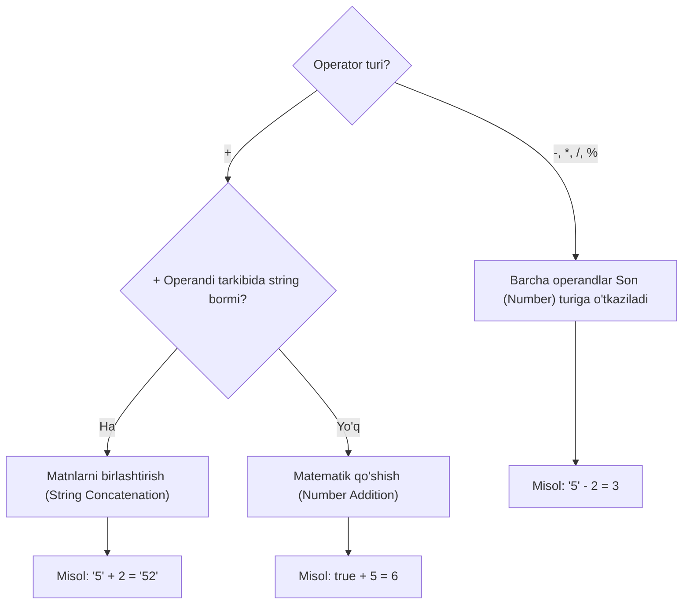

## 1. 💡 Sodda Tushuntirish va Analogiya

### Implicit Type Casting (Yashirin Type Casting / Coercion) nima?
* **Implicit Type Casting:** JavaScript dasturlash tilining o'zgaruvchilar bilan ishlashda bir ma'lumot turini boshqasiga avtomatik ravishda (dasturchining ishtirokisiz) o'tkazish xususiyatidir. Bunga ko'pincha **Type Coercion** ham deyiladi.
* **Explicit Type Casting:** Dasturchi tomonidan funksiyalar yordamida (masalan, `Number()`, `String()`) tiplarni qo'lda o'zgartirish.

### Real hayotiy analogiya
Tasavvur qiling, siz **xorijiy davlatdagi kafedasiz**:
* Kassir faqat **milliy valyutani (so'mni)** qabul qiladi.
* Siz esa unga **dollar** uzatasiz.
* Diler (JS dvigateli) kassir va sizning o'rtangizga kirib, dollar qiymatini avtomatik tarzda kurs bo'yicha so'mga aylantiradi va savdoni davom ettiradi. Siz o'zingiz bankka borib pul almashtirib kelmadingiz (explicit emas), hammasi yashirincha orqa fonda sodir bo'ldi (implicit).

Xuddi shunday, JavaScript ham `"5" - 2` amalini bajarganda, ayirish faqat sonlar o'rtasida bo'lishi mumkinligini tushunib, `"5"` matnini yashirin tarzda `5` soniga aylantirib yuboradi.

---

## 2. 💻 Real Kod Misollari

### 1. Basic Example (Plyus va Minus operatorlari farqi)
Plyus operatori matnlarni birlashtirishga, minus esa matematik hisobga moyil:
```javascript
// Plyus (+) operatori: string ustunlik qiladi
const result1 = "5" + 2; 
console.log(result1); // "52" (String)

// Minus (-) operatori: son ustunlik qiladi
const result2 = "5" - 2; 
console.log(result2); // 3 (Number)
```

### 2. Intermediate Example (Boolean va Null qiymatlarning aylanishi)
Matematik amallarda mantiqiy qiymatlar va `null` son sifatida talqin qilinadi:
```javascript
// true -> 1, false -> 0 ga aylanadi
console.log(true + 5);     // 6 (1 + 5)
console.log(false + 10);   // 10 (0 + 10)

// null -> 0 ga aylanadi
console.log(null + 7);     // 7 (0 + 7)

// undefined -> NaN ga aylanadi
console.log(undefined + 5); // NaN
```

### 3. Advanced Example (Obyektlarni Primitive tipga o'tkazish)
Obyekt yoki massivlarni boshqa qiymatlar bilan aralashtirganda kutilmagan natijalar chiqadi:
```javascript
// Massivlar default holda bo'sh string bo'lib ToPrimitive-dan o'tadi
console.log([] + []); // "" (bo'sh string)

// Massiv va obyekt qo'shilganda
console.log([] + {}); // "[object Object]" (chunki [] -> "" va {} -> "[object Object]")

// Loose equality (==) taqqoslashda coercion
console.log([] == false); // true
// Nega? [] -> "" -> 0 va false -> 0. Shuning uchun 0 == 0 -> true bo'ladi.
```

---

## 3. ⚙️ Qanday Ishlaydi (Under the Hood)

### ECMAScript Abstract Operations
JavaScript dvigateli tiplarni yashirin o'zgartirishda ichki (abstract) operatsiyalardan foydalanadi:
1. **`ToPrimitive(input, PreferredType)`:** Obyekt turidagi qiymatlarni oddiy (primitive) qiymatga aylantiradi. Bunda obyektning `[Symbol.toPrimitive]`, `valueOf()` yoki `toString()` metodlari tekshiriladi.
2. **`ToNumber(input)`:** Qiymatni son tipiga o'tkazadi. Masalan, `"123"` -> `123`, `true` -> `1`, `false` -> `0`, `null` -> `0`, `undefined` -> `NaN`.
3. **`ToString(input)`:** Qiymatni string tipiga o'tkazadi. Masalan, `123` -> `"123"`, `true` -> `"true"`, `null` -> `"null"`.
4. **`ToBoolean(input)`:** Qiymatni boolean holatiga o'tkazadi. JavaScript-da faqat ma'lum qiymatlar **falsy** (noto'g'ri) hisoblanadi, qolgan barchasi esa **truthy** (rost).

> [!IMPORTANT]
> **Falsy qiymatlar ro'yxati:**
> `false`, `0`, `-0`, `0n` (BigInt nol), `""` (bo'sh string), `null`, `undefined`, `NaN`.
> Qolgan barcha qiymatlar, shu jumladan bo'sh obyekt `{}` va bo'sh massiv `[]` ham **truthy** hisoblanadi.

---

## 4. ❌ Ko'p Uchraydigan Xatolar (Junior Mistakes)

### 1. Loose Equality (`==`) operatoridan foydalanish
`==` operatori taqqoslashdan oldin yashirin casting bajaradi va kutilmagan xatolarga olib keladi.
* **Xato:**
  ```javascript
  const count = "";
  if (count == 0) {
    console.log("Qiymat nolga teng!"); // Bu kod ishga tushadi, chunki "" -> 0 ga aylanadi
  }
  ```
* **To'g'ri:**
  ```javascript
  const count = "";
  if (count === 0) {
    console.log("Qiymat nolga teng!"); // Ishga tushmaydi, chunki tiplar ham tekshiriladi
  }
  ```

### 2. Forma (Input) ma'lumotlarini to'g'ridan-to'g'ri hisoblash
Foydalanuvchi kiritgan ma'lumot har doim `string` bo'ladi.
* **Xato:**
  ```javascript
  const ageInput = "25";
  const nextYearAge = ageInput + 1; // "251" chiqadi
  ```
* **To'g'ri:** Explicit (aniq) tarzda son qilish yoki unar plyus ishlatish:
  ```javascript
  const ageInput = "25";
  const nextYearAge = Number(ageInput) + 1; // 26
  // yoki:
  const nextYearAge2 = +ageInput + 1; // 26
  ```

### 3. `undefined` o'zgaruvchi bilan matematik amallar
* **Xato:**
  ```javascript
  let total; // undefined
  total += 10; // NaN (Not a Number) ga aylanadi va keyingi barcha hisoblar buziladi
  ```
* **To'g'ri:**
  ```javascript
  let total = 0; // default qiymat berish kerak
  total += 10; // 10
  ```

---

## 5. 💬 12 ta Intervyu Savollari

### Junior
1. **Savol:** Implicit type casting nima va u qachon sodir bo'ladi?
   * **Javob:** JS operatorlar yordamida ikki xil tipdagi qiymatlarni hisoblaganda, ularni avtomatik tarzda umumiy bir tipga o'tkazish jarayonidir.
2. **Savol:** `"5" + 3` va `"5" - 3` natijalari qanday bo'ladi va nega?
   * **Javob:** `"5" + 3` -> `"53"`, chunki `+` stringni birlashtiradi. `"5" - 3` -> `2`, chunki ayirish faqat sonlar bilan ishlaydi va `"5"` son bo'lib ketadi.
3. **Savol:** Falsy qiymatlar nima va ularni sanab bering?
   * **Javob:** Boolean shartida `false` ga aylanadigan qiymatlar: `false`, `0`, `-0`, `0n`, `""`, `null`, `undefined`, `NaN`.
4. **Savol:** `==` va `===` farqi nimada?
   * **Javob:** `==` qiymatlarni taqqoslashdan oldin yashirin casting qiladi, `===` esa casting qilmasdan ham qiymatni, ham tipni tekshiradi.

### Middle
5. **Savol:** `[] == false` ifodasi nega `true` qaytaradi?
   * **Javob:** `[]` obyekti ToPrimitive bo'yicha bo'sh stringga (`""`) aylanadi. Keyin `"" == false` taqqoslashida ikkala tomon ham songa o'tkaziladi: `0 == 0`. Natijada `true` chiqadi.
6. **Savol:** `null == undefined` va `null === undefined` natijalari qanday bo'ladi?
   * **Javob:** Birinchisi `true` (loose tenglikda ular bir-biriga teng deb belgilangan), ikkinchisi `false` (chunki tiplari har xil: null va undefined).
7. **Savol:** `NaN == NaN` nega `false` chiqadi?
   * **Javob:** ECMAScript standartiga ko'ra, NaN (Not-a-Number) o'ziga o'zi ham teng bo'lmagan yagona qiymatdir.
8. **Savol:** Unar plyus (`+`) va mantiqiy inkor (`!`) operatorlari qanday casting amalini bajaradi?
   * **Javob:** Unar plyus son tipiga (`ToNumber`), mantiqiy inkor esa boolean tipiga (`ToBoolean`) aylantiradi.

### Senior
9. **Savol:** Obyektlarni primitivga o'tkazishda `[Symbol.toPrimitive]` qanday rol o'ynaydi?
   * **Javob:** Agar obyektda ushbu metod mavjud bo'lsa, u yashirin casting vaqtida avtomatik chaqiriladi va qaytarilishi kutilayotgan tip (string, number, default) haqida ma'lumot beradi.
10. **Savol:** `{} + []` va `[] + {}` natijalari brauzer konsolida qanday farq qilishi mumkin?
    * **Javob:** `[] + {}` har doim `"[object Object]"` chiqadi. `{} + []` esa ba'zi konsollarda `{}` ni bo'sh blok deb tushunib, shunchaki `+[]` ni hisoblaydi va `0` qaytaradi. Zamonaviy JS dvigatellarida bu farqlar kamaytirilgan.
11. **Savol:** Loose equality qoidalarida `object == primitive` holatida nima sodir bo'ladi?
    * **Javob:** Obyekt avval ToPrimitive operatsiyasi orqali primitive ko'rinishga (string yoki number) o'tkaziladi, so'ngra taqqoslash davom ettiriladi.
12. **Savol:** Nima uchun katta loyihalarda implicit casting-dan qochish tavsiya etiladi?
    * **Javob:** Chunki u kodning o'qilishini qiyinlashtiradi va kutilmagan, aniqlash juda qiyin bo'lgan mantiqiy xatolarni (bugs) keltirib chiqaradi.

---

## 6. 🛠️ Amaliy Topshiriqlar

Quyidagi diagramma orqali `+` operatori va boshqa matematik operatorlar (`-`, `*`, `/`) ishlaganda JavaScript-da tiplar qanday qilib yashirin ravishda o'zgarishini ko'rishingiz mumkin:



### Mashhur ifodalar ustida bosqichma-bosqich tahlil:

1. **`"5" - - "3"`**
   * Dastlab, ikkinchi qismdagi `-"3"` bajariladi. Unar minus operatori `"3"` stringini songa o'tkazadi va ishorasini o'zgartiradi: `-3`.
   * So'ngra, `"5" - (-3)` amali qoladi. Ayirish `-` binary operatori `"5"` stringini `5` soniga o'tkazadi.
   * `5 - (-3) = 8` natijasi hosil bo'ladi.

2. **`[] + {}`**
   * Plyus operatori ishlamoqda. Ikkala operand ham obyekt bo'lgani uchun ularga `ToPrimitive` qo'llaniladi.
   * `[]` massivi default `toString()` bo'yicha bo'sh stringga (`""`) aylanadi.
   * `{}` obyekti `toString()` bo'yicha `"[object Object]"` stringiga aylanadi.
   * `"" + "[object Object]"` amali bajarilib, natija `"[object Object]"` bo'ladi.

---

## 7. 📝 12 ta Mini Test

Dars yakunidagi bilimingizni sinash va olingan nazariy bilimlarni mustahkamlash uchun alohida taqdim etilgan testlarni bajaring. U yerda asosan loose equality va matematik casting-ga oid murakkab savollar jamlangan.

---

## 8. 🎯 Real Project Case Study

### URL Query parametrlari bilan hisob-kitob qilishdagi muammo
Ko'p uchraydigan holat: backend yoki frontenda sahifa raqamini hisoblash uchun URL-dan query parametr olinadi. Masalan, foydalanuvchi keyingi sahifaga o'tmoqchi bo'lganda, hozirgi sahifaga 1 qo'shiladi.

* **Muammoli kod:**
  ```javascript
  const queryParams = { page: "2" }; // URL dan olingan qiymat har doim String bo'ladi
  const nextPage = queryParams.page + 1; 
  
  console.log(nextPage); // "21" (sahifa raqami kutilmagan holda 21-sahifaga aylanib ketdi!)
  ```
* **Loyiha darajasidagi yechim:**
  Har doim dynamic qiymatlarni arifmetik amallardan oldin explicit (aniq) songa o'tkazib olish kerak yoki implicit casting-ni aniq unar operator orqali ta'kidlash lozim:
  ```javascript
  // Yechim 1: Explicit casting (Tavsiya etiladi)
  const nextPage1 = Number(queryParams.page) + 1; // 3
  
  // Yechim 2: Implicit casting unar plyus orqali
  const nextPage2 = +queryParams.page + 1; // 3
  ```

---

## 9. 🚀 Performance va Optimization

* **Dvigatel yuklamasi:** Implicit casting amalga oshirilganda, JS dvigateli orqa fonda bir nechta abstract operatsiyalarni (`ToPrimitive`, `valueOf`, `toString`) ketma-ket bajarishga majbur bo'ladi. Bu oz bo'lsa-da runtime-da ishlash unumdorligiga (performance) ta'sir qiladi. Explicit o'tkazish (masalan `Number()`) to'g'ridan-to'g'ri mos metodni chaqirgani uchun tezroq va xotiradan tejamkorroq ishlaydi.
* **Kodni o'qish tezligi (Readability):** Dasturchining kodni o'qib tushunishi ham muhim performance ko'rsatkichi. Aniq yozilgan explicit kodda boshqa dasturchilar xato qidirib vaqt yo'qotmaydi.

---

## 10. 📌 Cheat Sheet

| Amal / Taqqoslash | Qanday aylantiriladi | Natija |
| :--- | :--- | :--- |
| `any + string` | Barcha operandlar string bo'ladi | `"value" + "string"` |
| `any - number` | Barcha operandlar songa o'tadi | Son qiymati yoki `NaN` |
| `+value` (Unar plyus) | Qiymatni songa o'tishga majburlaydi | Son qiymati yoki `NaN` |
| `!!value` | Qiymatni boolean tipiga o'tkazadi | `true` yoki `false` |
| `null == undefined` | Yashirin casting-siz to'g'ridan-to'g'ri teng | `true` |
| `NaN == NaN` | Standart bo'yicha hech qachon teng emas | `false` |
| `[]` (Bo'sh massiv) | Bo'sh stringga, so'ngra 0 soniga o'tadi | `""` yoki `0` |
