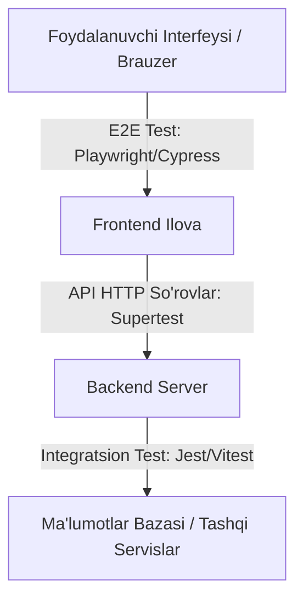

## 1. 💡 Sodda Tushuntirish va Analogiya

### Integratsion va E2E (End-to-End) Testlash nima?
* **Integratsion Testlash (Integration Testing):** Dasturning turli qismlari (masalan, API va Ma'lumotlar bazasi) bir-biri bilan to'g'ri bog'langanligini va birgalikda to'g'ri ishlashini tekshirish jarayoni.
* **E2E (End-to-End - Boshidan Oxirigacha) Testlash:** Tizimni haqiqiy foydalanuvchi nuqtai nazaridan tekshirish. Brauzerni avtomatik boshqarib, tugmalarni bosish, formalarni to'ldirish va yakuniy natijani ko'rish.

### Real hayotiy analogiya
Tasavvur qiling, siz **telefon ishlab chiqaruvchisiz**:
* **Unit Test:** Telefon batareyasi, ekrani va kamerasini zavodda alohida-alohida tok berib tekshirish.
* **Integratsion Test:** Batareyani telefonga ulab, quvvatlash simini tiqib, ekran foizi ko'payayotganini tekshirish (ikki tizim hamkorligi).
* **E2E Test:** Telefonni to'liq qutidan chiqarib, yoqib, SIM-karta solib, haqiqiy raqamga qo'ng'iroq qilib gaplashib ko'rish (haqiqiy foydalanuvchi ssenariysi).



---

## 2. 💻 Real Kod Misollari

### 1. Basic Example (Jest/Vitest + Supertest yordamida Express API ni integratsion test qilish)
Keling, oddiy Express server va uni tekshiradigan Supertest integratsion testini yozamiz.
```javascript
// app.js
const express = require('express');
const app = express();
app.use(express.json());

app.post('/api/users', (req, res) => {
  const { name } = req.body;
  if (!name) return res.status(400).json({ error: 'Name is required' });
  res.status(201).json({ id: 1, name });
});

module.exports = app;

// app.test.js
const request = require('supertest');
const app = require('./app');

describe('POST /api/users', () => {
  test('yangi foydalanuvchi muvaffaqiyatli yaratilishi kerak', async () => {
    const response = await request(app)
      .post('/api/users')
      .send({ name: 'Farhod' });

    expect(response.status).toBe(201);
    expect(response.body).toEqual({ id: 1, name: 'Farhod' });
  });

  test('ism berilmasa 400 xatosi qaytishi kerak', async () => {
    const response = await request(app)
      .post('/api/users')
      .send({});

    expect(response.status).toBe(400);
    expect(response.body.error).toBe('Name is required');
  });
});
```

### 2. Intermediate Example (Ma'lumotlar bazasi integratsiyasini test qilish)
Ma'lumotlar bazasiga ma'lumot yozish va har bir testdan keyin tozalash:
```javascript
// db.test.js
const { Pool } = require('pg');
const request = require('supertest');
const express = require('express');

const pool = new Pool({ connectionString: process.env.TEST_DATABASE_URL });
const app = express();
app.use(express.json());

app.post('/api/items', async (req, res) => {
  const { title } = req.body;
  const result = await pool.query('INSERT INTO items (title) VALUES ($1) RETURNING *', [title]);
  res.status(201).json(result.rows[0]);
});

describe('Database Integration Tests', () => {
  beforeAll(async () => {
    // Test jadvalini tayyorlash
    await pool.query('CREATE TABLE IF NOT EXISTS items (id SERIAL PRIMARY KEY, title TEXT)');
  });

  afterEach(async () => {
    // Har bir testdan so'ng ma'lumotlarni tozalash (izolyatsiya)
    await pool.query('TRUNCATE items RESTART IDENTITY');
  });

  afterAll(async () => {
    await pool.end();
  });

  test('item bazaga saqlanishini tekshirish', async () => {
    const res = await request(app)
      .post('/api/items')
      .send({ title: 'Kitob' });

    expect(res.status).toBe(201);
    expect(res.body.title).toBe('Kitob');

    // Baza tekshiruvi
    const dbCheck = await pool.query('SELECT * FROM items WHERE title = $1', ['Kitob']);
    expect(dbCheck.rows.length).toBe(1);
  });
});
```

### 3. Advanced Example (Playwright yordamida E2E test yozish)
Brauzerni ochib, Login formasini to'ldirish va muvaffaqiyatli kirishni tekshirish:
```javascript
// auth.spec.js
const { test, expect } = require('@playwright/test');

test.describe('Login E2E Flow', () => {
  test('foydalanuvchi tizimga kira olishi lozim', async ({ page }) => {
    // 1. Login sahifasiga o'tish
    await page.goto('https://example.com/login');

    // 2. Inputlarni to'ldirish
    await page.fill('input[name="username"]', 'admin');
    await page.fill('input[name="password"]', 'secret123');

    // 3. Login tugmasini bosish
    await page.click('button[type="submit"]');

    // 4. Bosh sahifaga yo'naltirilganini va xush kelibsiz xabari chiqqanini tekshirish
    await expect(page).toHaveURL('https://example.com/dashboard');
    const welcomeMessage = page.locator('.welcome-text');
    await expect(welcomeMessage).toHaveText('Xush kelibsiz, admin!');
  });
});
```

---

## 3. ⚠️ Muammo va Nima uchun Muhimligi

### Qaysi muammoni hal qiladi?
* **"Mening kompyuterimda ishlagandi":** Unit testlar alohida funksiyalarni tekshirgani sababli, ma'lumotlar bazasi yoki tarmoq ulanishlaridagi haqiqiy muammolarni topib berolmaydi. Integratsion testlar esa tizimlarning o'zaro aloqasini tekshiradi.
* **UI va API nomuvofiqligi:** Frontend va Backend ishlab chiquvchilari kelishgan API formati o'zgarib ketsa, unit testlar buni sezmaydi. E2E testlar esa foydalanuvchi interfeysidan tortib bazagacha bo'lgan zanjirni tekshirib, uzilish borligini ko'rsatadi.
* **Foydalanuvchi tajribasi kafolati (Critical Paths):** To'lov qilish, savatchaga narsa qo'shish va ro'yxatdan o'tish kabi muhim biznes jarayonlarining doimiy ishlashini kafolatlaydi.

---

## 4. ❌ Ko'p Uchraydigan Xatolar (Junior Mistakes)

### 1. Test ma'lumotlar bazasini har safar tozalamaslik
#### Xato:
Bitta test yozgan ma'lumot keyingi testning natijasiga ta'sir qiladi va testlarning ketma-ketligiga bog'liq bo'lib qoladi.
#### To'g'ri usul:
Har bir testdan oldin (`beforeEach`) yoki keyin (`afterEach`) test bazasini tozalash yoki tranzaksiyalarni orqaga qaytarish (`rollback`) kerak.

### 2. E2E testlarda qat'iy vaqt kutishlardan (`setTimeout` / `sleep`) foydalanish
#### Xato:
```javascript
// Noto'g'ri! Internet sekin bo'lsa test yiqiladi, tez bo'lsa vaqt yo'qotiladi
await page.waitForTimeout(5000);
```
#### To'g'ri usul:
```javascript
// Element paydo bo'lishini kutadigan selektorlardan foydalaning
await page.waitForSelector('.success-message');
```

### 3. Integratsion testlarda haqiqiy uchinchi tomon API-larini (masalan, Stripe, Twilio) chaqirish
#### Xato:
Haqiqiy SMS jo'natish yoki to'lov API-larini testlarda har safar chaqirish pul yo'qotishiga yoki akkaunt bloklanishiga olib keladi.
#### To'g'ri usul:
Bunday tashqi xizmatlar uchun mock serverlar (masalan, WireMock, MSW) yoki sandbox/test kalitlaridan foydalanish lozim.

---

## 5. 💬 12 ta Intervyu Savollari

### Junior (1–4)
1. **Savol:** Unit test va Integratsion testning farqi nimada?
   * **Javob:** Unit test bitta alohida funksiyani izolyatsiyada tekshiradi. Integratsion test esa ikki yoki undan ortiq komponentlarning (masalan, API va ma'lumotlar bazasi) birgalikdagi ishini tekshiradi.
2. **Savol:** E2E (End-to-End) test nima?
   * **Javob:** Tizimni boshidan oxirigacha, xuddi real foydalanuvchi brauzerda ishlatayotgandek avtomatlashtirilgan tarzda tekshirish.
3. **Savol:** Supertest nima va u nima uchun ishlatiladi?
   * **Javob:** Node.js HTTP serverlarini (masalan Express ilovalarini) haqiqiy portga o'rnatmasdan (listen qilmasdan) integratsion test qilish uchun ishlatiladigan kutubxona.
4. **Savol:** E2E testlar yozish uchun qanday mashhur kutubxonalarni bilasiz?
   * **Javob:** Playwright, Cypress, Selenium va Puppeteer.

### Middle (5–8)
5. **Savol:** Playwright va Cypress o'rtasidagi asosiy farqlar nimada?
   * **Javob:** Playwright bir vaqtning o'zida bir nechta tab, brauzer oynalari va iframelarni oson boshqara oladi, tezroq ishlaydi. Cypress esa brauzer ichida ishlaydi va qulayroq vizual debug rejimiga ega.
6. **Savol:** Test ma'lumotlar bazasini qanday izolyatsiyalash mumkin?
   * **Javob:** Har bir testni tranzaksiya ichida ishga tushirib yakunda rollback qilish, har bir testdan keyin `TRUNCATE` qilish yoki docker orqali har bir test uchun yangi baza ko'tarish.
7. **Savol:** Playwright-dagi "Auto-waiting" tushunchasi nima?
   * **Javob:** Playwright harakatlarni bajarishdan (masalan kliklash) oldin elementning ko'rinuvchanligi, faolligi va yuklanganligini avtomatik kutadi. Bu testlarning barqarorligini oshiradi.
8. **Savol:** "Flaky tests" (beqaror testlar) nima va ularni qanday kamaytirish mumkin?
   * **Javob:** Bir safar o'tib, ikkinchi safar hech qanday kod o'zgarishsiz yiqiladigan testlar. Ularni kamaytirish uchun qat'iy vaqt kutishlar o'rniga dinamik kutishlar yozish va asinxron amallarni to'g'ri kutish kerak.

### Senior (9–12)
9. **Savol:** CI/CD pipeline-da E2E testlar tezligini oshirish uchun qanday strategiyalarni qo'llaysiz?
   * **Javob:** Testlarni parallel ishga tushirish (sharding), headless rejimdan foydalanish, keraksiz tarmoq so'rovlarini mock/keshlash va faqat o'zgargan qismlar uchun testlarni ishga tushirish.
10. **Savol:** API shartnomasini testlash (Contract Testing) nima?
    * **Javob:** Frontend va Backend o'rtasidagi kelishuv (API request/response strukturasi) buzilmasligini integratsion darajada tekshirish (masalan Pact vositasi yordamida).
11. **Savol:** E2E testlarda autentifikatsiya (Login) holatini har safar qayta bajarmaslik uchun nima qilinadi?
    * **Javob:** Login jarayonini bir marta bajarib, brauzer holatini (Cookies, LocalStorage) faylga saqlab olish va keyingi testlarda ushbu saqlangan holatdan (storage state) foydalanish.
12. **Savol:** Integratsion testlarda "Mock Database" va "Real Test Database" yondashuvlarining afzallik va kamchiliklari nima?
    * **Javob:** Mock DB tez ishlaydi, lekin haqiqiy SQL sintaksis xatolarini yoki cheklovlarni (constraints) topib berolmaydi. Real Test DB biroz sekinroq, lekin ma'lumotlar yaxlitligi va murakkab so'rovlarning 100% to'g'riligini kafolatlaydi.

---

## 6. 🛠️ Amaliy Topshiriqlar

Bu bo'limda siz integratsion test yozish bo'yicha interaktiv topshiriqlarni bajarasiz.

---

## 7. 📝 12 ta Mini Test

Dars bo'yicha test savollari.

---

## 8. 🎯 Real Project Case Study

### Foydalanuvchini ro'yxatdan o'tkazish va tasdiqlash oqimi
Real loyihalarda integratsion testlar butun foydalanuvchi ro'yxatdan o'tish zanjirini tekshiradi:

1. **API so'rovi:** Foydalanuvchi ma'lumotlarini POST orqali yuborish.
2. **Baza nazorati:** Foydalanuvchi parolining xeshlangani va statusi `PENDING` ekanini bazadan tekshirish.
3. **Mocking:** Xat jo'natish xizmatining chaqirilganini tekshirish.

```javascript
// registration.test.js
const request = require('supertest');
const app = require('../app');
const db = require('../db');
const emailService = require('../services/emailService');

jest.mock('../services/emailService');

describe('User Registration Integration Flow', () => {
  beforeEach(async () => {
    await db.query('DELETE FROM users');
    jest.clearAllMocks();
  });

  test('muvaffaqiyatli ro\'yxatdan o\'tish va email yuborilish oqimi', async () => {
    const res = await request(app)
      .post('/api/register')
      .send({
        email: 'user@test.com',
        password: 'Password123'
      });

    // 1. HTTP Status va Response tekshiruvi
    expect(res.status).toBe(201);
    expect(res.body.message).toBe('Verification email sent');

    // 2. Ma'lumotlar bazasi tekshiruvi
    const user = await db.query('SELECT * FROM users WHERE email = $1', ['user@test.com']);
    expect(user.rows.length).toBe(1);
    expect(user.rows[0].status).toBe('PENDING');
    // Parol ochiq holatda saqlanmasligi kerak
    expect(user.rows[0].password).not.toBe('Password123');

    // 3. Email jo'natilganligini tekshirish
    expect(emailService.sendVerificationEmail).toHaveBeenCalledWith(
      'user@test.com',
      expect.any(String)
    );
  });
});
```

---

## 9. 🚀 Performance va Optimization

* **Parallel Testlarni Sozlash:** Playwright avtomatik ravishda testlarni parallel ishga tushiradi. Vitest-da esa `--threads` yordamida tezkor parallel integratsion testlarni amalga oshirish mumkin.
* **Database Transactions:** Truncate qilish o'rniga testlarni `BEGIN` va `ROLLBACK` ichida bajarish bazadagi integratsion testlarni 10 barobargacha tezlashtiradi.

---

## 10. 📌 Cheat Sheet

| Asbob / Kutubxona | Vazifasi | Misol |
| :--- | :--- | :--- |
| **Supertest** | Express API integratsion testlash | `request(app).get('/users')` |
| **Playwright** | Brauzerni E2E avtomatlashtirish | `await page.goto('/login')` |
| **page.fill()** | Input maydonini to'ldirish | `await page.fill('#email', 'test@mail.com')` |
| **page.click()** | Elementni bosish | `await page.click('button')` |
| **jest.mock()** | Tashqi API va modullarni soxtalashtirish | `jest.mock('./emailService')` |
| **beforeAll()** | Barcha testlardan oldin 1 marta bajarish | Ulanishlarni ochish |
| **afterAll()** | Barcha testlar tugagach 1 marta bajarish | Ulanishlarni yopish |
