## 1. 💡 Sodda Tushuntirish va Analogiya

### Junior Developer Intervyusi nima?
Junior (boshlang'ich) dasturchilar uchun o'tkaziladigan intervyular murakkab tizimlar arxitekturasini emas, balki JavaScript-ning eng asosiy va fundamental mexanizmlarini qay darajada tushunishingizni tekshiradi. JS qanday ishlaydi, xotira bilan qanday muloqot qiladi va kod qanday tartibda bajariladi — bular asosiy savollardir.

### Real hayotiy analogiya
Tasavvur qiling, siz **quruvchi** bo'lib ishga kirmoqchisiz:
* **Tajribali muhandis (Senior):** Undan butun binoning chizmasi, zilzilaga bardoshliligi va xarajatlarni hisoblash so'raladi.
* **Boshlang'ich yordamchi (Junior):** Undan g'ishtni qanday terish, sementni qanday qorish va asboblarni qanday toza saqlash so'raladi.
* **JavaScript fundamental bilimlari:** JS-da ma'lumot turlari — bu g'ishtlar, scopes (sohalar) va hoisting — devorning skeleti, event loop va asinxronlik esa binodagi lift yoki elektr simlari kabi kommunikatsiya tizimlaridir.

---

## 2. 💻 Real Kod Misollari

### 1. Basic Example: Hoisting va Scope
`var` va `let` o'rtasidagi farq hamda xotirada joy ajratilishi:
```javascript
// var o'zgaruvchisi hoisting bo'ladi va undefined qiymat oladi
console.log(hoistedVar); // undefined
var hoistedVar = "Men var o'zgaruvchisiman";

// let o'zgaruvchisi ham hoisting bo'ladi, lekin TDZ tufayli xato beradi
try {
  console.log(hoistedLet); // ReferenceError xatosi
} catch (error) {
  console.log("Xatolik:", error.message); 
  // "Cannot access 'hoistedLet' before initialization"
}
let hoistedLet = "Men let o'zgaruvchisiman";
```

### 2. Intermediate Example: Implicit Coercion (Yashirin tur o'zgartirish)
JavaScript-da arifmetik amallar bajarilganda turlarning avtomatik o'zgarishi:
```javascript
console.log(1 + "2");     // "12" (son stringga o'tib konkat bo'ladi)
console.log("5" - 2);     // 3 (string son ko'rinishida bo'lsa, ayirish amali uchun songa aylanadi)
console.log(true + true); // 2 (true son qiymati 1 ga teng, 1 + 1 = 2)
console.log(false == 0);  // true (ikkalasi ham falsey qiymatga o'giriladi)
console.log(null == undefined); // true (standart bo'yicha teng)
console.log(null === undefined); // false (turlari har xil: object va undefined)
```

### 3. Advanced Example: Pass by Value vs Pass by Reference
Primitive va Reference ma'lumotlarining xotirada saqlanishi va funksiyaga uzatilishi:
```javascript
// Primitive (Pass by Value): Qiymat ko'chiriladi
let originalNum = 10;
function changePrimitive(num) {
  num = 20;
}
changePrimitive(originalNum);
console.log(originalNum); // 10 (asl qiymat o'zgarmadi)

// Reference (Pass by Reference): Havola (manzil) ko'chiriladi
let originalObj = { name: "Ali" };
function changeReference(obj) {
  obj.name = "Vali";
}
changeReference(originalObj);
console.log(originalObj.name); // "Vali" (asl obyekt o'zgardi)
```

---

## 3. ⚙️ Qanday Ishlaydi (Under the Hood)

### 1. Execution Context (Bajarilish Muhiti)
JavaScript-da kod har doim **Execution Context** (Bajarilish Muhiti) ichida ishga tushadi. U ikki bosqichda ishlaydi:
1. **Creation Phase (Yaratilish bosqichi):** JS dvigateli kodni o'qib chiqadi, funksiyalar va o'zgaruvchilar uchun xotiradan joy ajratadi (Hoisting). `var` bilan e'lon qilingan o'zgaruvchilarga `undefined` qiymati beriladi, `let` va `const` esa **Temporal Dead Zone (TDZ)** ga tushadi.
2. **Execution Phase (Bajarilish bosqichi):** Kod tepadan pastga qarab qatorma-qator bajariladi va o'zgaruvchilarga haqiqiy qiymatlar tayinlanadi.

### 2. Scope Chain (Sohalar zanjiri)
Agar biron-bir o'zgaruvchi joriy funksiya ichida topilmasa, JavaScript uni tashqi leksik muhitdan (outer lexical environment) qidiradi. Bu qidiruv global scope-gacha davom etadi. Agar u yerda ham topilmasa, `ReferenceError` xatoligi qaytariladi.

### 3. Event Loop va Single Thread
JavaScript **single-threaded** (bitta oqimli) til bo'lib, bir vaqtda faqat bitta amalni bajara oladi. Asinxron operatsiyalar (masalan, `setTimeout` yoki API so'rovlar) brauzerning Web API qismiga yuboriladi va u yerda bajariladi. Ularning callback funksiyalari navbatga (Callback Queue / Microtask Queue) yoziladi. **Event Loop** doimiy ravishda Call Stack-ni tekshiradi, u bo'shagandan so'ng navbatdagi callback-larni bajarish uchun stack-ga olib keladi.

---

## 4. ❌ Ko'p Uchraydigan Xatolar (Junior Mistakes)

### 1. `var` o'zgaruvchisini sikl (loop) ichida asinxron kod bilan ishlatish
#### Muammo:
```javascript
for (var i = 1; i <= 3; i++) {
  setTimeout(function() {
    console.log(i); // 4, 4, 4 chiqadi
  }, 1000);
}
```
`var` funksiya doirasiga (function scope) ega bo'lganligi va hoisting tufayli barcha `setTimeout` callback-lari bajarilganda `i` o'zgaruvchisining oxirgi qiymati `4` ga teng bo'lib qoladi.

#### Tuzatish:
Sikl ichida block scope-ga ega `let` ishlatish kerak. Har bir sikl iteratsiyasi uchun yangi xotira bloki va alohida `i` qiymati yaratiladi:
```javascript
for (let i = 1; i <= 3; i++) {
  setTimeout(function() {
    console.log(i); // 1, 2, 3 chiqadi
  }, 1000);
}
```

### 2. `==` (Yumshoq tenglik) ishlatish orqali kutilmagan bug-lar kelib chiqishi
`==` operatori turlarni avtomatik tarzda moslashtiradi (type coercion). Bu esa kutilmagan xatolarga olib kelishi mumkin.
```javascript
console.log([] == false); // true! (chunki ikkalasi ham bo'sh qiymat sifatida 0 ga aylanadi)
console.log("" == 0);     // true!
```
**Tavsiya:** Har doim turlarni ham tekshiradigan qat'iy tenglik `===` operatoridan foydalaning.

---

## 5. 💬 12 ta Intervyu Savollari

### Junior (Boshlang'ich)
1. **Savol:** JS-da qanday ma'lumot turlari mavjud?
   * **Javob:** JS-da 8 ta ma'lumot turi bor: 7 ta primitive (String, Number, Boolean, Null, Undefined, Symbol, BigInt) va 1 ta reference (Object - massiv va funksiyalar ham object hisoblanadi).
2. **Savol:** `null` va `undefined` o'rtasidagi farq nima?
   * **Javob:** `undefined` — o'zgaruvchi e'lon qilingan, ammo unga hali qiymat berilmaganligini bildiradi. `null` esa qasddan bo'sh qiymat yoki obyektsiz ekanligini ifodalash uchun dasturchi tomonidan tayinlanadi.
3. **Savol:** `typeof null` nima qaytaradi va nima uchun?
   * **Javob:** U `"object"` qaytaradi. Bu JavaScript tilining ilk versiyasidagi xatolik (bug) bo'lib, o'tmishdagi kodlar buzilib ketmasligi uchun o'zgartirilmay qoldirilgan.
4. **Savol:** Hoisting nima?
   * **Javob:** Dasturni bajarishdan oldin (Creation phase), o'zgaruvchilar (`var`) va funksiya e'lonlarini xotirada saqlash va kodning yuqori qismiga ko'chirilish jarayoni.

### Middle (O'rta)
5. **Savol:** Temporal Dead Zone (TDZ) nima?
   * **Javob:** `let` va `const` o'zgaruvchilari e'lon qilingan blokning boshlanishidan boshlab, to o'zgaruvchi amalda e'lon qilinib qiymat berilgunigacha bo'lgan oraliq. Bu oraliqda o'zgaruvchiga murojaat qilish `ReferenceError`ga sabab bo'ladi.
6. **Savol:** `var`, `let` va `const` farqi nimada?
   * **Javob:** `var` - function scoped, hoisting bo'lganda `undefined` oladi va qayta e'lon qilsa bo'ladi. `let` - block scoped, qayta e'lon qilib bo'lmaydi, TDZ ga ega. `const` - block scoped, qiymati qayta tayinlanmaydi (read-only), e'lon qilinganda qiymat berilishi shart.
7. **Savol:** Implicit va Explicit Coercion nima?
   * **Javob:** Implicit coercion - JS dvigateli tomonidan turlarning avtomatik ravishda o'zgartirilishi (masalan, `5 + '5' = '55'`). Explicit coercion - dasturchi tomonidan funksiyalar yordamida turni o'zgartirish (masalan, `Number('5')`).
8. **Savol:** `==` va `===` farqi nima?
   * **Javob:** `==` faqat qiymatni taqqoslaydi (taqqoslashdan oldin turlarni moslashtiradi). `===` esa qiymatni ham, ma'lumot turini ham qat'iy tekshiradi.

### Senior (Yuqori)
9. **Savol:** Closure (Yopilish) nima?
   * **Javob:** Ichki funksiyaning o'zi yaratilgan tashqi funksiyaning o'zgaruvchilari (scope)ga, tashqi funksiya bajarilib bo'lgandan keyin ham kirish huquqini saqlab qolishi.
10. **Savol:** Pass by Value va Pass by Reference nima?
    * **Javob:** Primitive turlar qiymat bo'yicha uzatiladi (nusxa olinadi). Reference turlar (obyektlar, massivlar) esa xotiradagi havola (adres) bo'yicha uzatiladi. Havolani o'zgartirish asl obyektga ta'sir qiladi.
11. **Savol:** Event Loop qanday ishlaydi?
    * **Javob:** Event Loop - Call Stack bo'shligini kuzatib turadigan mexanizm. Agar Call Stack bo'sh bo'lsa va Callback/Microtask Queue-da navbatda turgan asinxron vazifalar bo'lsa, u ularni bajarish uchun Stack-ga olib kiradi.
12. **Savol:** Nima uchun `const obj = {}` qilingan obyekt ichidagi xususiyatlarni o'zgartirish mumkin, lekin butunlay yangi obyekt yuklab bo'lmaydi?
    * **Javob:** Chunki `const` o'zgaruvchining xotiradagi manzilini (reference) o'zgarmas qilib qulflaydi. Obyekt ichidagi xususiyatlarni o'zgartirish xotiradagi manzilni o'zgartirmaydi, lekin unga yangi obyekt tayinlash (`obj = {x: 1}`) manzilni o'zgartirishga urinish bo'lgani uchun taqiqlanadi.

---

## 6. 🛠️ Amaliy Topshiriqlar

Junior dasturchilar intervyusida eng ko'p so'raladigan mavzular xaritasi va yo'nalishi quyidagi Mermaid diagrammasida keltirilgan:

```mermaid
graph TD
    A["Junior Developer JS Roadmap"] --> B["Data Types"]
    A --> C["Scopes & Hoisting"]
    A --> D["Type Coercion"]
    A --> E["Closures Basics"]
    A --> F["Asynchronous Basics"]
    
    B --> B1["Primitives: string, number, boolean, null, undefined, symbol, bigint"]
    B --> B2["Reference: object, array, function"]
    B --> B3["typeof quirks: typeof null is object"]
    
    C --> C1["var vs let vs const"]
    C --> C2["Execution Context & Scope Chain"]
    C --> C3["Hoisting & Temporal Dead Zone - TDZ"]
    
    D --> D1["Implicit Coercion: 1 + '2' = '12'"]
    D --> D2["Explicit Coercion: Number, String, Boolean"]
    D --> D3["Soft vs Strict Equality: == vs ==="]
    
    E --> E1["Lexical Environment"]
    E --> E2["Retaining Outer Scope Variables"]
    E --> E3["Encapsulation / Private State"]
    
    F --> F1["Single Thread & Call Stack"]
    F --> F2["Callbacks & Web APIs"]
    F --> F3["Event Loop & Callback Queue"]
```



### Amaliy mashqlar tavsifi:
1. **Turlarni Taqqoslash (Custom Equality):** Standart qoidalarni inobatga olgan holda, berilgan shartlar asosida qiymatlarni taqqoslovchi funksiya yaratish.
2. **Maxfiy Balans (Private State):** Closure yordamida ma'lumotlarni inkapsulyatsiya qilish, maxfiy balans qiymatini faqat maxsus metodlar orqali o'zgartirish.
3. **Safe Typeof:** JavaScript-dagi `typeof null` va massivlarning turini aniq ko'rsatadigan xavfsiz tur aniqlovchi tizimni yozish.

---

## 7. 📝 12 ta Mini Test

Dars yakunidagi testlar junior dasturchilarning fundamental bilimlari darajasini baholash va intervyuda duch keladigan tuzoqlarni aniqlashga mo'ljallangan.

---

## 8. 🎯 Real Project Case Study

### Intervyuda Beriladigan Mini-Loyiha Tahlili: User Session va Cart Tizimi
Intervyularda junior dasturchilarga xotirani to'g'ri boshqarish va closures orqali ma'lumotlarni himoya qilish bo'yicha mini vazifalar beriladi. Quyida foydalanuvchi savatchasini (Cart) closures yordamida himoyalangan holda yaratish misoli keltirilgan:

```javascript
function createShoppingSession(user) {
  // Savatcha ma'lumotlari faqat ushbu funksiya doirasida yashaydi
  const cart = [];

  return {
    addItem(item) {
      cart.push(item);
      console.log(`${item.name} savatga qo'shildi.`);
    },
    getCart() {
      // Massivning asl nusxasini emas, balki shallow copy nusxasini qaytaramiz
      // Bu tashqaridan turib asl massivni to'g'ridan-to'g'ri o'zgartirishni oldini oladi
      return [...cart];
    },
    getTotalPrice() {
      return cart.reduce((total, item) => total + item.price, 0);
    }
  };
}

const session = createShoppingSession({ name: "Farhod" });
session.addItem({ name: "JS Darsligi", price: 15 });
session.addItem({ name: "Sichqoncha", price: 25 });

console.log(session.getTotalPrice()); // 40

// Tashqaridan cart massiviga to'g'ridan-to'g'ri element qo'shib bo'lmaydi:
const myCart = session.getCart();
myCart.push({ name: "Hacker Item", price: 0 }); // Bu faqat nusxaga ta'sir qiladi
console.log(session.getCart().length); // 2 (asl savat o'zgarmadi!)
```

---

## 9. 🚀 Performance va Optimization

* **`===` operatorini afzal ko'rish:** `==` operatori turlarni moslashtirish uchun qo'shimcha operatsiyalarni bajaradi. `===` esa turni ham to'g'ridan-to'g'ri tekshirgani sababli tezroq va xavfsizroq ishlaydi.
* **Global o'zgaruvchilardan qochish:** Global `var` yoki umuman global scope-da o'zgaruvchilar yaratish xotirani band qiladi va "Scope chain" qidiruv vaqtini uzaytiradi.
* **Block Scope orqali xotirani tozalash:** `let` va `const` ishlatilganda o'zgaruvchilar blok (sikl, shart yoki qavs) tugashi bilan Garbage Collector tomonidan tezroq xotiradan tozalanishga nomzod bo'ladi.

---

## 10. 📌 Cheat Sheet

| Konsept | Kalit So'zlar | Muhim Qoida |
| :--- | :--- | :--- |
| **var vs let vs const** | Function scope vs Block scope | Global `var` window-da paydo bo'ladi. `let/const` TDZga ega. |
| **typeof null** | `"object"` | JS tarixidagi bug, o'zgartirib bo'lmaydi. |
| **== vs ===** | Coercion vs Strict | Har doim qat'iy tenglik (`===`) ishlating. |
| **Pass by Value** | Primitive turlar | Qiymat nusxalanadi, asl qiymat o'zgarmaydi. |
| **Pass by Reference** | Objects & Arrays | Xotiradagi havola uzatiladi, ichki o'zgarish tashqariga ham ta'sir qiladi. |
| **Hoisting** | Memory allocation phase | `var` o'zgaruvchilari undefined bo'lib ko'tariladi, funksiyalar to'liq ko'tariladi. |
