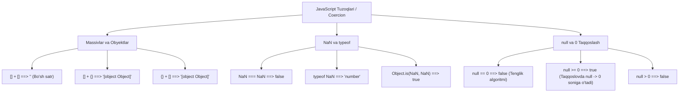

## 1. 💡 Sodda Tushuntirish va Analogiya

### JavaScript "Tuzoqlari" (Gotchas) nima?
JavaScript dunyodagi eng mashhur dasturlash tillaridan biri bo'lsa-da, u juda tez va shoshilinch ravishda (atigi 10 kunda) yaratilgan. Shuning uchun tilda ba'zi g'ayrioddiy, mantiqqa zid bo'lib tuyuladigan xususiyatlar yoki tarixiy xatolar mavjud. Dasturchilar bu xususiyatlarni ko'pincha **"tuzoqlar" (gotchas/pitfalls)** deb atashadi. 

Ular xato emas — ular til spetsifikatsiyasi bo'yicha shunday ishlashga mo'ljallangan, ammo inson mantig'iga to'g'ri kelmasligi sababli yosh dasturchilarni chalg'itadi.

### Real hayotiy analogiya
Tasavvur qiling, siz supermarketga kirib, **ikkita bo'sh savatni** birlashtirmoqchisiz. Siz ularni bir-birining ichiga kiydirsangiz, yana bir savat hosil bo'lishini kutasiz. Ammo kassir kelib: *"Qoidaga ko'ra, ikkita bo'sh savat birlashsa, ular havoga aylanib yo'q bo'lib ketadi (bo'sh matn bo'ladi)"* deydi. 

Yoki bo'lmasam, taroziga **olmani** qo'ysangiz, u sizga *"Bu meva emas, bu obyektdir"* deb javob beradi. 

JavaScript-dagi ba'zi qoidalar ham xuddi shunday g'alati va kutilmagan qoidalarga asoslangan. Ushbu darsda biz ana shunday "g'alati" qoidalarni o'rganamiz va ulardan qanday qochishni bilib olamiz.

---

## 2. 💻 Real Kod Misollari

### 1. Type Coercion (Tiplarni avtomatik o'zgartirish)
JavaScript ikki xil tipdagi ma'lumotlarni qo'shganda yoki solishtirganda ularni yashirincha bir xil tipga o'tkazishga harakat qiladi:
```javascript
// Massivlar yig'indisi
console.log([] + []); // "" (Bo'sh satr)
// Tushuntirish: Massivlar satrga o'giriladi: String([]) + String([]) -> "" + "" -> ""

// Massiv va Obyekt
console.log([] + {}); // "[object Object]"
// Tushuntirish: Bo'sh massiv "" bo'ladi, obyekt esa "[object Object]" ga aylanadi.

// Zanjirli taqqoslash
console.log(1 < 2 < 3); // true  (Chunki: 1 < 2 -> true. Keyin true < 3 baholanadi. true -> 1 ga aylanadi va 1 < 3 -> true)
console.log(3 > 2 > 1); // false (Chunki: 3 > 2 -> true. Keyin true > 1 baholanadi. true -> 1 bo'ladi va 1 > 1 -> false)
```

### 2. NaN (Not-a-Number) injiqliklari
`NaN` sonli tip bo'lsa-da, u o'ziga xos xususiyatlarga ega:
```javascript
console.log(typeof NaN); // "number" (Garchi nomi "Son emas" bo'lsa ham!)

console.log(NaN === NaN); // false (JS-da o'z-o'ziga teng bo'lmagan yagona qiymat)

// NaN ni tekshirishning to'g'ri va noto'g'ri usuli:
console.log(isNaN("salom"));        // true  (Chunki an'anaviy isNaN() satrni songa o'girib tekshiradi)
console.log(Number.isNaN("salom")); // false (Faqatgina qiymat rostdan ham NaN bo'lsa true qaytaradi)
```

### 3. null va 0 ning o'zaro munosabati
`null` solishtirilganda juda g'alati o'zini tutadi:
```javascript
console.log(null > 0);  // false (null 0 ga o'giriladi: 0 > 0 -> false)
console.log(null == 0); // false (Tenglik tekshiruvida null faqat undefined bilan teng bo'la oladi)
console.log(null >= 0); // true  (Taqqoslovda null yana 0 ga o'girilib, 0 >= 0 -> true beradi)
```

### 4. Floating Point (Suzuvchi nuqta) xatosi
Kompyuterlar sonlarni ikkilik tizimda saqlagani uchun o'nlik kasrlarni har doim ham aniq hisoblay olmaydi:
```javascript
console.log(0.1 + 0.2 === 0.3); // false
console.log(0.1 + 0.2); // 0.30000000000000004

// Yechim:
const sum = 0.1 + 0.2;
console.log(Number(sum.toFixed(12)) === 0.3); // true
```

### 5. Automatic Semicolon Insertion (ASI) tuzog'i
JS kodni o'qiyotganda qator oxiriga avtomatik ravishda nuqtali vergul (;) qo'yishi mumkin:
```javascript
function getObject() {
  return // JS bu yerga avtomatik ravishda ';' qo'yadi
  {
    status: "success"
  };
}

console.log(getObject()); // undefined (Obyekt qaytmaydi!)

// Tuzatilgan shakli:
function getObjectFixed() {
  return {
    status: "success"
  };
}
console.log(getObjectFixed()); // { status: "success" }
```

---

## 3. ⚠️ Muammo va Nima uchun Muhimligi

### Qaysi muammolarni keltirib chiqaradi?
1. **Moliyaviy hisob-kitoblardagi xatolar:** Floating point xatosi tufayli onlayn do'konlarda mahsulot narxi noto'g'ri hisoblanib, kassa xarajatlari mos kelmay qolishi mumkin (`0.1 + 0.2` xatosi kabi).
2. **Kutilmagan shartlar bajarilishi:** `null >= 0` yoki `1 < 2 < 3` kabi ifodalar if-else shartlarida mutlaqo boshqa natija berib, dastur mantig'ini buzadi.
3. **Sinxronizatsiya va ma'lumot yo'qolishi:** ASI tuzog'iga tushib qolganda, funksiyalar `undefined` qaytarib, loyihada `TypeError: Cannot read properties of undefined` xatolarini keltirib chiqaradi.

---

## 4. ❌ Ko'p Uchraydigan Xatolar (Junior Mistakes)

### 1. `==` (noqattiq tenglik) ishlatish
Junior dasturchilar ko'pincha tiplarni avtomatik o'zgartiruvchi `==` operatorini ishlatishadi.
* **Xato:** `"" == 0` -> `true`, `[] == false` -> `true`.
* **Tuzatish:** Har doim `===` (qattiq tenglik) operatoridan foydalaning. U qiymatdan tashqari ma'lumot tipini ham tekshiradi: `"" === 0` -> `false`.

### 2. `typeof null` natijasiga ishonish
* **Xato:** Obyektni tekshirish uchun `if (typeof value === "object")` deb yozish, agar `value` o'rniga `null` kelsa ham bu blok ishga tushib ketadi (chunki `typeof null === "object"`).
* **Tuzatish:** Obyektni tekshirishda `null` emasligini ham qo'shib tekshiring:
  ```javascript
  if (value !== null && typeof value === "object") { ... }
  ```

### 3. Loop ichida `var` ishlatish va asinxronlik
* **Xato:** `for (var i = 0; i < 3; i++) { setTimeout(...) }` kodida `i` global yoki funksiya scope-da bo'lgani uchun hamma asinxron chaqiriqlar oxirgi `3` qiymatini oladi.
* **Tuzatish:** Har doim `let` kalit so'zidan foydalaning. `let` blok scope-ga ega bo'lgani uchun har bir sikl bosqichida yangi o'zgaruvchi yaratadi.

---

## 5. 💬 12 ta Intervyu Savollari

### Junior (1–4)
1. **Savol:** Nima uchun `0.1 + 0.2 === 0.3` ifodasi `false` qaytaradi?
   * **Javob:** Kompyuterlar kasr sonlarni IEEE 754 standarti bo'yicha ikkilik sanoq tizimida saqlaydi. Ba'zi o'nlik kasrlar ikkilikda cheksiz davriy bo'lganligi sababli, yaxlitlashda xatolik yuzaga keladi va natija `0.30000000000000004` bo'ladi.
2. **Savol:** JavaScript-da `typeof null` nima qaytaradi va nega?
   * **Javob:** `"object"` qaytaradi. Bu til yaratuvchilarining ilk versiyadagi xatosi bo'lib, eski kodlar ishlamay qolmasligi uchun tuzatishlarsiz qoldirilgan.
3. **Savol:** `NaN === NaN` ifodasi nima qaytaradi?
   * **Javob:** `false` qaytaradi. JavaScript-da `NaN` o'z-o'ziga teng bo'lmagan yagona qiymatdir.
4. **Savol:** Qiymat rostdan ham `NaN` ekanligini qanday qilib ishonchli aniqlash mumkin?
   * **Javob:** `Number.isNaN(value)` metodi yoki `Object.is(value, NaN)` yordamida aniqlash mumkin.

### Middle (5–8)
5. **Savol:** `null == undefined` va `null === undefined` natijalari qanday farq qiladi?
   * **Javob:** `null == undefined` -> `true` qaytaradi (chunki noqattiq tenglikda ular teng deb hisoblanadi). `null === undefined` -> `false` qaytaradi, chunki ularning ma'lumot tiplari har xil (`Null` va `Undefined`).
6. **Savol:** Nima uchun `[] + []` bo'sh satr beradi, `[] + {}` esa `"[object Object]"` beradi?
   * **Javob:** `+` operatori qo'llanilganda massivlar o'z-o'zidan satrga (`""`) aylanadi. Obyekt esa `"[object Object]"` satriga o'giriladi.
7. **Savol:** Nega `null >= 0` ifodasi `true` bo'lsa-da, `null > 0` va `null == 0` ifodalari `false` bo'ladi?
   * **Javob:** Relatsion operatorlar (`>=`, `>`) `null` qiymatini `0` soniga aylantiradi (shu sababli `0 >= 0` -> `true`). Lekin tenglik (`==`) tekshiruvi `null`ni raqamga aylantirmaydi, u faqat `undefined` bilan teng bo'la oladi.
8. **Savol:** `3 > 2 > 1` ifodasining natijasi nima bo'ladi va nima uchun?
   * **Javob:** Natija `false` bo'ladi. Avval `3 > 2` solishtirilib, `true` qiymatini beradi. Keyin `true > 1` baholanadi. `true` qiymati songa o'girilganda `1` bo'ladi va `1 > 1` ifodasi `false` qaytaradi.

### Senior (9–12)
9. **Savol:** Automatic Semicolon Insertion (ASI) nima va u qanday holatda kutilmagan bug (xatolik) hosil qilishi mumkin?
   * **Javob:** ASI — JavaScript interpretatori tomonidan qatorlar oxiriga nuqtali vergullarni avtomatik qo'yish mexanizmi. Masalan, `return` so'zidan keyingi qatorda obyekt yoki ifoda yozilsa, ASI `return` oxiriga `;` qo'yadi va funksiya `undefined` qaytaradi.
10. **Savol:** `Object.is()` metodining `===` operatoridan qanday farqlari bor?
    * **Javob:** `Object.is()` asosan ikkita holatda `===` dan farq qiladi:
      * `Object.is(NaN, NaN)` -> `true` (lekin `NaN === NaN` -> `false`)
      * `Object.is(-0, +0)` -> `false` (lekin `-0 === +0` -> `true`)
11. **Savol:** `Array(5)` orqali yaratilgan massiv va `[undefined, undefined, undefined, undefined, undefined]` o'rtasida qanday amaliy farq bor?
    * **Javob:** `Array(5)` massivining uzunligi 5 ga teng bo'lsa-da, uning ichida haqiqiy indekslar mavjud emas (sparse array — bo'sh slotlar). `map()` yoki `forEach()` metodlari bo'sh slotlarni aylanib o'tadi va ularga ishlov bermaydi. Ikkinchi massivda esa indekslar mavjud va ularning qiymati `undefined` ga teng, bu metodlar ularni to'liq qayta ishlaydi.
12. **Savol:** `typeof` operatori `"function"` qaytargan holda, nima uchun funksiyalar aslida alohida ma'lumot tipi emas?
    * **Javob:** JavaScript-da funksiyalar chaqiriluvchi obyektlar (callable objects) hisoblanadi. Ular ichki `[[Call]]` metodiga ega bo'lgan maxsus obyektlardir. `typeof` ularni dasturchilarga qulay bo'lishi uchun alohida tip sifatida ko'rsatadi, biroq ular baribir obyekt sinfiga tegishlidir.

---

## 6. 🛠️ Amaliy Topshiriqlar

Bu bo'limda siz turli xil qiymatlarni solishtirish va ularni to'g'ri tekshirish ko'nikmalaringizni shakllantirasiz. Quyidagi diagrammada JavaScript-ning eng g'alati o'zgarishlarining (coercion) umumiy manzarasi keltirilgan:



---

## 7. 📝 12 ta Mini Test

Dars yakunida bilimingizni tekshirish uchun testlarni topshiring va noto'g'ri javoblardagi tushuntirishlarni yaxshilab o'rganing.

---

## 8. 🎯 Real Project Case Study

### Elektron tijorat (E-commerce) savatidagi narxlarni aniq hisoblash
Agar siz xaridlar savatidagi tovarlar yig'indisini hisoblayotgan bo'lsangiz, suzuvchi nuqta xatosi foydalanuvchiga noto'g'ri narx chiqishiga sabab bo'ladi:

```javascript
// Muammoli kod:
const items = [
  { name: "Qalam", price: 0.10 },
  { name: "O'chirg'ich", price: 0.20 }
];

const total = items.reduce((sum, item) => sum + item.price, 0);
console.log(total); // 0.30000000000000004

// YECHIM 1: Tiyinlar (cents) shaklida butun sonlar bilan ishlash
// Narxlar sent yoki tiyinlarda (butun son) saqlanadi: 10 tiyin va 20 tiyin
const totalInCents = items.reduce((sum, item) => sum + (item.price * 100), 0);
const finalTotal = totalInCents / 100;
console.log(finalTotal); // 0.3 (Mutlaqo aniq!)

// YECHIM 2: Yaxlitlash metodini qo'llash (Decimal rounding)
function roundTo(num, decimals = 2) {
  return Number(Math.round(num + 'e' + decimals) + 'e-' + decimals);
}
console.log(roundTo(total)); // 0.3
```

---

## 9. 🚀 Performance va Optimization

* **Qattiq tenglikdan foydalaning (`===`):** Noqattiq tenglik (`==`) ishlatilganda brauzer JS dvigateli (V8 kabi) tiplarni o'zgartirish algoritmlarini (Abstract Equality Comparison) bajaradi. Bu esa qo'shimcha vaqt va resurs talab qiladi. Qattiq tenglikda esa tiplar mos kelmasa, tekshirish o'sha zahoti to'xtatiladi.
* **Katta aniqlikdagi matematik hisoblar uchun kutubxonalar:** Agar loyihangiz moliya yoki kriptovalyutalar bilan bog'liq bo'lsa, JS-ning standart arifmetikasiga ishonmang. `decimal.js`, `big.js` yoki `bignumber.js` kabi maxsus kutubxonalardan foydalaning.

---

## 10. 📌 Cheat Sheet

| Amal / Ifoda | Natija | Sabab / Izoh | Tavsiya / Yechim |
| :--- | :--- | :--- | :--- |
| `0.1 + 0.2` | `0.30000000000000004` | IEEE 754 ikkilik aniqlik xatosi | `Number(sum.toFixed(10))` |
| `typeof null` | `"object"` | Dastlabki JS versiyasidagi xato | `val !== null && typeof val === 'object'` |
| `NaN === NaN` | `false` | Specifikatsiyaga ko'ra o'ziga teng emas | `Number.isNaN(val)` |
| `[] + []` | `""` | Ikkita bo'sh massiv satrga o'tadi | Massivlarni `concat` qiling |
| `null >= 0` | `true` | Taqqoslovda `null` qiymati `0` bo'ladi | Tipini alohida tekshiring |
| `return \n { ... }` | `undefined` | ASI avtomatik `;` qo'yib yuboradi | `{` qavsni return bilan bir qatorda yozing |
| `typeof NaN` | `"number"` | NaN raqamli ma'lumot tipiga kiradi | `Number.isNaN()` bilan aniqlang |
