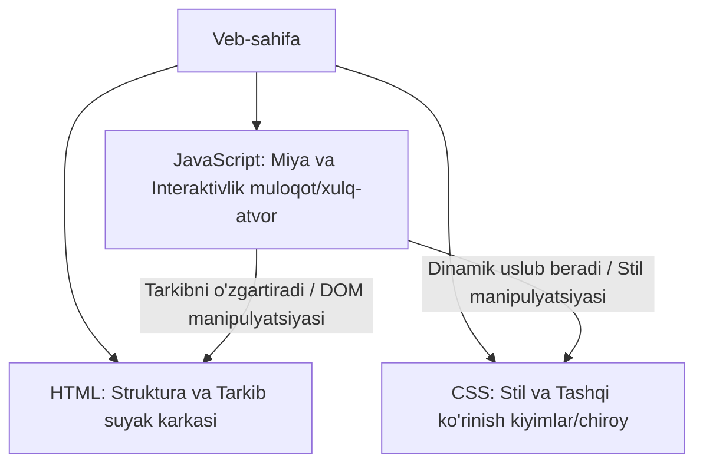

## 1. 💡 Sodda Tushuntirish va Analogiya

### JavaScript nima?
* **JavaScript (JS):** Bu veb-sahifalarni jonlantirish, ularga dinamik xatti-harakatlar va interaktivlik qo'shish uchun ishlatiladigan dasturlash tilidir. Dastlab faqat brauzerlar ichida ishlash uchun mo'ljallangan bo'lsa, bugungi kunda serverlardan tortib sun'iy intellekt tizimlarigacha qo'llaniladi.
* **ECMAScript:** Bu JavaScript tili asoslangan standartdir. Brauzerlar bir xil standartdagi kodlarni tushunishi uchun ushbu standart qoidalari yangilanib turadi.

### Real hayotiy analogiya
Tasavvur qiling, siz **inson tanasini yaratmoqchisiz**:
* **HTML (Suyak karkasi):** Bu insonning skeleti. Unda ko'zlar, qo'llar va oyoqlar qayerda joylashishi ko'rsatiladi, lekin ular hali harakatlanmaydi va chiroyga ega emas.
* **CSS (Kiyim va Teri):** Bu insonning tashqi ko'rinishi. Ko'zining rangi, sochlarining turi, kiygan kiyimlari. Bu dizayn va uslubdir.
* **JavaScript (Miya va Muskullar):** Bu insonning harakatlanishi, gapirishi, o'ylashi va atrof-muhit bilan muloqot qilishi. Tugma bosilganda qo'lning ko'tarilishi yoki savolga miya orqali javob berilishi JavaScript hisoblanadi.

---

## 2. 💻 Real Kod Misollari

### 1. Basic Example (Sodda o'zgaruvchi va konsol xabari)
O'zgaruvchilar yaratish va ma'lumotlarni konsolga chop etish:
```javascript
// O'zgaruvchilar e'lon qilish
const userName = "Sardor";
let attemptCount = 3;

// let yordamida yaratilgan o'zgaruvchini o'zgartirish mumkin
attemptCount = attemptCount - 1;

console.log(`Salom, ${userName}! Sizda ${attemptCount}ta urinish qoldi.`);
// Natija: Salom, Sardor! Sizda 2ta urinish qoldi.
```

### 2. Intermediate Example (Tugma bosilganda sahifani o'zgartirish)
Foydalanuvchi interaktivligi bilan ishlash (DOM manipulyatsiyasi):
```javascript
// HTML-dagi tugma va matn elementlarini aniqlaymiz
const subscribeBtn = document.getElementById("sub-btn");
const statusText = document.getElementById("status-text");

// Tugma bosilganda ishga tushadigan funksiya
subscribeBtn.addEventListener("click", () => {
  statusText.textContent = "Siz kanalga muvaffaqiyatli obuna bo'ldingiz! 🎉";
  subscribeBtn.textContent = "Obuna bo'lindi";
  subscribeBtn.disabled = true; // Tugmani faolsizlantirish
});
```

### 3. Advanced Example (API-dan ma'lumot yuklash va sahifaga chiqarish)
Asinxron Fetch so'rovi orqali ma'lumotlarni yuklab olish:
```javascript
async function fetchWeather() {
  try {
    console.log("Ob-havo ma'lumotlari yuklanmoqda...");
    const response = await fetch("https://api.weatherapi.com/v1/current.json?q=Tashkent");
    
    if (!response.ok) throw new Error("Tarmoq xatosi!");
    
    const data = await response.json();
    document.getElementById("temp").textContent = `${data.current.temp_c}°C`;
    console.log("Ma'lumot ekranga chiqarildi.");
  } catch (error) {
    console.error("Xatolik yuz berdi:", error);
  }
}

fetchWeather();
```

---

## 3. ⚙️ Qanday Ishlaydi (Under the Hood)

### JavaScript Engine va JIT kompilyatsiyasi
JavaScript kodi oddiy matn ko'rinishida yoziladi. Kompyuter yoki brauzer uni bevosita tushunmaydi. Kodni ishga tushirish uchun brauzer ichidagi **JavaScript Dvigatellari** (masalan, Google Chrome va Node.js uchun **V8**, Firefox uchun **SpiderMonkey**) ishlaydi.

Dvigatel ishlash bosqichlari:
1. **Parsing (Tahlil qilish):** Kod satrma-satr o'qilib, uning sintaktik daraxti — **AST (Abstract Syntax Tree)** yaratiladi.
2. **Kompilyatsiya (JIT - Just-In-Time):** JavaScript nafaqat interpretator, balki JIT kompilyatordan foydalanadi. Kod bajarilayotgan paytning o'zida tezda mashina kodiga o'giriladi. Bu tilning juda tez ishlashiga yordam beradi.
3. **Execution (Bajarilish):** Call Stack va Memory Heap yordamida funksiyalar va xotira boshqariladi.

> [!NOTE]
> JavaScript **Single-Threaded** (bir oqimli) tildir, ya'ni bir vaqtda faqat bitta vazifani bajara oladi. Asinxron operatsiyalar brauzerning Web API qismiga topshiriladi va Event Loop orqali boshqariladi.

---

## 4. ❌ Ko'p Uchraydigan Xatolar (Junior Mistakes)

### 1. Skriptni HTML hujjat boshida defer/async-siz chaqirish
#### Xato:
```html
<head>
  <script src="main.js"></script>
</head>
```
Bu holda brauzer skriptni to'liq yuklab, ishga tushirgunicha HTML sahifa yuklanishi to'xtab qoladi (render-blocking). Skript DOM elementlarini topa olmay xato berishi mumkin.
#### To'g'ri usul:
```html
<head>
  <script src="main.js" defer></script>
</head>
```
`defer` atributi skriptni orqa fonda yuklab, faqat butun HTML tahlil qilinib bo'lingach ishga tushiradi.

### 2. `const` bilan yaratilgan o'zgaruvchini qayta o'zgartirishga urinish
#### Xato:
```javascript
const userRole = "user";
userRole = "admin"; // TypeError: Assignment to constant variable.
```
#### To'g'ri usul:
Qiymati keyinchalik o'zgaradigan o'zgaruvchilar uchun har doim `let` kalit so'zidan foydalaning:
```javascript
let userRole = "user";
userRole = "admin";
```

### 3. `undefined` va `null` qiymatlarini chalkashtirish
* `undefined` — o'zgaruvchi e'lon qilingan, lekin unga hali hech qanday qiymat berilmaganligini bildiradi (avtomatik beriladi).
* `null` — dasturchi tomonidan ataylab berilgan bo'sh, yo'q qiymatdir.

---

## 5. 💬 12 ta Intervyu Savollari

### Junior (1–4)
1. **Savol:** JavaScript nima va u qaysi standartga asoslangan?
   * **Javob:** JavaScript — bu veb-sahifalarga dinamiklik va interaktivlik beruvchi til bo'lib, u ECMAScript (ES) standartiga asoslanadi.
2. **Savol:** `let`, `const` va `var` farqlari nimada?
   * **Javob:** `var` global yoki funksiya scope-ga ega va hoist bo'ladi. `let` va `const` esa block scope-ga ega (figurali qavslar ichida ishlaydi). `const` qiymatini qayta e'lon qilib yoki o'zgartirib bo'lmaydi.
3. **Savol:** JavaScript-da qanday ibtidoiy (primitive) ma'lumot turlari bor?
   * **Javob:** JavaScript-da 7 ta primitive tur mavjud: String, Number, Boolean, Null, Undefined, Symbol va BigInt.
4. **Savol:** `typeof` operatori nima vazifani bajaradi?
   * **Javob:** `typeof` o'zgaruvchi yoki qiymatning qaysi ma'lumot turiga tegishli ekanligini matn ko'rinishida qaytaradi (masalan: `"string"`, `"number"`).

### Middle (5–8)
5. **Savol:** Dynamic Typing (Dinamik tiplash) nima degani?
   * **Javob:** O'zgaruvchi yaratilayotganda uning turi aniq ko'rsatilmaydi. Uning turi ichiga yuklangan qiymatga qarab dinamik ravishda aniqlanadi va o'zgarishi mumkin.
6. **Savol:** `==` va `===` operatorlarining farqi nimada?
   * **Javob:** `==` taqqoslashdan oldin qiymatlarning turini bir xil ko'rinishga keltirib tekshiradi (implicit type coercion). `===` esa ham turni, ham qiymatni qat'iy tekshiradi (strict equality).
7. **Savol:** Nima uchun `typeof null` ning javobi `"object"` chiqadi?
   * **Javob:** Bu JavaScript tili ilk yaratilgan vaqtda yuz bergan va keyinchalik eski kodlar buzilib ketmasligi uchun o'zgartirilmagan tarixiy xatolik (bug) hisoblanadi.
8. **Savol:** `defer` va `async` atributlarining farqi nimada?
   * **Javob:** Ikkisi ham skriptni parallel ravishda fonda yuklaydi. `async` skript tayyor bo'lishi bilanoq sahifani to'xtatib uni bajaradi. `defer` esa faqat HTML hujjat to'liq yuklangandan keyingina kodlarni ketma-ket bajaradi.

### Senior (9–12)
9. **Savol:** Just-In-Time (JIT) kompilyatsiyasi qanday ishlaydi?
   * **Javob:** JS Dvigateli kod bajarilishi jarayonida tez-tez chaqiriladigan funksiyalarni (hot functions) kuzatadi (profiling) va ularni interpretatordan to'g'ridan-to'g'ri tezkor mashina kodiga o'tkazadi. Agar kiritilgan ma'lumot turi o'zgarsa, dvigatel uni qaytadan interpretator rejimiga qaytaradi (deoptimization).
10. **Savol:** Garbage Collector xotirani qanday tozalaydi?
    * **Javob:** Asosan "Mark-and-Sweep" algoritmi yordamida. Global obyekt (root) dan boshlab, bog'lanishlar tarmog'i bo'ylab barcha obyeklar tekshiriladi. Global doiradan mutlaqo kirish imkoni bo'lmagan (erishib bo'lmaydigan) obyektlar xotiradan o'chirib yuboriladi.
11. **Savol:** Nima uchun JavaScript Event Loop tufayli Single-Threaded bo'lsa ham ko'p vazifali (non-blocking) bo'lib ko'rinadi?
    * **Javob:** Chunki og'ir asinxron topshiriqlar (taymerlar, tarmoq so'rovlari) brauzerning ichki Web API tizimiga beriladi. Ular bajarilib bo'lingach, ularning callback funksiyalari Callback Queue-ga tushadi. Event Loop faqatgina Call Stack bo'sh bo'lganda, queue-dagi kodlarni stack-ga o'tkazib ishlatadi.
12. **Savol:** Strict Mode (`'use strict'`) nima va u qanday xavfsizlikni ta'minlaydi?
    * **Javob:** Kodni qat'iy rejimda ishlatish uchun fayl boshiga yoziladi. U e'lon qilinmagan o'zgaruvchilar ishlatilishini taqiqlaydi, xavfsiz bo'lmagan xatti-harakatlarda xatoliklarni chiqaradi (silent errors to throwing errors) va kelajakdagi ES standartlari uchun zamin yaratadi.

---

## 6. 🛠️ Amaliy Topshiriqlar

JavaScript veb-sahifadagi HTML elementlarni manipulyatsiya qilish va CSS stillarini dinamik boshqarish orqali haqiqiy "miya" va boshqaruvchi rolimni bajaradi. Quyidagi diagrammada HTML, CSS va JavaScript o'rtasidagi munosabat tasvirlangan:



Ushbu darsning amaliy topshiriqlari yordamida siz o'zingizning ilk JavaScript funksiyangizni yozasiz, o'zgaruvchilarni e'lon qilasiz va ma'lumot turlarini `typeof` operatori bilan aniqlashni o'rganasiz.

---

## 7. 📝 12 ta Mini Test

Dars oxiridagi interaktiv testlar orqali JavaScript asoslari, sintaksis, ma'lumot turlari va brauzerda skript yuklanish tartiblari haqida olgan bilimlaringizni sinab ko'ring.

---

## 8. 🎯 Real Project Case Study

### Tungi/Kunduzgi rejim (Dark/Light Mode) almashtirgichi
Haqiqiy loyihalarda foydalanuvchiga qulaylik yaratish uchun qorong'u fon rejimini yoqish imkoniyati qo'shiladi. Bu butunlay JavaScript boshqaruvida bo'ladi.

#### Kod yechimi:
```javascript
// 1. O'zgartiruvchi tugmani va sahifa tanasini (body) olamiz
const toggleBtn = document.querySelector(".theme-toggle");

// 2. Tugma bosilishini doimiy eshitamiz
toggleBtn.addEventListener("click", () => {
  // 3. body elementining 'dark-theme' klassini o'zgartiramiz (bor bo'lsa o'chiradi, yo'q bo'lsa qo'shadi)
  document.body.classList.toggle("dark-theme");
  
  // 4. Holatni tekshirib konsolda aks ettiramiz
  const isDarkMode = document.body.classList.contains("dark-theme");
  console.log(`Tizim rejimi: ${isDarkMode ? "Qorong'u" : "Yorug'"}`);
});
```

---

## 9. 🚀 Performance va Optimization

* **defer yordamida yuklash:** Sahifa yuklanish tezligini (LCP ko'rsatkichini) oshirish uchun har doim JavaScript fayllarini `<script defer>` atributi bilan yuklang.
* **Minifikatsiya qilish:** Ishlab chiqarishga (production) yuborishdan oldin keraksiz bo'shliqlar va izohlardan tozalash orqali JavaScript fayllarining hajmini kamaytiring.

---

## 10. 📌 Cheat Sheet

| Vosita / Atribut | Vazifasi | Misol |
| :--- | :--- | :--- |
| **HTML** | Sahifaning tuzilishi va ma'lumotlarini belgilaydi | `<h1>Sarlavha</h1>` |
| **CSS** | Sahifa elementlarini chiroyli ko'rinishga keltiradi | `body { background: #000; }` |
| **JavaScript** | Sahifaga harakat va muloqot elementlarini qo'shadi | `btn.onclick = () => alert('!')` |
| **let / const** | O'zgaruvchi va o'zgarmaslarni e'lon qiladi | `let x = 5; const PI = 3.14;` |
| **typeof** | Berilgan qiymat yoki o'zgaruvchi turini aniqlaydi | `typeof "Salom" // "string"` |
| **defer** | Skriptni fonda parallel yuklab, DOM tayyor bo'lgach ishga tushiradi | `<script src="app.js" defer></script>` |
