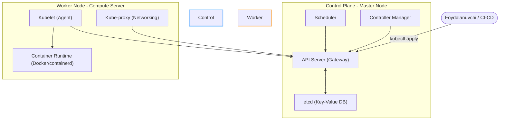

## 1. 💡 Sodda Tushuntirish va Analogiya

### Kubernetes (K8s) nima?
Docker yordamida ilovamizni konteynerga joyladik. Lekin real loyihalarda bizda bitta emas, balki yuzlab konteynerlar bo'lishi mumkin. Agar konteynerlardan biri to'satdan o'chib qolsa, yuklama haddan tashqari oshib ketganda uni qanday ko'paytiramiz (scale)? Ularni bir-biri bilan qanday bog'laymiz?

Mana shu muammolarni hal qilish uchun bizga **Kubernetes (K8s)** yordam beradi.
**Kubernetes** — bu konteynerlarni avtomatlashtirilgan tarzda joylashtirish (deployment), ularni masshtablash (scaling) va boshqarish (orchestration) uchun mo'ljallangan platformadir.

### Real hayotiy analogiya
Tasavvur qiling, sizda **katta simfonik orkestr** bor:
* Har bir **musiqachi** — bu bitta **Konteyner** (masalan, Docker konteyneri). U faqat o'z asbobini chalishni biladi.
* **Kubernetes** — bu **Orkestr Diriqyori**. Diriqyor musiqachilarga qachon boshlashni, qachon to'xtashni, qaysi ohangda chalishni va kim balandroq chalishi kerakligini aytadi. Agar biror cholg'uchi charchab chala olmay qolsa (konteyner o'chib qolsa), diriqyor darhol uning o'rniga zaxiradagi musiqachini chiqaradi.

---

## 2. 💻 Real Kod Misollari

Kubernetes-da barcha resurslar deklarativ tarzda **YAML** formatidagi manifest fayllar orqali tavsiflanadi.

### 1. Pod Manifesti (`pod.yaml`)
**Pod** — Kubernetes-dagi eng kichik va oddiy joylashtirish birligi. U o'z ichiga bitta yoki bir nechta konteynerni oladi.
```yaml
apiVersion: v1
kind: Pod
metadata:
  name: my-node-app
  labels:
    app: backend
spec:
  containers:
    - name: node-container
      image: node:20-alpine
      ports:
        - containerPort: 8080
      resources:
        limits:
          memory: "256Mi"
          cpu: "500m"
        requests:
          memory: "128Mi"
          cpu: "250m"
```

### 2. Deployment Manifesti (`deployment.yaml`)
**Deployment** — Pod-larning nechtaligi (replicas), qanday yangilanishi va ularni boshqarish qoidalarini belgilaydi. U ReplicaSet-ni boshqaradi.
```yaml
apiVersion: apps/v1
kind: Deployment
metadata:
  name: backend-deployment
spec:
  replicas: 3 # Har doim 3 ta pod ishlab turishi shart
  selector:
    matchLabels:
      app: backend
  template:
    metadata:
      labels:
        app: backend
    spec:
      containers:
        - name: node-app
          image: myregistry/node-app:v1.0.0
          ports:
            - containerPort: 8080
          livenessProbe:
            httpGet:
              path: /healthz
              port: 8080
            initialDelaySeconds: 15
            periodSeconds: 20
```

### 3. Service Manifesti (`service.yaml`)
**Service** — Dinamik ravishda o'zgarib turuvchi Pod-larga barqaror IP-manzil (yoki DNS) beradi va yuklamani tarqatadi.
```yaml
apiVersion: v1
kind: Service
metadata:
  name: backend-service
spec:
  type: NodePort # Tashqi dunyo ulanishi uchun
  selector:
    app: backend # Qaysi pod-larga yo'naltirishni belgilaydi
  ports:
    - protocol: TCP
      port: 80 # Service porti
      targetPort: 8080 # Konteyner porti
      nodePort: 30080 # Tashqi host porti (30000-32767 oralig'ida)
```

---

## 3. ⚠️ Muammo va Nima uchun Muhimligi

### Kubernetes qaysi muammolarni hal qiladi?
1. **Self-Healing (O'zini davolash):** Agar konteyner buzilsa yoki tugun (node) ishdan chiqsa, K8s buni darhol sezadi va yangi konteynerni boshqa tugunda avtomatik ishga tushiradi.
2. **Horizontal Scaling (Masshtablash):** Saytga odam ko'payganda (masalan, aksiyalar paytida) bitta buyruq bilan Pod-lar sonini 1 tadan 10 taga oshirish mumkin. Yuklama kamayganda esa resurslarni tejash uchun yana kamaytiriladi.
3. **Service Discovery va Load Balancing:** K8s pod-larga avtomatik ravishda o'z IP-manzillarini beradi va ular orasida kelayotgan so'rovlarni teng taqsimlaydi (Load Balancer).
4. **Automated Rollouts & Rollbacks:** Yangi versiyani yuklaganda (Update), K8s foydalanuvchilarga bildirmasdan, eski podlarni birma-bir o'chirib, o'rniga yangilarini qo'shadi (Rolling Update). Agar yangi versiyada xato chiqsa, avtomatik ravishda eski versiyaga qaytadi (Rollback).

---

## 4. ❌ Ko'p Uchraydigan Xatolar (Junior Mistakes)

### 1. Konteyner Image tagini `latest` deb belgilash
* **Xato:** `image: my-app:latest`. Bu yangi build-larda kutilmagan xatolarga olib keladi va rollback qilishni imkonsiz qiladi.
* **Tuzatish:** Har doim aniq semantik versiyadan foydalaning (masalan, `image: my-app:1.2.3`).

### 2. Resurs chegaralarini (CPU/Memory Limits) belgilamaslik
* **Xato:** Pod resurs chegaralarisiz ishga tushirilsa, bitta pod xatolik tufayli barcha server xotirasini yeb bitirishi va qo'shni podlarni ham o'chirib yuborishi mumkin.
* **Tuzatish:** Har doim `resources.limits` va `resources.requests` qismlarini yozing.

### 3. Maxfiy ma'lumotlarni YAML manifestida ochiq yozish
* **Xato:** Baza paroli yoki API tokenlarni to'g'ridan-to'g'ri `deployment.yaml` ichida saqlash.
* **Tuzatish:** Maxfiy ma'lumotlar uchun `Secret` resursidan, oddiy sozlamalar uchun esa `ConfigMap`dan foydalaning.

---

## 5. 💬 12 ta Intervyu Savollari

### Junior
1. **Savol:** Kubernetes (K8s) nima va 8 nima anglatadi?
   * **Javob:** Konteynerlarni orkestratsiya qiluvchi ochiq kodli vosita. "8" esa "K" va "s" harflari orasidagi 8 ta harfni (ubernete) bildiradi.
2. **Savol:** Pod nima?
   * **Javob:** Kubernetes-dagi eng kichik hisoblash birligi bo'lib, uning ichida bitta yoki bir nechta konteyner bo'lishi mumkin.
3. **Savol:** Service nima uchun kerak?
   * **Javob:** Pod-larning IP manzillari tez-tez o'zgarib turgani uchun ularga doimiy tarmoq kirish nuqtasi va yuklama taqsimlovchisini ta'minlash uchun kerak.
4. **Savol:** Kubectl nima?
   * **Javob:** Kubernetes cluster-i bilan muloqot qilish uchun ishlatiladigan rasmiy buyruqlar satri (CLI) vositasidir.

### Middle
5. **Savol:** ReplicaSet va Deployment o'rtasidagi farq nimada?
   * **Javob:** ReplicaSet faqat belgilangan sondagi Pod-lar nusxasi ishlab turishini nazorat qiladi. Deployment esa ReplicaSet-ni boshqaradi va yangi versiyalarni xavfsiz yangilash (rollout/rollback) imkonini beradi.
6. **Savol:** Minikube va K3s nima va ular qachon ishlatiladi?
   * **Javob:** Mahalliy kompyuterda sinov klasterini ishga tushirish uchun yengil vositalar. Minikube ko'proq resurs talab qiladi, K3s esa IoT va yengil tizimlar uchun optimallashgan.
7. **Savol:** Liveness va Readiness Probes farqi nimada?
   * **Javob:** Liveness probe konteyner o'lib qolganligini tekshiradi (o'lsa, K8s uni o'chirib qayta ishga tushiradi). Readiness probe esa konteyner so'rovlarni qabul qilishga tayyorligini tekshiradi (tayyor bo'lguncha unga trafik yo'naltirilmaydi).
8. **Savol:** ConfigMap va Secret farqi nimada?
   * **Javob:** ConfigMap oddiy matnli sozlamalarni saqlash uchun, Secret esa parollar kabi maxfiy ma'lumotlarni Base64 formatida shifrlab saqlash uchun ishlatiladi.

### Senior
9. **Savol:** Control Plane (Master Node) tarkibiy qismlarini sanab bering va ularning vazifalarini tushuntiring.
   * **Javob:** **API Server** (muloqot markazi), **etcd** (cluster bazasi), **Scheduler** (podlarni tugunlarga joylashtiruvchi), **Controller Manager** (cluster holatini kuzatuvchi nazoratchi).
10. **Savol:** Worker Node tarkibiy qismlariga nimalar kiradi?
    * **Javob:** **Kubelet** (tugundagi agent), **Kube-proxy** (tarmoq qoidalari boshqaruvchisi) va **Container Runtime** (konteynerlarni yurituvchi dvigatel, masalan containerd yoki Docker).
11. **Savol:** RollingUpdate strategiyasi qanday ishlaydi?
    * **Javob:** Yangi versiyadagi Pod-larni birma-bir yaratib, eski versiyadagi Pod-larni navbatma-navbat o'chiradi. Bu loyihaning biror soniya ham to'xtab qolmasdan (zero-downtime) yangilanishini ta'minlaydi.
12. **Savol:** Node Affinity nima?
    * **Javob:** Pod-larni ma'lum bir xususiyatga (label) ega bo'lgan maxsus Worker Node-larga joylashtirish qoidasi (masalan, faqat GPU bor serverlarda ishlashini ta'minlash).

---

## 6. 🛠️ Amaliy Topshiriqlar

Kubernetes klasterining Control Plane va Worker Node o'rtasidagi asosiy komponentlar arxitekturasi:



---

## 7. 📝 12 ta Mini Test

Kubernetes bo'yicha bilimlaringizni mustahkamlash uchun mini testlarni bajaring.

---

## 8. 🎯 Real Project Case Study

### Elektron tijorat saytida HPA (Horizontal Pod Autoscaler)
Katta sotuvlar (Black Friday) paytida backend xizmati yuklamani ko'tara olmay qolishi mumkin. 

**Yechim:**
Biz klasterda CPU yuklamasi 70% dan oshganda avtomatik ravishda podlar sonini 2 tadan 10 tagacha ko'paytiradigan HPA (Autoscaler) o'rnatamiz:

```yaml
# hpa.yaml
apiVersion: autoscaling/v2
kind: HorizontalPodAutoscaler
metadata:
  name: backend-autoscaler
spec:
  scaleTargetRef:
    apiVersion: apps/v1
    kind: Deployment
    name: backend-deployment
  minReplicas: 2
  maxReplicas: 10
  metrics:
  - type: Resource
    resource:
      name: cpu
      target:
        type: Utilization
        averageUtilization: 70
```

---

## 9. 🚀 Performance va Optimization

* **Kichik Image hajmi:** Worker Node-larga yuklanish tez bo'lishi uchun Alpine kabi yengil bazaviy tasvirlardan foydalaning.
* **Probes sozlash:** `initialDelaySeconds`ni ilovangiz haqiqatda ishga tushish vaqtiga moslang, aks holda K8s ishga tushishga ulgurmagan konteynerni buzilgan deb hisoblab, cheksiz qayta o'rnataveradi.
* **Requests va Limits optimal qiymatlari:** Monitoringsiz limits belgilamang. CPU limit haddan tashqari kam bo'lsa CPU throttling (ilovaning sekinlashishi), Memory limit kam bo'lsa OOMKilled (xotira yetishmay o'chib qolish) yuz beradi.

---

## 10. 📌 Cheat Sheet

| Buyruq | Vazifasi | Misol |
| :--- | :--- | :--- |
| `kubectl apply -f <file>` | Manifestni klasterga qo'llash | `kubectl apply -f deployment.yaml` |
| `kubectl get <resource>` | Resurslar ro'yxatini olish | `kubectl get pods` yoki `kubectl get svc` |
| `kubectl describe <res> <name>` | Resurs haqida batafsil ma'lumot | `kubectl describe pod my-pod` |
| `kubectl logs <pod-name>` | Pod loglarini ko'rish | `kubectl logs my-pod` |
| `kubectl delete -f <file>` | Resurslarni o'chirish | `kubectl delete -f deployment.yaml` |
| `kubectl exec -it <pod> -- sh` | Pod ichiga kirish | `kubectl exec -it my-pod -- sh` |
