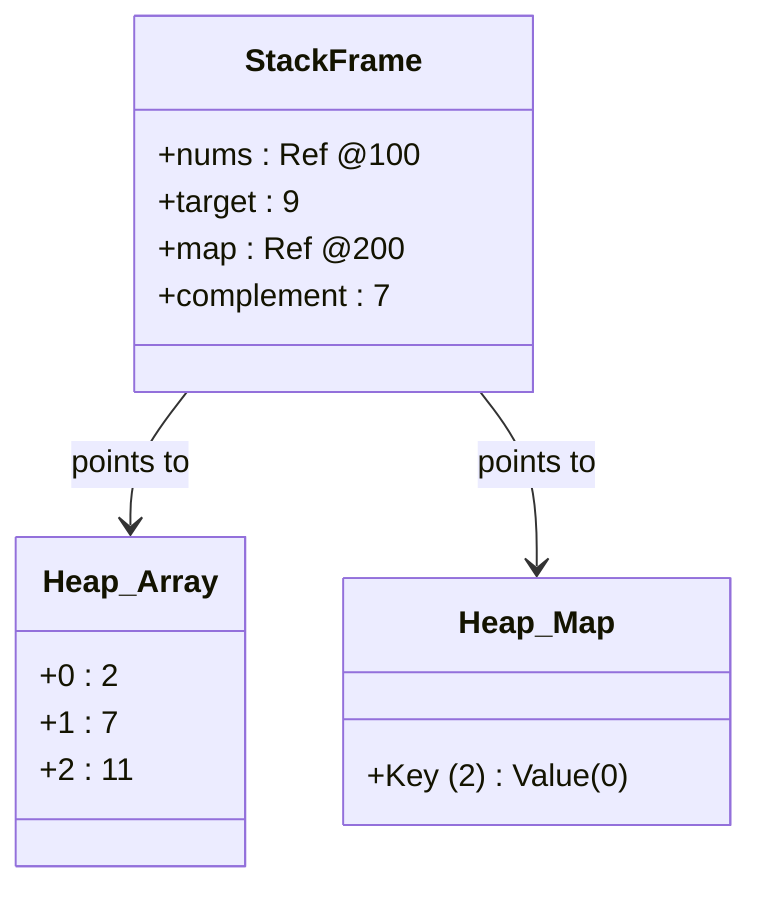
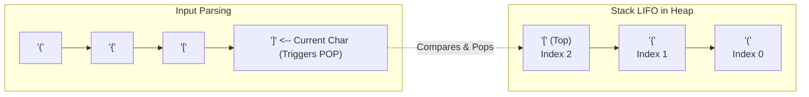

## 1. 💡 Sodda Tushuntirish va Analogiya

### Top LeetCode Masalalari nima?
**LeetCode** — bu dasturchilar uchun algoritmik fikrlashni rivojlantirish va yirik texnologik kompaniyalar (Google, Meta, Amazon, Apple, Netflix va boshqalar) intervyulariga tayyorlanish uchun dunyodagi eng mashhur platformadir.
Top LeetCode masalalari odatda eng ko'p so'raladigan va dasturlashning asosiy naqshlarini (patterns) o'z ichiga olgan klassik muammolardir.

### Real hayotiy analogiya
Algoritmlarni yechish va naqshlarni o'rganish xuddi **shaxmat o'ynashga** o'xshaydi:
* **Brute Force (Oddiy yo'l):** Shaxmat donalarini tasodifiy surib ko'rish yoki raqibning har bir mumkin bo'lgan yurishini hisoblab chiqish (juda ko'p vaqt oladi).
* **Algoritmik naqshlar (Patterns):** Shaxmatdagi ma'lum debyutlar, taktikalar (vilka, bog'lash, mot naqshlari) kabi, algoritmlarda ham ma'lum usullar bor (masalan, Sliding Window, Two Pointers, DFS, Dynamic Programming). Agar siz shu naqshlarni bilsangiz, masalani ko'rishingiz bilan uning optimal yechimini ko'ra olasiz.

---

## 2. 💻 Real Kod Misollari

### 1. Basic Example (Two Sum - Ikki son yig'indisi)
Berilgan massiv ichidan yig'indisi target-ga teng bo'lgan ikki son indeksini topish:
```javascript
// O(n) vaqt va O(n) xotira yechimi
function twoSum(nums, target) {
  const map = new Map(); // Qiymat -> Indeks xaritasi
  
  for (let i = 0; i < nums.length; i++) {
    const complement = target - nums[i];
    
    // Agar farq map-da bo'lsa, indekslarni qaytaramiz
    if (map.has(complement)) {
      return [map.get(complement), i];
    }
    
    // Aks holda joriy sonni indeks bilan birga saqlaymiz
    map.set(nums[i], i);
  }
  return [];
}

console.log(twoSum([2, 7, 11, 15], 9)); // [0, 1]
```

### 2. Intermediate Example (Valid Parentheses - Qavslarni tekshirish)
Qavslar to'g'ri ochilib yopilganligini stak yordamida tekshirish:
```javascript
function isValid(s) {
  const stack = [];
  const map = {
    ')': '(',
    '}': '{',
    ']': '['
  };
  
  for (let char of s) {
    if (char === '(' || char === '{' || char === '[') {
      stack.push(char); // Ochilgan qavsni stakka qo'shamiz
    } else {
      // Yopiluvchi qavs kelganda stakdan oxirgisini pop qilamiz
      const last = stack.pop();
      if (last !== map[char]) {
        return false; // Mos kelmasa xato
      }
    }
  }
  
  return stack.length === 0; // Agar stak bo'sh bo'lsa, hammasi to'g'ri yopilgan
}

console.log(isValid("()[]{}")); // true
console.log(isValid("([)]")); // false
```

### 3. Advanced Example (Best Time to Buy and Sell Stock)
Maksimal foydani bitta tsikl yordamida topish (Kadane uslubiga yaqin):
```javascript
function maxProfit(prices) {
  let minPrice = Infinity;
  let maxProfit = 0;
  
  for (let i = 0; i < prices.length; i++) {
    if (prices[i] < minPrice) {
      minPrice = prices[i]; // Eng arzon narxni yangilaymiz
    } else if (prices[i] - minPrice > maxProfit) {
      maxProfit = prices[i] - minPrice; // Maksimal foydani yangilaymiz
    }
  }
  
  return maxProfit;
}

console.log(maxProfit([7, 1, 5, 3, 6, 4])); // 5 (1 da sotib olib, 6 da sotiladi)
```

---

## 3. ⚠️ Muammo va Nima uchun Muhimligi

### Qaysi muammoni hal qiladi?
* **Texnik intervyulardan o'tish:** Yirik IT kompaniyalari sizning dasturlash tilingizni bilishingizdan ko'ra muammoni hal qilish logikangizni (Problem Solving) tekshiradi. LeetCode masalalari aynan shuni baholash uchun standart vositadir.
* **Kodni optimallashtirish ko'nikmasi:** Kundalik dasturlashda juniorlar ko'pincha nested loops (ichma-ich tsikllar) yozib, O(n²) yechimlar yaratishadi. LeetCode naqshlarini bilish esa kodni O(n) yoki O(log n) tezlikda ishlashiga imkon beradi.

---

## 4. ❌ Ko'p Uchraydigan Xatolar (Junior Mistakes)

### 1. Brute Force yechimida to'xtab qolish
Masalaga yechim yozgach, tezlikni tekshirmaslik eng katta xatodir.
* *Junior:* Nested loops (O(n²)) yozadi va ishlayotganiga xursand bo'ladi.
* *Senior:* Xotira (Space) va Vaqt (Time) murakkabliklarini tahlil qilib, Hash Table, Sliding Window yoki Two Pointers yordamida tezlikni O(n) ga tushiradi.

### 2. Edge case-larni (chekka holatlar) hisobga olmaslik
#### Xato:
Massiv bo'sh bo'lganda, bitta element bo'lganda yoki manfiy sonlar bo'lganda kodni tekshirmaslik.
#### Tuzatish:
Kod yozishdan oldin input validatsiyasini va chekka holatlarni o'ylash kerak:
`if (!prices || prices.length < 2) return 0;`

---

## 5. 💬 12 ta Intervyu Savollari

### Junior (1–4)
1. **Savol:** Big O notation nima va u nima uchun kerak?
   * **Javob:** Algoritmning ma'lumotlar hajmi (n) ortib borishi bilan vaqt va xotira sarfi qanchalik o'sishini ifodalovchi matematik o'lchovdir.
2. **Savol:** Stack va Queue farqi nimada?
   * **Javob:** Stack — LIFO (Last In First Out - oxirgi kirgan birinchi chiqadi), Queue — FIFO (First In First Out - birinchi kirgan birinchi chiqadi).
3. **Savol:** Nima uchun Two Sum masalasida Map ishlatganimiz ma'qul?
   * **Javob:** Map ichidan kalit bo'yicha qiymat qidirish vaqt murakkabligi O(1) bo'lganligi sababli.
4. **Savol:** Satr (string) belgilarini tezkor teskari (reverse) qilish qanday amalga oshiriladi?
   * **Javob:** JS-da: `s.split('').reverse().join('')` yoki Two Pointer yordamida massivga o'girib, o'rinlarini almashtirish orqali.

### Middle (5–8)
5. **Savol:** Sliding Window (Sirpanuvchi oyna) texnikasi qachon ishlatiladi?
   * **Javob:** Massiv yoki satrning ketma-ket kelgan qismlarini (subarrays/substrings) tahlil qilishda, keraksiz takroriy hisoblashlarni oldini olish uchun.
6. **Savol:** Linked List (Bog'langan ro'yxat) nima va uning massivdan afzalligi nimada?
   * **Javob:** Elementlari xotirada ketma-ket joylashmagan, har bir element keyingisiga ko'rsatkich (pointer) saqlaydigan tuzilma. Afzalligi — element qo'shish va o'chirish O(1) vaqt oladi.
7. **Savol:** Kadane algoritmi nima?
   * **Javob:** Massiv ichidagi eng katta yig'indiga ega bo'lgan ketma-ket qism massivni (Maximum Subarray) O(n) vaqtda topuvchi algoritm.
8. **Savol:** `Fast and Slow Pointers` (Tez va sekin ko'rsatkichlar) texnikasi qayerda ishlatiladi?
   * **Javob:** Linked List ichida sikl (loop/cycle) bor-yo'qligini aniqlashda (Floyd's Cycle Finding Algorithm) yoki ro'yxatning o'rtasini topishda.

### Senior (9–12)
9. **Savol:** Dinamik Dasturlash (Dynamic Programming) va Rekursiya o'rtasidagi farq nima?
   * **Javob:** DP — bu rekursiv muammoning kichik qismlari natijalarini keshlab (Memoization yoki Tabulation orqali), takroriy hisob-kitoblarni chetlab o'tuvchi optimallashtirilgan yondashuvdir.
10. **Savol:** BFS va DFS algoritmlarining xotira murakkabligi farqi nimada?
    * **Javob:** BFS daraxt kengligiga qarab xotira oladi (navbat queue ishlatadi), DFS esa daraxt chuqurligiga qarab xotira oladi (chaqiriqlar staki ishlatiladi).
11. **Savol:** "Monotonic Stack" nima va u qanday masalalarda qo'llaniladi?
    * **Javob:** Elementlari faqat o'sib borish yoki faqat kamayib borish tartibida saqlanadigan stak. U ko'pincha "keyingi eng katta element" (Next Greater Element) kabi masalalarni O(n) da yechishda qo'llaniladi.
12. **Savol:** Tizimli dizayn (System Design) va LeetCode algoritmlari o'rtasidagi bog'liqlik nimada?
    * **Javob:** Leetcode masalalari past darajadagi (low-level) kod tezligi va xotirani optimallashtirsa, System Design yuqori darajadagi (high-level) arxitektura, keshlar, ma'lumotlar bazalarini taqsimlash muammolarini hal qiladi. Har ikkisi ham masshtablanuvchanlik (scalability) uchun muhimdir.

---

## 6. 🎨 Interaktiv Vizual

LeetCode masalalarida yechimning tezligi kabi uning xotira strukturalari ustidagi amallari ham juda muhim.

### 1. Two Sum: Hash Map va Massivning Xotira Holati

`twoSum([2, 7, 11], 9)` masalasida:
* **Stack**: Funksiya chaqiruvi local parametrlarni saqlaydi (`nums = @100`, `target = 9`).
* **Heap `@100`**: Asl massiv `[2, 7, 11]`.
* **Heap `@200`**: Biz yaratgan `Map` (Hash Table). 2 elementini ko'rganimizda uning jufti `7` ekanini bilamiz. `Map`-ga `2: 0` (qiymat -> indeks) juftligini yozamiz. 7 kelganda esa `9 - 7 = 2` ni `Map` ichidan $O(1)$ tezlikda qidirib topamiz.



### 2. Valid Parentheses: Stack va LIFO Xotira Dinamikasi

`isValid("({[]})")` satri tekshirilayotganda Stack-dagi o'zgarishlar:
* Har bir ochiluvchi qavs Heap-dagi dinamik massivga (stakka) qo'shib boriladi (`push`).
* Yopiluvchi qavs kelganda stakning eng oxirgi elementi olinadi (`pop`) va tekshiriladi.



### 3. Best Time to Buy and Sell Stock: $O(1)$ Xotira bilan Optimal Ishlash

Ushbu yechimda qo'shimcha massiv yoki obyekt yaratilmaydi. Hamma o'zgaruvchilar faqat **Stack** xotirada saqlanadi. Heap-dan faqat massiv elementlari o'qiladi. Xotira sarfi cheksiz n uchun ham bir xil ($O(1)$).

```mermaid
graph TD
    subgraph Stack Frame
        MinPrice["minPrice = 1"]
        MaxProfit["maxProfit = 5"]
    end
    
    subgraph Heap Array prices = @500
        P1["7"]
        P2["1"]
        P3["5"]
        P4["3"]
        P5["6"]
        P6["4"]
    end
    
    MinPrice -.->|"reads and updates"| P2
    MaxProfit -.->|"calculates profit"| P5
```

---

## 7. 🛠️ Amaliy Topshiriqlar

Ushbu bo'limdagi interaktiv muharrir yordamida Two Sum, Valid Parentheses va Best Time to Buy and Sell Stock masalalarini optimal usullarda yozib, test topshiriqlarini bajaring.

---

## 8. 🎯 Real Project Case Study

### Ilova loglari yoki qavslar sintaksisini tekshiruvchi validator
Matn muharrirlarida (masalan, VS Code yoki brauzer konsolida) foydalanuvchi kod yozayotganda qavslarning to'g'ri ochilib yopilganligini real vaqtda tekshirish tizimi Stack va Map algoritmlari yordamida ishlaydi.

#### Kod sintaksisi validatorining soddalashtirilgan ko'rinishi:
```javascript
class SyntaxValidator {
  constructor() {
    this.matchingPairs = { ')': '(', '}': '{', ']': '[' };
    this.openingSet = new Set(['(', '{', '[']);
  }

  validate(codeString) {
    const stack = [];
    for (let char of codeString) {
      if (this.openingSet.has(char)) {
        stack.push(char);
      } else if (this.matchingPairs[char]) {
        if (stack.length === 0 || stack.pop() !== this.matchingPairs[char]) {
          return false; // Noto'g'ri yopilgan qavs
        }
      }
    }
    return stack.length === 0; // Ochiq qavs qolib ketmaganligini tekshirish
  }
}
```

---

## 9. 🚀 Performance va Optimization

* **O'rnatilgan metodlardan qochish:** Ba'zida `Array.prototype.indexOf` yoki `.includes` metodlarini tsikl ichida ishlatish bilmasdan O(n²) tezlikka olib kelishi mumkin. Ularning o'rniga Map/Set (O(1)) ishlatgan ma'qul.
* **Xotira tejash (In-place changes):** Agar qo'shimcha xotira sarflash taqiqlangan bo'lsa (O(1) Space), massiv elementlarini vaqtinchalik massivga ko'chirmasdan, Two Pointer texnikasi bilan joyida almashtiring.

---

## 10. 📌 Cheat Sheet

| Naqsh (Pattern) | Qachon ishlatiladi | Murakkablik (Time) | Masalaga misol |
| :--- | :--- | :--- | :--- |
| **Two Pointers** | Saralangan massivda juftliklarni qidirishda | O(n) | Two Sum II, Reverse String |
| **Sliding Window** | Subarray yoki Substring o'lchamlarini dinamik tekshirishda | O(n) | Longest Substring Without Repeating Chars |
| **Fast & Slow** | Linked listda aylanma yo'llarni topishda | O(n) | Linked List Cycle |
| **Hash Map / Set** | Qiymatlarni tezkor tekshirish va indeks saqlashda | O(1) amallar | Two Sum, Contains Duplicate |
| **Stack** | Qavslar, orqaga qaytish (backtracking) jarayonlarida | O(n) | Valid Parentheses |
