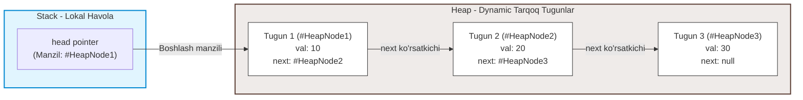
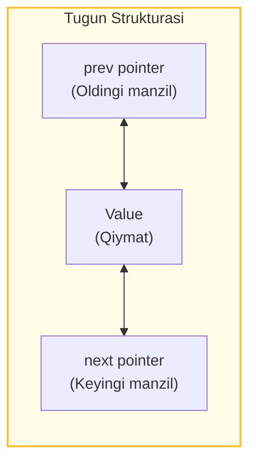

## 1. 💡 Sodda Tushuntirish va Analogiya

### Bog'langan Ro'yxat (Linked List) nima?
* **Linked List:** Bu elementlari xotirada ketma-ket emas, balki tarqoq joylashgan va har bir element (tugun) o'zidan keyingi elementga havola (ko'rsatkich) orqali bog'langan ma'lumotlar tuzilmasidir.
* **Tarkibi:** Har bir element **Tugun (Node)** deb ataladi va u ikki qismdan iborat:
  1. **Qiymat (Value):** Tugunda saqlanadigan ma'lumot.
  2. **Ko'rsatkich (Next pointer):** Keyingi tugunning xotiradagi manzili.
* **Floyd Tsikl Tizimi (Floyd's Cycle Detection):** Bog'langan ro'yxat ichida oxiri yo'q cheksiz aylanma yo'l (tsikl) bor-yo'qligini aniqlaydigan algoritm.

### Real hayotiy analogiya
Tasavvur qiling, siz **xazina qidiryapsiz (Treasure Hunt)**:
* **Massiv usuli (Array):** Sizga xarita berilgan va u yerda xazinalar qaysi uylarda ekani aniq yozilgan. Siz to'g'ridan-to'g'ri 5-uyga borib xazinani olasiz.
* **Linked List usuli:** Siz birinchi uyga borasiz. U yerda xazina va keyingi xazina qaysi uyda ekanligi yozilgan eslatma (havola) bor. Keyingi uyga borasiz, u yerda ham qiymat va keyingi uy manzili yozilgan. Oxirgi uyda esa "Keyingi uy yo'q" deb yozilgan (`null`).
* **Floyd Tsikl Tizimi (Aylanma yo'l):** Agar kimdir uydagi eslatmani avvalgi biror uyga yo'naltirib qo'ysa, siz aylanma yo'lga kirib qolasiz va umringiz oxirigacha o'sha uylar orasida aylanib yuraverasiz. Uni aniqlash uchun ikki kishi (biri sekin yuruvchi Toshbaqa, biri tez yuguruvchi Quyon) yo'lga chiqadi. Agar yo'l aylana bo'lsa, Quyon baribir Toshbaqani quvib yetadi.

---

## 2. 💻 Real Kod Misollari

### 1. Tugun (Node) va Linked List yaratish
JavaScript-da bog'langan ro'yxatni class-lar yordamida yozamiz:
```javascript
class Node {
  constructor(val) {
    this.val = val;
    this.next = null; // Boshida keyingi tugun yo'q
  }
}

// Ro'yxatni yaratish: 1 -> 2 -> 3 -> null
const head = new Node(1);
head.next = new Node(2);
head.next.next = new Node(3);
```

### 2. Bog'langan ro'yxatni aylanib chiqish (Traversal)
```javascript
function printList(head) {
  let current = head;
  while (current !== null) {
    console.log(current.val);
    current = current.next; // Ko'rsatkichni keyingi tugunga suramiz
  }
}
printList(head); // Konsolga: 1, 2, 3 chiqadi
```

### 3. Floyd Tsikl Aniqlash Algoritmi (Detect Cycle)
```javascript
function hasCycle(head) {
  let slow = head;
  let fast = head;

  while (fast !== null && fast.next !== null) {
    slow = slow.next;       // 1 qadam siljiydi (Toshbaqa)
    fast = fast.next.next;  // 2 qadam siljiydi (Quyon)

    if (slow === fast) {
      return true; // Ular uchrashdi, demak tsikl bor!
    }
  }
  return false; // fast oxiriga yetdi, tsikl yo'q
}
```

---

## 3. ⚙️ Qanday Ishlaydi (Under the Hood)

### Xotira taqsimoti va Tugunlar sxemasi (Memory Allocation & Node Layouts)
Massivlardan farqli o'laroq, Linked List elementlari xotiradan ketma-ket joy talab qilmaydi.
* **Massiv xotira joylashuvi:** Kompyuter RAMidan yaxlit, chiziqli blok ajratadi. Indeks orqali element topish $O(1)$ bo'lsa-da, massiv hajmini oshirish yoki boshiga element qo'shish barcha elementlarni siljitishni (shuning uchun $O(n)$) talab qiladi.
* **Linked List xotira joylashuvi:** Har safar `new Node(val)` yozilganda, JavaScript obyekti xotiraning ixtiyoriy, bo'sh bo'lgan **Heap (Xip)** qismida yaratiladi.
* **Havolalar (Pointer references):** Heapdagi har bir Node obyektida ikkita xossa bo'ladi: `val` (qiymat) va `next`. `next` xossasi qiymat emas, balki keyingi Node obyektining Heapdagi **xotira manzili (hexadecimal address reference)** bo'ladi.
* **Stack xotira roli:** Bizning dasturimizdagi `head` o'zgaruvchisi Stackda joylashadi va u faqat birinchi tugunning Heapdagi manziliga ishora qiladi. Biz keyingi tugunlarga faqat ushbu zanjirlangan manzillar orqali borishimiz mumkin.

#### CPU Kesh effekti (Cache Locality)
Massivlar ketma-ket joylashgani sababli CPU kesh xotirasiga (L1/L2/L3) yaxlit holda yuklanadi va ularni o'qish juda tez kechadi. Linked List tugunlari esa Heap bo'ylab tarqoq bo'lgani sababli, CPU har bir tugunga o'tishda yangi xotira so'rovini yuboradi. Bunga **pointer chasing (ko'rsatkich quvish)** deyiladi va u kesh xatoliklarini (cache misses) keltirib chiqaradi.

### Floyd algoritmining matematik isboti
Nega tezkor (fast) va sekin (slow) ko'rsatkichlar tsikl ichida albatta to'qnashadi?
* Tsikl ichida `fast` ko'rsatkichi har qadamda `slow`ga 1 qadamdan yaqinlashib boradi (chunki tezligi $2 - 1 = 1$). 
* Masofa har qadamda 1 taga qisqargani sababli, ular orasidagi masofa albatta 0 ga teng bo'ladi va ular uchrashadi.

---

## 4. ❌ Ko'p Uchraydigan Xatolar (Junior Mistakes)

### 1. `null` qiymat ustida `.next`ni chaqirish (NullPointer Exception)
Ko'rsatkichni tekshirmasdan oldinga surish dasturni buzib qo'yadi.
* **Xato:**
  ```javascript
  let current = head;
  while (current.next !== null) { // Agar head null bo'lsa, xatolik beradi
    current = current.next;
  }
  ```
* **Tuzatish:**
  ```javascript
  let current = head;
  while (current !== null && current.next !== null) {
    current = current.next;
  }
  ```

### 2. Havolalarni yo'qotib qo'yish (Broken Chain)
Yangi element qo'shayotganda yoki o'chirayotganda zanjir tartibini noto'g'ri yozish havolalar uzilishiga olib keladi.
* **Xato:**
  ```javascript
  // Yangi tugunni head-dan keyin qo'shish
  let newNode = new Node(1.5);
  head.next = newNode; // Head-ning eski next havolasi yo'qoldi! (2 va 3-tugunlar xotirada yetim qoldi)
  ```
* **Tuzatish:**
  ```javascript
  let newNode = new Node(1.5);
  newNode.next = head.next; // Avval yangi tugunni eski zanjirga ulaymiz
  head.next = newNode;      // Keyin head-ni yangi tugunga ulaymiz
  ```

---

## 5. 💬 12 ta Intervyu Savollari

### Junior
1. **Linked List nima?**
   * *Javob:* Har bir elementi qiymat va keyingi elementga havola saqlaydigan tugunlar zanjiridan iborat chiziqli ma'lumotlar tuzilmasi.
2. **Linked List massivdan qanday ustunlikka ega?**
   * *Javob:* Boshiga va oxiriga (tail ma'lum bo'lsa) element qo'shish/o'chirish O(1) vaqt oladi va o'lchami dynamic ravishda o'zgaradi.
3. **Singly va Doubly Linked List farqi nimada?**
   * *Javob:* Singly list faqat keyingi tugunga havola qiladi. Doubly list esa ham keyingi, ham oldingi tugunga havola qiladi.
4. **Linked List-da element o'chirish qanday ishlaydi?**
   * *Javob:* O'chiriladigan tugundan oldingi tugunning `next` havolasini o'chirilayotgan tugundan keyingi tugunga yo'naltirish orqali.

### Middle
5. **Nima uchun Linked List-da elementni indeks bo'yicha olish O(n) vaqt talab qiladi?**
   * *Javob:* Chunki elementlar xotirada tarqoq joylashgan va to'g'ridan-to'g'ri indeks bo'yicha borib bo'lmaydi. Boshidan boshlab bittalab aylanib chiqish shart.
6. **Floyd Tsikl aniqlash algoritmi qanday ishlaydi?**
   * *Javob:* Ikkita ko'rsatkich (slow va fast) olingan holda, fast ikki marta tezroq yuradi. Agar tsikl bo'lsa, ular to'qnashadi, bo'lmasa fast oxiriga yetib boradi.
7. **Singly Linked List-ni teskari qilish algoritmini tushuntiring.**
   * *Javob:* Uchta ko'rsatkich (`prev`, `current`, `next`) yordamida zanjir bo'ylab yurib, har bir tugunning `next` havolasini orqadagi `prev` tugunga qarab o'zgartirib chiqiladi.
8. **Linked List-da xotira sarfi massivdagidan ko'pmi?**
   * *Javob:* Ha, chunki qiymatning o'zidan tashqari har bir tugun uchun pointer (havola) ham saqlanishi kerak.

### Senior
9. **Circular Linked List nima va u qayerda ishlatiladi?**
   * *Javob:* Oxirgi tugunning `next` ko'rsatkichi yana `head`ga ulanadigan ro'yxat. U aylanma navbatlar (Round-Robin CPU scheduling) kabi algoritmlarda ishlatiladi.
10. **Floyd algoritmi orqali tsikl boshlanish nuqtasini (tugunini) qanday topish mumkin?**
    * *Javob:* Toshbaqa va Quyon to'qnashganidan so'ng, ulardan birini (masalan, slow) yana `head`ga qaytaramiz. Keyin ikkalasini ham 1 qadamdan surib boramiz. Ular yana uchrashgan nuqta tsikl boshlanish tuguni bo'ladi.
11. **Skip List nima?**
    * *Javob:* Elementlarni qidirishni tezlashtirish (O(log n)) uchun bir necha qatlamli ko'rsatkichlarga ega bo'lgan bog'langan ro'yxat turi.
12. **Garbage Collector (Axlat yig'uvchi) bog'langan ro'yxatdagi o'chirilgan tugunlarni qachon xotiradan o'chiradi?**
    * *Javob:* Qachonki global qamrovda yoki ishlayotgan funksiyalarda ushbu tugunga olib boruvchi birorta ham havola qolmagan bo'lsa.

---

## 6. 🎨 Interaktiv Vizual

### Xotira taqsimoti (Stack vs Heap)
Stack xotiradagi `head` ko'rsatkichi Heapdagi tarqoq tugunlar zanjirini qanday bog'lab turishi:



### Doubly Linked List Node Layout (Ikki tomonlama bog'langan tugun)
Har bir Doubly Node xotirada 3 ta bo'limdan tarkib topadi:



---

## 7. 🛠️ Amaliy Topshiriqlar

Bu dars uchun topshiriqlar `linkedLists_exercises.json` faylida berilgan. U yerda siz ro'yxatni teskari qilish, Floyd tsikl algoritmini yozish va ro'yxat o'rtasini topish kabi topshiriqlarni bajarasiz.

---

## 8. 📝 12 ta Mini Test

Dars bo'yicha bilimingizni sinash uchun 12 ta test savollari tayyorlangan bo'lib, ular `linkedLists_quizzes.json` faylida keltirilgan.

---

## 9. 🎯 Real Project Case Study

### Browser History (Orqaga-Oldinga o'tish tizimi)
Brauzerlarda "Orqaga" (Back) va "Oldinga" (Forward) tugmalari qanday ishlaydi?
* **Yechim:** Bu tizim Doubly Linked List yordamida amalga oshiriladi.
* **Ishlash tartibi:**
  * Har bir ochilgan sahifa yangi tugun sifatida qo'shiladi va joriy tugun unga bog'lanadi.
  * Biz hozir turgan sahifa ko'rsatkich sifatida saqlanadi (`current`).
  * "Orqaga" bosilganda `current = current.prev` qilinadi.
  * "Oldinga" bosilganda `current = current.next` qilinadi.

```javascript
class BrowserHistory {
  constructor(homepage) {
    this.current = { url: homepage, prev: null, next: null };
  }

  visit(url) {
    const newPage = { url: url, prev: this.current, next: null };
    this.current.next = newPage;
    this.current = newPage; // Yangi sahifaga o'tdik
  }

  back() {
    if (this.current.prev) {
      this.current = this.current.prev;
    }
    return this.current.url;
  }

  forward() {
    if (this.current.next) {
      this.current = this.current.next;
    }
    return this.current.url;
  }
}
```

---

## 10. 📌 Cheat Sheet

| Operatsiya | Array (Massiv) | Linked List (Bog'langan Ro'yxat) | Izoh |
| :--- | :--- | :--- | :--- |
| **Lookup (Indeks orqali olish)** | O(1) | O(n) | Massivda random access bor, ro'yxatda yo'q |
| **Insert at Head (Boshiga qo'shish)** | O(n) | O(1) | Massiv elementlarini surish kerak, ro'yxatda shart emas |
| **Insert at Tail (Oxiriga qo'shish)** | O(1) | O(1) (tail bo'lsa) / O(n) (bo'lmasa) | Ro'yxat oxirigacha borish vaqti talab qilinishi mumkin |
| **Delete (O'chirish)** | O(n) | O(1) (tugun berilgan bo'lsa) | Havolani o'zgartirish kifoya |
| **Qo'shimcha Xotira** | Yo'q | Bor (next va prev pointerlar uchun) | Ro'yxat ko'proq RAM sarflaydi |
