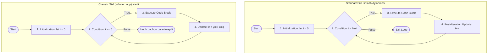

## 1. 💡 Sodda Tushuntirish va Analogiya

### Sikl (Loop) nima?
Dasturlashda ko'pincha bir xil amalni bir necha marta takrorlashga to'g'ri keladi. Masalan, 1 dan 100 gacha sanash, massivdagi barcha elementlarni ekranga chiqarish yoki foydalanuvchi to'g'ri parol kiritmaguncha so'rov yuborish. Bu takrorlanuvchi jarayonlar **sikllar (loops)** orqali amalga oshiriladi.

JavaScript-da asosan uchta klassik sikl turi mavjud:
* **`for` (Soni aniq takrorlanish):** Agar siz amal necha marta bajarilishi kerakligini oldindan bilsangiz (masalan, roppa-rosa 10 marta yoki massiv uzunligicha), ushbu sikl eng yaxshi tanlovdir.
* **`while` (Shartli takrorlanish):** Takrorlanishlar soni oldindan ma'lum bo'lmasa-da, ma'lum bir shart to'g'ri (`true`) bo'lib turgunga qadar ishni davom ettirish kerak bo'lganda ishlatiladi.
* **`do-while` (Kamida bir marta ishlaydigan takrorlanish):** Xuddi `while` kabi ishlaydi, lekin shartni tekshirishdan oldin kod blokini **kamida bir marta** bajarish kafolatlanadi.

---

### Real hayotiy analogiya

Tasavvur qiling, siz **sport zalidasiz va murabbiy sizga mashq topshirdi**:
* **`for` sikli (10 marta turnikda tortilish):** Siz 1 dan boshlab sanaysiz, har bir tortilishda sonni 1 taga oshirasiz va 10 ga yetganda to'xtaysiz. Necha marta tortilishingiz boshidanoq aniq belgilangan.
* **`while` sikli (Charchamaguningizcha yugurish):** Murabbiy sizga "charchab qolmaguningizcha yuguring" dedi. Har bir aylanadan keyin o'zingizdan so'raysiz: "Charchadimmi?". Agar charchamagan bo'lsangiz (`charchadim === false`), yugurishda davom etasiz. Boshida charchagan bo'lsangiz, umuman yugurmasligingiz ham mumkin.
* **`do-while` sikli (Taomni tatib ko'rish):** Murabbiy sizga yangi vitaminli ichimlik berdi va "yoqmaguncha iching" dedi. Siz ichimlik yoqadimi yo'qmi bilish uchun **kamida bir marta** tatib ko'rishingiz (xo'plashingiz) shart. Birinchi xo'plamdan keyingina shartni tekshira boshlaysiz.

---

## 2. 💻 Real Kod Misollari

### 1. Basic Example (`for` sikli - Sonlarni sanash)
Noldan boshlab berilgan songacha bo'lgan raqamlarni konsolga chiqarish:
```javascript
const limit = 5;

// for (boshlanish; shart; o'zgarish)
for (let i = 0; i < limit; i++) {
  console.log("Hozirgi son:", i);
}
// Natija:
// Hozirgi son: 0
// Hozirgi son: 1
// Hozirgi son: 2
// Hozirgi son: 3
// Hozirgi son: 4
```

### 2. Intermediate Example (`while` va `do-while` farqi)
Keling, bir xil noto'g'ri shart bilan ikkala siklni ham ishga tushirib ko'ramiz:
```javascript
let countWhile = 10;
// while shartni boshida tekshiradi
while (countWhile < 5) {
  console.log("while ichi bajarildi"); // Bu kod umuman ishlamaydi
  countWhile++;
}

let countDo = 10;
// do-while avval kodni bajarib, keyin shartni tekshiradi
do {
  console.log("do-while ichi bajarildi!"); // Bu kod 1 marta ishlaydi
  countDo++;
} while (countDo < 5);

// Natijada konsolga faqat: "do-while ichi bajarildi!" chiqadi.
```

### 3. Advanced Example (Sikl ichida break, continue va obyektdan foydalanish)
Massiv ichidagi foydalanuvchilar orasidan faqat "admin" bo'lmagan birinchi 2 ta foydalanuvchini topish:
```javascript
const users = [
  { name: "Ali", role: "admin" },
  { name: "Vali", role: "user" },
  { name: "Sardor", role: "user" },
  { name: "Jasur", role: "admin" },
  { name: "Lola", role: "user" }
];

const selectedUsers = [];

for (let i = 0; i < users.length; i++) {
  // Agar foydalanuvchi admin bo'lsa, uni tashlab o'tamiz (continue)
  if (users[i].role === "admin") {
    continue; 
  }

  selectedUsers.push(users[i]);

  // Kerakli miqdordagi odamni yig'gach, siklni butunlay to'xtatamiz (break)
  if (selectedUsers.length === 2) {
    break; 
  }
}

console.log(selectedUsers);
// Natija: [{ name: "Vali", role: "user" }, { name: "Sardor", role: "user" }]
```

---

## 3. ⚙️ Qanday Ishlaydi (Under the Hood)

### JavaScript Call Stack va Sikllarni Bajarish mexanizmi
JavaScript dvigateli (V8 kabi) sikllarni qanday bajaradi?
1. **Sinxron Bajarilish:** JavaScript bir oqimli (single-threaded) bo'lgani uchun, sikl boshlanganda u joriy Execution Context-ni (bajarilish muhitini) va Call Stack-ni band qiladi. Sikl to'liq tugamaguncha undan keyingi qatordagi kodlar bajarilmaydi (ya'ni sikllar bloklovchi xususiyatga ega).
2. **Kompilyator darajasida (Jumps):** Dvigatel darajasida sikl sharti tekshirilgach, assembler tilidagi `JUMP` (o'tish) buyrug'i kabi kodning ma'lum bir satriga qaytish yoki shart bajarilmaganda sikldan keyingi satrga sakrash amalga oshiriladi.
3. **`let` bilan block scope yaratilishi:** `for (let i = 0; i < 5; i++)` siklida `let` har bir iteratsiya (aylanish) uchun alohida Leksik Muhit (Lexical Environment) yaratadi. Bu esa sikl ichidagi asinxron funksiyalar (masalan, `setTimeout` yoki event listener) har safar `i` ning o'z qadamidagi nusxasini xotirada to'g'ri saqlab qolishini ta'minlaydi.

> [!WARNING]
> Agar sikl sharti noto'g'ri yozilsa va u cheksiz davom etsa, Call Stack abadiy band bo'lib qoladi. Event Loop navbatdagi boshqa vazifalarni (tugma bosilishi, renderlash, taymerlar) stack-ga yuklay olmaydi va natijada brauzer tabingiz butunlay qotib qoladi (Thread Block).

---

## 4. ❌ Ko'p Uchraydigan Xatolar (Junior Mistakes)

### 1. Cheksiz Sikl (Infinite Loop) - Qadamni yangilashni unutish
Sikl o'zgaruvchisini o'zgartirishni unutish eng ko'p uchraydigan xatodir.
* **Noto'g'ri:**
  ```javascript
  let i = 0;
  while (i < 5) {
    console.log(i);
    // i++ yozilmadi. i doimo 0 ga teng bo'lib qoladi va sikl cheksiz aylanadi.
  }
  ```
* **To'g'ri:**
  ```javascript
  let i = 0;
  while (i < 5) {
    console.log(i);
    i++; // Har safar qadam 1 taga oshadi
  }
  ```

### 2. Off-by-One Xatoligi (Chegaradan chiqib ketish)
Massiv indekslari 0 dan boshlangani sababli, oxirgi indeks har doim `length - 1` bo'ladi. `<` o'rniga `<=` ishlatilsa, massiv chegarasidan chiqib ketiladi.
* **Noto'g'ri:**
  ```javascript
  const arr = [10, 20, 30];
  for (let i = 0; i <= arr.length; i++) {
    console.log(arr[i]); // Oxirgi iteratsiyada arr[3] ya'ni `undefined` chiqadi
  }
  ```
* **To'g'ri:**
  ```javascript
  const arr = [10, 20, 30];
  for (let i = 0; i < arr.length; i++) {
    console.log(arr[i]); // To'g'ri: 10, 20, 30 chiqadi
  }
  ```

### 3. Loop ichida `var` ishlatilishi va asinxronlik xatosi
`var` block scope-ga ega bo'lmagani sababli asinxron hodisalarda kutilmagan natija beradi.
* **Noto'g'ri:**
  ```javascript
  for (var i = 0; i < 3; i++) {
    setTimeout(() => console.log(i), 100); 
  }
  // Konsolga 3 ta "3" chiqadi. Chunki i umumiy o'zgaruvchi va u sikl yakunida 3 ga teng bo'lib qolgan.
  ```
* **To'g'ri:**
  ```javascript
  for (let i = 0; i < 3; i++) {
    setTimeout(() => console.log(i), 100); 
  }
  // Konsolga "0, 1, 2" chiqadi, chunki let har bir qadam uchun alohida scope yaratadi.
  ```

---

## 5. 💬 12 ta Intervyu Savollari

### Junior
1. **Savol:** JavaScript-da qanday sikllar mavjud va ularning asosiy vazifasi nima?
   * **Javob:** `for`, `while`, `do-while`, `for...in`, va `for...of` sikllari bor. Ularning vazifasi ma'lum bir kod qismini berilgan shart asosida takroriy bajarishdir.
2. **Savol:** `for` siklining qavslari ichidagi uchta ifoda nima uchun xizmat qiladi?
   * **Javob:** `initialization` (boshlang'ich qiymat o'rnatish), `condition` (sikl davom etish sharti) va `update` (har bir aylanishdan keyin o'zgaruvchini o'zgartirish).
3. **Savol:** `break` va `continue` o'rtasidagi farq nimada?
   * **Javob:** `break` siklni darhol to'xtatib, undan butunlay chiqib ketadi. `continue` esa siklning joriy aylanmasini to'xtatib, kod blokining qolgan qismini tashlab yuboradi va darhol keyingi aylanmaga (iteratsiyaga) o'tadi.
4. **Savol:** Nima uchun `do-while` sikli kamida bir marta ishlaydi deb aytiladi?
   * **Javob:** Chunki `do-while` sintaksisida avval kod bloki bajariladi (`do` qismi), so'ngra shart tekshiriladi (`while` qismi). Shart boshidanoq noto'g'ri bo'lsa ham, birinchi aylanish allaqachon bajarilgan bo'ladi.

### Middle
5. **Savol:** `for...in` va `for...of` sikllarining farqini tushuntirib bering.
   * **Javob:** `for...in` obyektning kalitlarini (keys / properties) aylanib chiqish uchun ishlatiladi. `for...of` esa faqat iterativ (iterable) obyektlarning (massiv, string, Map, Set) qiymatlarini (values) to'g'ridan-to'g'ri o'qish uchun qo'llaniladi.
6. **Savol:** Cheksiz sikl yuz berganda sahifa nima uchun qotib qoladi (respond qilmaydi)?
   * **Javob:** JavaScript single-threaded bo'lib, uning asosi Event Loop-ga tayanadi. Cheksiz sikl Call Stack-ni to'liq egallab oladi, bu esa Event Loop-ga foydalanuvchi harakatlarini (klik, skrol) yoki sahifani qayta chizish (repaint) operatsiyalarini bajarishga yo'l qo'ymaydi.
7. **Savol:** Quyidagi kod bajarilganda konsolga nima chiqadi va nima uchun?
   ```javascript
   let i = 0;
   for (; i < 3 ;) {
     console.log(i++);
   }
   ```
   * **Javob:** `0, 1, 2` ketma-ket chiqadi. `for` siklida initialization va update qismlarini qavs ichida yozish majburiy emas (lekin nuqtali vergullar yozilishi shart). Qiymat sikl ichida oshirib boriladi.
8. **Savol:** Massivlarni aylanib chiqishda an'anaviy `for` sikli yaxshimi yoki `.forEach()` metodi?
   * **Javob:** `.forEach()` metodi o'qilishi osonroq va xavfsizroq (chegaradan chiqib ketish xavfi yo'q). Ammo an'anaviy `for` sikli ichida `break` yoki `continue` ishlatib, aylanishni erta to'xtatish mumkin, `.forEach()` ichida esa bunday qilib bo'lmaydi (faqat return qilish mumkin, u continue kabi ishlaydi, break qilishning imkoni yo'q).

### Senior
9. **Savol:** Labelled statements (belgili ifodalar) nima va ulardan sikllarda qanday foydalaniladi?
   * **Javob:** Bu sikllarga nom (label) berish usuli bo'lib, ichma-ich joylashgan sikllarda ichki sikl ichidan tashqi siklni to'xtatish (`break labelName`) yoki uni keyingi qadamga o'tkazish (`continue labelName`) imkonini beradi.
10. **Savol:** JavaScript dvigateli (masalan, V8) sikllarni optimallashtirish uchun qanday texnikalardan foydalanadi?
    * **Javob:** Dvigatel **Loop Peeling** (birinchi iteratsiyani alohida ajratish), **Loop Invariant Code Motion** (sikl ichidagi o'zgarmas hisob-kitoblarni sikldan tashqariga chiqarish) va **Loop Unrolling** (kichik sikllarni ketma-ket qatorlarga almashtirish orqali sakrashlarni kamaytirish) kabi optimallashtirishlarni bajaradi.
11. **Savol:** Nima uchun `for...in` siklini massivlar uchun ishlatish tavsiya etilmaydi?
    * **Javob:** Birinchidan, `for...in` indekslarni satr (string) sifatida o'qiydi (masalan, "0", "1"), bu esa matematik amallarda xatolikka olib kelishi mumkin. Ikkinchidan, u massivning prototipiga (prototype chain) qo'shilgan nostandart xususiyatlarni ham aylanib chiqadi, bu esa ortiqcha elementlar chiqishiga sabab bo'ladi.
12. **Savol:** Agar asinxron kodlarni (masalan, API so'rovlarini) ketma-ket bajarish kerak bo'lsa, qaysi sikl yordam beradi?
    * **Javob:** `for...of` sikli ichida `await` ishlatish mumkin. Ya'ni, `for (const item of items) { await fetchItem(item); }` yozilganda, so'rovlar ketma-ket bajariladi. `.forEach` ichida esa `await` ishlatish kutilgandek ishlamaydi, chunki u barcha callbacklarni parallel va sinxron ishga tushirib yuboradi.

---

## 6. 🛠️ Amaliy Topshiriqlar

Sikllar mavzusini amaliy jihatdan mukammal o'zlashtirish uchun topshiriqlar tayyorlangan. Ularni `/Users/farhod/Desktop/github/js-uz/scratch/loops_exercises.json` faylida topishingiz va bajarishingiz mumkin.

### Sikllarning ishlash jarayoni (Lifecycle) va cheksiz sikl sxemasi:

Quyidagi diagrammalarda standart sikl aylanish bosqichlari va xavfli cheksiz sikl qanday yuzaga kelishi tasvirlangan:



---

## 7. 📝 12 ta Mini Test

Dars bo'yicha olgan bilimlaringizni sinash va mustahkamlash uchun 12 ta interaktiv test tayyorlandi. Test savollarini yechish uchun `/Users/farhod/Desktop/github/js-uz/scratch/loops_quizzes.json` faylini oching.

---

## 8. 🎯 Real Project Case Study

### Case Study 1: E-commerce Savatidagi Mahsulotlar Yig'indisini Hisoblash
Katta internet do'konlarda foydalanuvchi savatidagi mahsulotlarning umumiy narxini hisoblash uchun sikllardan foydalaniladi. Quyida dynamic narxlar va chegirmalarni hisobga olib yig'indini hisoblovchi kod keltirilgan:

```javascript
const cart = [
  { name: "Telefon", price: 3000000, quantity: 1, discount: 0.1 }, // 10% chegirma
  { name: "G'ilof", price: 150000, quantity: 2, discount: 0 },
  { name: "Zaryadlovchi", price: 250000, quantity: 1, discount: 0.05 } // 5% chegirma
];

function calculateTotal(cartItems) {
  let totalSum = 0;

  for (let i = 0; i < cartItems.length; i++) {
    const item = cartItems[i];
    const discountedPrice = item.price * (1 - item.discount);
    totalSum += discountedPrice * item.quantity;
  }

  return totalSum;
}

console.log("Jami to'lov:", calculateTotal(cart)); // 3237500 UZS
```

### Case Study 2: API Polling (Doimiy so'rov yuborib holatni tekshirish)
Ba'zida serverda uzoq vaqt talab qiladigan jarayon boshlanadi (masalan, videoni formatini o'zgartirish yoki hisobot tayyorlash). Dastur orqa fonda serverga har 3 soniyada so'rov yuborib, status `'COMPLETED'` bo'lguniga qadar kutishi kerak. Bu `while` yordamida quyidagicha simulyatsiya qilinadi:

```javascript
// Server holatini simulyatsiya qiluvchi funksiya
let attempts = 0;
function checkServerStatus() {
  attempts++;
  console.log(`Serverga so'rov yuborildi (urinish: ${attempts})...`);
  return attempts >= 3 ? "COMPLETED" : "PROCESSING";
}

// Polling jarayoni
function startPolling() {
  let status = "PENDING";
  
  // Status 'COMPLETED' bo'lmaguncha sikl davom etadi
  while (status !== "COMPLETED") {
    status = checkServerStatus();
    
    if (status === "COMPLETED") {
      console.log("Jarayon muvaffaqiyatli yakunlandi!");
      break;
    }
    
    // Haqiqiy loyihada bu yerda asinxron kutish (sleep) qo'yiladi
  }
}

startPolling();
```

---

## 9. 🚀 Performance va Optimization

### 1. Loop Overhead va Cache Optimization
Eski JavaScript dvigatellarida massiv uzunligini har bir iteratsiyada hisoblash vaqt talab qilardi. Zamonaviy dvigatellar buni avtomatik optimallashtirsa-da, katta hajmdagi massivlar uchun uzunlikni o'zgaruvchiga keshlab olish hali ham yaxshi praktika hisoblanadi:
```javascript
// Nisbatan sekinroq (katta massivlarda har iteratsiyada length o'qiladi)
for (let i = 0; i < largeArray.length; i++) { ... }

// Optimallashtirilgan usul (length bir marta o'qib olinadi)
for (let i = 0, len = largeArray.length; i < len; i++) { ... }
```

### 2. Nested Loops (Ichma-ich sikllar) xavfi
Ichma-ich yozilgan sikllar dastur tezligini keskin pasaytiradi, chunki ularning vaqt murakkabligi **$O(N^2)$** ga teng bo'ladi. Agar massivda 10 000 ta element bo'lsa, ichma-ich sikl 100 000 000 (yuz million) marta ishlaydi va sahifani butunlay qotiradi. Bunday holatlarni massivlarni obyekt (Hash Map) yoki `Map` tuzilmalariga o'tkazish orqali optimallashtirish lozim.

### 3. Early Exit (Erta chiqish)
Sikldan qanchalik erta chiqib ketilsa, CPU resurslari shunchalik tejaladi. Masalan, massivdan biror element qidirilayotganda, u topilishi bilanoq `break` orqali sikl to'xtatilishi kerak.

---

## 10. 📌 Cheat Sheet

| Sikl turi | Qachon ishlatiladi | O'ziga xosligi | Oddiy Misol |
| :--- | :--- | :--- | :--- |
| **`for`** | Takrorlanishlar soni aniq bo'lganda | Barcha 3 ta qism (init, cond, update) bir qatorda yoziladi | `for(let i=0; i<5; i++)` |
| **`while`** | Shart to'g'ri bo'lib turguncha takrorlash kerak bo'lsa | Sikl boshlanishidan oldin shart tekshiriladi | `while(x < 10) { x++ }` |
| **`do-while`** | Kamida 1 marta bajarilishi shart bo'lganda | Shart oxirida tekshiriladi | `do { x++ } while(x < 10)` |
| **`for...of`** | Massiv yoki satr qiymatlarini o'qish uchun | Qiymatni to'g'ridan-to'g'ri qaytaradi, indeks yo'q | `for(let val of arr)` |
| **`for...in`** | Obyekt kalitlarini (keys) aylanib chiqishda | Faqat obyekt xususiyatlari nomlarini beradi | `for(let key in obj)` |
