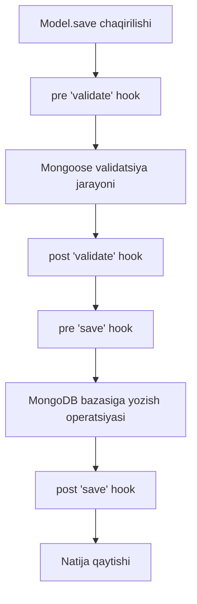

## 1. 💡 Sodda Tushuntirish va Analogiya

### MongoDB va Mongoose nima?
* **MongoDB:** Bu reliesion (SQL) bazalardan farqli ravishda, ma'lumotlarni jadvallarda emas, balki **hujjatlar (documents)** ko'rinishida saqlaydigan NoSQL ma'lumotlar bazasi. Hujjatlar JSON (BSON) formatida yoziladi va ular juda moslashuvchan.
* **Mongoose:** Bu MongoDB uchun yozilgan **ODM (Object Document Mapper)** kutubxonasi. U Node.js dasturi va MongoDB o'rtasida ko'prik vazifasini bajaradi. U bazaga yozilayotgan ma'lumotlar ma'lum bir tartibda (Schema) bo'lishini va tekshiruvlardan (Validation) o'tishini ta'minlaydi.

### SQL vs MongoDB (NoSQL) analogiyasi
Keling, ularni **Kutubxona** tizimi orqali solishtiramiz:
* **SQL (Relyatsion):** Bu an'anaviy kutubxona kartotekasi. Har bir kitob haqida ma'lumot qat'iy ustunlari bor jadvalga yoziladi (ID, Nomi, Muallif, Chiqilgan yili). Agar kitobning bir nechta muallifi bo'lsa, siz alohida `Mualliflar` jadvalini yaratib, ularni kitobga bog'lashingiz shart (JOIN yordamida).
* **MongoDB (NoSQL):** Bu har bir kitob uchun alohida **kichik papka (hujjat)**. Ushbu papka ichida kitob nomi, uning mualliflari massivi va hatto boblar ro'yxatini ham bitta fayl ichida saqlash mumkin. Hech qanday murakkab bog'lanishlarsiz barcha ma'lumot bitta joyda (Document) jamlanadi.

---

## 2. 💻 Real Kod Misollari

### 1. Basic Example (Schema va Model yaratish)
Mongoose-da foydalanuvchilar kolleksiyasi uchun oddiy sxema va model yaratish:
```javascript
const mongoose = require('mongoose');

// 1. Schema loyihasini chizamiz
const userSchema = new mongoose.Schema({
  name: { type: String, required: true },
  email: { type: String, required: true, unique: true },
  age: Number
});

// 2. Sxema asosida model (klass) yaratamiz
const User = mongoose.model('User', userSchema);
```

### 2. Intermediate Example (Validatsiya va Middleware)
Sxema ichida maydonlarni tekshirish (validation) va ma'lumot saqlanishidan oldin ishlovchi hook (middleware):
```javascript
const userSchema = new mongoose.Schema({
  username: {
    type: String,
    required: [true, 'Foydalanuvchi nomi kiritilishi shart'],
    trim: true
  },
  password: {
    type: String,
    required: true,
    minlength: 6
  }
});

// Pre-save hook: Parol bazaga saqlanishidan oldin uni hash qilish
userSchema.pre('save', async function(next) {
  // Faqat parol maydoni o'zgargandagina hash qilamiz
  if (this.isModified('password')) {
    this.password = await bcrypt.hash(this.password, 10);
  }
  next();
});
```

### 3. Advanced Example (Bog'liqliklar va Population)
Ikki kolleksiyani (User va Post) bir-biriga bog'lash va so'rov paytida birlashtirish:
```javascript
// Post Schema
const postSchema = new mongoose.Schema({
  title: { type: String, required: true },
  content: String,
  author: {
    type: mongoose.Schema.Types.ObjectId,
    ref: 'User', // User modeliga ishora (reference)
    required: true
  }
});

const Post = mongoose.model('Post', postSchema);

// So'rov paytida populate yordamida muallif ma'lumotlarini qo'shib olish
async function getPostWithAuthor(postId) {
  const post = await Post.findById(postId).populate('author', 'name email');
  console.log(post);
  /* Natijada author maydoni faqat ID emas, to'liq User obyektiga aylanadi:
     {
       title: "Mongoose Asoslari",
       author: { _id: "...", name: "Farhod", email: "farhod@example.com" }
     }
  */
}
```

---

## 3. ⚠️ Muammo va Nima uchun Muhimligi

### Qaysi muammoni hal qiladi?
1. **Sxemasiz bazaga sxema berish:** MongoDB aslini olganda sxemasiz (schema-less) baza hisoblanadi, ya'ni istalgan hujjatga istalgan maydonni saqlab yuborish mumkin. Mongoose dastur darajasida sxema o'rnatib, tartib va izchillikni ta'minlaydi.
2. **Validatsiya yukini yengillatish:** Bazaga noto'g'ri (masalan, yoshi manfiy yoki formati noto'g'ri email) ma'lumotlar kirishining oldini olishni to'g'ridan-to'g'ri schema darajasida hal qiladi.
3. **Ma'lumotlar hayotiy siklini boshqarish (Lifecycle hooks):** Ma'lumot yozilishi, o'chirilishi yoki yangilanishi jarayonlariga aralashish, parollarni avtomat hashlash yoki log yuritish imkonini beradi.

---

## 4. ❌ Ko'p Uchraydigan Xatolar (Junior Mistakes)

### 1. Hook (Middleware) ichida Arrow funksiyalarni ishlatish
#### Xato:
```javascript
userSchema.pre('save', (next) => {
  this.password = hash(this.password); // Xatolik! this undefined bo'ladi
  next();
});
```
#### Tuzatish:
Mongoose hooklarida joriy hujjatni (document) anglatuvchi `this` konteksti to'g'ri ishlashi uchun **oddiy funksiya** ishlatish shart.
```javascript
userSchema.pre('save', function(next) {
  if (this.isModified('password')) {
    this.password = hash(this.password);
  }
  next();
});
```

### 2. Har doim to'liq Mongoose hujjatini qaytarish (Optimallashtirish yo'qligi)
#### Xato:
Faqat ma'lumotni o'qish (read-only) uchun qilinadigan so'rovlarda ham og'ir Mongoose Document klassini yuklash.
#### Tuzatish:
Faqat o'qish uchun bo'lgan so'rovlarda `.lean()` metodini ishlating. Bu so'rov tezligini 4-5 baravargacha oshiradi.
```javascript
const users = await User.find().lean(); // Oddiy yengil JS obyekti qaytadi
```

### 3. Population ref model nomini xato yozish
#### Xato:
`ref: 'user'` (model nomi kichik harfda, aslida model `User` deb nomlangan).
#### Tuzatish:
Mongoose model yaratilgan nomga sezgir (case-sensitive). Model qanday nomlangan bo'lsa (`mongoose.model('User', ...)`), ref kalitida ham xuddi shunday (`ref: 'User'`) yozilishi shart.

---

## 5. 💬 12 ta Intervyu Savollari

### Junior (1–4)
1. **Savol:** Mongoose-da Schema va Model o'rtasidagi farq nima?
   * **Javob:** Schema - bu ma'lumotlar tuzilishi va qoidalarini belgilaydigan loyiha (blueprint). Model esa shu sxema asosida yaratilgan klass bo'lib, u orqali bazada yaratish, o'qish, yangilash va o'chirish (CRUD) amallari bajariladi.
2. **Savol:** `required: true` nima vazifani bajaradi?
   * **Javob:** Belgilangan maydon kiritilishi majburiy ekanligini bildiradi. Agar u berilmasa, Mongoose validatsiya xatosini qaytaradi va ma'lumot saqlanmaydi.
3. **Savol:** Mongoose-da qanday asosiy ma'lumot turlari mavjud?
   * **Javob:** String, Number, Date, Buffer, Boolean, Mixed, ObjectId, Array va Decimal128.
4. **Savol:** `unique: true` validatsiya hisoblanadimi?
   * **Javob:** Yo'q, u Mongoose validator emas. U MongoDB darajasida yagona indeks (unique index) yaratadi. Shuning uchun uning xatolarini ushlash uchun validator xatolari emas, MongoDB error handling ishlatiladi.

### Middle (5–8)
5. **Savol:** Pre va Post middleware-lar farqi nimada?
   * **Javob:** `pre` middleware ma'lum bir hodisa (masalan, save yoki validate) bajarilishidan oldin ishlaydi va `next()` orqali zanjirni davom ettiradi. `post` middleware esa hodisa muvaffaqiyatli bajarilib bo'lingandan keyin ishlaydi va uning ichida `next` chaqirilmaydi.
6. **Savol:** `isModified()` metodi nima uchun kerak?
   * **Javob:** Hujjatdagi biror maydon qiymati o'zgarganligini tekshirish uchun ishlatiladi. Ko'pincha parolni faqat o'zgargandagina hash qilishda `isModified('password')` ko'rinishida qo'llaniladi.
7. **Savol:** Virtual xossalar nima va ularning afzalligi nimada?
   * **Javob:** Virtual maydonlar bazada saqlanmaydi, lekin so'rov paytida dinamik hisoblanadi (masalan, firstName va lastName birlashib fullName qaytarishi). Ular bazada ortiqcha joy egallamaslik imkonini beradi.
8. **Savol:** Mongoose-da ma'lumotlarni bog'lash (Relationships) qanday amalga oshiriladi?
   * **Javob:** Schema maydoniga `mongoose.Schema.Types.ObjectId` turini berish va bog'lanadigan model nomini `ref` kaliti orqali ko'rsatish orqali amalga oshiriladi.

### Senior (9–12)
9. **Savol:** Mongoose-da `.lean()` metodining ishlash mexanizmi va ahamiyati nimada?
   * **Javob:** Sukut bo'yicha Mongoose so'rovlarida to'liq Mongoose Document obyekti qaytadi, unda `save()`, `validate()`, getters/setters kabi og'ir metodlar bo'ladi. `.lean()` ishlatilganda, Mongoose bularni yuklamaydi, faqat toza POJO (Plain Old JavaScript Object) qaytaradi, bu xotirani tejaydi va tezlikni sezilarli oshiradi.
10. **Savol:** Mongoose-da save lifecycle ketma-ketligi qanday?
    * **Javob:** Quyidagi tartibda amalga oshadi: pre('validate') -> validation jarayoni -> post('validate') -> pre('save') -> bazaga yozish -> post('save').
11. **Savol:** Mongoose-da tranzaksiyalar (Transactions) qanday ishlaydi?
    * **Javob:** MongoDB Replica Set-da ishlayotganda Mongoose tranzaksiyalarni qo'llab-quvvatlaydi. Buning uchun `connection.startSession()` orqali sessiya ochiladi, keyin `session.startTransaction()` chaqiriladi va barcha yozish amallari shu sessiya doirasida bajariladi. Xatolik bo'lsa `abortTransaction()`, muvaffaqiyatli tugasa `commitTransaction()` qilinadi.
12. **Savol:** Discriminators nima va qachon ishlatiladi?
    * **Javob:** Discriminators - bu bir xil kolleksiyadagi ma'lumotlar uchun merosxo'rlik (inheritance) mexanizmi. Masalan, bitta `User` kolleksiyasida `Customer` va `Admin` sxemalarini bir-biridan farqli maydonlar bilan saqlashda ishlatiladi.

---

## 6. 🛠️ Amaliy Topshiriqlar

Ushbu dars amaliy topshiriqlarida siz Mongoose schemalari yaratish, validatsiyalarni sozlash va pre-save hooklari yozish bo'yicha ko'nikmalaringizni sinab ko'rasiz.

---

## 7. 📝 12 ta Mini Test

Bilimingizni sinash va mustahkamlash uchun dars oxirida 12 ta interaktiv test taqdim etiladi.

---

## 8. 🎯 Real Project Case Study

### Avtomatlashtirilgan foydalanuvchi akkaunti hayotiy sikli

Haqiqiy loyihalarda foydalanuvchi ro'yxatdan o'tganda parolni xavfsiz saqlash, ism-familiyani birlashtirib ko'rsatish va profil rasmini default sozlash talab qilinadi. Quyida Mongoose-da bular qanday integratsiya qilinishi ko'rsatilgan:

```javascript
const mongoose = require('mongoose');
const bcrypt = require('bcrypt');

const userSchema = new mongoose.Schema({
  firstName: { type: String, required: true, trim: true },
  lastName: { type: String, required: true, trim: true },
  email: { type: String, required: true, unique: true, lowercase: true },
  password: { type: String, required: true, minlength: 8 },
  avatarUrl: { type: String, default: 'https://example.com/default-avatar.png' }
}, {
  timestamps: true // createdAt va updatedAt maydonlarini avtomat yaratadi
});

// 1. Virtual property orqali to'liq ismni hisoblash
userSchema.virtual('fullName').get(function() {
  return `${this.firstName} ${this.lastName}`;
});

// 2. Pre-save hook orqali parolni hash qilish va default qiymatlarni sozlash
userSchema.pre('save', async function(next) {
  // Parol o'zgargan bo'lsa hashlaymiz
  if (this.isModified('password')) {
    const salt = await bcrypt.genSalt(10);
    this.password = await bcrypt.hash(this.password, salt);
  }
  next();
});

const User = mongoose.model('User', userSchema);
module.exports = User;
```

---

## 9. 🚀 Performance va Optimization

1. **Indekslardan to'g'ri foydalanish:** Tez-tez qidiriladigan maydonlarga (`email`, `username`) sxema darajasida `index: true` yoki `unique: true` bering.
2. **Maydonlarni cheklash (Projection):** So'rov paytida keraksiz maydonlarni (masalan, katta matnlar yoki parollar) chetlab o'ting:
   ```javascript
   const users = await User.find().select('name email'); // Parol va boshqa maydonlar yuklanmaydi
   ```
3. **Mongoose Save Lifecycle Visual:**



---

## 10. 📌 Cheat Sheet

| Metod / Kalit | Sintaksis / Vazifasi | Misol |
| :--- | :--- | :--- |
| **Schema yaratish** | `new mongoose.Schema({ ... })` | Sxema tuzilmasini aniqlash |
| **Model yaratish** | `mongoose.model('ModelName', schema)` | Bazaga so'rov yuboruvchi klass |
| **Pre Hook** | `schema.pre('save', function(next) { ... })` | Saqlashdan oldin bajariladigan funksiya |
| **Post Hook** | `schema.post('save', function(doc) { ... })` | Saqlab bo'lingandan keyin bajariladigan funksiya |
| **Population** | `query.populate('field')` | Bog'langan obyekt ma'lumotlarini yuklash |
| **Lean Queries** | `query.lean()` | Mongoose klassisiz oddiy tezkor obyekt olish |
| **Select Fields** | `query.select('a -b')` | Kerakli maydonlarni tanlash yoki chetlatish |
