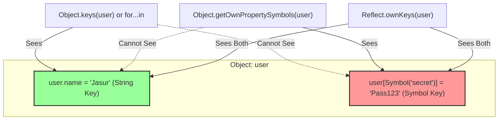

## 1. 💡 Sodda Tushuntirish va Analogiya

JavaScript tilida ma'lumotlar turlari (Data Types) asosan ikki guruhga bo'linadi: **ibtidoiy (primitive)** va **murakkab (reference/object)** turlari. Keling, eng maxsus va ilg'or primitive turlar bo'lgan **Null**, **Symbol** va **BigInt** haqida batafsil gaplashamiz.

*   **Null:** Bu ataylab bo'shliqni, qiymatning mutlaqo yo'qligini anglatuvchi maxsus turdir.
*   **Symbol:** Obyektlar uchun mutlaqo noyob va takrorlanmas kalitlar (identifikatorlar) yaratish uchun xizmat qiladi.
*   **BigInt:** JavaScript-dagi standart `Number` turi sig'dira olmaydigan juda katta butun sonlar (safe butun sonlar limitidan katta) bilan ishlash uchun ishlatiladi.

### Real hayotiy analogiya

1.  **Null (Bo'sh quti):** Tasavvur qiling, uyingizda bitta **quti** bor. Quti ichida hech narsa yo'q va siz buni yaxshi bilasiz, chunki o'zingiz uni bo'shatib qo'ygansiz. Bu `null`. Agar sizda umuman quti bo'lmaganida va u haqida bilmaganingizda, bu `undefined` bo'lar edi.
2.  **Symbol (Barmoq izi):** Har bir insonning o'ziga xos **barmoq izi** bor. Dunyoda ikki insonning ismi bir xil bo'lishi mumkin (masalan, ikkita "Jasur"), lekin ularning barmoq izi hech qachon bir xil bo'lmaydi. `Symbol` — bu obyekt xossalari uchun yaratilgan o'sha takrorlanmas barmoq izidir.
3.  **BigInt (Teleskopik o'lchov):** Oddiy kundalik hayotda siz uyingizning uzunligini o'lchash uchun oddiy **metr o'lchagich** (Number) ishlatasiz. Lekin yer sharidan Quyoshgacha bo'lgan masofani yoki koinotdagi atomlar sonini hisoblash uchun sizga o'ta quvvatli **kosmik kalkulyator** (BigInt) kerak bo'ladi.

---

## 2. 💻 Real Kod Misollari

### 1. Null bilan ishlash (Qasddan bo'shliqni ifodalash)

Foydalanuvchi tizimga kirishidan oldin uning holatini `null` qilamiz. Bu "foydalanuvchi hali aniqlanmagan" degan ma'noni anglatadi.

```javascript
// Foydalanuvchi hali tizimga kirmagan
let currentUser = null; 

function loginUser(user) {
  currentUser = user;
}

console.log(currentUser); // null

loginUser({ name: "Jasur", role: "Admin" });
console.log(currentUser); // { name: "Jasur", role: "Admin" }
```

### 2. Symbol bilan ishlash (Noyob kalitlar yaratish)

Symbol yordamida obyektga yashirin va xavfsiz kalit qo'shish misoli:

```javascript
const userIdSymbol = Symbol('userId');

const employee = {
  name: "Kamola",
  department: "HR",
  [userIdSymbol]: "EMP-9082" // Symbol yordamida yaratilgan xossa
};

// Xossaga murojaat qilish
console.log(employee[userIdSymbol]); // "EMP-9082"

// Symbol kalitlari oddiy kalitlar ro'yxatida ko'rinmaydi
console.log(Object.keys(employee)); // ["name", "department"]
console.log(JSON.stringify(employee)); // '{"name":"Kamola","department":"HR"}'
```

### 3. BigInt bilan ishlash (Katta sonlar ustida amallar)

Standart raqamlar bilan xato hisoblanadigan va BigInt yordamida to'g'ri bajariladigan hisob-kitoblar:

```javascript
// Standart Number xatosi (2^53 - 1 limitidan oshganda):
const maxNum = Number.MAX_SAFE_INTEGER; // 9007199254740991
console.log(maxNum + 1 === maxNum + 2); // true (Bu xato! Lekin JS shunday hisoblaydi)

// BigInt yordamida to'g'ri hisoblash:
const bigNum1 = 9007199254740991n; // Oxiriga 'n' qo'shiladi
const bigNum2 = BigInt("9007199254740993");

const sum = bigNum1 + bigNum2;
console.log(sum); // 18014398509481984n
console.log(bigNum1 + 1n === bigNum1 + 2n); // false (To'g'ri hisob-kitob)
```

---

## 3. ⚠️ Muammo va Nima uchun Muhimligi

### Null nimaga kerak? Undefined bilan farqi nima?
JavaScript-da `undefined` — bu o'zgaruvchi e'lon qilingan-u, lekin unga hali **hech qanday qiymat berilmaganligini** bildiradi. `null` esa dasturchi tomonidan ataylab **"bu yerda hech qanday qiymat yo'q"** deb qo'yilgan qiymatdir. Agarda `null` bo'lmaganida, biz qaysi qiymat hali belgilanmagan (tizim xatosi) va qaysi biri dastur logikasi bo'yicha bo'sh ekanligini ajrata olmasdik.

### Symbol qaysi muammoni hal qiladi?
Agar siz yirik loyihalarda uchinchi tomon kutubxonalari (libraries) bilan ishlasangiz, ulardan keladigan obyektlarga qo'shimcha xossa qo'shish xavfli bo'lishi mumkin. Masalan, siz obyektga `.id` xossasini qo'shsangiz va u kutubxonaning ichki `.id` xossasi bilan to'qnashib (naming collision) qolsa, kutubxona ishdan chiqishi yoki siz yozgan qiymat ustidan yozib yuborilishi mumkin. `Symbol` har doim takrorlanmas qiymat qaytargani uchun nomi bir xil bo'lgan taqdirda ham to'qnashuvni mutlaqo bartaraf etadi.

### BigInt nima uchun muhim?
Bugungi kunda zamonaviy veb-ilovalarda katta ma'lumotlar bazasi ID-lari (masalan, Twitter API-dagi 64-bitli ID-lar), blokcheyn tranzaksiyalari (masalan, Ethereum-dagi Wei qiymatlari) va yuqori darajadagi kriptografik hisob-kitoblar ko'p qo'llaniladi. Standart `Number` turi 15-16 xonali sondan keyin aniqlikni yo'qotadi. BigInt esa xotira yetguncha istalgancha uzunlikdagi sonlarni xatosiz hisoblashga imkon beradi.

---

## 4. ❌ Ko'p Uchraydigan Xatolar (Junior Mistakes)

### 1. `typeof null` natijasini noto'g'ri tekshirish
`typeof null` har doim `"object"` qaytaradi. Bu JS tilidagi eng katta dizayn xatolaridan biridir.
*   **Noto'g'ri:**
    ```javascript
    if (typeof value === "null") { ... } // Bu shart hech qachon ishlamaydi!
    ```
*   **To'g'ri:**
    ```javascript
    if (value === null) { ... } // To'g'ridan-to'g'ri qiymatni solishtirish kerak
    ```

### 2. BigInt va Number turlarini aralashtirish
BigInt va oddiy sonlarni to'g'ridan-to'g'ri qo'shib bo'lmaydi.
*   **Noto'g'ri:**
    ```javascript
    const total = 100n + 10; // TypeError: Cannot mix BigInt and other types
    ```
*   **To'g'ri:**
    ```javascript
    const total = 100n + BigInt(10); // 110n
    // Yoki:
    const totalNum = Number(100n) + 10; // 110 (diapazonga ehtiyot bo'ling)
    ```

### 3. Symbol kalitlarini oddiy sikl bilan o'qishga urinish
*   **Noto'g'ri:**
    ```javascript
    const mySym = Symbol("key");
    const obj = { [mySym]: "data" };
    for (let key in obj) {
      console.log(key); // Hech narsa chiqmaydi, Symbol kalitlari ko'rinmaydi!
    }
    ```
*   **To'g'ri:**
    ```javascript
    const symbols = Object.getOwnPropertySymbols(obj);
    console.log(symbols[0]); // Symbol(key)
    ```

---

## 5. 💬 12 ta Intervyu Savollari

### Junior darajasi (1-4)
1.  **Savol:** `null` va `undefined` farqi nimada?
    *   **Javob:** `undefined` — qiymat umuman berilmaganligini anglatadi (default holat). `null` — dasturchi tomonidan qasddan belgilangan bo'sh qiymatdir.
2.  **Savol:** `typeof null` va `typeof undefined` nima qaytaradi?
    *   **Javob:** `typeof null` `"object"` qaytaradi, `typeof undefined` esa `"undefined"` qaytaradi.
3.  **Savol:** Symbol qanday yaratiladi va uning asosiy xususiyati nima?
    *   **Javob:** `Symbol()` funktsiyasi orqali yaratiladi. Asosiy xususiyati — har bir yaratilgan Symbol o'ziga xos va noyobdir.
4.  **Savol:** BigInt sonini oddiy Number sonidan qanday ajratish mumkin?
    *   **Javob:** BigInt sonining oxirida `n` harfi bo'ladi (masalan, `10n`) va uning turi `"bigint"` bo'ladi.

### Middle darajasi (5-8)
5.  **Savol:** `null == undefined` va `null === undefined` natijalari qanday bo'ladi?
    *   **Javob:** `null == undefined` `true` qaytaradi (tiplar avtomatik moslashtirilgani uchun). `null === undefined` esa `false` qaytaradi (qat'iy solishtirishda turlari har xil).
6.  **Savol:** `Symbol.for()` va oddiy `Symbol()` farqi nimada?
    *   **Javob:** `Symbol()` har doim mutlaqo yangi noyob Symbol yaratadi. `Symbol.for(key)` esa global reyestrdan berilgan kalitli Symbol-ni qidiradi, topilsa o'shani qaytaradi, aks holda yangi yaratib reyestrga qo'shadi.
7.  **Savol:** BigInt bilan `Math` obyektining metodlarini (masalan, `Math.round`, `Math.max`) ishlatsa bo'ladimi?
    *   **Javob:** Yo'q. `Math` metodlari BigInt qiymatlarini qabul qilmaydi va xatolik beradi (`TypeError`).
8.  **Savol:** Obyektdagi barcha Symbol kalitlarini qanday olish mumkin?
    *   **Javob:** `Object.getOwnPropertySymbols(obj)` metodi yoki ham string ham symbol kalitlarini qaytaradigan `Reflect.ownKeys(obj)` orqali olish mumkin.

### Senior darajasi (9-12)
9.  **Savol:** `Symbol.iterator` nima va u JavaScript-da qanday vazifani bajaradi?
    *   **Javob:** Bu tizimli (well-known) Symbol bo'lib, obyektlarga `for...of` sikli yoki yoyish operatori (`...`) bilan aylanish imkonini beruvchi iterator metodini belgilaydi.
10. **Savol:** Nima uchun BigInt-dan ishlash tezligi (performance) muhim bo'lgan joylarda ehtiyotkorlik bilan foydalanish kerak?
    *   **Javob:** Chunki oddiy `Number` qiymatlari protsessor darajasida tezkor 64-bitli suzuvchi nuqta apparatida hisoblanadi. BigInt esa o'zgaruvchan uzunlikka ega bo'lgani sababli, dastur darajasida (dasturiy hisoblash orqali) bajariladi va ancha sekinroq ishlaydi.
11. **Savol:** BigInt obyektini qanday qilib to'g'ridan-to'g'ri `JSON.stringify` yordamida JSON formatiga o'girish mumkin va buning muammosi nimada?
    *   **Javob:** To'g'ridan-to'g'ri o'girib bo'lmaydi (xatolik beradi). Buni hal qilish uchun BigInt prototipiga `toJSON` metodini qo'shish yoki replacer funksiyasidan foydalanib uni String formatga o'tkazish kerak.
12. **Savol:** Symbol yordamida yaratilgan obyekt xossalari haqiqatan ham private (yashirin) xossalar hisoblanadimi? Encapsulation uchun bu yetarlimi?
    *   **Javob:** Haqiqiy private emas, chunki `Object.getOwnPropertySymbols` yoki `Reflect.ownKeys` orqali baribir ularga kirish mumkin. Bu faqat "tasodifiy o'zgartirishlar" va "nomlar to'qnashuvi"dan himoya qilish uchun mo'ljallangan yashirin xossalardir.

---

## 6. 🛠️ Amaliy Topshiriqlar

Quyidagi sxemada oddiy String kalitli xossalar va Symbol kalitli xossalarning obyekt ichida qanday joylashishi hamda ularga tashqaridan qanday metodlar orqali kirish mumkinligi ko'rsatilgan:



### Amaliy vazifa:
1. O'zingiz `Symbol.for('app.config')` yordamida global konfiguratsiya yaratib ko'ring.
2. `9007199254740991` sonidan kattaroq bo'lgan ikkita sonni BigInt yordamida ko'paytirib, natijani konsolga chiqaring.

---

## 7. 📝 12 ta Mini Test

Dars bo'yicha olgan bilimlaringizni mustahkamlash uchun alohida taqdim etilgan 12 ta interaktiv testni yechib ko'ring. Testlar Null ning o'ziga xosliklari, Symbol noyobligi va BigInt qoidalari haqida savollarni o'z ichiga oladi.

---

## 8. 🎯 Real Project Case Study

### 64-bitli ID-lar (Snowflake ID) va BigInt integratsiyasi

Katta tizimlarda (masalan, Twitter, Discord, yoki katta ERP tizimlar) ma'lumotlar bazasi identifikatorlari sifatida **64-bitli butun sonlar (Snowflake ID)** ishlatiladi. JS-dagi standart Number esa faqat 53-bitgacha bo'lgan sonlarni aniq o'qiydi. Agar biz API-dan kelgan JSON ma'lumotlaridagi bunday katta ID-larni oddiy raqam sifatida qabul qilsak, brauzer ularni noto'g'ri o'zgartirib yuboradi (masalan, `9223372036854775807` soni `9223372036854776000` ga aylanib qoladi).

#### Muammoni bartaraf etuvchi kod:

```javascript
// API dan kelgan ma'lumot (satr ko'rinishida kelishi shart, aks holda JS uni parslashda buzadi)
const rawApiResponse = '{"postId": "18451874981728374912", "likes": 250}';

// JSON parslash jarayonida BigInt-ga o'tkazish
const postData = JSON.parse(rawApiResponse, (key, value) => {
  if (key === 'postId') {
    return BigInt(value); // Xavfsiz tarzda BigInt-ga o'tkazamiz
  }
  return value;
});

console.log(postData.postId); // 18451874981728374912n
console.log(typeof postData.postId); // "bigint"

// Endi ID ustida matematik yoki solishtirish amallarni bajaramiz
const nextPostId = postData.postId + 1n;
console.log(nextPostId); // 18451874981728374913n
```

---

## 9. 🚀 Performance va Optimization

*   **BigInt Matematikasi:** BigInt ustida amallar oddiy Number amallariga qaraganda 5-10 barobar sekinroq bajarilishi mumkin. Shuning uchun o'yinlar yaratishda, grafikalar chizishda (Canvas 2D/3D) yoki tezkor algoritmlarda BigInt-ni ishlatish tavsiya etilmaydi.
*   **Symbol Xotirasi:** Symbol o'zgaruvchilari o'ziga xos identifikatorlar sifatida V8 dvigatelida juda tezkor ishlaydi va ular xotiradan oddiy obyektlar kabi avtomatik tarzda tozalanadi (Garbage Collection). Ammo `Symbol.for()` yordamida yaratilgan global symbollar dastur tugamaguncha global reyestrda saqlanib turadi. Ularni haddan tashqari ko'p ishlatish xotira sarfini ko'paytirishi mumkin.
*   **Null tekshiruvi:** `value === null` tekshiruvi JavaScript dvigatellari tomonidan eng yuqori darajada optimallashtirilgan tezkor solishtirish hisoblanadi.

---

## 10. 📌 Cheat Sheet

| Ma'lumot turi | Sintaksis misoli | Typeof qiymati | Asosiy vazifasi | Ehtiyot bo'lish kerak bo'lgan holat |
| :--- | :--- | :--- | :--- | :--- |
| **Null** | `let x = null;` | `"object"` | Qiymatning qasddan yo'qligini ko'rsatish | `typeof null === "object"` ekanligi |
| **Symbol** | `const s = Symbol('d');` | `"symbol"` | Obyektlar uchun takrorlanmas, yashirin kalit yaratish | `for...in` siklida ko'rinmasligi |
| **BigInt** | `const b = 100n;` | `"bigint"` | Standart limitdan katta butun sonlarni hisoblash | Standart Number turlari bilan aralashtirib bo'lmasligi |
