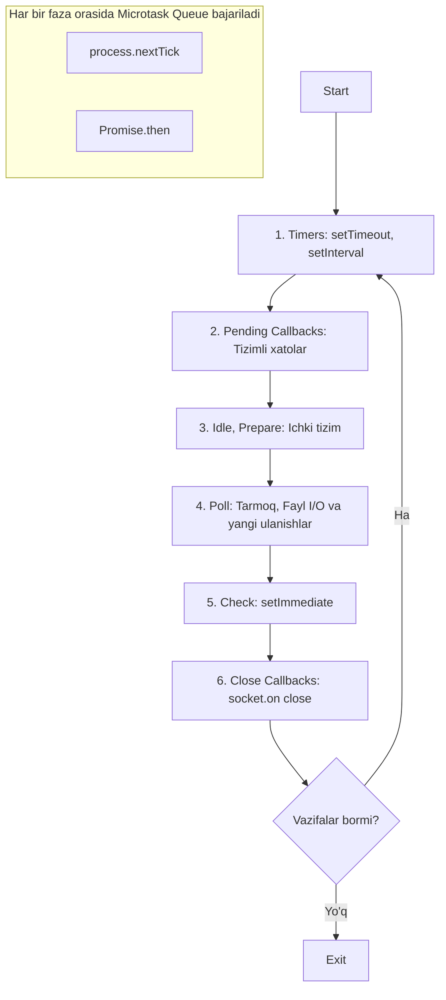
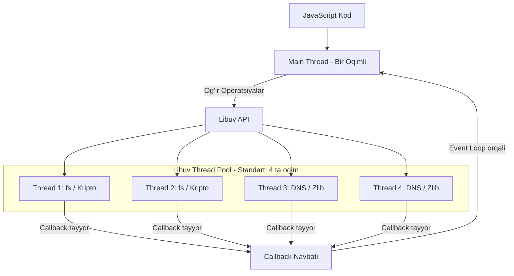

## 1. 💡 Sodda Tushuntirish va Analogiya

### Node.js va uning Arxitekturasi nima?
* **Node.js** — bu JavaScript kodini brauzerdan tashqarida, server muhitida ishga tushirish imkonini beruvchi platforma. U o'zining tezligi va yengilligi bilan ajralib turadi.
* **Single-threaded (Bir oqimli):** Node.js asosiy JavaScript kodlarini faqat bitta oqimda (Main Thread) ketma-ket bajaradi.
* **Non-blocking I/O (Bloklamaydigan kirish-chiqish):** Server fayllarni o'qiyotganda yoki tarmoq so'rovini kutayotganda butun dasturni to'xtatib qo'ymaydi, balki ishni orqa fonga topshirib, navbatdagi so'rovlarni qabul qilaveradi.

### Real hayotiy analogiya
Tasavvur qiling, siz **kichik qahvaxona** ochdingiz:
* **Single-threaded Kassir (JavaScript Main Thread):** Qahvaxonada faqat bitta kassir ishlaydi. U barcha mijozlardan buyurtmalarni qabul qiladi.
* **Asinxron buyurtma:** Kassir sizdan buyurtma oladi, unga raqam yozilgan chek (Promise/Callback) beradi va buyurtmani orqadagi **oshxonaga** uzatadi. Kassir kofe tayyor bo'lishini kutib turmasdan, navbatdagi mijozga o'tadi.
* **Baristalar jamoasi (Libuv Thread Pool):** Oshxonada kofe tayyorlaydigan 4 ta barista (ishchi oqimlar) bor. Ular og'ir contributes (qahva qaynatish, shirinlik pishirish) bilan band.
* **Buyurtma yetkazuvchi (Event Loop):** Kofe tayyor bo'lgani haqida signal chalinganda (Event), uni kassir orqali mijozga topshiradi va siklni davom ettiradi.

---

## 2. 💻 Real Kod Misollari

### 1. Basic Example (Bajarilish tartibi: nextTick, Promise, setTimeout, setImmediate)
```javascript
console.log("1. Sinxron boshlanish");

setTimeout(() => {
  console.log("2. setTimeout (Timers Phase)");
}, 0);

setImmediate(() => {
  console.log("3. setImmediate (Check Phase)");
});

Promise.resolve().then(() => {
  console.log("4. Promise (Microtask)");
});

process.nextTick(() => {
  console.log("5. process.nextTick (Microtask)");
});

console.log("6. Sinxron yakun");

// Natija tartibi:
// 1. Sinxron boshlanish
// 6. Sinxron yakun
// 5. process.nextTick (Microtask)
// 4. Promise (Microtask)
// 2. setTimeout (Timers Phase)
// 3. setImmediate (Check Phase)
```

### 2. Intermediate Example (Buffer yordamida vaqtinchalik ma'lumot saqlash)
```javascript
// Matndan Buffer yaratish
const textBuffer = Buffer.from("Salom, Node.js!", "utf-8");

console.log(textBuffer); // <Buffer 53 61 6c 6f 6d 2c 20 4e 6f 64 65 2e 6a 73 21>
console.log(textBuffer.toString("utf-8")); // Salom, Node.js!
console.log(textBuffer.length); // 15 bayt
```

### 3. Advanced Example (Streams yordamida katta faylni oqimli o'qish va yozish)
```javascript
const fs = require("fs");
const zlib = require("zlib");

// Katta faylni oqimli o'qish, siqish (gzip) va yangi faylga yozish
const readStream = fs.createReadStream("big_video.mp4");
const gzip = zlib.createGzip();
const writeStream = fs.createWriteStream("big_video.mp4.gz");

// Pipeline yordamida oqimlarni zanjirlash
readStream
  .pipe(gzip)
  .pipe(writeStream)
  .on("finish", () => {
    console.log("Fayl muvaffaqiyatli siqildi va saqlandi!");
  });
```

---

## 3. ⚠️ Muammo va Nima uchun Muhimligi

### Nima uchun Node.js arxitekturasini tushunish shart?
1. **Event Loop-ni bloklash xavfi (Blocking the Event Loop):** Agar siz yagona Main Thread ichida juda og'ir va ko'p vaqt oladigan sinxron operatsiyani (masalan, 10 millionlik sikl yoki `fs.readFileSync`) bajarsangiz, server butunlay qotib qoladi. Boshqa hech bir foydalanuvchi serverga ulana olmaydi.
2. **Xotira to'lib qolishi (Out of Memory):** 3 GB hajmli faylni `fs.readFile()` bilan o'qiganingizda, Node.js butun faylni bir vaqtning o'zida tezkor xotiraga (RAM) yuklashga urinadi. Natijada xotira yetishmay dastur o'chib qoladi. Buni faqat **Streams (Oqimlar)** yordamida hal qilish mumkin.

---

## 4. ❌ Ko'p Uchraydigan Xatolar (Junior Mistakes)

### 1. So'rov kelganda sinxron metodlardan foydalanish
* **Noto'g'ri:**
  ```javascript
  app.get("/data", (req, res) => {
    const data = fs.readFileSync("data.json"); // Event loop bloklanadi!
    res.send(data);
  });
  ```
* **To'g'ri:**
  ```javascript
  app.get("/data", (req, res) => {
    fs.readFile("data.json", (err, data) => {
      if (err) return res.status(500).send(err);
      res.send(data);
    });
  });
  ```

### 2. Stream o'rniga oddiy readFile orqali ulkan fayllarni yuklash
Agar fayl hajmi juda katta bo'lsa, RAM to'ladi. Katta fayllarni har doim bo'laklab (`chunk`) uzatish zarur.

### 3. `setImmediate` va `setTimeout(fn, 0)` tartibini noto'g'ri taxmin qilish
Oddiy skriptda ularning qaysi biri birinchi ishlashi kafolatlanmaydi. Lekin I/O callback ichida `setImmediate` har doim birinchi bajariladi.

---

## 5. 💬 12 ta Intervyu Savollari

### Junior
1. **Savol:** Node.js bir oqimli (single-threaded) bo'lsa, qanday qilib bir vaqtda minglab so'rovlarni boshqara oladi?
   * **Javob:** Asinxron, bloklamaydigan I/O arxitekturasi tufayli. U og'ir fayl va tarmoq operatsiyalarini operatsion tizim yoki Thread Pool-ga yuklaydi, Main Thread esa bo'sh qolib yangi so'rovlarni qabul qiladi.
2. **Savol:** Node.js arxitekturasidagi V8 dvigatelining vazifasi nima?
   * **Javob:** JavaScript kodini tezkor mashina kodiga tarjima qilib beradi.
3. **Savol:** Buffer nima?
   * **Javob:** V8 xotirasidan tashqarida joylashgan, xom ikkilik (binary) ma'lumotlarni baytlar ko'rinishida saqlaydigan vaqtinchalik xotira bo'lagi.
4. **Savol:** Stream nima va uning qanday turlari bor?
   * **Javob:** Katta ma'lumotlarni kichik bo'laklarga bo'lib uzatish texnologiyasi. Turlari: Readable, Writable, Duplex, Transform.

### Middle
5. **Savol:** Libuv nima va u Node.js uchun nega kerak?
   * **Javob:** C tilida yozilgan kutubxona bo'lib, u Event Loop va Thread Pool (ishchilar oqimi) faoliyatini boshqaradi va asinxronlikni ta'minlaydi.
6. **Savol:** Event Loop fazalarini sanab bering.
   * **Javob:** Timers, Pending Callbacks, Idle/Prepare, Poll, Check, Close Callbacks.
7. **Savol:** `process.nextTick()` va `setImmediate()` farqi nima?
   * **Javob:** `process.nextTick()` joriy operatsiya tugashi bilan zudlik bilan ishga tushadi. `setImmediate()` esa Check fazasida ishlaydi.
8. **Savol:** `EventEmitter` klassi nima uchun ishlatiladi?
   * **Javob:** Node.js-da hodisalarni (events) yaratish va ularga obuna bo'lish (on/emit) orqali asinxron muloqot o'rnatish uchun.

### Senior
9. **Savol:** Libuv Thread Pool o'lchamini qanday o'zgartirish mumkin?
   * **Javob:** Standart o'lcham 4 ta. Uni `process.env.UV_THREADPOOL_SIZE` orqali dastur ishga tushishidan oldin o'zgartirish mumkin.
10. **Savol:** Event Loop-ni nimalar bloklashi mumkin?
    * **Javob:** Sinxron CPU-intensive hisob-kitoblar (masalan, JSON.parse juda katta satr uchun), sinxron fayl operatsiyalari, crypto yoki zlib-ning sinxron metodlari.
11. **Savol:** Stream-dagi "Backpressure" muammosi nima va u qanday hal qilinadi?
    * **Javob:** Ma'lumotlarni o'qish tezligi yozish tezligidan ancha yuqori bo'lganda, bufer to'lib ketishi. Uni `.pipe()` yordamida yoki oqimlarning `drain` hodisasini tinglash orqali boshqarish mumkin.
12. **Savol:** `Buffer.alloc` va `Buffer.allocUnsafe` farqi nimada?
    * **Javob:** `Buffer.alloc` xotirani tozalab (nol bilan to'ldirib) ajratadi. `Buffer.allocUnsafe` tezroq ajratadi, ammo eski ma'lumotlar qoldiqlarini o'z ichiga olishi mumkinligi sababli xavfsizlikka salbiy ta'sir qilishi mumkin.

---

## 6. 🛠️ Amaliy Topshiriqlar

Quyidagi Mermaid diagrammalari Node.js tizimining qanday ishlashini tushunishga yordam beradi:

### Node.js Event Loop Fazalari Diagrammasi


### Libuv Thread Pool va Main Thread Diagrammasi


---

## 7. 📝 12 ta Mini Test

Dars bo'yicha bilimlaringizni tekshirish uchun quyidagi testlarni yeching.

---

## 8. 🎯 Real Project Case Study

### Katta Log Fayllarni Qidirish va Filtrlash
Katta hajmdagi (masalan, 5 GB) log faylini ochib, undagi faqat "[ERROR]" kalit so'zi qatnashgan qatorlarni boshqa faylga yozishimiz kerak.

```javascript
const fs = require("fs");
const readline = require("readline");

async function filterErrorLogs(inputPath, outputPath) {
  const readStream = fs.createReadStream(inputPath);
  const writeStream = fs.createWriteStream(outputPath);
  
  const rl = readline.createInterface({
    input: readStream,
    crlfDelay: Infinity
  });

  for await (const line of rl) {
    if (line.includes("[ERROR]")) {
      writeStream.write(line + "\n");
    }
  }
  
  writeStream.end();
  console.log("Filtrlash yakunlandi!");
}
```

---

## 9. 🚀 Performance va Optimization

* **Oqim o'lchamini sozlash:** Stream-larda `highWaterMark` parametrini sozlash orqali bir vaqtning o'zida o'qiladigan bufer o'lchamini boshqarish mumkin.
* **Main Threadni bo'sh saqlang:** Hech qachon og'ir matematik hisob-kitoblarni asosiy oqimda bajarmang. Ular uchun `Worker Threads` modulidan foydalaning.

---

## 10. 📌 Cheat Sheet

| Faza / Metod | Bajarilish Joyi | Asosiy Vazifasi |
| :--- | :--- | :--- |
| **Timers** | Event Loop (1-faza) | `setTimeout` va `setInterval` callbacklarini bajarish |
| **Poll** | Event Loop (4-faza) | Fayl va tarmoq (I/O) callbacklarini qabul qilish |
| **Check** | Event Loop (5-faza) | `setImmediate` callbacklarini bajarish |
| **Microtask** | Har bir faza orasida | `process.nextTick` va `Promise.then` ni zudlik bilan ishlatish |
| **Buffer** | RAM | Ikkilik ma'lumotlarni tezkor xotirada saqlash |
| **Stream** | Xotira va Disk | Ma'lumotlarni oqimli (bo'laklab) uzatish |
