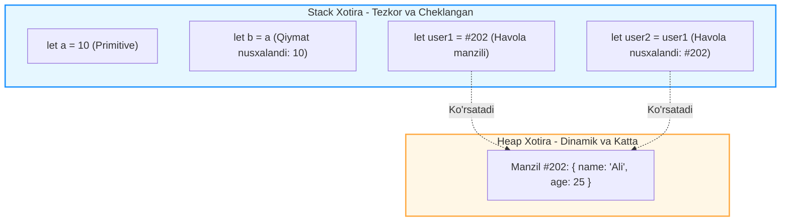

## 1. 💡 Sodda Tushuntirish va Analogiya

### Primitivlar va Obyektlar nima?
JavaScript-da o'zgaruvchilar va ma'lumotlar bilan ishlashda eng muhim tushunchalardan biri bu ularning xotirada qanday saqlanishidir. Ma'lumotlar turlari ikki asosiy guruhga bo'linadi:
1. **Primitiv turlar (Primitive types):** `Number`, `String`, `Boolean`, `Null`, `Undefined`, `Symbol` va `BigInt`. Ular oddiy, yagona qiymatni ifodalaydi va xotiraning **Stack** deb nomlangan tezkor qismida bevosita saqlanadi. Primitivlar o'zgarmas (**immutable**) hisoblanadi.
2. **Havola turlar (Reference types / Objects):** Obyektlar (`Object`), massivlar (`Array`) va funksiyalar (`Function`). Ular murakkab tuzilishga ega bo'lib, o'lchami dinamik ravishda o'zgarishi mumkin. Ular xotiraning **Heap** deb nomlangan katta qismida saqlanadi, Stack-da esa faqat ularning Heap-dagi manziliga ko'rsatuvchi ko'rsatkich (havola / pointer) saqlanadi. Obyektlar o'zgaruvchan (**mutable**) hisoblanadi.

---

### Real hayotiy analogiya

* **Primitiv qiymat (Qiymat bo'yicha nusxalash) — Qog'ozdagi raqam:**
  Tasavvur qiling, sizda bir varaq qog'oz bor va unda "42" raqami yozilgan (`let x = 42`). Siz do'stingizga xuddi shu qog'ozning kserokopiyasini berdingiz (`let y = x`). Endi do'stingiz o'zidagi qog'ozdagi raqamni o'chirib, "100" deb yozsa ham, sizning qog'ozingizdagi "42" o'zgarmaydi. Ular mutlaqo mustaqil nusxalardir.

* **Havola qiymat (Havola bo'yicha nusxalash) — Google Doc hujjati havolasi:**
  Tasavvur qiling, siz bulutli saqlagichda bitta matnli hujjat yaratdingiz (Heap-dagi obyekt) va uning havola manzilini (linkini) o'zgaruvchiga saqladingiz (`let doc1 = "https://docs.google.com/document/d/1"`). Keyin bu havolani do'stingizga nusxalab berdingiz (`let doc2 = doc1`). Endi do'stingiz havolani ochib, hujjat ichidagi matnni o'zgartirsa, siz ham o'z havolangiz orqali kirganingizda o'sha o'zgarishlarni ko'rasiz. Chunki havola (link) ikkita bo'lsa-da, ular ko'rsatib turgan real hujjat bitta.

---

## 2. 💻 Real Kod Misollari

### 1. Basic Example (Primitivlar — Qiymat bo'yicha nusxalash)
```javascript
let scoreA = 100;
let scoreB = scoreA; // scoreA ning qiymati scoreB ga ko'chirildi

scoreB = 250; // scoreB o'zgartirildi

console.log(scoreA); // 100 (scoreA o'zgarmay qoldi)
console.log(scoreB); // 250
```

### 2. Intermediate Example (Obyektlar — Havola bo'yicha nusxalash)
```javascript
const player1 = { name: "Jasur", score: 100 };
const player2 = player1; // Obyekt nusxalanmadi, uning xotiradagi manzili nusxalandi

player2.score = 250; // player2 orqali xususiyat o'zgartirildi

console.log(player1.score); // 250 (player1 ham o'zgardi!)
console.log(player1 === player2); // true (ikkala o'zgaruvchi ham bitta obyektga ko'rsatmoqda)
```

### 3. Advanced Example (Sayoz nusxa vs Chuqur nusxa va Ichma-ich obyektlar)
Spread operator (`...`) yordamida yuzaki (shallow) nusxa olinganda, faqat birinchi darajali primitivlar nusxalanadi, ammo ichki obyektlarning havolasi saqlanib qoladi:
```javascript
const originalUser = {
  name: "Ali",
  skills: ["JavaScript", "React"] // Ichki massiv (reference type)
};

// Spread operator yordamida shallow copy
const shallowCopy = { ...originalUser };

shallowCopy.name = "Vali";
shallowCopy.skills.push("Node.js"); // Ichki obyekt o'zgartirildi

console.log(originalUser.name); // "Ali" (birinchi darajali primitiv o'zgarmadi)
console.log(originalUser.skills); // ["JavaScript", "React", "Node.js"] (ichki reference o'zgarib ketdi!)

// To'liq chuqur nusxa olish (Deep Copy) - structuredClone yordamida
const deepCopy = structuredClone(originalUser);
deepCopy.skills.push("Python");

console.log(originalUser.skills); // ["JavaScript", "React", "Node.js"] (original endi xavfsiz!)
console.log(deepCopy.skills); // ["JavaScript", "React", "Node.js", "Python"]
```

---

## 3. ⚙️ Qanday Ishlaydi (Under the Hood)

### Stack va Heap xotiralari
JavaScript tizimi (masalan V8 dvigateli) xotirani ikki turga ajratib boshqaradi:

1. **Stack (Stek) xotira:**
   - **Tuzilishi:** LIFO (Last In, First Out) tartibida ishlaydigan qat'iy va tartibli xotira.
   - **Tezligi:** Juda tez ishlaydi.
   - **Nima saqlanadi:** Funksiya chaqiriqlari (execution contexts), lokal o'zgaruvchilar va ulardagi primitiv qiymatlar hamda Heap-dagi obyektlarning havolalari (pointers).
   - **Boshqarilishi:** Kontekst yopilishi bilan Stack-dan avtomatik ravishda o'chiriladi.

2. **Heap (Xip) xotira:**
   - **Tuzilishi:** Dinamik ravishda o'lchami o'zgaruvchi, tartibsiz katta xotira havzasi.
   - **Tezligi:** Stack-ga qaraganda sekinroq, chunki manzillar bo'yicha qidirish va boshqarish talab etiladi.
   - **Nima saqlanadi:** Obyektlar, massivlar, funksiyalar va boshqa murakkab tuzilmalar.
   - **Boshqarilishi:** Garbage Collector (axlat yig'uvchi) tomonidan boshqariladi.

### Argumentlarni funksiyaga uzatish (Pass-by-value)
JavaScript-da barcha argumentlar funksiyaga **qiymat bo'yicha (by value)** uzatiladi. Biroq, obyektni uzatayotganda, "qiymat" sifatida obyektning o'zi emas, balki uning **havola ko'rsatkichi (pointer)** nusxalanib uzatiladi.

```javascript
function modify(primitive, object) {
  primitive = 100; // Lokal o'zgaruvchi o'zgardi, tashqariga ta'sir qilmaydi
  object.value = 100; // Havola bo'yicha obyektning ichki xususiyati o'zgartirildi
  
  // Parametrga yangi obyekt yuklash (havolani uzib yuboradi)
  object = { value: 999 }; 
}

let num = 10;
let data = { value: 10 };

modify(num, data);

console.log(num);  // 10
console.log(data.value); // 100 (ichki xususiyat o'zgardi, lekin butunlay yangi obyektga aylanmadi)
```

---

## 4. ❌ Ko'p Uchraydigan Xatolar (Junior Mistakes)

### 1. Obyektni nusxalash uchun oddiy assignment (`=`) operatorini ishlatish
#### Noto'g'ri (Original obyekt mutatsiyaga uchraydi):
```javascript
const user = { name: "Anvar" };
const userCopy = user;
userCopy.name = "Doston";
console.log(user.name); // "Doston" (original ham o'zgarib ketdi)
```
#### To'g'ri (Shallow yoki Deep nusxa olish):
```javascript
const user = { name: "Anvar" };
const userCopy = { ...user }; // Yoki structuredClone(user)
userCopy.name = "Doston";
console.log(user.name); // "Anvar"
```

### 2. Ikkita obyektni qiymatlari bo'yicha `===` orqali solishtirish
#### Noto'g'ri (Har doim false qaytaradi):
```javascript
const obj1 = { id: 1 };
const obj2 = { id: 1 };
console.log(obj1 === obj2); // false (chunki xotiradagi manzillari boshqa-boshqa)
```
#### To'g'ri (Tarkibidagi xususiyatlarni solishtirish):
```javascript
const obj1 = { id: 1 };
const obj2 = { id: 1 };
const isEqual = obj1.id === obj2.id; // true
// Yoki chuqur solishtirish uchun: JSON.stringify(obj1) === JSON.stringify(obj2)
```

### 3. `const` bilan e'lon qilingan obyektni umuman o'zgartirib bo'lmaydi deb o'ylash
#### Noto'g'ri (Xatolik kelib chiqishini kutish, lekin kod ishlayverishi):
```javascript
const settings = { theme: "dark" };
settings.theme = "light"; // Hech qanday xatoliksiz o'zgaradi!
```
#### To'g'ri (Xossalarini o'zgartirishni ham taqiqlash uchun Object.freeze ishlatish):
```javascript
const settings = Object.freeze({ theme: "dark" });
settings.theme = "light"; // Qat'iy rejimda (strict mode) xatolik beradi, oddiy rejimda o'zgarmaydi.
console.log(settings.theme); // "dark"
```

---

## 5. 💬 12 ta Intervyu Savollari

### Junior (1–4)
1. **Savol:** JavaScript-da qanday ma'lumotlar turlari primitiv hisoblanadi?
   * **Javob:** `String`, `Number`, `Boolean`, `Null`, `Undefined`, `Symbol` va `BigInt`.
2. **Savol:** Nima uchun `typeof null` natijasi `"object"` chiqadi?
   * **Javob:** Bu JavaScript-ning birinchi versiyalaridan qolgan tarixiy xato (bug) bo'lib, orqaga moslikni saqlab qolish uchun tuzatilmagan.
3. **Savol:** Primitivlar va obyektlarning nusxalanishidagi asosiy farq nima?
   * **Javob:** Primitivlar qiymat bo'yicha nusxalanadi (alohida xotira ajratiladi), obyektlar esa havola bo'yicha nusxalanadi (bir xil xotira manziliga ko'rsatadi).
4. **Savol:** "Immutability" (o'zgarmaslik) primitivlar uchun nima degani?
   * **Javob:** Primitiv qiymatning o'zini xotirada o'zgartirib bo'lmaydi. Masalan, `'salom'` satriga metod qo'llasak, u mavjud satrni o'zgartirmaydi, balki yangi satr yaratadi.

### Middle (5–8)
5. **Savol:** JavaScript-da argumentlar funksiyaga qanday uzatiladi?
   * **Javob:** Har doim qiymat bo'yicha (pass-by-value). Ammo obyektlar uzatilganda, ularning havola manzili qiymat sifatida uzatiladi, bu esa ba'zan "pass-by-reference" taassurotini uyg'otadi.
6. **Savol:** Sayoz nusxa (Shallow Copy) va Chuqur nusxa (Deep Copy) o'rtasidagi farq nima?
   * **Javob:** Sayoz nusxa faqat obyektning birinchi darajali xossalarini nusxalaydi, ichki obyektlar esa havola bo'lib qoladi. Chuqur nusxa esa barcha ichki elementlarni ham rekursiv nusxalab, mutlaqo yangi obyekt yaratadi.
7. **Savol:** `structuredClone` nima va uning cheklovlari qanday?
   * **Javob:** Bu JavaScript-da chuqur nusxa olish uchun mo'ljallangan o'rnatilgan funksiyadir. U funksiyalar, DOM elementlari va ba'zi maxsus obyektlarni (masalan, Symbol kalitlari) nusxalay olmaydi.
8. **Savol:** `Object.freeze()` metodining cheklovi nimada?
   * **Javob:** U faqat sayoz (shallow) muzlatadi. Agar obyekt ichida boshqa obyekt bo'lsa, ichki obyektning xossalarini baribir o'zgartirsa bo'ladi.

### Senior (9–12)
9. **Savol:** V8 dvigatelida Stack va Heap xotirani boshqarish va Garbage Collection qanday bog'langan?
   * **Javob:** Stack o'z-o'zidan kontekst yakunlanganda tozalanadi. Heap xotiradagi obyektlar esa Garbage Collector (Mark-and-Sweep algoritmi) orqali tozalanadi. Agar Stack-dan (root) Heap-dagi obyektgacha hech qanday havola zanjiri yetib bormasa, u axlat deb hisoblanadi va o'chiriladi.
10. **Savol:** Closures (yopilishlar) qanday qilib xotira oqishiga (memory leak) sabab bo'lishi mumkin?
    * **Javob:** Ichki funksiya tashqi funksiyadagi katta obyektlarni o'zining leksik muhitida (`[[Environment]]`) saqlab qolsa va ichki funksiyaga havola ochiq qolsa, Garbage Collector o'sha katta obyektlarni Heap-dan o'chira olmaydi.
11. **Savol:** Nima uchun primitivlarni Heap-da emas, Stack-da saqlash optimalroq?
    * **Javob:** Chunki primitivlarning o'lchami oldindan ma'lum va o'zgarmasdir. Stack xotira pointer siljishi orqali juda tez ishlaydi, Heap esa dinamik taqsimlashni talab qiladi va sekinroq.
12. **Savol:** Primitivlar ustida metod chaqirilganda (masalan, `"hello".toUpperCase()`) orqa fonda nima yuz beradi (Autoboxing)?
    * **Javob:** JavaScript vaqtincha vaqtinchalik o'rab turuvchi obyekt (Wrapper Object: `new String()`) yaratadi, metodni bajaradi va natijani qaytargach, u obyektni darhol yo'qotib, xotirani bo'shatadi.

---

## 6. 🛠️ Amaliy Topshiriqlar

Quyidagi Mermaid diagrammasi JavaScript-da primitiv va havola turlarining xotirada qanday saqlanishi va nusxalanishini yaqqol ko'rsatib beradi:



### Amaliy Mashqlar:
1. **Shallow vs Deep Copy:** Berilgan murakkab xususiyatli obyekt ustida yuzaki va chuqur nusxalarni sinab ko'ring va ularning o'zgarishlarini konsolda kuzating.
2. **Mutatsiyasiz funksiya yozish:** Massiv elementlarini o'zgartiradigan, lekin original massivni buzmaydigan, toza funksiyalar yozish amaliyoti.

---

## 7. 📝 12 ta Mini Test

Dars oxiridagi bilimingizni sinash uchun testlar.

---

## 8. 🎯 Real Project Case Study

### React State yangilanishida Immutability (O'zgarmaslik) printsipi
React loyihalarida state o'zgarganini tekshirish uchun faqatgina havolalar solishtiriladi (`prevState === nextState`). Agar siz obyekt ichini mutatsiya qilsangiz, React o'zgarishni sezmaydi.

#### Xavfli va xato yondashuv (React-da render ishlamaydi):
```javascript
const [profile, setProfile] = useState({ name: "Lola", settings: { notifications: true } });

const toggleNotificationsX = () => {
  profile.settings.notifications = !profile.settings.notifications; // Mutatsiya!
  setProfile(profile); // Havola bir xil bo'lgani uchun sahifa yangilanmaydi
};
```

#### To'g'ri yondashuv (Immutability saqlangan):
```javascript
const toggleNotifications = () => {
  setProfile({
    ...profile,
    settings: {
      ...profile.settings,
      notifications: !profile.settings.notifications
    }
  }); // Yangi xotira manzillariga ega obyekt yaratiladi va React renderingni boshlaydi
};
```

---

## 9. 🚀 Performance va Optimization

* **Obyekt yaratish xarajati:** Heap xotirada yangi obyekt yaratish Stack-dagi oddiy primitiv amallarga qaraganda 10-20 baravar ko'proq vaqt va resurs talab qiladi. Keraksiz massiv va obyekt yaratishdan tiyilish kerak.
* **Deep Copy xavfi:** `JSON.parse(JSON.stringify(obj))` yoki `structuredClone(obj)` orqali katta obyektlarni nusxalash og'ir CPU operatsiyasidir. Agar bu tez-tez (masalan, har bir sekundda yoki har bir klaviatura bosilganda) bajarilsa, dastur qotib qoladi (jank yuzaga keladi).
* **Garbage Collection yuklamasi:** Heap xotirada yaratilgan obyektlar soni qanchalik ko'p bo'lsa, Garbage Collector shunchalik ko'p ishlashga va CPU resursini sarflashga majbur bo'ladi.

---

## 10. 📌 Cheat Sheet

| Xususiyat | Primitiv turlar | Havola turlar (Obyektlar) |
| :--- | :--- | :--- |
| **Xotirada saqlanishi** | Stack xotirada bevosita | Heap-da ma'lumot, Stack-da havola manzili |
| **Nusxalanishi** | Qiymat bo'yicha (Copy by value) | Havola bo'yicha (Copy by reference) |
| **Taqqoslanishi** | Qiymati bo'yicha solishtiriladi | Xotiradagi manzili bo'yicha solishtiriladi |
| **O'zgaruvchanligi** | O'zgarmas (Immutable) | O'zgaruvchan (Mutable) |
| **Misollar** | `42`, `"salom"`, `true`, `null` | `{...}`, `[...]`, `function() {}` |
