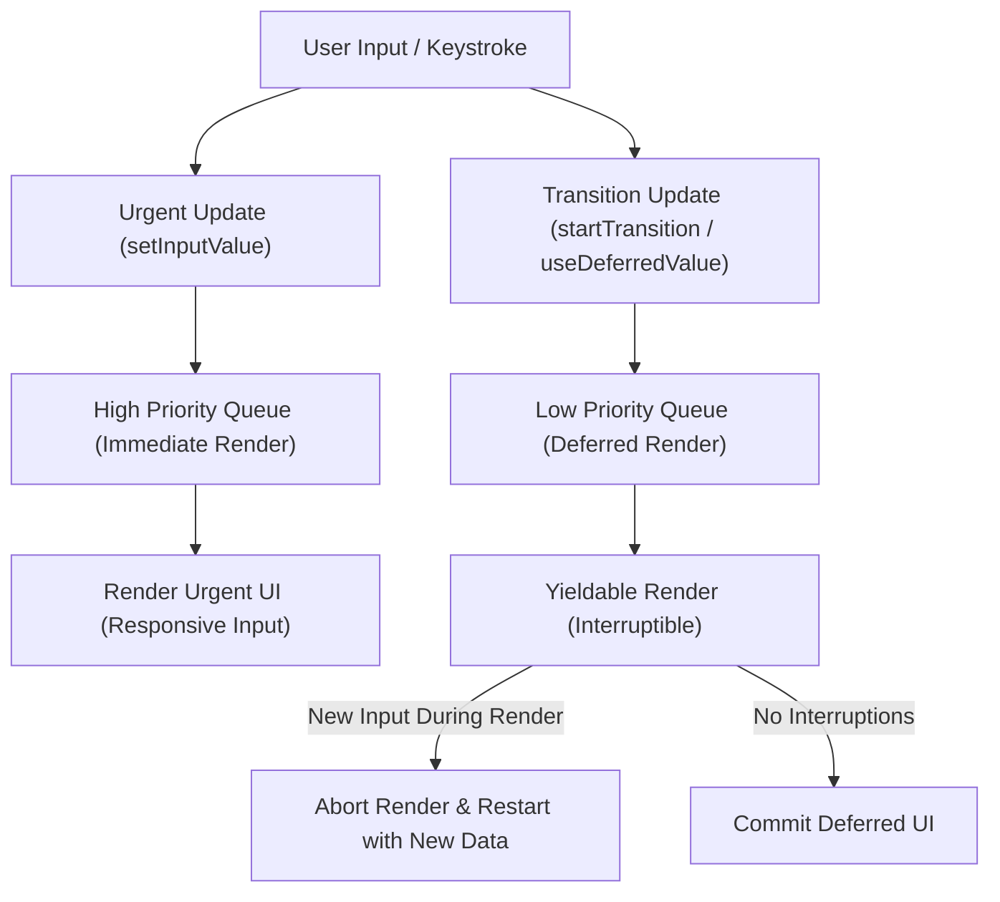

## 1. 💡 Sodda Tushuntirish va Analogiya

### Murakkab Performance va Profiler nima?
React-da ilova tezligini optimallashtirish faqatgina `useMemo` yoki `useCallback` yozishdan iborat emas. Murakkab interfeyslarda, masalan, minglab satrdan iborat jadvallarda, real vaqtda ishlaydigan qidiruv tizimlarida yoki murakkab animatsiyalarda sahifaning qotishi (lag) foydalanuvchi tajribasini buzadi. Bizga brauzer oqimini (Main Thread) bloklamaydigan Concurrent (parallel) rejim va asbob-uskunalar kerak bo'ladi.

### Real hayotiy analogiya
Tasavvur qiling, siz **yirik savdo markazining boshqaruvchisiz**:
* **Profiler (Diagnostika):** Savdo markazining qaysi eshigi yoki yo'lagida odamlar tirband bo'layotganini ko'rsatuvchi issiqlik kamerasi (Heat Map). U orqali siz aynan qaysi do'kon (komponent) sekin ishlayotganini ko'rasiz.
* **Debounce (Kutish):** Savdo markazining avtomat eshigi. Eshik har safar odam kelganda yopilishni boshlamaydi. U oxirgi odam o'tib bo'lgach, 2 soniya kutadi va hech kim kelmasa keyin yopiladi.
* **Throttle (Tezlikni cheklash):** Eshik oldidagi aylanma turniket. Har bir soniyada faqat bitta odamga o'tishga ruxsat beradi. Odamlar soni mingta bo'lsa ham turniket o'z tezligida ishlaydi.
* **Virtualizatsiya (Faqat ko'rinadigan qism):** Muzeydagi eksponatlar ko'rgazmasi. Muzeyda 10 000 ta rasm bor, lekin zalga faqat 10 tasi qo'yilgan. Siz yurganda, orqada qolgan rasmlar omborga olinadi va yangi rasmlar osib qo'yiladi.
* **Concurrent Rendering (Ustuvorlik):** Restorandagi ofitsiant. Agar yangi mijoz kelib shoshilinch savol bersa (Urgents render/Input), ofitsiant buyurtmani tayyorlayotgan oshpazga "to'xtab tur" deb turib, mijozga javob beradi va keyin o'z ishiga qaytadi.

---

## 2. 💻 Real Kod Misollari

### 1. Custom useDebounce Hook
Input yozilayotganda keraksiz re-render yoki API so'rovlarini kamaytirish uchun ishlatiladi:
```javascript
import { useState, useEffect } from 'react';

function useDebounce(value, delay) {
  const [debouncedValue, setDebouncedValue] = useState(value);

  useEffect(() => {
    // Har safar value o'zgarganda yangi taymer ishga tushadi
    const handler = setTimeout(() => {
      setDebouncedValue(value);
    }, delay);

    // Komponent unmount bo'lganda yoki value o'zgarganda eski taymer o'chiriladi
    return () => {
      clearTimeout(handler);
    };
  }, [value, delay]);

  return debouncedValue;
}
```

### 2. useTransition (Concurrent Rendering)
Og'ir renderlarni pastroq ustuvorlik (low priority) bilan orqa fonda yuklash:
```javascript
import { useState, useTransition } from 'react';

function ProductList() {
  const [isPending, startTransition] = useTransition();
  const [searchQuery, setSearchQuery] = useState('');
  const [filteredItems, setFilteredItems] = useState([]);

  const handleSearch = (e) => {
    const value = e.target.value;
    
    // Urgent update: Input darhol yangilanishi kerak
    setSearchQuery(value);

    // Non-urgent update: Og'ir qidiruv orqa fonda bajariladi
    startTransition(() => {
      const heavyFilter = Array(20000)
        .fill(0)
        .map((_, i) => `${value} - Mahsulot #${i}`)
        .filter(item => item.includes(value));
      setFilteredItems(heavyFilter);
    });
  };

  return (
    <div>
      <input type="text" value={searchQuery} onChange={handleSearch} />
      {isPending && <p>Yuklanmoqda...</p>}
      <ul>
        {filteredItems.map((item, idx) => <li key={idx}>{item}</li>)}
      </ul>
    </div>
  );
}
```

### 3. useDeferredValue yordamida state optimallashtirish
Tez o'zgaruvchi state-dan nusxa olib, uning og'ir nusxasini kechiktirib yangilash:
```javascript
import { useState, useDeferredValue, memo } from 'react';

// Og'ir komponent re-renderini oldini olish uchun memo ishlatiladi
const HeavyList = memo(({ query }) => {
  const items = Array(10000).fill(0).map((_, i) => `Element #${i} - ${query}`);
  return (
    <ul>
      {items.map((item, index) => <li key={index}>{item}</li>)}
    </ul>
  );
});

function App() {
  const [text, setText] = useState('');
  // text o'zgarganda deferredText orqa fonda biroz kechikib yangilanadi
  const deferredText = useDeferredValue(text);

  return (
    <div>
      <input value={text} onChange={(e) => setText(e.target.value)} />
      <HeavyList query={deferredText} />
    </div>
  );
}
```

---

## 3. ⚠️ Muammo va Nima uchun Muhimligi

### Qaysi muammoni hal qiladi?
1. **Main Thread Blocking (Asosiy oqim qotishi):** Brauzer soniyasiga 60 ta kadr (60 FPS) chizishi kerak. Agar React komponenti daraxtini render qilish 16.6ms dan ko'proq vaqt olsa, interfeys qotib qoladi (jank yuzaga keladi).
2. **Eski Re-render muammolari:** React 18 gacha bo'lgan versiyalarda har qanday render jarayoni sinxron va to'xtatib bo'lmas edi. Foydalanuvchi inputga yozayotganda katta ro'yxat render bo'lsa, input yozishni to'xtatib tura olmas edi. Concurrent rejim o'yin qoidalarini o'zgartirdi va renderlarni ustuvorlikka qarab bo'lish imkonini berdi.

---

## 4. ❌ Ko'p Uchraydigan Xatolar (Junior Mistakes)

### 1. `useRef` yoki `useCallback` ishlatmasdan debounce yaratish
#### Xato:
```javascript
// Har safar render bo'lganda yangi debounce funksiyasi yaratiladi va taymer ishlamaydi
const handleSearch = debounce((text) => fetchAPI(text), 300);
```
#### Tuzatish:
```javascript
const handleSearch = useCallback(
  debounce((text) => fetchAPI(text), 300),
  []
);
```

### 2. Hamma narsani `startTransition` ichiga o'rash
`startTransition` faqat past ustuvorlikdagi ishlarga mo'ljallangan. Masalan, input qiymatini o'zini uning ichiga o'rab qo'ysangiz, input juda kech va qotib yoziladigan bo'lib qoladi.

---

## 5. 💬 12 ta Intervyu Savollari

### Junior
1. **React Profiler nima?**
   * **Javob:** React ilovasining render vaqtlarini o'lchaydigan va qaysi komponentlar keraksiz re-render bo'layotganini ko'rsatuvchi vizual tahlil vositasi.
2. **Debounce va Throttle farqi nima?**
   * **Javob:** Debounce harakat to'liq tugagandan so'ng kutib ishga tushadi. Throttle esa harakat to'xtovsiz davom etsa ham ma'lum intervalda bajariladi.
3. **List Virtualization nima?**
   * **Javob:** Faqat foydalanuvchining ko'rish maydoniga (Viewport) kirgan elementlarni render qilish orqali minglab qatorlarni tezkor ko'rsatish texnikasi.
4. **React DevTools-dagi Flame Chart nimani ko'rsatadi?**
   * **Javob:** Komponentlar daraxti bo'yicha qaysi komponent renderiga qancha vaqt ketganini va qaysi biri eng og'irligini ranglar (sariq/olovrang) yordamida ko'rsatadi.

### Middle
5. **Concurrent Mode React-da qanday muammoni hal qiladi?**
   * **Javob:** U render jarayonini interruptible (to'xtatilishi mumkin bo'lgan) qiladi. Foydalanuvchi tez harakat qilganda React og'ir renderingni to'xtatib, foydalanuvchi harakatini birinchi bajaradi.
6. **useTransition custom transition yaratish uchunmi?**
   * **Javob:** Yo'q, u CSS transition-lar uchun emas, balki UI-da state yangilanishini "past ustuvorlik" holatiga o'tkazish uchun ishlatiladi.
7. **useDeferredValue va useTransition farqi nimada?**
   * **Javob:** `useTransition` state-ni yangilovchi funksiyani o'z ichiga oladi, `useDeferredValue` esa tayyor qiymatni (value) olib, uning kechiktirilgan nusxasini qaytaradi.
8. **React Profiler-ni production rejimda ishlatish mumkinmi?**
   * **Javob:** Default holatda profiling kodlari production builddan olib tashlanadi, lekin `--profile` flagi orqali production uchun ham yoqish mumkin.

### Senior
9. **React Scheduler qanday qilib Main Thread-ni band qilmasdan render qiladi?**
   * **Javob:** U `requestIdleCallback` va `MessageChannel` kabi API-lar yordamida render ishlarini mayda bo'laklarga (Time Slicing) bo'lib bajaradi va har 5ms-da brauzerning asosiy oqimiga navbat beradi.
10. **Virtualizatsiya tizimlarida Dynamic Row Height qanday hisoblanadi?**
    * **Javob:** Elementlar render bo'lganidan keyin ularning balandligi (ResizeObserver orqali) o'lchanadi va keshlab boriladi.
11. **useDeferredValue ishlatilganda eski render bekor qilinadimi?**
    * **Javob:** Ha, agar foydalanuvchi tezlik bilan yangi qiymat yuborsa, React orqa fondagi eski qiymat bo'yicha render jarayonini to'xtatib, yangi qiymat bilan qayta hisoblashni boshlaydi.
12. **Profiler render sabablarini qanday aniqlaydi?**
    * **Javob:** React DevTools profiling paytida "Record why each component rendered" sozlamasi yoqilgan bo'lsa, prop, state yoki context o'zgarishlarini yozib boradi.

---

## 6. 🛠️ Amaliy Topshiriqlar

Quyida React 18 Concurrent oqimining ustuvorlik (Scheduling) sxemasi keltirilgan:



Mashqlar maxsus test tizimi orqali tekshiriladi.

---

## 7. 📝 12 ta Mini Test

Dars oxirida testlar taqdim etiladi.

---

## 8. 🎯 Real Project Case Study

### Katta Dashboard Jadvallarini Optimallashtirish
Katta hajmdagi ma'lumotlarni render qiluvchi real-time dashboard loyihasida 5000 dan ortiq ma'lumot qatorlari, tezkor qidiruv va filtrlar mavjud edi. Dastlab foydalanuvchi qidiruv maydoniga yozganda sahifa butunlay qotib qolar edi.

**Yechim:**
1. **React Profiler** orqali tekshirilganda, eng katta muammo har bir harf yozilganda barcha 5000 ta qator re-render bo'layotgani aniqlandi.
2. Qidiruv inputiga custom `useDebounce` hook-i ulandi. API so'rovlari 400ms kechikish bilan yuboriladigan bo'ldi.
3. Mahalliy filtrlash uchun `useTransition` qo'llanildi. Bu foydalanuvchiga filtr yuklanayotgan paytda ham boshqa elementlar bilan erkin aloqa qilish imkonini berdi.
4. Jadval qismini ko'rsatish uchun `react-window` orqali virtualizatsiya yoqildi, natijada DOM-dagi tugunlar soni 5000 tadan 30 tagacha kamaytirildi.

---

## 9. 🚀 Performance va Optimization

* **Profiler Profiling Production:** Production-da profiling qilish uchun build sozlamalariga `resolve: { alias: { 'react-dom$': 'react-dom/profiling' } }` kabi o'zgarishlar kiritish lozim.
* **Component Splitting:** Og'ir qismlarni dinamik `React.lazy` va `Suspense` yordamida bo'lib yuklang.

---

## 10. 📌 Cheat Sheet

| Hook / Texnika | Vazifasi | Qachon ishlatiladi? |
| :--- | :--- | :--- |
| `useTransition` | State o'zgarishini past ustuvorlikda orqa fonda bajarish | Og'ir hisob-kitoblar, ro'yxat filtrlash |
| `useDeferredValue` | Qiymatni kechiktirib yangilash | Katta ma'lumotlar ro'yxatiga bog'liq inputlar |
| `Profiler` | Render vaqtlarini va sabablarini tahlil qilish | Sekinlashuv va tirbandliklarni aniqlashda |
| `Virtualization` | Faqat ko'rinadigan qatorlarni render qilish | 1000+ elementdan iborat uzun ro'yxat/jadvallar |
