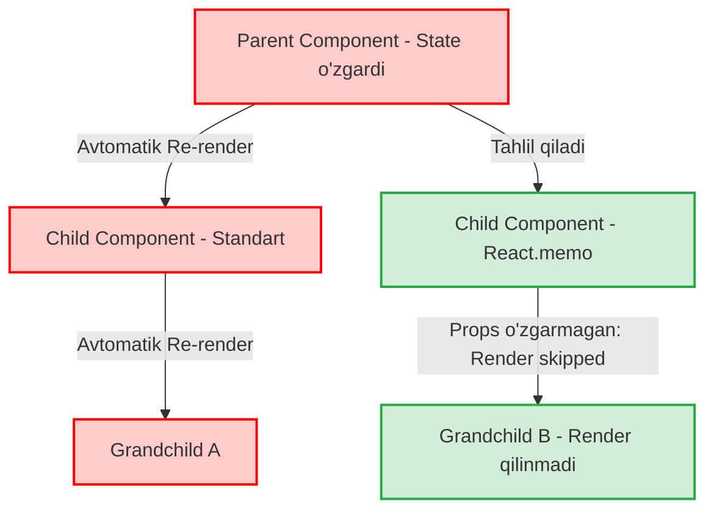

# React Performance Asoslari

## 1. 💡 Sodda Tushuntirish va Analogiya

### React Performance Asoslari nima?
React dasturlari juda tez ishlaydi, biroq noto'g'ri yozilgan kod butun ilovani sekinlashtirib qo'yishi mumkin. React unumdorligini (performance) optimallashtirishning asosi — bu komponentlar qachon va nima uchun qayta chizilishini (re-render) tushunish hamda keraksiz renderlar oqimini jilovlashdir.
* **Virtual DOM:** Brauzerning og'ir real DOM daraxtining xotiradagi yengil JavaScript ob'ektlari ko'rinishidagi nusxasi.
* **Reconciliation (Sinxronizatsiya):** Virtual DOM dagi o'zgarishlarni real DOM bilan solishtirib, faqatgina o'zgargan qismlarni yangilash jarayoni.
* **Diffing Algoritmi:** React ikki xil Virtual DOM daraxtini O(N) vaqtda solishtirib, farqlarni aniqlashda foydalanadigan algoritmik qoidalar to'plami.

### Real hayotiy analogiya
Tasavvur qiling, siz **uydagi stol ustidagi chashkaning joyini o'zgartirmoqchisiz**:
* **Haqiqiy DOM (Real DOM):** Butun uyni buzib yuborib, stol va chashkani yangi joyga qo'yib, uyni g'ishtma-g'isht noldan qayta qurish. Bu juda sekin va ko'p resurs talab qiladi.
* **Virtual DOM:** Uyingizning xotiradagi **kichik maketi (3D modeli)**. Siz chashkani avval maketda surib ko'rasiz.
* **Reconciliation & Diffing:** Eski va yangi maketlarni solishtirasiz, faqatgina chashka joyi o'zgarganini sezasiz va haqiqiy uyga borib, faqat chashkaning o'zini siljitib qo'yasiz.

---

## 2. 💻 Real Kod Misollari

### 1. Basic Example (Sodda Parent-Child Re-render Muammosi)
Ota (Parent) komponent render bo'lganda, uning barcha bola (Child) komponentlari ham o'z-o'zidan render bo'ladi:
```jsx
import React, { useState } from 'react';

// Bola komponent
function ChildComponent() {
  console.log("ChildComponent render bo'ldi!");
  return <p>Men oddiy bola komponentman.</p>;
}

// Ota komponent
export default function ParentComponent() {
  const [count, setCount] = useState(0);

  return (
    <div>
      <button onClick={() => setCount(count + 1)}>
        Soni: {count}
      </button>
      {/* Har safar tugma bosilganda ChildComponent ham keraksiz qayta render bo'ladi */}
      <ChildComponent />
    </div>
  );
}
```

### 2. Intermediate Example (React.memo yordamida optimallashtirish)
`React.memo` komponent propslari o'zgarmasa, uni qayta render bo'lishdan saqlab qoladi (Memoization):
```jsx
import React, { useState } from 'react';

// Memoizatsiya qilingan bola komponent
const MemoizedChild = React.memo(function ChildComponent() {
  console.log("ChildComponent faqat props o'zgarganda render bo'ladi!");
  return <p>Men himoyalangan bola komponentman.</p>;
});

export default function ParentComponent() {
  const [count, setCount] = useState(0);

  return (
    <div>
      <button onClick={() => setCount(count + 1)}>
        Soni: {count}
      </button>
      {/* Endi tugma bosilganda MemoizedChild qayta render bo'lmaydi */}
      <MemoizedChild />
    </div>
  );
}
```

### 3. Advanced Example (useCallback va useMemo orqali reference xatolarini tuzatish)
Agar bola komponentga funksiya yoki ob'ekt props sifatida uzatilsa, `React.memo` ishlamay qoladi, chunki har renderda yangi havola (reference) yaratiladi. Buni tuzatish uchun `useCallback` va `useMemo` kerak:
```jsx
import React, { useState, useCallback, useMemo } from 'react';

const MemoizedButton = React.memo(function ActionButton({ onClick, data }) {
  console.log("Button render bo'ldi!");
  return <button onClick={onClick}>{data.text}</button>;
});

export default function ComplexParent() {
  const [count, setCount] = useState(0);
  const [text, setText] = useState("");

  // 1. Funksiyani useCallback ichiga olamiz, toki uning referensi o'zgarmasin
  const handleClick = useCallback(() => {
    setCount(prev => prev + 1);
  }, []); // Bo'sh dependency

  // 2. Ob'ektni useMemo ichiga olamiz
  const buttonData = useMemo(() => {
    return { text: "Bosish: " + count };
  }, [count]); // Faqat count o'zgarganda yangi havola yaratiladi

  return (
    <div>
      <input value={text} onChange={(e) => setText(e.target.value)} placeholder="Yozing..." />
      {/* input o'zgarganda MemoizedButton qayta render bo'lmaydi */}
      <MemoizedButton onClick={handleClick} data={buttonData} />
    </div>
  );
}
```

---

## 3. ⚠️ Muammo va Nima uchun Muhimligi

### Qaysi muammolarni hal qiladi?
1. **Daraxtsimon render kaskadi (Cascade Re-renders):** Katta loyihalarda eng yuqori komponent (masalan, App.jsx) render bo'lsa, pastdagi yuzlab komponentlar avtomatik render bo'lib chiqadi. Bu esa UI javob qaytarish tezligini sekinlashtiradi.
2. **Layout Thrashing va CPU to'lib qolishi:** Virtual DOM solishtirish jarayoni juda tez bo'lsa-da, komponentlar soni ko'p bo'lsa, bu solishtirish (diffing) ishlari ham kompyuter protsessorini (CPU) band qilib, sahifani qotiradi.
3. **Reference-turi bo'yicha solishtirish:** JavaScript-da ob'ektlar va funksiyalar har safar yangi xotira manzilida yaratiladi. Bu React props shallow comparison (yuzaki tekshiruvi) natijasida keraksiz renderlar oqimiga sabab bo'ladi.

---

## 4. ❌ Ko'p Uchraydigan Xatolar (Junior Mistakes)

### 1. Arrow functions va Inline obyektlarni to'g'ridan-to'g'ri props sifatida berish
#### Xato:
```jsx
// Har renderda yangi funksiya va yangi ob'ekt yaratiladi
<MemoizedChild 
  onClick={() => console.log('Click')} 
  style={{ color: 'red' }} 
/>
```
#### To'g'ri usul:
```jsx
const handleClick = useCallback(() => console.log('Click'), []);
const style = useMemo(() => ({ color: 'red' }), []);

<MemoizedChild onClick={handleClick} style={style} />
```

### 2. state-ni keraksiz yuqoriga ko'tarish (State Over-lifting)
#### Xato:
Faqat bitta Input komponentiga kerakli bo'lgan state-ni eng yuqoridagi `App.jsx` darajasiga olib chiqish. inputga har bir harf yozilganda butun sahifa qayta render bo'ladi.
#### To'g'ri usul:
State-ni qaysi komponent ishlatsa, o'shaning ichida saqlash (Colocate state).

---

## 5. 💬 12 ta Intervyu Savollari

### Junior (1–4)
1. **Savol:** Virtual DOM nima va u nega haqiqiy DOM-dan tezroq?
   * **Javob:** Virtual DOM real DOM ning xotiradagi yengil JS nusxasidir. U to'g'ridan-to'g'ri brauzer sahifasini chizish (reflow/layout) ishlarini bajarmagani uchun juda tez ishlaydi.
2. **Savol:** Reconciliation nima?
   * **Javob:** Virtual DOM-dagi o'zgarishlarni real DOM bilan solishtirib, real sahifani minimal harakatlar bilan sinxronlash (yangilash) jarayoni.
3. **Savol:** Nima uchun React-da parent render bo'lganda child ham render bo'ladi?
   * **Javob:** Bu React-ning standart chizish zanjiri (render tree loop) qoidasidir. React o'zgarishlar barcha shaxobchalarga ta'sir qilishi mumkin deb hisoblab, ularni qayta chizadi.
4. **Savol:** React.memo nima vazifa bajaradi?
   * **Javob:** Komponentni memoizatsiya qiladi. Agar kelayotgan propslar o'zgarmasa, ushbu komponentni qayta render bo'lishdan saqlaydi.

### Middle (5–8)
5. **Savol:** Diffing algoritmi qanday ishlaydi va uning murakkabligi (Time Complexity) qancha?
   * **Javob:** U O(N) vaqtda ishlaydi. Agar element turi o'zgarsa, butun shoxni o'chirib boshqatdan quradi. Agar element turi saqlansa, faqat o'zgargan atributlarni yangilaydi.
6. **Savol:** useCallback va useMemo o'rtasidagi farq nima?
   * **Javob:** `useCallback` funksiyaning o'zini (referensini) keshlab beradi. `useMemo` esa funksiya qaytargan qiymatni (hisob-kitob natijasini) keshlab saqlaydi.
7. **Savol:** StrictMode ishlab chiqish jarayonida nima uchun kerak?
   * **Javob:** Koddagi noto'g'ri side-effectlarni (nojo'ya ta'sirlarni) va eski metodlarni topish uchun komponentlarni ataylab 2 marta render qiladi.
8. **Savol:** Nima uchun inline funksiyalar React.memo-ni ishlatib bo'lmaydigan qilib qo'yadi?
   * **Javob:** Chunki har renderda yangi havola bilan yangi funksiya yaratiladi. React.memo esa propslarni yuzaki (`===`) solishtirgani uchun har doim farq topadi va komponentni baribir render qiladi.

### Senior (9–12)
9. **Savol:** Render Phase va Commit Phase farqi nimada?
   * **Javob:** Render phase asinxron bo'lib, xotirada Virtual DOM daraxtini quradi va farqlarni hisoblaydi (xavfsiz to'xtatilishi mumkin). Commit phase esa sinxron bo'lib, o'zgarishlarni real DOM-ga yozadi.
10. **Savol:** React Fiber nima va u rendering tezligiga qanday ta'sir ko'rsatdi?
    * **Javob:** React 16 dan boshlab kiritilgan yangi render dvigateli. U render ishlarini mayda bo'laklarga bo'lib, asosiy oqimni (Main Thread) bloklamasdan, yuqori ustuvorlikka ega vazifalarga (masalan tugma bosilishiga) yo'l beradi.
11. **Savol:** Batching nima va React 18 dagi Automatic Batching farqi nimada?
    * **Javob:** Bir nechta state o'zgarishini bitta renderga birlashtirish. React 18 dan boshlab asinxron operatsiyalar (promises, timeouts, native events) ichidagi state o'zgarishlari ham avtomatik batching qilinadi.
12. **Savol:** Nima uchun ro'yxatlarni render qilganda `key` sifatida massiv indeksini ishlatish tavsiya etilmaydi?
    * **Javob:** Agar elementlar o'rtasidan biror element o'chirilsa yoki tartibi o'zgarsa, indekslar o'zgarib ketadi. Natijada React Virtual DOM dagi farqlarni noto'g'ri tushunib, elementlar holatini (state) chalkashtirib yuboradi.

---

## 6. 🛠️ Amaliy Topshiriqlar

Bu bo'limda siz interaktiv kod muharriri orqali amaliy mashqlarni bajarasiz. Quyidagi diagrammada ota komponentdagi state o'zgarishi natijasida rendering zanjiri qanday ishlashi ko'rsatilgan:



---

## 7. 📝 12 ta Mini Test

Dars oxiridagi test topshiriqlari quyidagi quizzes modulida taqdim etiladi.

---

## 8. 🎯 Real Project Case Study

### Katta hajmli ro'yxatlarni optimallashtirish (Heavy Lists Rendering)
Loyiha davomida foydalanuvchilar ro'yxatini chiqaruvchi komponent yozildi. Ro'yxatdagi har bir elementda o'chirish tugmasi bor. Oddiy yozilganda, bitta element o'chirilganda qolgan barcha 500 ta element qayta render bo'lib sahifani sekinlashtirardi.

#### Yechim (Optimallashtirilgan Ro'yxat):
1. Har bir elementni `React.memo` orqali o'raymiz.
2. O'chirish funksiyasini `useCallback` yordamida keshlaymiz.

```jsx
import React, { useState, useCallback } from 'react';

// 1. Memoized ro'yxat elementi
const ListItem = React.memo(function ListItem({ item, onDelete }) {
  console.log("ListItem render bo'ldi: ", item.name);
  return (
    <li>
      {item.name} 
      <button onClick={() => onDelete(item.id)}>O'chirish</button>
    </li>
  );
});

// 2. Asosiy ota komponent
export default function UserList() {
  const [users, setUsers] = useState([
    { id: 1, name: "Farhod" },
    { id: 2, name: "Ali" },
    { id: 3, name: "Vali" }
  ]);
  const [filterText, setFilterText] = useState("");

  // O'chirish funksiyasini keshlaymiz, toki ListItem referens o'zgardi deb render bo'lmasin
  const handleDelete = useCallback((id) => {
    setUsers((prevUsers) => prevUsers.filter(user => user.id !== id));
  }, []);

  return (
    <div>
      <input 
        value={filterText} 
        onChange={(e) => setFilterText(e.target.value)} 
        placeholder="Qidiruv..." 
      />
      <ul>
        {users.map(user => (
          <ListItem key={user.id} item={user} onDelete={handleDelete} />
        ))}
      </ul>
    </div>
  );
}
```

---

## 9. 🚀 Performance va Optimization

* **Har bir narsani memoize qilmang:** `React.memo` va `useMemo` o'z hisob-kitob resurslariga ega (xotira va solishtirish vaqti). Shuning uchun ularni faqat ota komponent render bo'lganda tez-tez keraksiz chiziladigan o'rta va og'ir komponentlarda ishlating.
* **React DevTools Profiler:** Ilovani ishlab chiqishda brauzerda Profiler oynasini yoqib, aynan qaysi komponent ko'p vaqt olayotganini va render sabablarini vizual tekshirib boring.

---

## 10. 📌 Cheat Sheet

| Asbob | Vazifasi | Qachon ishlatiladi | Yodda tuting |
| :--- | :--- | :--- | :--- |
| **\`React.memo\`** | Komponentni memoizatsiya qilish | Props o'zgarmasa qayta renderdan saqlash uchun | Inline funksiyalar/ob'ektlar memo-ni buzadi |
| **\`useCallback\`** | Funksiya referensini saqlash | Bola komponentga uzatiladigan callback-larni keshlashda | Bo'sh dependency array \`[]\` eng ko'p ishlatiladi |
| **\`useMemo\`** | Hisob-kitob qiymatini saqlash | Og'ir hisoblashlar yoki ob'ekt havolasini keshlashda | Har renderda og'ir array map/filter ishlarini kamaytiradi |
| **\`key\` atributi** | Virtual DOM elementini tanish | Ro'yxatlarni chizganda o'zgarishlarni topishda | Hech qachon random yoki array indeksini ishlatmang |
