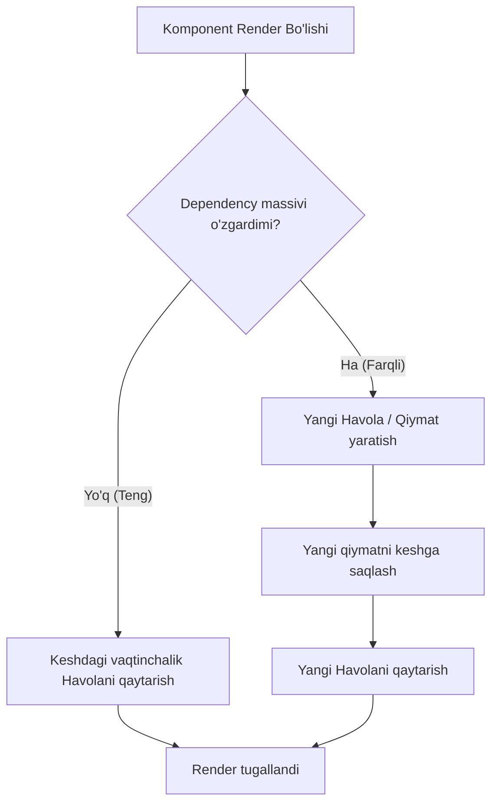

## 1. 💡 Sodda Tushuntirish va Analogiya

### React-da Performance Optimization nima?
React judayam tez ishlaydigan kutubxona bo'lsa-da, loyiha kattalashib borgan sari interfeys qotib qolishi yoki keraksiz re-renderlar ko'payishi mumkin. **React Performance Optimization (Ishlash samaradorligini optimallashtirish)** — bu keraksiz qayta chizishlarni va og'ir matematik hisob-kitoblarni oldini olish orqali ilova tezligini saqlash usulidir.

### Real hayotiy analogiya
Tasavvur qiling, siz maktabda matematika darsidasiz:
* **useMemo yo'q bo'lsa (Keshlanmagan):** O'qituvchi har safar sizdan "135 x 24 necha bo'ladi?" deb so'raganda, siz har safar varoq va qalam olib qaytadan hisoblaysiz. Bu vaqt va kuchingizni ketkazadi.
* **useMemo bor bo'lsa (Keshga saqlangan):** Siz birinchi marta "135 x 24 = 3240" deb hisoblab, daftaringiz burchagiga yozib qo'yasiz. Keyingi safar so'rashganda, darhol "3240" deb javob berasiz.
* **React.memo (Eshikbon):** Kelgan mehmonning props-lari (sovig'alari) o'zgarmagan bo'lsa, uni eshikdan qaytaradi (komponentni qayta render qilmaydi).
* **useCallback (Sertifikat):** Har safar bir xil ishni qiladigan xodimga yangi shartnoma tuzmasdan, eski shartnomani xotirada saqlab, qayta-qayta ishlatishdir.

---

## 2. 💻 Real Kod Misollari

### 1. Basic Example (React.memo va useCallback)
Ota komponentdan bolaga funksiya uzatish va bolaning keraksiz render bo'lishini cheklash:
```javascript
import React, { useState, useCallback } from 'react';

// Bolakay komponent - faqat props o'zgarganda render bo'ladi
const ChildButton = React.memo(({ onClick, label }) => {
  console.log(`${label} tugmasi render bo'ldi!`);
  return <button onClick={onClick}>{label}</button>;
});

export function ParentComponent() {
  const [count, setCount] = useState(0);
  const [text, setText] = useState("");

  // Har renderda yangi funksiya yaratilishini oldini olamiz
  const increment = useCallback(() => {
    setCount(prev => prev + 1);
  }, []); // dependency bo'sh, faqat 1 marta yaratiladi

  return (
    <div>
      <h3>Sanoq: {count}</h3>
      <input 
        value={text} 
        onChange={(e) => setText(e.target.value)} 
        placeholder="Yozing..." 
      />
      {/* ChildButton faqat increment havolasi o'zgarsa render bo'ladi.
          useCallback tufayli increment o'zgarmaydi, shuning uchun inputga
          yozganda ChildButton qayta render bo'lmaydi. */}
      <ChildButton onClick={increment} label="Ko'paytirish" />
    </div>
  );
}
```

### 2. Intermediate Example (useMemo yordamida og'ir hisob-kitoblarni optimallashtirish)
Katta hajmdagi massivlarni saralash va qidirish:
```javascript
import React, { useState, useMemo } from 'react';

export function SearchList({ items }) {
  const [query, setQuery] = useState("");

  // Faqat items yoki query o'zgargandagina massiv filtrlanadi
  const filteredItems = useMemo(() => {
    console.log("Massiv filtrlanmoqda... (Og'ir amal)");
    return items.filter(item => 
      item.name.toLowerCase().includes(query.toLowerCase())
    );
  }, [items, query]); // faqat shu 2 ta dependency o'zgarganda ishlaydi

  return (
    <div>
      <input 
        value={query} 
        onChange={(e) => setQuery(e.target.value)} 
        placeholder="Qidirish..." 
      />
      <ul>
        {filteredItems.map(item => (
          <li key={item.id}>{item.name}</li>
        ))}
      </ul>
    </div>
  );
}
```

### 3. Advanced Example (React.lazy va Suspense yordamida Code Splitting)
Og'ir komponentlar yoki butun boshli sahifalarni faqat kerak bo'lganda yuklash:
```javascript
import React, { useState, Suspense } from 'react';

// Og'ir komponentni lazy load qilamiz
const HeavyChart = React.lazy(() => import('./HeavyChart'));

export function Dashboard() {
  const [showChart, setShowChart] = useState(false);

  return (
    <div>
      <h2>Dashboard sahifasi</h2>
      <button onClick={() => setShowChart(true)}>Grafikni ko'rsatish</button>
      
      {showChart && (
        <Suspense fallback={<div>Grafik yuklanmoqda...</div>}>
          <HeavyChart />
        </Suspense>
      )}
    </div>
  );
}
```

---

## 3. ⚠️ Muammo va Nima uchun Muhimligi

### Qaysi muammoni hal qiladi?
* **Keraksiz Renderlar (Unnecessary Re-renders):** React-da ota komponent render bo'lsa, uning ostidagi barcha komponentlar ham re-render bo'ladi. Bu katta sahifalarda sezilarli sekinlashuvga olib keladi.
* **Og'ir Hisob-kitoblarning Qayta Bajarilishi:** Katta ma'lumotlarni saralash, murakkab matematik formulalar har bir oddiy foydalanuvchi harakatida (masalan, inputga yozganda) qaytadan hisoblanishi CPU yuklamasini oshiradi.
* **Yirik JS Bundle hajmi:** Sayt ochilganida barcha sahifalar va komponentlar kodini birdan yuklab olish saytning birinchi yuklanish vaqtini (LCP) sekinlashtiradi. `React.lazy` va Code Splitting buni hal qiladi.

---

## 4. ❌ Ko'p Uchraydigan Xatolar (Junior Mistakes)

### 1. Hamma narsani `useMemo` va `useCallback` bilan o'rab chiqish
#### Xato:
```javascript
const handleClick = useCallback(() => {
  console.log("Clicked");
}, []);
```
#### Nega noto'g'ri?
Oddiy va kichik funksiyalar yoki primitiv qiymatlarga `useCallback`/`useMemo` ishlatish ularni solishtirish va keshga saqlash jarayonidan ko'ra arzonroqdir. Ularning o'zi ham qo'shimcha resurs (overhead) talab qiladi.

### 2. Dependency massivini bo'sh qoldirib, stale closure yaratish
#### Xato:
```javascript
const logCount = useCallback(() => {
  console.log("Count:", count);
}, []); // count o'zgarganda funksiya yangilanmaydi va har doim 0 ni chiqaradi
```
#### To'g'ri yechim:
```javascript
const logCount = useCallback(() => {
  console.log("Count:", count);
}, [count]);
```

### 3. Taqqoslash funksiyasi bo'lmagan obyektlarni props qilib yuborish
#### Xato:
```javascript
// Ota komponent ichida:
return <ChildComponent options={{ theme: 'dark' }} />;
// Har renderda yangi options obyekti (yangi reference) yaratiladi,
// natijada ChildComponent React.memo qilingan bo'lsa ham foydasiz bo'lib qoladi.
```

---

## 5. 💬 12 ta Intervyu Savollari

### Junior (1–4)
1. **Savol:** `React.memo` nima va u qachon ishlatiladi?
   * **Javob:** `React.memo` — bu Oliy Darajali Komponent (HOC) bo'lib, u props-larni yuzaki (shallow) solishtiradi. Props o'zgarmasa, komponent qayta render bo'lishidan saqlaydi.
2. **Savol:** `useMemo` ning asosiy vazifasi nima?
   * **Javob:** `useMemo` og'ir hisob-kitoblar natijasini (qiymatini) renderlararo keshlab saqlash uchun ishlatiladi.
3. **Savol:** `useCallback` nima uchun kerak?
   * **Javob:** U funksiyaning xotiradagi havolasini (reference) saqlaydi. Har renderda yangi funksiya yaratilishini oldini oladi.
4. **Savol:** Referential Identity (Havola aynanligi) nima degani?
   * **Javob:** JavaScript-da obyektlar va funksiyalar xotiradagi manzili bo'yicha solishtiriladi. Ikki bir xil obyekt `{} === {}` false qaytaradi, chunki ularning havolalari boshqadir.

### Middle (5–8)
5. **Savol:** `useMemo` va `useCallback` o'rtasidagi asosiy farq nimada?
   * **Javob:** `useMemo` funksiya qaytargan **qiymatni** keshlaydi, `useCallback` esa funksiyaning **o'zini (havolasini)** keshlaydi.
6. **Savol:** `React.lazy` va `Suspense` qanday ishlaydi?
   * **Javob:** `React.lazy` komponentni dinamik import qilish imkonini beradi. `Suspense` esa u yuklangunga qadar vaqtinchalik visual interfeys (fallback) ko'rsatib turadi.
7. **Savol:** React.memo ichidagi custom taqqoslash funksiyasini qanday yozamiz?
   * **Javob:** Ikkinchi argument sifatida custom function beriladi: `React.memo(Component, (prevProps, nextProps) => boolean)`. Agar true qaytsa render bo'lmaydi.
8. **Savol:** Nega obyektlar props sifatida uzatilganda `React.memo` ishlamay qoladi?
   * **Javob:** Chunki ota komponent har render bo'lganda yangi obyekt yaratiladi va yuzaki solishtirishda yangi havola (`prevProps.obj !== nextProps.obj`) tufayli re-render sodir bo'laveradi.

### Senior (9–12)
9. **Savol:** React-da "Stale Closure" muammosi nima va uni qanday hal qilish mumkin?
   * **Javob:** Keshlab qo'yilgan callback funksiya ichida ishlatilgan o'zgaruvchining qiymati dependency massivga yozilmay qolganda, funksiya eski qiymat bilan qolib ketishi. Yechimi: dependencyni to'g'ri ko'rsatish yoki state updater funksiyalardan `(prev => prev + 1)` foydalanish.
10. **Savol:** Profiler va Chrome DevTools orqali React-dagi keraksiz renderlarni qanday aniqlaysiz?
    * **Javob:** React DevTools Profiler orqali render davomiyligini yozib olamiz. "Highlight updates when components render" sozlamasi orqali qayta render bo'layotgan komponentlarni vizual ko'ramiz.
11. **Savol:** React 18 dagi `useTransition` hooki qanday muammoni hal qiladi?
    * **Javob:** U og'ir re-renderlarni "past ustuvorlikdagi" (non-urgent transition) deb belgilaydi. Bu orqali foydalanuvchining inputga yozishi kabi tezkor amallari bloklanib qolmaydi.
12. **Savol:** `useEvent` (yoki transition APIs) useCallback hookidan qanday ustunlikka ega?
    * **Javob:** U doimo eng yangi state va props-larni ko'ra oladi, lekin uning xotiradagi havolasi hech qachon o'zgarmaydi va dependency massivi talab qilmaydi.

---

## 6. 🛠️ Amaliy Topshiriqlar

### Memoization va Havolalar Bog'liqligi
Quyidagi diagrammada React-da dependency o'zgarishiga qarab keshdagi havolani qaytarish yoki yangisini yaratish jarayoni tasvirlangan:



Mashqlar quyida taqdim etilgan. Ularni bajarib ko'nikmalaringizni oshiring.

---

## 7. 📝 12 ta Mini Test

Dars oxiridagi test topshiriqlari.

---

## 8. 🎯 Real Project Case Study

### Katta hajmdagi jadvalni (Table Grid) optimallashtirish
Tasavvur qiling, sizda 1000 ta qatordan iborat mahsulotlar jadvali bor. Har bir qatorda "Savatga qo'shish" tugmasi mavjud. Tugma bosilganda ota komponentdagi `cart` state-i yangilanadi va butun 1000 ta qator qaytadan render bo'ladi. Bu foydalanuvchiga sezilarli darajada kechikish beradi.

#### Muammoning yechimi (React.memo va useCallback):
1. **Har bir qatorni `React.memo` bilan o'rash:** Faqat o'sha mahsulotning props o'zgarsagina qayta chiziladi.
2. **"Savatga qo'shish" funksiyasini `useCallback` bilan o'rash:** Har renderda yangi funksiya yaratilib, bolalarning re-render bo'lishiga sabab bo'lmaydi.
3. **State updater funksiyasi:** `useCallback` dependency massivini bo'sh saqlash XML/HTML o'xshash state-ni yangilashda callback sintaksisidan foydalanamiz.

```javascript
// Yechim namunasi:
const TableRow = React.memo(({ item, onAddToCart }) => {
  console.log(`Row render: ${item.name}`);
  return (
    <tr>
      <td>{item.name}</td>
      <td>{item.price} $</td>
      <td>
        <button onClick={() => onAddToCart(item.id)}>Savatga</button>
      </td>
    </tr>
  );
});

export function ProductTable({ items }) {
  const [cart, setCart] = useState([]);

  // callback har doim bir xil havolaga ega bo'ladi
  const handleAddToCart = useCallback((id) => {
    setCart((prevCart) => [...prevCart, id]);
  }, []);

  return (
    <table>
      <tbody>
        {items.map(item => (
          <TableRow 
            key={item.id} 
            item={item} 
            onAddToCart={handleAddToCart} 
          />
        ))}
      </tbody>
    </table>
  );
}
```

---

## 9. 🚀 Performance va Optimization

* **Virtualizatsiya (Windowing):** Agar jadvalda o'n minglab qator bo'lsa, hatto `React.memo` ham yetarli bo'lmaydi. Buning uchun `react-window` yoki `react-virtualized` yordamida faqat ekranga ko'rinib turgan qatorlarnigina render qilish kerak.
* **Inline funksiyalar va obyektlardan qochish:** JSX ichida to'g'ridan-to'g'ri `<Component style={{color: 'red'}} onClick={() => {}} />` yozish har doim yangi referencelar yaratadi. Ularni tashqariga yoki `useMemo`/`useCallback`ga o'tkazing.

---

## 10. 📌 Cheat Sheet

| Asbob | Qachon ishlatiladi | Yuzaki tekshiruv (Shallow) |
| :--- | :--- | :--- |
| **React.memo** | Props o'zgarmaganda butun komponent re-renderini to'xtatish uchun | Ha (prevProps vs nextProps) |
| **useMemo** | Og'ir hisob-kitoblar va obyekt referencelarini saqlash uchun | Ha (dependency massivi) |
| **useCallback** | Funksiyalar havolasini (reference) saqlash uchun | Ha (dependency massivi) |
| **React.lazy** | Kodni bo'lish (Code Splitting) va tezkor yuklash uchun | N/A |
