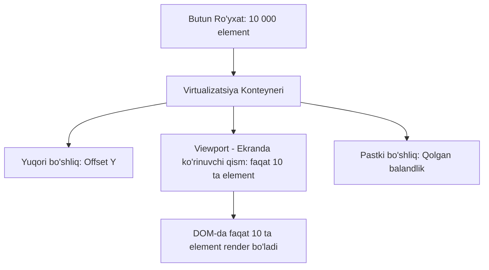
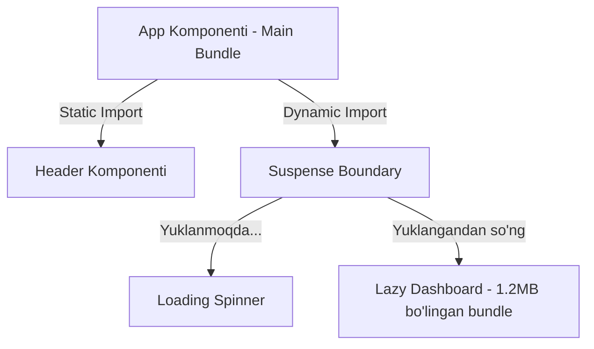

## 1. 💡 Sodda Tushuntirish va Analogiya

### Rendering Optimization va Listlar nima?
React-da unumdorlikni optimallashtirish (rendering optimization) — bu ilova interfeysining tezroq yuklanishi, ortiqcha renderlar (re-renders) sonini kamaytirish va foydalanuvchi harakatlariga lahzada javob qaytarishini ta'minlashdir.
Ayniqsa, ro'yxatlar (lists) va katta hajmli ma'lumotlarni ekranga chiqarish eng ko'p resurs talab qiladigan qismlardan biridir.

### Real hayotiy analogiyalar
1. **Talabalar navbati (Reconciliation va Key):**
   Sizda navbatda turgan talabalar bor: `[Ali, Vali, G'ani]`. Siz navbatning boshiga `Sami` ismli yangi talabani qo'shmoqchisiz: `[Sami, Ali, Vali, G'ani]`.
   * **Indeks key ishlatilsa (yoki key umuman qo'yilmasa):** Ali 0-indeks edi, endi Sami 0-indeks bo'ldi. React navbatdagi barcha talabalarni o'z joyidan qo'zg'atib, hammani qaytadan chizib chiqadi (chunki indekslar siljigan).
   * **Unikal ID key ishlatilsa (`key="id-val"`):** React Sami yangi ekanligini, Ali, Vali va G'ani esa shunchaki joyini o'zgartirganini ko'radi va ularni qayta render qilmaydi. Faqat Samini yangi qo'shadi.

2. **Kino tasmasi (Virtualization):**
   Sizda 10 000 ta kadrli film bor. Ammo proyektor ekrani faqat bitta kadrni ko'rsata oladi. Siz butun lentani bir vaqtning o'zida ekranga yoymaysiz. Faqat ko'rinib turgan kadrni ekranga chiqarasiz va lentani siljitasiz.
   * **Virtualizatsiya** ham xuddi shunday ishlaydi: ro'yxatda 10 000 ta element bo'lsa ham, faqat ekranda ko'rinib turgan 10-20 tasini render qiladi, qolganlarini esa foydalanuvchi skrol qilganda dinamik ravishda chizadi.

3. **Darsliklar (Code Splitting):**
   Maktabga borayotganingizda uydagi barcha 100 ta kitobni portfelga solib yurmaysiz. Faqat bugungi darslar uchun kerakli 5 ta kitobni olasiz.
   * **Code Splitting (Kodni bo'laklash)** ham sayt yuklanganda butun JS kodni emas, faqat hozirgi sahifaga kerakli bo'lakni yuklash imkonini beradi.

---

## 2. 💻 Real Kod Misollari

### 1. React.memo va To'g'ri Kalit (Key) ishlatish
Katta ro'yxatlarda faqat o'zgargan elementni qayta render qilish:
```jsx
import React, { useState } from 'react';

// Memoized komponent - agar props o'zgarmasa, qayta render bo'lmaydi
const ListItem = React.memo(({ item, onDelete }) => {
  console.log(`ListItem render bo'ldi: ${item.text}`);
  return (
    <li>
      {item.text} 
      <button onClick={() => onDelete(item.id)}>O'chirish</button>
    </li>
  );
});

export function TodoList() {
  const [todos, setTodos] = useState([
    { id: '1', text: 'React o\'rganish' },
    { id: '2', text: 'Optimallashtirishni o\'rganish' },
    { id: '3', text: 'Loyihani tugatish' }
  ]);

  const handleDelete = (id) => {
    setTodos(prev => prev.filter(todo => todo.id !== id));
  };

  return (
    <ul>
      {todos.map(todo => (
        // Unikal va barqaror ID kalit sifatida berilmoqda
        <ListItem key={todo.id} item={todo} onDelete={handleDelete} />
      ))}
    </ul>
  );
}
```

### 2. useMemo va useCallback yordamida referensial butunlikni saqlash
Renderlar davomida funksiyalar va obyektlarning qayta yaratilishini oldini olish:
```jsx
import React, { useState, useMemo, useCallback } from 'react';

export function SearchFilter() {
  const [query, setQuery] = useState('');
  const [items] = useState(['Olma', 'Anor', 'Banan', 'Gilos', 'Shaftoli']);

  // Og'ir filtr amalini faqat query o'zgargandagina qayta hisoblaymiz
  const filteredItems = useMemo(() => {
    console.log("Filtrlash bajarilmoqda...");
    return items.filter(item => item.toLowerCase().includes(query.toLowerCase()));
  }, [query, items]);

  // Funksiya har renderda qayta yaratilmaydi, referensial xotirasi saqlanadi
  const handleClear = useCallback(() => {
    setQuery('');
  }, []);

  return (
    <div>
      <input value={query} onChange={e => setQuery(e.target.value)} placeholder="Qidirish..." />
      <button onClick={handleClear}>Tozalash</button>
      <ul>
        {filteredItems.map((item, idx) => <li key={idx}>{item}</li>)}
      </ul>
    </div>
  );
}
```

### 3. Code Splitting va Suspense Boundaries
Katta komponentlarni faqat kerak bo'lganda yuklash:
```jsx
import React, { useState, lazy, Suspense } from 'react';

// Og'ir komponent dinamik import qilinadi
const HeavyChart = lazy(() => import('./HeavyChart'));

export function Dashboard() {
  const [showChart, setShowChart] = useState(false);

  return (
    <div>
      <h1>Tahlillar Paneli</h1>
      <button onClick={() => setShowChart(true)}>Grafikni Yuklash</button>
      
      {showChart && (
        <Suspense fallback={<div>Grafik yuklanmoqda...</div>}>
          <HeavyChart />
        </Suspense>
      )}
    </div>
  );
}
```

---

## 3. ⚙️ Qanday Ishlaydi (Under the Hood)

### 1. Reconciliation (Virtual DOM Diffing)
React Virtual DOM yaratadi va uni haqiqiy DOM bilan solishtiradi. Ushbu jarayon **Reconciliation** deb ataladi:
* React ikkita daraxtni solishtirganda, birinchi navbatda ota elementlarning turi o'zgarganini tekshiradi. Agar tur o'zgarsa (masalan, `<div>` o'rniga `<span>`), butun eski daraxt o'chiriladi (unmount) va yangisi quriladi.
* Agar elementlar ro'yxatida `key` prop berilsa, React ularni o'tgan renderdagi mos kalitlar bilan solishtiradi. Bu React-ga elementlarning joyi o'zgarganini, o'chganini yoki yangi qo'shilganini aniq tushunishga va DOM-ga minimal o'zgartirish kiritishga yordam beradi.

### 2. List Virtualization (Oyna printsipi)
Virtualizatsiya kutubxonalari (masalan, `react-window` yoki `react-virtualized`) quyidagicha ishlaydi:
* Skrol bo'luvchi konteyner yaratiladi va uning umumiy balandligi hisoblab chiqiladi (masalan, `10 000 * 50px = 500 000px`).
* Mutlaq joylashuv (absolute positioning) yordamida faqat foydalanuvchiga ko'rinib turgan qism (viewport) va uning tepa hamda pastki qismidagi bir nechta zaxira (buffer) elementlar chiziladi.
* Foydalanuvchi skrol qilganda elementlar o'chib-taqilaveradi, natijada DOM-da bir vaqtning o'zida faqat 20-30 ta tugun (node) saqlanib qoladi.

---

## 4. ❌ Ko'p Uchraydigan Xatolar (Junior Mistakes)

### 1. `key={Math.random()}` yozish
* **XATO:** Har renderda mutlaqo yangi key yaratiladi, natijada butun ro'yxat va uning bolalari noldan qayta o'rnatiladi (unmount va mount).
* **OQIBAT:** Local state-lar yo'qoladi, input fokuslari yo'qoladi va sahifa qattiq qotadi.
* **TO'G'RI:** Faqat ma'lumotlar bazasidan kelgan unikal `id` yoki barqaror qiymatlardan foydalaning.

### 2. Har doim `index`ni kalit sifatida ishlatish
* **XATO:** Dinamik saralanadigan yoki o'chiriladigan ro'yxatlarda massiv indeksini `key={index}` qilish.
* **OQIBAT:** Element o'chirilganda keyingi element uning indeksini oladi, React esa UI va inputlardagi ma'lumotlarni adashtirib yuboradi.
* **TO'G'RI:** Faqat mutlaqo o'zgarmas (statik) ro'yxatlar uchungina indeksni kalit qilish mumkin.

### 3. Inline funksiyalar va obyektlarni noo'rin ishlatish
* **XATO:** `React.memo` bilan optimallashtirilgan bolaga har renderda inline funksiya berish: `<Child onClick={() => doSomething()} />`.
* **OQIBAT:** Har renderda yangi funksiya referensi yaratiladi va `React.memo` baribir bolani qayta render qilib yuboradi.
* **TO'G'RI:** Bunday funksiyalarni `useCallback` ichida e'lon qiling.

---

## 5. 💬 12 ta Intervyu Savollari

### Junior
1. **Savol:** Nima uchun React-da ro'yxatlar renderida `key` props bo'lishi shart?
   * **Javob:** React Virtual DOM reconciliation (solishtirish) jarayonida elementlarning shaxsiyatini saqlash va faqatgina o'zgarganlarini qayta chizish uchun `key`dan foydalanadi.
2. **Savol:** Nega `key={Math.random()}` yozish tavsiya qilinmaydi?
   * **Javob:** Chunki bu har safar render bo'lganda komponentlarni o'chirib qayta quradi, barcha local state yo'qoladi va tezlik keskin pasayadi.
3. **Savol:** React Fragment-ga key prop yozsa bo'ladimi?
   * **Javob:** Ha, faqat to'liq yozilgan `<React.Fragment key={id}>` ko'rinishida yozish mumkin. Qisqa `<>` tegi prop qabul qilmaydi.
4. **Savol:** React-da `React.lazy` va `Suspense` nima uchun kerak?
   * **Javob:** Ular Code Splitting (kodni bo'laklash) uchun xizmat qiladi. Komponentlarni faqat kerakli paytda asinxron yuklash va u yuklangunicha loading ko'rsatish imkonini beradi.

### Middle
5. **Savol:** Indeksni kalit (key) sifatida ishlatish qachon xavfsiz va qachon xavfli?
   * **Javob:** Ro'yxat o'zgarmas, saralanmas va o'chirilmas bo'lsa xavfsiz. Elementlar qo'shilishi, o'chirilishi yoki tartiblanishi mumkin bo'lsa, xavfli (UI chalkashib ketadi).
6. **Savol:** `React.memo` nima va u qanday ishlaydi?
   * **Javob:** Bu yuqori tartibli komponent (HOC) bo'lib, uning props-lari o'zgarmasa, ushbu komponentni qayta render bo'lishdan himoya qiladi (shuningdek, shallow comparison bajaradi).
7. **Savol:** `useMemo` va `useCallback` o'rtasidagi farq nima?
   * **Javob:** `useMemo` funksiya qaytargan *qiymatni* keshlaydi. `useCallback` esa funksiyaning *o'zini* (referensini) keshlaydi.
8. **Savol:** List Virtualization (Virtualizatsiya) nima va u qachon ishlatiladi?
   * **Javob:** Katta hajmli ro'yxatlarni (masalan, 10 000+ satr) ekranga chizishda faqat viewport (ko'rinish hududi) dagi elementlarni DOM-da saqlab, performance-ni oshirish texnikasi.

### Senior
9. **Savol:** Reconciliation algoritmining o'tish murakkabligi (Big O) qanday va React buni qanday qilib O(n) ga tushirgan?
   * **Javob:** Ikki daraxtni solishtirishning umumiy algoritmi O(n³) vaqtni oladi. React ikkita evristik taxmin yordamida buni O(n) ga tushirgan: har xil turdagi elementlar har xil daraxtlarni beradi va ishlab chiquvchi `key` yordamida elementlar barqarorligini ta'minlaydi.
10. **Savol:** `React.memo` ning ikkinchi argumenti nima va undan qanday maqsadda foydalaniladi?
    * **Javob:** Ikkinchi argument solishtirish funksiyasi (`arePropsEqual(prevProps, nextProps)`) bo'lib, props o'zgarishini qo'lda tekshirish va renderni boshqarish imkonini beradi.
11. **Savol:** Code Splitting qilingan komponentlarning yuklanishini optimallashtirish uchun qanday yondashuvlar mavjud?
    * **Javob:** Foydalanuvchi hover qilganda yoki sahifaga kirishidan oldin kodni oldindan yuklash (Prefetching/Preloading) va Webpack magic comments (`/* webpackPrefetch: true */`) ishlatish.
12. **Savol:** Virtualizatsiyada "Layout Thrashing" ning oldini olish uchun nimalarga e'tibor berish kerak?
    * **Javob:** Har bir satr balandligini oldindan ma'lum qilish (dinamik bo'lsa keshlab borish) va skrol paytida DOM elementlarining stillarini o'qish/yozishni guruhlash (batching).

---

## 6. 🛠️ Amaliy Topshiriqlar

Bu bo'limda siz asinxron komponentlarni yuklash (Code Splitting) va unumdorlik chegaralarini, shuningdek listlarni optimallashtirish prinsiplarini o'rganishingiz kerak.

### Virtualizatsiya (List Virtualization) arxitekturasi:
Foydalanuvchi faqat ma'lum bir ekrandagi "Oyna" (Viewport) ni ko'radi. Qolgan minglab elementlar xotirada saqlansa-da, real DOM-ga chizilmaydi:



### Code Splitting va Suspense chegaralari arxitekturasi:
Katta ilovalarda foydalanuvchiga faqat kerakli sahifa kodini yuklash sxemasi:



---

## 7. 📝 12 ta Mini Test

Bilimingizni sinab ko'rish uchun mashqlardan so'ng berilgan 12 ta test savollariga javob bering. Ular orqali list rendering va optimallashtirish bo'yicha bilimlaringiz mustahkamlanadi.

---

## 8. 🎯 Real Project Case Study

### Muammo: 10 000 ta qatorli Real-time Dashboard jadvali
Katta moliyaviy ilovada har soniyada aksiyalar narxlari o'zgarib turadi. Jadvalda 10 000 ta qator bor. Har safar birgina aksiya narxi o'zgarganda butun jadval qayta render bo'lib, sahifa qotib qoladi (Lag).

### Yechim va Optimallashtirish bosqichlari:
1. **Virtualizatsiya:**
   `react-window` yordamida faqat ekrandagi 20 ta qatorni chizamiz.
2. **Komponentlarni bo'lish va Memoizatsiya:**
   Har bir jadval qatorini `React.memo` bilan o'raymiz. Props sifatida kelayotgan o'chirish yoki tahrirlash funksiyalarini `useCallback` bilan keshlaymiz.
3. **Optimallashtirilgan Kod:**
   ```jsx
   import React, { useState, useCallback, useMemo } from 'react';
   import { FixedSizeList as List } from 'react-window';

   // Memoized Row
   const Row = React.memo(({ index, style, data }) => {
     const { items, onToggle } = data;
     const item = items[index];
     return (
       <div style={style} className="table-row">
         <span>{item.name}</span> - <span>{item.price} USD</span>
         <button onClick={() => onToggle(item.id)}>
           {item.active ? 'Faol' : 'Nofaol'}
         </button>
       </div>
     );
   });

   export function FinancialDashboard() {
     const [stocks, setStocks] = useState(
       Array.from({ length: 10000 }, (_, i) => ({
         id: i,
         name: `Aksiya ${i}`,
         price: (Math.random() * 100).toFixed(2),
         active: true
       }))
     );

     const handleToggle = useCallback((id) => {
       setStocks(prev => prev.map(stock => 
         stock.id === id ? { ...stock, active: !stock.active } : stock
       ));
     }, []);

     // Data obyekti o'zgarmasligini ta'minlash
     const itemData = useMemo(() => ({
       items: stocks,
       onToggle: handleToggle
     }), [stocks, handleToggle]);

     return (
       <List
         height={500}
         itemCount={stocks.length}
         itemSize={50}
         width="100%"
         itemData={itemData}
       >
         {Row}
       </List>
     );
   }
   ```

---

## 9. 🚀 Performance va Optimization

* **Barqaror Kalitlar:** Hech qachon `key` sifatida massiv indeksini yoki random qiymatlarni asossiz ishlatmang.
* **Faqat Kerakli Vaqtda Render:** `React.memo`, `useMemo` va `useCallback`dan to'g'ri foydalaning. Ammo ularni har doim va har qayerda ishlatavermang (keshlashning ham o'z xotira xarajatlari bor).
* **Bundle Hajmini Nazorat Qiling:** `lazy` va `Suspense` yordamida foydalanuvchiga faqat kerakli sahifa yoki komponent kodlarini yuklang.

---

## 10. 📌 Cheat Sheet

| Texnika | Muammo | Yechim / Sintaksis |
| :--- | :--- | :--- |
| **Reconciliation Key** | Elementlarning o'rni chalkashishi | `<div key={item.id}>...</div>` |
| **React.memo** | Keraksiz bolalar renderi | `export default React.memo(MyComponent)` |
| **useCallback** | Funksiya referensining o'zgarishi | `const fn = useCallback(() => {}, [])` |
| **useMemo** | Qimmat hisob-kitoblar | `const val = useMemo(() => heavy(a), [a])` |
| **Virtualization** | DOM elementlarining haddan ortiq ko'pligi | `react-window` yoki `react-virtualized` |
| **Code Splitting** | Boshlang'ich bundle hajmining kattaligi | `const LazyComp = lazy(() => import('./Comp'))` |
